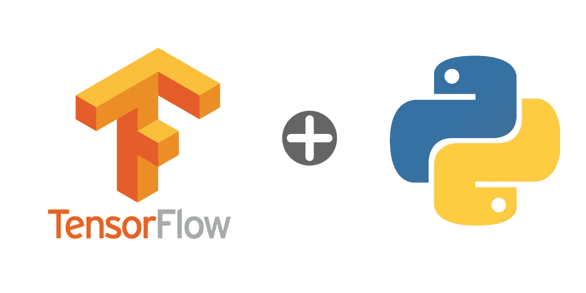

# 从零开始理解和构建神经网络——第二部分

> 原文：<https://medium.com/analytics-vidhya/understanding-and-building-neural-networks-from-scratch-part-ii-4a1bfbeca8ba?source=collection_archive---------8----------------------->



这是理解神经网络系列的第二部分。你可以在这里找到第一部分。

在前一部分，我们看了一下神经网络的构成，以及它们是如何工作的。如果你正在直接阅读这一部分，我建议你在几个重要的术语上刷新你的记忆。或者，参考[这个词汇表](https://developers.google.com/machine-learning/glossary)来熟悉机器学习中常用的术语和度量。

TensorFlow 是一个非常强大的机器学习平台，为模型的构建、生产和部署提供了出色的支持。它是基于计算图的模型，将计算构建为数据流通过图中的节点，其中节点是计算单元；而边形成了**张量**的流动(因此得名，TensorFlow)。[看一看](https://deepnotes.io/tensorflow)更好地理解计算图。在本教程中，并不一定要使用它，但是它将有助于使一些事情合理化。

TensorFlow 也是研究学者的起点——从零开始实现一些东西，将想法转化为代码，等等。它是一个强大的平台，只受程序员思想的限制。大多数以人工智能为中心的公司都使用 TensorFlow 来构建他们的产品/服务，他们有很好的理由这样做。TensorFlow 还拥有对 Java 和 Android 的原生支持，这让它(从字面上)在某种程度上拥有了领域优势。它还拥有非常活跃的社区支持，有助于解决和理解用户在使用时可能面临的错误/问题。你可以在 https://www.tensorflow.org/[了解更多关于 TensorFlow 及其用法的信息。](https://www.tensorflow.org/)

让我们从在 python 机器上安装 tensorflow 开始:

```
*#install the required library*
*!pip install tensorflow*
```

我们将使用内置的 MNIST 数据集。这是为了节省我们上传和使用 csv 文件的麻烦，但请随意探索其他选项。

```
**from** **tensorflow.examples.tutorials** **import** mnist
**import** **numpy** **as** **np**digits = mnist.input_data.read_data_sets("tmp/data", one_hot=True)
```

MNIST 是一个由 28x28 幅图像组成的数据集，每幅图像代表一个数字。这是一个相当简单的数据集，不需要太多(如果有的话)预处理。我们将直接使用它。正如您可以从上面的代码中推断的那样，我们将图像数据存储在一个“tmp/data”目录中。它们将被提取并存储在您的系统中。由于这是一个数字数据集，因此任何图像的可能输出都是 10-0，1，…9.这是一个由 10 个值组成的列表，其中标签值的**索引为 1。**

示例:对于图像标签= 5，数组=[0 0 0 0 1 0 0 0 0]。同理，对于 label = 2，array =[0 0 1 0 0 0 0 0 0 0 0]等。这也很容易解释。

```
**print** "Images for training : {}".format(len(digits.train.images))
**print** "Images for testing : {}".format(len(digits.test.images))
**print** "Shape of input data : {}".format(digits.train.images.shape[1])
```

这里，我们只是对图像进行简单的计数，用于训练、测试和图像数组的 input_shape。记住，图像数组是一个 784 值列表。如果一切正常，您应该看到上面单元的输出为 55000 幅训练图像和 10000 幅测试图像。

所有要训练的数据都必须是 numpy.ndarray()格式，所以一定要确保在训练不同的数据时，在将它们全部转换为数字并随后转换为 numpy 数组()之前，已经注意到了分类变量和值。由于我们是从*开始编码的，*我已经避免使用 tf 库中的许多帮助函数。因此，我分别为图像和标签建立了训练和测试阵列。我维护了 55000 幅训练图像和 10000 幅测试图像的相同格式。然后，将它们转换成 numpy 数组，我对数据集的基本预处理就完成了。

回想一下，神经网络需要一个输入层、一个输出层和 *n* 个隐藏层。还记得每一层都是由**节点**组成的，并且具有**权重**和**偏差**。对于任意一层，我们的**求和**函数为[ ( *输入到该层*该层的节点数* ) + *该层*的偏差]。超过**阈值** / **激活函数**的求和产生该层的输出。当前层的**输出**形成下一层的**输入**，每一隐层的权值个数将取决于前一层的节点个数。由于每个节点都有一个权重，因此每层所需的权重数将是(*前一层的节点数*当前层的节点数*)，因为前一层的节点数构成了当前层的输入。

在继续编写代码之前，花点时间相对好地理解上面的内容。(否则可能没有意义。)

让我们定义神经网络的参数:输入层的节点数、隐藏层的节点数和输出层的节点数。因为我们的数据集有 10 个类(它可以接受 10 个不同的值)，所以我们将输出层中的节点数设为 10。图像的标签将只是被激活的 10 个神经元中的一个。输入层和隐藏层的节点数量完全是主观的，所以要用不同的数量做实验。我在输入层中使用了 1024 个节点，隐藏层分别有 1024、768 和 512 个节点。

```
*#define parameters*

input_layer_nodes = 1024
hidden_layer_nodes, num_classes = [1024, 768, 512], y_tr.shape[1]
batch_size, epochs = 64, 20
ip_data_shape = x_tr.shape[1]
```

让我们也为输入数据定义**占位符**。占位符只是一个变量，我们不会立即将数据赋给它，而是在以后的某个时间点。这支持 TensorFlow 的计算图形属性，其中图形在处理开始之前构建。一旦构建了计算图，我们就通过这些占位符向它传递数据。

```
X, y = tf.placeholder('float', [None, ip_data_shape]), tf.placeholder('float')
```

让我们开始着手最终定义我们的神经网络。

```
input_layer = {'w':tf.Variable(tf.random_normal([ip_data_shape, input_layer_nodes])),                 'b':tf.Variable(tf.random_normal([input_layer_nodes]))}
```

这里，我们为输入层定义了一个简单的字典。该层的输入是图像阵列形状(784)。字典有两个键， **w** 和 **b** ，分别代表权重和偏差。为了定义权重和偏差，我们使用 **tf。变量**属性，它允许我们立即设置数据(相对于 **tf.placeholder** )。这是因为在我们神经网络的运行过程中，我们将**更新**权重和偏差。还要注意使用了 **tf.random_variable** ，它将为作为参数给出的列表初始化随机权重。这是因为我们想从随机权重开始，随后**学习**并更新每层的权重/偏差。请注意，偏差仅添加到当前层的节点，而不是上一层节点的乘积。

同样，让我们定义隐藏层:

```
hlayer_1 = {'w':tf.Variable(tf.random_normal([input_layer_nodes, hidden_layer_nodes[0]])),                'b':tf.Variable(tf.random_normal([hidden_layer_nodes[0]]))}
```

注意，该层的输入是前一层的节点数，即图像阵列的形状。这一过程对于接下来的两个隐藏层也是链式的和连续的，其中输入=前一层的节点数。

回想一下，我们有 10 个类，因此有 10 个输出节点。我们将这些定义为:

```
output_layer = {'w':tf.Variable(tf.random_normal([hidden_layer_nodes[2], num_classes])),                    'b':tf.Variable(tf.random_normal([num_classes]))}
```

现在，我们已经定义了网络的层次。我们仍然需要为它提供求和函数和激活函数。我们使用 **tf.add()** 和 **tf.matmul()** 来执行求和操作，以及来自 **tf.nn** 库中的一个激活函数。我已经用 [ReLU](https://machinelearningmastery.com/rectified-linear-activation-function-for-deep-learning-neural-networks/) 作为我的激活功能，不过你可以自己选择。在训练期间，ReLU 比其他激活功能有几个好处，其中之一是更快的收敛(即，您的网络将训练得更快)。将这些编码进去，我们的网络就完整了:

```
 ip_l = tf.add(tf.matmul(data, input_layer['w']),    input_layer['b'])
    ip_l = tf.nn.relu(ip_l)

    hl_1 = tf.add(tf.matmul(ip_l, hlayer_1['w']), hlayer_1['b'])
    hl_1 = tf.nn.relu(hl_1)
    hl_2 = tf.add(tf.matmul(hl_1, hlayer_2['w']), hlayer_2['b'])
    hl_2 = tf.nn.relu(hl_2)
    hl_3 = tf.add(tf.matmul(hl_2, hlayer_3['w']), hlayer_3['b'])
    hl_3 = tf.nn.relu(hl_3)

    op_l = tf.add(tf.matmul(hl_3, output_layer['w']), output_layer['b'])
```

我们将返回输出层，并在训练数据时将其用于最终的激活层。回想一下，人工神经网络使用高效的学习算法(反向传播算法)进行训练。因为我们有多个标签来对图像进行分类，所以我们使用 **softmax 激活**函数作为最终的激活层。这将应用于我们从 neural_network()返回的输出层。我们将**成本**定义为 [**损失函数**](https://machinelearningmastery.com/loss-and-loss-functions-for-training-deep-learning-neural-networks/) 发生的损失。使用优化器来训练神经网络，优化器使用所述损失函数来计算模型误差。因此，我们将我们的[优化器](https://blog.algorithmia.com/introduction-to-optimizers)定义为 **AdamOptimizer()** ，这是一种反向传播算法。请注意，损失并不等同于准确性。

```
pred = neural_network(x)
cost = tf.reduce_mean(tf.nn.softmax_cross_entropy_with_logits(logits=pred, labels=y))
optimizer = tf.train.AdamOptimizer().minimize(cost)
```

这标志着我们构建计算图的结束。深呼吸，试着理解这一切意味着什么——你现在已经准备好训练和测试你的神经网络了！

为了启动会话(允许执行您的计算图)，我们使用 **tf。会话()**。然后，我们使用 **Session.run()** 属性初始化图中的所有变量。**注意**我们需要在训练/测试网络后关闭会话。还记得我们为 *x* 纪元训练一个网络，让它达到收敛并使损失最小化。一旦损失停滞不前，我们就可以推断网络已经‘训练’好了。这里，我们使用**批次大小**来定义“m”个数据样本后的权重更新。它是在权重和偏差更新之前处理的样本数。批量越小，训练时间就越高。我们将小批量数据作为 numpy 数组进行采样，并使用 Session.run()来运行部分计算图。我使用了一个简单的 while 循环在每一个批处理完成后更新我的列表索引。成本是在整个时期内连续计算和添加的。在每个时期结束时，我显示总的附加损耗(尽管对于第一次看*损耗*的人来说可能没有任何意义，但看到网络经过训练仍然是一种保证)。

```
**with** tf.Session() **as** sess:
        sess.run(tf.initialize_all_variables())
        **for** epoch **in** range(epochs):
            ep_loss, i = 0,0
            **while** i<len(x_tr):
                **if** i+batch_size < len(x_tr):
                    ep_x = np.array(x_tr[i:i+batch_size])
                    ep_y = np.array(y_tr[i:i+batch_size])
                    i += batch_size
                **else**:
                    ep_x = np.array(x_tr[i:])
                    ep_y = np.array(y_tr[i:])
                    i += len(x_tr)
                _, c = sess.run([optimizer, cost], feed_dict={x:ep_x , y:ep_y})
                ep_loss += c
            **print** "Epoch {} of {} completed".format(epoch+1, epochs)
            **print** "Current epoch loss : {}".format(np.log(ep_loss))
```

我们简单地用 tf.equal()函数得出的正确预测数来计算准确度。我们将图像的预测输出和图像的实际输出作为两个参数传递。该函数计算正确输出的数量。然后我们打印网络的准确性。

瞧~

坐下来，输入批量大小和周期数，放松一下。如果你已经正确地遵循了一切，你应该看到你的网络火车。在它产生输出之前给它一些时间。

我的网络刚刚达到 98%的训练集准确率和 96%的测试集准确率。这绝不是一项成就，但是，嘿——对于我们从零开始构建的东西来说，还不错，是吧？:)

上述教程的代码可以在 github 库中找到。