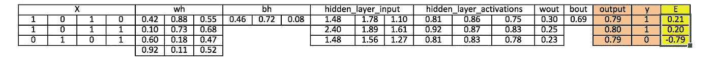

# 用 Python 和 R 从头开始理解和编码神经网络

> 原文：<https://medium.com/analytics-vidhya/understanding-and-coding-neural-networks-from-scratch-in-python-and-r-b8c760f0ad1c?source=collection_archive---------2----------------------->


# 介绍

您可以通过两种方式学习和实践一个概念:

*   选项 1: 你可以学习某一特定主题的全部理论，然后寻找应用这些概念的方法。所以，你阅读了整个算法是如何工作的，它背后的数学，它的假设，限制，然后你应用它。稳健但耗时的方法。
*   **选择 2:** 从简单的基础开始，培养对主题的直觉。接下来，挑一个问题，开始解决它。在解决问题的同时学习概念。不断调整和提高你的理解。所以，你读了如何应用一个算法——出去应用它。一旦你知道如何应用它，用不同的参数、值、极限去尝试它，并发展对算法的理解。

我更喜欢第二种方法，用这种方法来学习任何新的话题。我也许不能告诉你算法背后的全部数学，但我可以告诉你直觉。根据我的实验和理解，我可以告诉你应用算法的最佳场景。

在我与人的互动中，我发现人们没有花时间去发展这种直觉，因此他们努力以正确的方式应用事物。

在本文中，我将从头开始讨论神经网络的构建模块，并更多地关注开发这种直觉来应用神经网络。我们将用“Python”和“R”两种语言编码。到本文结束时，你将理解神经网络如何工作，我们如何初始化权重，以及我们如何使用反向传播来更新它们。

我们开始吧。

# 目录:

1.  神经网络背后的简单直觉
2.  多层感知器及其基础
3.  神经网络方法中涉及的步骤
4.  神经网络工作方法的可视化步骤
5.  使用 Numpy (Python)实现神经网络
6.  用 R 实现神经网络
7.  [可选]反向传播算法的数学观点

# 神经网络背后的简单直觉

如果你是一名开发人员或者见过一个工作人员——你应该知道如何在代码中寻找 bug。您可以通过改变输入或环境来激发各种测试用例，并寻找输出。输出中的变化为您提供了在哪里查找 bug 的提示——检查哪个模块，读取哪些行。一旦你找到了，你就进行修改，然后继续练习，直到你有了正确的代码/应用程序。

神经网络以非常相似的方式工作。它接受几个输入，通过来自多个隐藏层的多个神经元进行处理，并使用输出层返回结果。这个结果估计过程在技术上被称为“**正向传播**”。

接下来，我们将结果与实际输出进行比较。任务是使神经网络的输出尽可能接近实际(期望)输出。这些神经元中的每一个都对最终输出产生一些误差。你如何减少误差？

我们试图最小化对错误贡献更多的神经元的值/权重，这发生在返回神经网络的神经元并找到错误所在的时候。这个过程被称为“**反向传播**”。

为了减少这些迭代次数以最小化误差，神经网络使用一种称为“梯度下降”的常见算法，这有助于快速有效地优化任务。

就是这样——这就是神经网络的工作方式！我知道这是一个非常简单的表示，但是它会帮助你以一种简单的方式理解事情。

# 多层感知器及其基础

就像原子构成地球上任何物质的基础一样——神经网络的基本构成单位是感知器。那么，什么是感知机呢？

感知器可以理解为接受多个输入并产生一个输出的任何东西。比如看下图。


感知器

上面的结构接受三个输入并产生一个输出。下一个逻辑问题是，投入和产出的关系是什么？让我们从基本的方法开始，然后继续寻找更复杂的方法。

下面，我讨论了创建输入输出关系的三种方法:

1.  **通过直接组合输入并基于阈值计算输出**。例如:取 x1=0，x2=1，x3=1，并设置阈值=0。所以，如果 x1+x2+x3 >为 0，则输出为 1，否则为 0。你可以看到，在这种情况下，感知器将输出计算为 1。
2.  **接下来，让我们给输入增加权重。**权重为输入赋予重要性。例如，将 w1=2、w2=3 和 w3=4 分别分配给 x1、x2 和 x3。为了计算输出，我们将输入乘以各自的权重，并与阈值进行比较，如 w1*x1 + w2*x2 + w3*x3 >阈值。与 x1 和 x2 相比，这些权重赋予 x3 更多的重要性。
3.  接下来，让我们添加偏差:每个感知器也有一个偏差，可以认为是感知器的灵活程度。它在某种程度上类似于线性函数 *y = ax + b 的常数 *b* ，它允许我们上下移动直线，以使预测与数据更好地吻合。没有 b，直线将总是通过原点(0，0)，你可能得到一个较差的拟合。*例如，感知器可能有两个输入，在这种情况下，它需要三个权重。一个用于每个输入，一个用于偏置。现在，输入的线性表示看起来像 w1*x1 + w2*x2 + w3*x3 + 1*b。

但是，所有这些仍然是线性的，而感知器曾经是线性的。但这并不有趣。因此，人们想到将感知器进化成现在所谓的人工神经元。神经元对输入和偏置应用非线性变换(激活函数)。

# 什么是激活函数？

激活函数将加权输入的和(w1*x1 + w2*x2 + w3*x3 + 1*b)作为自变量，并返回神经元的输出。


在上式中，我们将 1 表示为 x0，b 表示为 w0。

激活函数主要用于进行非线性变换，使我们能够拟合非线性假设或估计复杂函数。有多个激活功能，像:“乙状结肠”，“Tanh”，ReLu 和许多其他的。

# 正向传播、反向传播和纪元

到目前为止，我们已经计算了输出，这个过程被称为“**正向传播**”。但是如果估计输出与实际输出相差很远(误差大)怎么办。在神经网络中，我们根据误差更新偏差和权重。这个权重和偏差更新过程被称为“**反向传播**”。

反向传播(BP)算法的工作原理是确定输出端的损耗(或误差),然后将其传播回网络。权重被更新以最小化由每个神经元产生的误差。最小化误差的第一步是确定每个节点相对于最终输出的梯度(导数)。要获得反向传播的数学观点，请参考下一节。

这一轮前向和反向传播迭代被称为一次训练迭代，又名“**时期**”。

# 多层感知器

现在，让我们进入**多层**感知器的下一部分。到目前为止，我们只看到了一个由 3 个输入节点(即 x1、x2 和 x3)组成的单层和一个由单个神经元组成的输出层。但是，出于实用目的，单层网络只能做这么多。MLP 由堆叠在**输入层**和**输出层**之间的多层**隐藏层**组成，如下图所示。


上图显示的只是一个绿色的隐藏层，但实际上可以包含多个隐藏层。对于 MLP，需要记住的另一点是所有图层都是完全连接的，即一个图层中的每个节点(除了输入和输出图层)都连接到前一图层和后一图层中的每个节点。

让我们继续下一个主题，这是一个神经网络的训练算法(以尽量减少误差)。在这里，我们将看看最常见的训练算法，称为[梯度下降](https://www.analyticsvidhya.com/blog/2017/03/introduction-to-gradient-descent-algorithm-along-its-variants/)。

# 全批次梯度下降和随机梯度下降

梯度下降的两种变体通过使用相同的更新算法来执行更新 MLP 权重的相同工作，但是差异在于用于更新权重和偏差的训练样本的数量。

顾名思义，全批次梯度下降算法使用所有训练数据点来更新每个权重一次，而随机梯度使用 1 个或更多(样本)但从不使用整个训练数据来更新权重一次。

让我们用一个简单的例子来理解这一点，一个由 10 个数据点组成的数据集有两个权重 **w1** 和 **w2** 。

**整批:**使用 10 个数据点(全部训练数据)，计算 w1 的变化(δw1)和 w2 的变化(δw2)，并更新 w1 和 w2。

**SGD:** 使用第一个数据点，计算 w1(δw1)和 w2(δw2)的变化，并更新 w1 和 w2。接下来，当您使用第二个数据点时，您将处理更新后的权重

对于这两种方法的更深入的解释，你可以看一下[这篇文章](https://www.analyticsvidhya.com/blog/2017/03/introduction-to-gradient-descent-algorithm-along-its-variants/)。

# 神经网络方法中涉及的步骤


让我们来看看神经网络的一步一步的构建方法(带有一个隐藏层的 MLP，类似于上面显示的架构)。在输出层，我们只有一个神经元，因为我们正在解决一个二元分类问题(预测 0 或 1)。我们也可以有两个神经元来预测这两类中的每一类。

首先看一下宽泛的步骤:

0.)我们把输入和输出

*   x 作为输入矩阵
*   y 作为输出矩阵

1.)我们用随机值初始化权重和偏差(这是一次性初始化。在下一次迭代中，我们将使用更新的权重和偏差)。让我们来定义:

*   wh 作为隐藏层的权重矩阵
*   bh 作为隐藏层的偏置矩阵
*   作为输出层的权重矩阵
*   作为输出层的偏置矩阵

2.)我们取输入和分配给输入和隐藏层之间的边的权重的矩阵点积，然后将隐藏层神经元的偏差添加到相应的输入，这被称为线性变换:

隐藏层输入=矩阵点积(X，wh) + bh

3)使用激活函数(Sigmoid)执行非线性变换。Sigmoid 将以 1/(1 + exp(-x))的形式返回输出。

hidden layer _ activations = sigmoid(隐藏层输入)

4.2)对隐藏层激活执行线性变换(取带权重的矩阵点积并添加输出层神经元的偏差),然后应用激活函数(再次使用 sigmoid，但您可以根据您的任务使用任何其他激活函数)来预测输出

output _ layer _ input = matrix _ dot _ product(hidden layer _ activations * wout)+bout
*output = sigmoid(output _ layer _ input)*

**以上所有步骤被称为“正向传播”**

5.)将预测与实际输出进行比较，并计算误差的梯度(实际-预测)。误差是均方损失= ((Y-t) )/2

E = y 输出

6.2)计算隐藏层和输出层神经元的斜率/梯度(为了计算斜率，我们计算每个神经元在每个层的非线性激活 x 的导数)。sigmoid 的梯度可以作为 x * (1-x)返回。

slope _ output _ layer = derives _ sigmoid(output)
*slope _ hidden _ layer = derives _ sigmoid(hidden layer _ activations)*

7.2)根据误差的梯度乘以输出层激活的斜率，计算输出层的变化因子(δ)

*d _ 输出= E *斜率 _ 输出 _ 图层*

8.)在这一步，错误将传播回网络，这意味着隐藏层的错误。为此，我们将采用输出层δ与隐藏层和输出层之间的边的权重参数的点积(wout。t)。

error _ at _ hidden _ layer = matrix _ dot _ product(d _ output，wout。转置)

9.2)计算隐藏层的变化因子(δ),将隐藏层的误差乘以隐藏层激活的斜率

*d _ hidden layer = Error _ at _ hidden _ layer * slope _ hidden _ layer*

10.2)更新输出和隐藏层的权重:网络中的权重可以根据为训练样本计算的误差来更新。

wout = wout+matrix _ dot _ product(hidden layer _ activations。转置，d _ output)* learning _ rate
wh = wh+matrix _ dot _ product(X . Transpose，d_hiddenlayer)*learning_rate

learning_rate:权重更新的数量由称为学习率的配置参数控制)

11.2)更新输出和隐藏层的偏差:网络中的偏差可以从该神经元的聚集误差中更新。

*   output_layer 的偏差= output _ layer 的偏差+output _ layer 在行方向的增量之和* learning_rate
*   隐藏层偏差=隐藏层偏差+行输出层增量之和*学习率

*bh = bh + sum(d_hiddenlayer，axis = 0)* learning _ rate
bout = bout+sum(d _ output，axis=0)*learning_rate*

**从 5 到 11 的步骤被称为“反向传播”**

一个前向和后向传播迭代被认为是一个训练周期。正如我前面提到的，我们什么时候第二次训练，然后更新权重和偏差用于前向传播。

上面，我们已经更新了隐藏层和输出层的权重和偏差，并且使用了全批次梯度下降算法。

# 神经网络方法步骤的可视化

我们将重复上述步骤，并将输入、权重、偏差、输出、误差矩阵可视化，以理解神经网络(MLP)的工作方法。

注意:

*   为了得到好的可视化图像，我在 2 或 3 位四舍五入了小数。
*   黄色填充单元格表示当前活动单元格
*   橙色单元格表示用于填充当前单元格值的输入

**步骤 0:** 读取输入和输出


**步骤 1:** 用随机值初始化权重和偏差(有初始化权重和偏差的方法，但是现在用随机值初始化)


**第二步:**计算隐藏层输入:
hidden _ layer _ input = matrix _ dot _ product(X，wh) + bh


**步骤 3:** 对隐藏的线性输入进行非线性变换
*hidden layer _ activations = sigmoid(hidden _ layer _ input)*


**步骤 4:** 在输出层执行隐藏层激活的线性和非线性变换

output _ layer _ input = matrix _ dot _ product(hidden layer _ activations * wout)+bout
*output = sigmoid(output _ layer _ input)*


**第五步:**计算输出层误差(E)的梯度
*E = y-输出*



**步骤 6:** 计算输出和隐藏层的斜率
*Slope _ output _ layer = derives _ sigmoid(output)*
*Slope _ hidden _ layer = derives _ sigmoid(hidden layer _ activations)*


**第 7 步:**计算输出层的增量

*d _ 输出= E *斜率 _ 输出 _ 图层*lr*


**步骤 8:** 计算隐藏层的误差

error _ at _ hidden _ layer = matrix _ dot _ product(d _ output，wout。转置)


**第九步:**计算隐藏层的增量

*d _ hidden layer = Error _ at _ hidden _ layer * slope _ hidden _ layer*


**步骤 10:** 更新输出层和隐藏层的权重

wout = wout+matrix _ dot _ product(hidden layer _ activations。转置，d _ output)* learning _ rate
wh = wh+matrix _ dot _ product(X . Transpose，d_hiddenlayer)*learning_rate


**步骤 11:** 更新输出和隐藏层的偏差

*bh = bh + sum(d_hiddenlayer，axis = 0)* learning _ rate
bout = bout+sum(d _ output，axis=0)*learning_rate*


上面，你可以看到仍然有一个不接近实际目标值的好的误差，因为我们只完成了一次训练迭代。如果我们将训练模型多次，那么它将是一个非常接近的实际结果。我已经完成了数千次迭代，我的结果接近实际目标值([[0.98032096][0.96845624][0.04532167]])。

# 使用 Numpy (Python)实现神经网络

```
import numpy as np#Input array
X=np.array([[1,0,1,0],[1,0,1,1],[0,1,0,1]])#Output
y=np.array([[1],[1],[0]])#Sigmoid Function
def sigmoid (x):
    return 1/(1 + np.exp(-x))#Derivative of Sigmoid Function
def derivatives_sigmoid(x):
    return x * (1 - x)#Variable initialization
epoch=5000 #Setting training iterations
lr=0.1 #Setting learning rate
inputlayer_neurons = X.shape[1] #number of features in data set
hiddenlayer_neurons = 3 #number of hidden layers neurons
output_neurons = 1 #number of neurons at output layer#weight and bias initialization
wh=np.random.uniform(size=(inputlayer_neurons,hiddenlayer_neurons))
bh=np.random.uniform(size=(1,hiddenlayer_neurons))
wout=np.random.uniform(size=(hiddenlayer_neurons,output_neurons))
bout=np.random.uniform(size=(1,output_neurons))for i in range(epoch):

    #Forward Propogation
    hidden_layer_input1=np.dot(X,wh)
    hidden_layer_input=hidden_layer_input1 + bh
    hiddenlayer_activations = sigmoid(hidden_layer_input)
    output_layer_input1=np.dot(hiddenlayer_activations,wout)
    output_layer_input= output_layer_input1+ bout
    output = sigmoid(output_layer_input) #Backpropagation
    E = y-output
    slope_output_layer = derivatives_sigmoid(output)
    slope_hidden_layer = derivatives_sigmoid(hiddenlayer_activations)
    d_output = E * slope_output_layer
    Error_at_hidden_layer = d_output.dot(wout.T)
    d_hiddenlayer = Error_at_hidden_layer * slope_hidden_layer
    wout += hiddenlayer_activations.T.dot(d_output) *lr
    bout += np.sum(d_output, axis=0,keepdims=True) *lr
    wh += X.T.dot(d_hiddenlayer) *lr
    bh += np.sum(d_hiddenlayer, axis=0,keepdims=True) *lrprint output
```

# 在 R 中实现神经网络

`# input matrix
X=matrix(c(1,0,1,0,1,0,1,1,0,1,0,1),nrow = 3, ncol=4,byrow = TRUE)`

`# output matrix`
`Y=matrix(c(1,1,0),byrow=FALSE)`

`#sigmoid function`
`sigmoid<-function(x){`
`1/(1+exp(-x))`


`# derivative of sigmoid function`
`derivatives_sigmoid<-function(x){`
`x*(1-x)`


`# variable initialization`
`epoch=5000`

`inputlayer_neurons=ncol(X)`
`hiddenlayer_neurons=3`
`output_neurons=1`

`#weight and bias initialization`
`wh=matrix( rnorm(inputlayer_neurons*hiddenlayer_neurons,mean=0,sd=1), inputlayer_neurons, hiddenlayer_neurons)`
`bias_in=runif(hiddenlayer_neurons)`
`bias_in_temp=rep(bias_in, nrow(X))`
`bh=matrix(bias_in_temp, nrow = nrow(X), byrow = FALSE)`
`wout=matrix( rnorm(hiddenlayer_neurons*output_neurons,mean=0,sd=1), hiddenlayer_neurons, output_neurons)`

`bias_out=runif(output_neurons)`
`bias_out_temp=rep(bias_out,nrow(X))`
`bout=matrix(bias_out_temp,nrow = nrow(X),byrow = FALSE)`
`# forward propagation`
`for(i in 1:epoch){`

`hidden_layer_input1= X%*%wh`
`hidden_layer_input=hidden_layer_input1+bh`
`hidden_layer_activations=sigmoid(hidden_layer_input)`
`output_layer_input1=hidden_layer_activations%*%wout`
`output_layer_input=output_layer_input1+bout`
`output= sigmoid(output_layer_input)`

`# Back Propagation`

`E=Y-output`
`slope_output_layer=derivatives_sigmoid(output)`
`slope_hidden_layer=derivatives_sigmoid(hidden_layer_activations)``Error_at_hidden_layer=d_output%*%t(wout)``d_output=E*slope_output_layer``Error_at_hidden_layer=d_output%*%t(wout)`
`d_hiddenlayer=Error_at_hidden_layer*slope_hidden_layer`
`wout= wout + (t(hidden_layer_activations)%*%d_output)*lr`
`bout= bout+rowSums(d_output)*lr`
`wh = wh +(t(X)%*%d_hiddenlayer)*lr`
`bh = bh + rowSums(d_hiddenlayer)*lr`

`}`


# [可选]反向传播算法的数学观点

设 Wi 为输入层和隐藏层之间的权重。Wh 是隐藏层和输出层之间的权重。

现在， **h=σ (u)= σ (WiX)** ，即 h 是 u 的函数，u 是 Wi 和 x 的函数，这里我们把我们的函数表示为 **σ**

**Y =σ(u ')=σ(**W**h**h**)**，即 Y 是 u '的函数，u '是 Wh 和 h 的函数。

我们将不断引用上述方程来计算偏导数。

我们主要感兴趣的是找到两个术语，∂E/∂Wi 和∂E/∂Wh，即改变输入层和隐藏层之间的权重时的误差变化和改变隐藏层和输出层之间的权重时的误差变化。

但是为了计算这两个偏导数，我们需要使用偏导数的链式法则，因为 E 是 Y 的函数，Y 是 u '的函数，u '是 Wi 的函数。

让我们好好利用这个属性，计算梯度。

∂E/∂Wh = (∂E/∂Y).(∂Y/∂u').(∂u'/∂Wh)，……..(1)

我们知道 E 的形式为 E=(Y-t)2/2。

所以，(∂E/∂Y)=)

现在，σ是一个 sigmoid 函数，并且具有σ(1- σ)形式的有趣微分。我敦促读者从他们的角度来验证这一点。

所以，(∂y/∂u')= ∂(σ(u ')/∂u'=σ(u ')(1-σ(u '))。

但是，σ(u')=Y，所以，

(∂Y/∂u')=Y(1-Y)

现在，(∂u'/∂Wh)= ∂( Whh)/ ∂Wh = h

替换我们得到的等式(1)中的值，

**∂E/∂Wh = (Y-t)。Y(1-Y)。h**

所以，现在我们已经计算了隐藏层和输出层之间的梯度。现在是我们计算输入层和隐藏层之间的梯度的时候了。

∂E/∂Wi =(∂ E/∂ h)。(∂h/∂u).(∂u/∂Wi)

但是，(∂e/∂·h)=(∂e/∂y).(∂Y/∂u').(∂u'/∂h).在上面的等式中替换这个值，

∂E/∂Wi =[(∂E/∂Y).(∂Y/∂u').(∂u'/∂h)].(∂h/∂u).(∂u/∂Wi)……………(2)

那么，首先计算隐藏层和输出层之间的梯度有什么好处呢？

正如你在等式(2)中看到的，我们已经计算了∂E/∂Y 和∂Y/∂u'，节省了我们的空间和计算时间。一会儿我们会知道为什么这个算法叫做反向传播算法。

让我们计算等式(2)中的未知导数。

∂u'/∂h = ∂(Whh)/ ∂h =白色

∂h/∂u = ∂( σ(u)/ ∂u= σ(u)(1- σ(u))

但是，σ(u)=h，所以，

(∂Y/∂u)=h(1-h)

现在，∂u/∂Wi = ∂(WiX)/ ∂Wi = X

替换等式(2)中的所有这些值，我们得到，

**∂E/∂Wi = [(Y-t)。Y(1-Y)。Wh】。h(1-h)。X**

因此，现在我们已经计算了两个梯度，权重可以更新为

**Wh = Wh + η。∂E/∂Wh**

**Wi = Wi + η。∂E/∂Wi**

其中 **η** 是学习率。

所以回到问题:为什么这个算法叫反向传播算法？

原因是:如果你注意到 **∂E/∂Wh** 和 **∂E/∂Wi** 的最终形式，你会看到(Y-t)项，即输出误差，这是我们开始的，然后将其传播回输入层进行权重更新。

那么，这种数学在代码中处于什么位置呢？

hiddenlayer_activations=h

E= Y-t

坡度 _ 输出 _ 图层= Y(1-Y)

lr = η

坡度 _ 隐藏 _ 图层= h(1-h)

wout = Wh

现在，你可以很容易地把代码和数学联系起来。

# 结束注释:

本文的重点是从头开始构建神经网络并理解其基本概念。我希望现在你理解了神经网络的工作原理，比如前向和后向传播是如何工作的，优化算法(完全批处理和随机梯度下降)，如何更新权重和偏差，Excel 中每一步的可视化以及 python 和 r 中的代码。

因此，在我即将发表的文章中，我将解释在 Python 中使用神经网络的应用，以及解决与以下相关的现实挑战:

1.  计算机视觉
2.  演讲
3.  自然语言处理

我喜欢写这篇文章，并希望从你的反馈中学习。你觉得这篇文章有用吗？我将感谢你的建议/反馈。请随时通过下面的评论提出你的问题。

*原载于 2017 年 5 月 28 日*[*www.analyticsvidhya.com*](https://www.analyticsvidhya.com/blog/2017/05/neural-network-from-scratch-in-python-and-r/)*。*