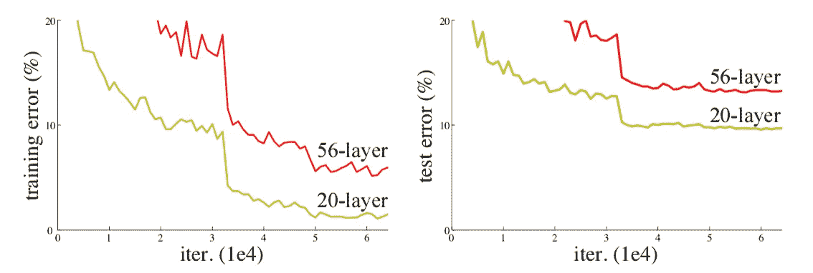
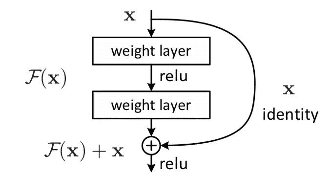
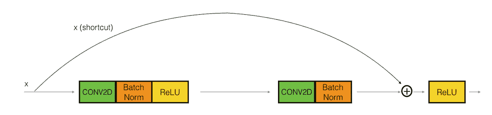
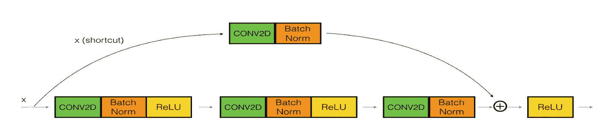
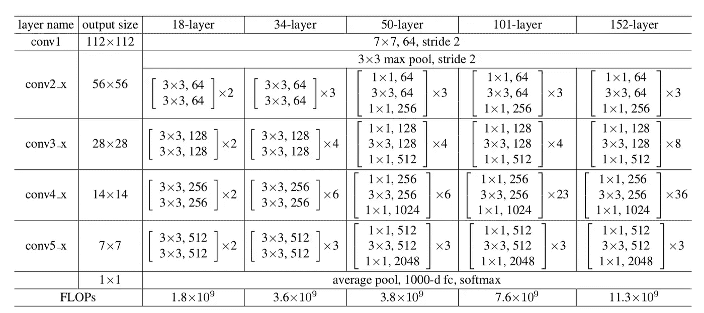
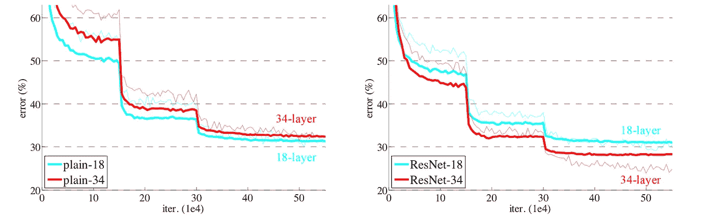
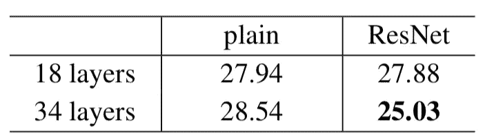
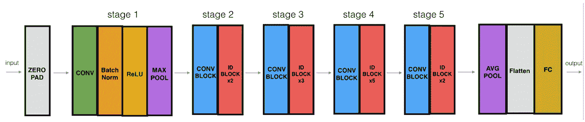

# 剩余网络的理解和实现

> 原文：<https://medium.com/analytics-vidhya/understanding-and-implementation-of-residual-networks-resnets-b80f9a507b9c?source=collection_archive---------0----------------------->

剩余学习框架简化了网络的训练，比以前使用的网络要深得多。

本文主要基于微软研究院发表的研究论文“**图像识别的深度残差学习**”。[ [链接到吴恩达的研究论文](https://arxiv.org/pdf/1512.03385.pdf)和卷积神经网络课程。

# **目录:**

*   简介—深度神经网络的问题
*   为什么会发生这种情况，我们如何解决？
*   解决方案:剩余学习框架
*   ResNet 中使用的块类型
*   从剩余块中提取
*   研究论文的结果
*   ResNet 成功了吗？
*   构建您的第一个 ResNet 模型(50 层)
*   摘要

# **简介—深度神经网络问题:**

近年来，神经网络变得更加深入，最先进的网络从几层(如 AlexNet)发展到超过一百层。

*   非常深的网络的主要好处之一是它可以表示非常复杂的功能。
*   然而，训练它们的一个巨大障碍是梯度消失:非常深的网络通常有一个梯度信号，它很快变为零，因此梯度下降非常慢。
*   更具体地说，在梯度下降过程中，当我们从最后一层返回到第一层时，我们在每一步上都乘以权重矩阵。如果梯度很小，由于大量的乘法运算，梯度会以指数形式快速下降到零(或者，在极少数情况下，以指数形式快速增长并“爆炸”到非常大的值)。

像 VGG-16 这样的常规网络被称为“普通”网络。

在平面网络中，随着层数从 20 层增加到 56 层(如下所示)，即使经过数千次迭代，56 层网络的训练误差也比 20 层网络差。

具有 20 层和 56 层“普通”网络的 CIFAR-10 上的训练误差(左)和测试误差(右)。更深的网络具有更高的训练误差，从而具有更高的测试误差。

理论上，我们期望有一个更深的网络只会有所帮助，但实际上，更深的网络具有更高的训练误差，从而具有更高的测试误差。

# **为什么会出现这种情况，我们如何解决？**

当更深的网络能够开始收敛时，一个*退化*问题就暴露出来了:随着网络深度的增加，精度达到饱和(这可能不足为奇)，然后迅速退化。

使用更深的网络会降低模型的性能。微软研究论文试图用**深度剩余学习框架解决这个问题。**

**解决方案:**残差块/身份块

这个想法是让网络去适应剩余映射，而不是让层去学习底层映射。因此，不是说 H(x)，初始映射*，*让网络拟合，F(x) := H(x)-x，这给出 H(x) := F(x) + x

方法是在*中添加一个* ***快捷方式*** *或一个* ***跳过连接*** ，这样可以让信息更容易地从一层流向下一层，也就是说，你可以绕过正常的 CNN，从一层流向下一层。

残余块:

剩余学习:一个积木

**从剩余块中提取两项:**

1.  添加额外的/新的层不会损害模型的性能，因为如果这些层没有用，正则化会跳过它们。
2.  如果额外的/新的层是有用的，即使存在正则化，层的权重或核也将是非零的，并且模型性能可能略有提高。

因此，通过添加新的层，由于“跳过连接”/“剩余连接”，保证了模型的性能不会降低，但是可以稍微提高。

通过将这些 ResNet 块相互堆叠，可以形成一个非常深的网络。拥有带有快捷方式的 ResNet 块也使得其中一个块学习标识函数变得非常容易。这意味着您可以在额外的 ResNet 块上进行堆栈，而几乎没有损害定型集性能的风险。

ResNet 中使用两种主要类型的块，主要取决于输入/输出维度是相同还是不同。

1 **。身份块**——和我们上面看到的一样。身份模块是 ResNets 中使用的标准模块，对应于输入激活与输出激活尺寸相同的情况*。*

**身份块。**跳过连接“跳过”2 层

2.**卷积块** —当输入和输出维度不匹配时，我们可以使用这种类型的块*。与 identity 块的不同之处在于快捷路径中有一个 CONV2D 层。*

卷积块

# **论文结果:**

ImageNet 的架构。构建块显示在括号中，其中堆叠了块的数量。

ImageNet 培训。细曲线表示训练误差，粗曲线表示中心作物的验证误差。左图:18 层和 34 层的平面网络。右图:18 层和 34 层的结果。

ImageNet 验证的头号错误(%，10 次裁剪测试)

34 层 ResNet 的性能优于 18 层 ResNet 和普通计数器部件。因此，无论是普通网络还是 ResNet 网络，在深度 ResNet 网络上，退化问题都比浅网络得到了更好的解决。

对于更深层次的网络(50 及以上),作者引入了瓶颈架构以获得经济收益。

# ResNet 成功了吗？——是的。

*   以 3.57%的前 5 名错误率(集合模型)在 ILSVRC 2015 分类竞赛中获得第一名
*   在 ILSVRC 和 Coco 2015 比赛中分别获得 ImageNet 检测、ImageNet 定位、COCO 检测和 COCO 分割的第一名。
*   用 ResNet-101 替换更快 R-CNN 中的 VGG-16 层。他们观察到 28%的相对改进
*   高效训练的网络也有 100 层和 1000 层。

# 构建您的第一个 ResNet 模型(50 层)

现在你已经有了构建一个非常深的 ResNet 所必需的模块。下图详细描述了该神经网络的体系结构。图中的“ID BLOCK”代表“身份块”，而“ID BLOCK x3”意味着您应该将 3 个身份块堆叠在一起。

上述 ResNet-50 型号的详细信息如下:

*   零填充:用(3，3)填充输入
*   阶段 1:2D 卷积具有 64 个形状为(7，7)的滤波器，并使用(2，2)的步长。它的名字叫“conv1”。BatchNorm 应用于输入的通道轴。最大池使用(3，3)窗口和(2，2)步距。
*   阶段 2:卷积块使用三组大小为 64×64×256 的滤波器，f=3，s=1，并且块是“a”。这两个单位块使用三组大小为 64×64×256 的滤波器，f=3，块是“b”和“c”。
*   阶段 3:卷积块使用三组大小为 128×128×512 的滤波器，f=3，s=2，块是“a”。3 个单位块使用三组大小为 128×128×512 的滤波器，f=3，块为“b”、“c”和“d”。
*   阶段 4:卷积块使用三组大小为 256×256×1024 的滤波器，f=3，s=2，块是“a”。这 5 个单位块使用三组大小为 256×256×1024 的滤波器，f=3，块是“b”、“c”、“d”、“e”和“f”。
*   阶段 5:卷积块使用三组大小为 512×512×2048 的滤波器，f=3，s=2，块是“a”。这两个单位块使用三组大小为 256×256×2048 的滤波器，f=3，块是“b”和“c”。
*   2D 平均池使用形状为(2，2)的窗口，其名称为“avg_pool”。
*   展平没有任何超参数或名称。
*   全连接(密集)层使用 softmax 激活将其输入减少到类的数量。它的名字应该是' fc' + str(类)。

# **概要:**

*   非常深的神经网络(普通网络)实现起来不实际，因为它们由于消失梯度而难以训练。
*   跳跃连接有助于解决消失梯度问题。它们还使得 ResNet 块很容易学习标识函数。
*   有两种主要类型的 ResNets 块:身份块和卷积块。
*   通过将这些块堆叠在一起，构建非常深的剩余网络。

# 参考资料:

*   微软研究院的“图像识别深度残差学习”研究论文— [ [链接至论文](https://arxiv.org/pdf/1512.03385.pdf)
*   [https://www . coursera . org/learn/卷积神经网络](https://www.coursera.org/learn/convolutional-neural-networks)
*   【https://www.appliedaicourse.com 
*   [https://medium . com/@ 14 Prakash/understanding-and-implementing-architectures-of-resnet-and-resnext-for-state-of-art-image-cf 51669 e 1624](/@14prakash/understanding-and-implementing-architectures-of-resnet-and-resnext-for-state-of-the-art-image-cf51669e1624)
*   [https://engmrk.com/residual-networks-resnets/](https://engmrk.com/residual-networks-resnets/)