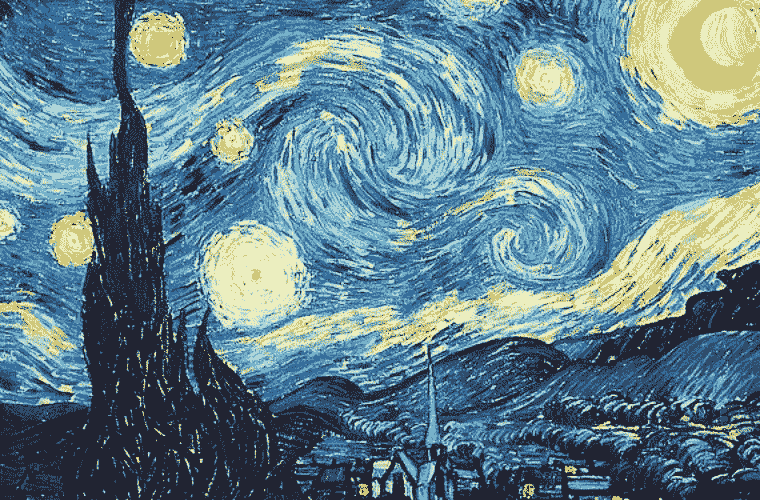

# 理解和实现神经类型转移

> 原文：<https://medium.com/analytics-vidhya/understanding-and-implementing-neural-style-transfer-7d752d3cfe74?source=collection_archive---------13----------------------->

***神经风格转移(Neural style transfer)是一种使用深度学习方法将两个独立图像的风格和内容组合成一个图像的艺术方法。***

> 先决条件:对 CNN 和 Keras 的基本了解。


照片由[蒂姆·怀布罗](https://unsplash.com/@timwhybrow?utm_source=unsplash&utm_medium=referral&utm_content=creditCopyText)在 [Unsplash](https://unsplash.com/search/photos/vibrany?utm_source=unsplash&utm_medium=referral&utm_content=creditCopyText) 上通过应用 NST 进行改造。

# 那么什么是神经风格转移(NST)？？？

根据维基百科，

> 神经风格转移指的是一类软件算法，这些算法操纵数字图像或视频，以采用另一个图像的外观或视觉风格。

我们要研究的 NST 算法是基于 Leon A. Gatys 等人的论文 [*一种艺术风格的神经算法*](https://arxiv.org/pdf/1508.06576.pdf) 。NST 算法提供了一个基于深度神经网络的人工系统，可以创建高视觉质量的艺术图像。

艺术类图像的创建是计算机视觉的一个分支，称为 [*非真实感渲染*](http://ieeexplore. ieee.org/xpls/abs_all.jsp?arnumber=6243138) ，但这些方法涉及对图像像素的直接操作，而不是对图像的特征空间的操作。

当我们处理图像的特征空间时，我们利用卷积神经网络(这里我们使用 VGG-19 体系结构),其已经在像 Imagenet(1000 个类)这样的大数据集上被训练用于对象检测任务。

# 为什么我们在 NST 中使用 CNN？？


1.  CNN 是一类深度神经网络，在图像处理任务中非常强大。CNN 的每一层产生输入图像的特征图，这些特征图是输入图像的过滤版本。
2.  我们可以使用每一层的特征图来重建输入图像。特征图是图像的多层表示，由 CNN 的层产生作为输出。
3.  CNN 帮助在特征空间而不是像素空间中捕捉图像的表示。
4.  CNN 的高层捕捉图像的全局信息，而不是像素表示。全局表示捕获图像的**高级内容**。相比之下，较低层捕捉原始图像的精确像素值。因此，我们使用来自更高层的特征响应作为**“内容表示”。**这里我们用的是 VGG-19 的**【con V5 _ 1】**层的特征图，它是最顶层的褶积层。
5.  通过构建多尺度特征空间，获得图像的**【风格表征】**。这个特征空间包含多层的不同滤波器响应之间的相关性。这里我们将累积使用**【con v1 _ 1】【con v2 _ 1】【con v3 _ 1】【con v4 _ 1】【con V5 _ 1】**的特征图。

> 通过包括多层的特征相关性，我们获得了输入图像的静态、多尺度表示，其捕获了其纹理信息，但没有捕获全局排列。

# NST 的实施

实现该算法的过程包括:

1.  选择两个图像，其中一个是样式参考图像，另一个是内容基础/目标图像。如果选择的样式参考图像有更多的纹理和图案，我们会得到更好的结果。

```
from keras.preprocessing.image import load_img, img_to_array
target_image_path = 'img/portrait.jpg'
style_reference_image_path = 'img/transfer_style_reference.jpg'
width, height = load_img(target_image_path).size
img_height = 400
img_width = int(width * img_height / height)
```



风格参考图像(梵高的《星空》)和内容基础图像。

**2。**选择一个网络(这里我们使用 VGG19 ),该网络已经在一些数据集上进行了训练，用于一些特定的任务，如对象检测。我们使用已经训练好的网络的原因是，他们已经有了关于提取图像特征的合理想法，因为他们已经在像 ImageNet 这样的大型图像数据集上进行了训练。

**3。**因此，我们通过将生成的图像通过网络来同时计算样式参考图像、目标/内容基础图像和生成的图像的层激活。初始生成的图像作为白噪声图像。网络的输入是样式参考图像、内容图像和组合图像的组合(最初是空白图像)。

```
from keras import backend as K
target_image = K.constant(preprocess_image(target_image_path))style_reference_image = K.constant(preprocess_image(style_reference_image_path))combination_image = K.placeholder((1, img_height, img_width, 3))
input_tensor = K.concatenate([target_image,
style_reference_image,
combination_image], axis=0)model = vgg19.VGG19(input_tensor=input_tensor,
weights='imagenet',
include_top=False)
print('Model loaded.')
```

这里，preprocess_image 是一个辅助函数，我们使用它将图像转换为 numpy 数组，我们还使用 imagenet 的平均值和标准差进行归一化，因为 VGG19 是在 imagenet 数据集上训练的，所以我们必须确保我们是在相同的输入分布上训练网络。

**4。**接下来我们定义损失函数

*   **内容损失函数:**内容损失函数接受目标/内容图像和生成图像的最后一个卷积层生成的特征。然后，我们定义两个特征表示之间的平方误差损失。

```
def content_loss(base, combination):
     return K.sum(K.square(combination - base))
```

*   **风格损失函数:**如前所述，图像的风格表示是由 conv 层的特征之间的相关性形成的，我们使用定义为`G = (A ^ T) A`的格拉姆矩阵。因此，风格损失采用风格参考图像和生成图像的 gram 矩阵，并执行平方损失误差。

```
def gram_matrix(x):
    features = K.batch_flatten(K.permute_dimensions(x, (2, 0, 1)))
    gram = K.dot(features, K.transpose(features))
    return gramdef style_loss(style, combination):
    S = gram_matrix(style)
    C = gram_matrix(combination)
    channels = 3
    size = img_height * img_width
    return K.sum(K.square(S - C)) / (4\. * (channels ** 2) * (size ** 2))
```

*   **全变分损失:**全变分损失是对生成的组合图像的像素进行操作的正则化损失。我们使用这种损失来鼓励生成图像的空间连续性，这将避免过度像素化的结果。

```
def total_variation_loss(x):
    a = K.square(
x[:, :img_height - 1, :img_width - 1, :] -
x[:, 1:, :img_width - 1, :])
    b = K.square(
x[:, :img_height - 1, :img_width - 1, :] -
x[:, :img_height - 1, 1:, :])
return K.sum(K.pow(a + b, 1.25))
```

**5。**我们要最小化的损失是使用梯度下降优化技术对所有这三种损失的加权平均。

**6。**在 Francois Chollet 的《用 python 进行深度学习的 T4》一书中，他提到在最初的论文中，他们使用 L-BFGS 算法进行了优化，但老实说，当我阅读论文时，我没有找到任何关于该算法的参考资料(我可能忽略了)。但是我们将使用 L-BFGS 算法进行优化。你可以参考下面关于 L-BFGS 算法的博客。

[](http://aria42.com/blog/2014/12/understanding-lbfgs) [## 数值优化:理解 L-BFGS

### 数值优化是许多机器学习的核心。一旦定义了模型并有了数据集…

aria42.com](http://aria42.com/blog/2014/12/understanding-lbfgs) 

**7。**作者还提到，如果我们使用平均池而不是最大池，我们会得到更好的结果。出现这种情况的原因可能是由于丢弃了 max pooling 中的像素，这可能会导致信息丢失。

# 实验

## 1.使用空白图像作为内容图像。


1)用作风格参考图像的梵高自画像。2)当内容图像是空白图像时生成的图像。

## 2.使用空白图像作为样式参考图像。


一个时期后和十个时期后的结果。

## 3.使用黑色图像作为样式参考图像。

我们能注意到的一件事是背景的黑色化而不是脸部区域。如果样式参考图像是高度纹理化的，则 NST 算法转移是有效的。


30 个时期后生成的图像。

# 密码

[](https://github.com/shiv-u/neural_style_transfer) [## shiv-u/neural_style_transfer

### 此时您不能执行该操作。您已使用另一个标签页或窗口登录。您已在另一个选项卡中注销，或者…

github.com](https://github.com/shiv-u/neural_style_transfer) 

# 参考

1.  [Francois chollet 用 python 进行深度学习。](https://www.amazon.in/Deep-Learning-Python-Francois-Chollet/dp/1617294438/ref=sr_1_1?crid=6P8X7GZR6GDK&keywords=deep+learning+with+python&qid=1564554245&s=gateway&sprefix=deeplea%2Caps%2C307&sr=8-1)
2.  原文：<https://arxiv.org/pdf/1508.06576.pdf>。