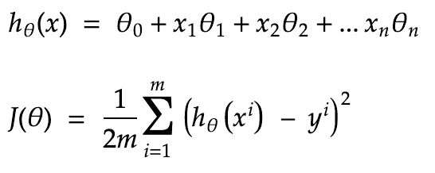
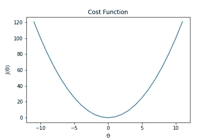
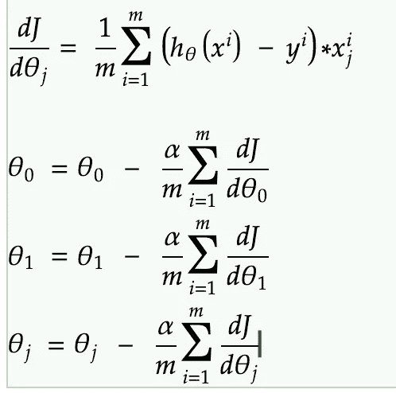
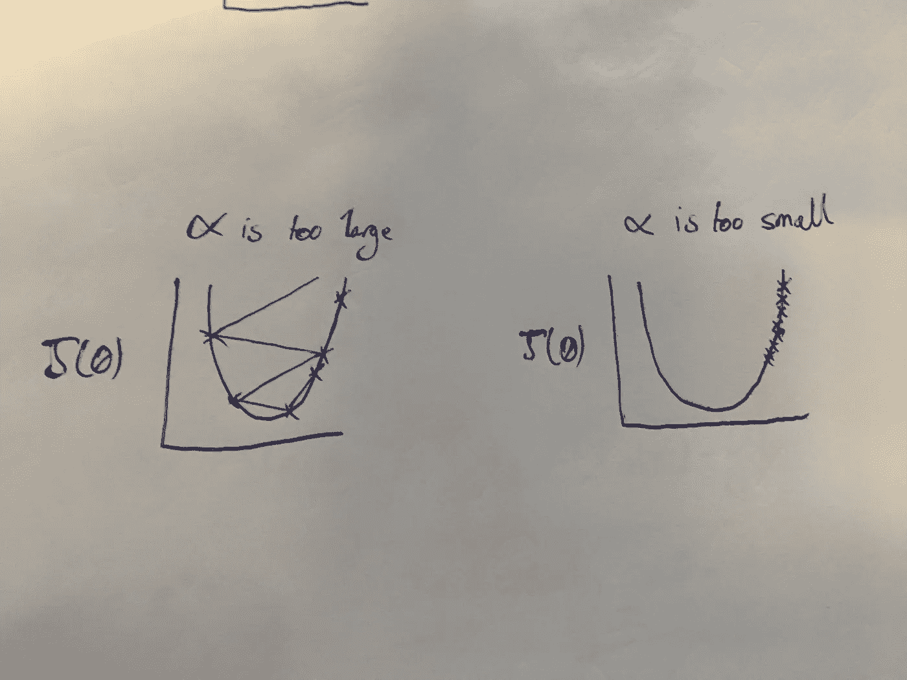
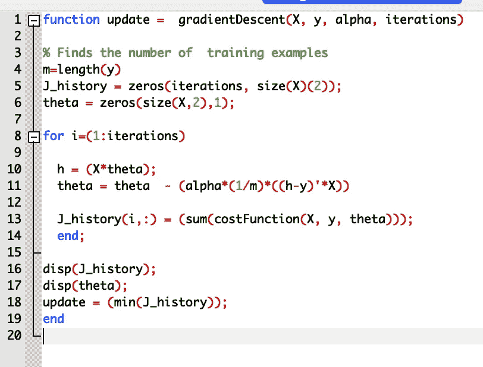
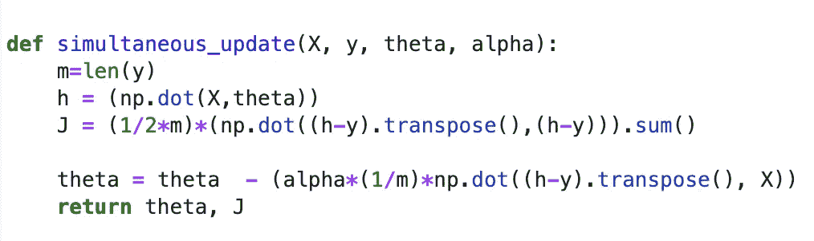
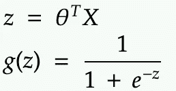
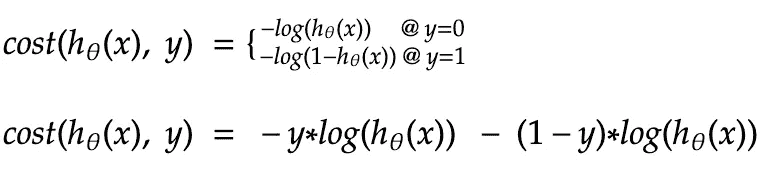
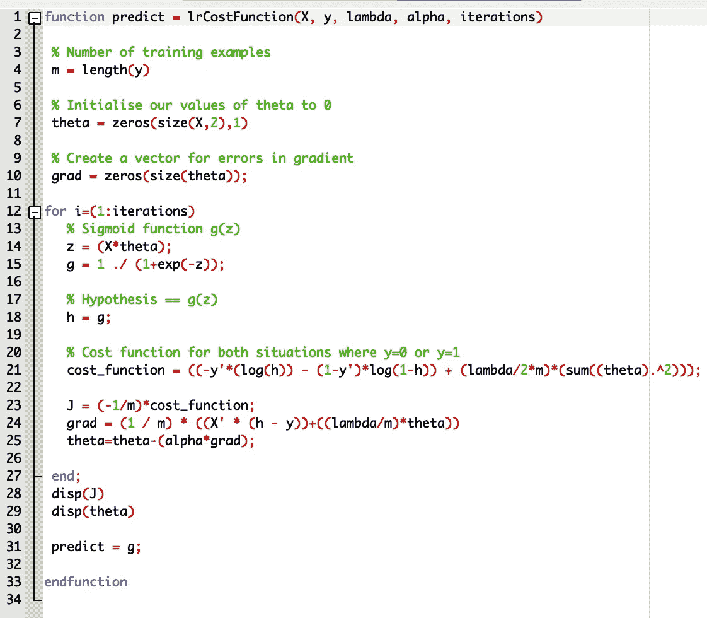
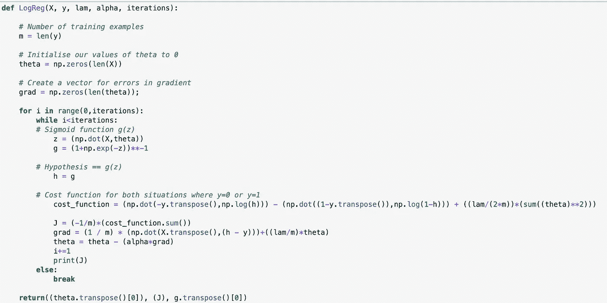

# 理解并编写你自己的机器学习算法:线性和逻辑回归

> 原文：<https://medium.com/analytics-vidhya/understanding-and-writing-your-own-machine-learning-algorithms-linear-and-logistic-regression-6a26eb0a67cd?source=collection_archive---------16----------------------->

[托马斯·麦赫雷](https://unsplash.com/@trille?utm_source=medium&utm_medium=referral)在 [Unsplash](https://unsplash.com?utm_source=medium&utm_medium=referral) 上拍照

如果你已经为一个连续变量(比如价格)或者一个分类问题建立了一个模型，那么你很可能遇到过线性回归和逻辑回归。这可能是当今许多编程语言(如 Python 中的 Scikit-learn)中最流行的两种机器学习算法，只需几行代码就可以导入并运行。然而，这一过程的简单性意味着无需真正理解底层机制就可以非常容易地构建这些模型。

然而，在实现你自己的算法之前，你应该了解它们是如何工作的，在哪里可以使用它们，在哪里不可以。如果你知道这一点，实现你自己的算法将是帮助你理解他们做什么的一个非常好的方法。

在这篇博文中，我将解释这些众所周知的算法背后的直觉和数学，并为您提供一种自己编写和测试它们的方法，以便更好地理解正在发生的事情。这也意味着你将能够为特定的场景优化你的算法。

以下内容可以用多种语言完成，具体取决于你最习惯的语言。我已经使用 NumPy (Python)进行了计算，并在 Octave 中进行了初步实现——类似于 MatLab，但适用于那些买不起许可证的人。Python 中 [Octave](https://www.gnu.org/software/octave/) 文件的运行可以用 [Oct2Py 库实现。](https://oct2py.readthedocs.io/en/latest/)

# **线性回归**

基于特征 X 和相应的权重/系数θ的组合，线性回归用于预测连续的结果变量 y。我们称我们的预测为我们的假设 h_θ(x)，并计算成本函数 J(θ)，其中最常用的是均方误差。

我们的预测 h(x)和相关的成本函数/误差项。其中 n 是特征的数量，m 是训练样本的数量。我们设置 x0 =1，所以θ0 是我们的截距。

由于我们的 J(θ)是一个平方项，我们的成本函数呈现抛物线，其中最小值是误差最小的地方。当我们求导误差项的变化率时，1/2m 是为了使数学更容易。

通过改变θ使成本函数最小化。

现在机器学习来了。我们主要计算预测中的误差，并在使误差最小的方向上改变每个系数的值。这很好地解决了这个问题，因为我们可以利用成本函数对每个系数的微分来保持其他系数不变。这称为同步更新:

系数的同时更新，其中α是学习率，J 是成本函数。

这是一个方便的等式，因为我们还可以看到，随着θ的减小，误差项也会减小，因此 dJ/dθ项也会变小。这意味着当我们接近最小值时，我们会采取更小的步骤。我们的α值是学习率，必须适当选择，以便不超过最小值，也使我们的算法不需要太长时间运行。

太大的α值(快速学习率)会导致成本函数膨胀，但是太小的α值(慢速学习率)会使我们达不到最小值。

## 矢量化

为了预测多个变量，我们可以使用矢量化，只需对代码进行微小的调整，就可以轻松计算。这是将我们的特征 X 转换成矩阵，将我们的系数θ转换成向量的过程。

下面是用 Octave 和 Python 写的代码，用于同步更新:

整个梯度下降算法，向量化，在八度。

Python 中的同步更新，矢量化。

# **逻辑回归**

现在，当我们需要预测离散值时，我们使用逻辑回归。很多人会称逻辑回归为分类器，但实际上它不是。随着我对相关数学的研究，这一点会变得清晰，但本质上这是一个概率预测。

在逻辑回归的情况下，我们的假设采取不同的形式:

sigmoid 函数的方程。

决策边界设置为 0.5 的 sigmoid 函数。

由于我们将使用 sigmoid 函数将我们的预测转换为 0 到 1 之间的概率，因此成本函数会发生变化。如果我们对此求平方，就像在线性回归的 MSE 中一样，我们将最终得到多个最小值，梯度下降将无法找到成本函数的全局最小值。

相反，我们使用下面的交叉熵或对数损失函数:

成本函数可以合并成一个等式，其中，根据 y 是 1 还是 0，该项的一侧消失。

该等式还方便地为错误预测提供了更大的惩罚，使得成本函数更大。

对数损失在 y 轴上，我们的预测在 x 轴上。摘自吴恩达在 Coursera 上的斯坦福机器学习课程。

现在我们可以把它写成代码:

正则化逻辑回归，矢量化，以倍频程表示。

Python 中正则化逻辑回归的矢量化算法

这就是你自己的逻辑和线性回归算法！我仍然建议坚持使用预先构建的模型，因为这些模型已经针对许多不同的用例进行了尝试和测试——尽管您可能会找到一个用例来优化和使用您自己的用例！

希望这已经提供了对这些常用模型如何工作以及如何调试它们的有用理解。如果你觉得这有帮助或有趣，请留下评论！