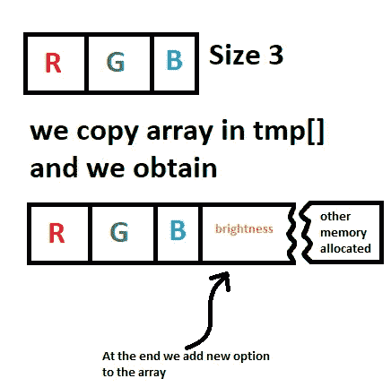
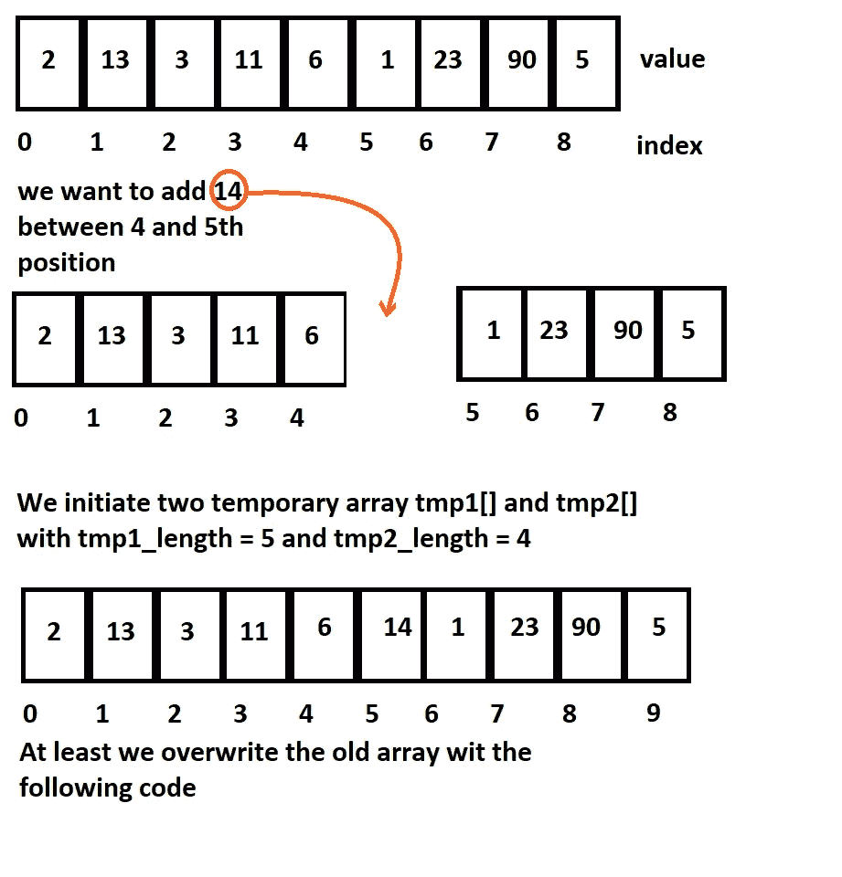

# 理解数组

> 原文：<https://medium.com/analytics-vidhya/understanding-array-d6262093e821?source=collection_archive---------24----------------------->

享受数组带来的乐趣

今天我想解释什么是数组，以及你可以在数组上做什么操作。我们用大小、类型和第 I 个元素来描述一个数组。

首先我们必须声明类型(整型，浮点型，双精度型，长整型，字符串型，字符型…取决于编程语言)，数组的变量名，数组的大小。为了描述一个数组，我们将使用 java，如果你不熟悉 java，请随时联系我。

首先，我们创建一个名为 MyArray 的类

```
public class MyArray{int[] vector;public MyArray(int size)
 {
 vector = new int[size];
 }public static void main(String[] args)
{
 MyArray a = new MyArray(10);
}
}
```

**1 简单操作**

我们用 10 个位置(从 0 到 9)初始化一个数组，现在编写一个方法来打印元素的值。我们可以使用 toString 方法并覆盖它。

如果我们运行这段代码，输出是一个只有零的数组，这是因为 java 在数组的每个位置初始化一个零的数组。

现在你可以在一个位置上做的第一件事就是执行操作或者添加一个元素。

**2 延伸幽阵**

当您使用动态数据结构时，您可以添加一个新元素，而不必担心更新数组大小或指出分配的数组内存空间之类的问题。有时候最好的选择是使用数组(一种静态数据结构)。例如，如果你想呈现一种颜色，你需要三个通道，一个是红色，绿色和蓝色。


您只需用一个大小为 3 数组表示三个通道。

现在我们假设我们想要获得亮度。
亮度可以被认为是红色、绿色和蓝色坐标的[算术](https://en.wikipedia.org/wiki/Arithmetic_mean)平均值。我们想要用 rgb 通道和亮度值来表示颜色向量，我们可以使用一个方法来添加一个新的位置值。

方法“AddOption”创建一个临时数组，用旧的长度加 1 初始化，然后我们用 for 循环复制 rgb 通道，并用亮度设置临时数组中的最后一个位置。
**我们通过将 r、g 和 b 通道相加来计算亮度，并对总和进行平均。如果你不知道 mean 或其他数学概念，请遵循本文:**

[](/analytics-vidhya/a-little-bit-of-math-that-you-can-use-in-python-2ada05709693) [## 你可以在 python 中使用一点数学知识

### 数学数学再数学

medium.com](/analytics-vidhya/a-little-bit-of-math-that-you-can-use-in-python-2ada05709693) 

**下面是如何处理数组以进行扩展的示意图:**



现在，如果您想在 x 位置添加一个值，例如，您可以在第 3 和第 4 个位置之间插入一个值。您可以将数组分成两部分，并在中间添加新值。
**首先是一个心理方案:**



将数组分成两个临时数组是一个好方法，但是如果你编码这个解决方案就不能使用:

我在一个主类中编写了这个片段，让您可以在 ide 中尝试编辑代码。
下面的代码使用一个临时数组来保存第一半并将新值添加到最后一个位置，然后进行最后一次循环来复制原始数组的第二部分。

有更好的方法来修改一个数组并在两个位置之间添加一个新值。以这种方式编写的代码可以让您更好地理解向量背后的动态。
**有任何事情随时联系我。**

**享受你的代码**