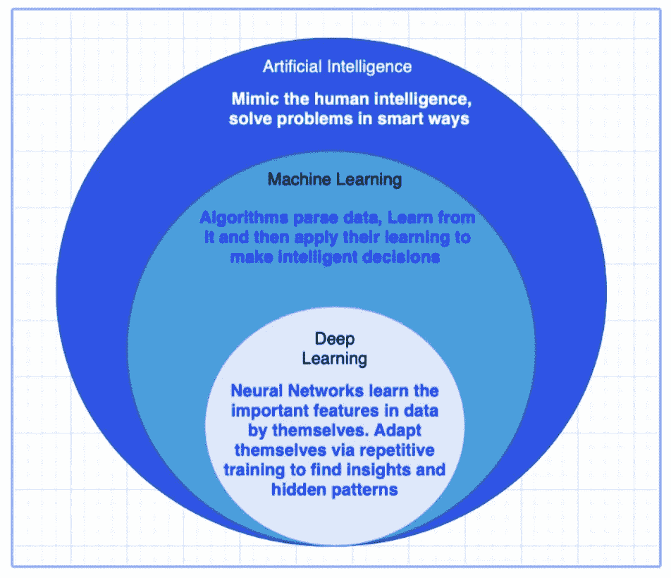

# 理解人工智能、机器学习、深度学习和数据科学

> 原文：<https://medium.com/analytics-vidhya/understanding-artificial-intelligence-machine-learning-deep-learning-and-data-science-e7b48e6cb9cf?source=collection_archive---------21----------------------->

## 有哪些被过度炒作的术语，它们是什么意思？

@版权所有 Chan Naseeb

所有这些时髦词汇是什么意思，它们与你有什么关系？

在文章中，我试图用很少的话来阐述这些术语，如人工智能、ML、DL 和数据科学…