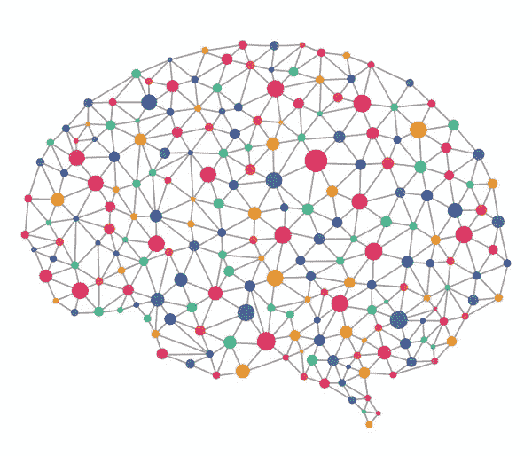
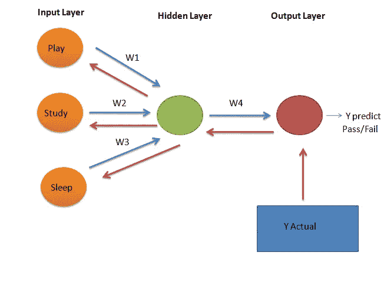
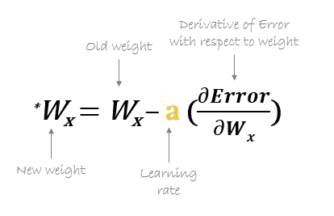

# 理解人工神经网络的 7 个步骤

> 原文：<https://medium.com/analytics-vidhya/understanding-artificial-neural-network-in-7-steps-86edf61be53e?source=collection_archive---------16----------------------->

用于数据处理和识别数据模式的神经网络。

来源:[https://www . aitrends . com/WP-content/uploads/2018/05/5-11 deeplearning-2 . jpg](https://www.aitrends.com/wp-content/uploads/2018/05/5-11DeepLearning-2.jpg)

神经网络使用人工神经元的概念，其工作方式类似于我们大脑中的神经元。人工神经网络由大量用于处理信息的相互连接的神经元组成。

# 人工神经网络是如何工作的？

来源:作者

让我们通过一个例子来理解这一点

## **问题陈述** : **我们必须根据一个学生玩耍、睡觉和学习的时间来预测他是否会通过考试。**

1.  这里我们有 3 个输入——玩耍(x1)、睡眠(x2)和学习(x3)。(以橙色显示)在输入层。
2.  有一个隐藏层，其中 1 个神经元以绿色显示。
3.  有一个输出层(显示为红色)。输出层有 1 个神经元。它将预测学生是否会通过/失败。

# 步骤:

输入被传递给隐藏层中的神经元。

**第一步:将计算神经元 Y 中的**。

Y=w1x1+w2x2+w3x3+b ( w1，w2，w3 为权重，b 为偏差)。那么激活函数将应用于 y 上，我们假设激活函数为 sigmoid。应用激活函数后，输出为 z。

Z=Act(Y)

**第二步:**隐藏层的输出将被传递到输出层。y 预测将是输出层的输出。这是一个二元类-通过/失败。这被称为**正向传播(蓝色箭头所示)**

**步骤 3:** 将 Y 预测值与 Y 实际值进行比较，并计算损失/成本。

第四步:我们必须将损失/成本降到最低。因此 Y 预测值可以与 Y 实际值相匹配。

**步骤 5:** 在训练阶段，我们必须以损失/成本最小化的方式更新权重，这可以使用优化器来完成，如(梯度下降、adam 等)

**第六步:**我们必须返回去更新权重，这个过程叫做**反向传播(红色箭头所示)**

**第 7 步:**现在我们必须计算新的权重，以便将成本/损失降至最低。

来源:[https://hmkcode.github.io/images/ai/bp_update_formula.png](https://hmkcode.github.io/images/ai/bp_update_formula.png)

w4 new= w4old-(学习率)X(损失/成本 wrt 对 w4old 的导数)

类似地，将计算 w1、w2、w3。

在获得更新的权重之后，将进行前向传播以找到输出。这将重复一些时期，直到损失/成本最小化。

注意:学习率不应该非常非常小(因为可能需要很长时间来收敛以找到最优权重)或非常非常大(因为它可能错过最优权重值的全局最小值点)

# 在你走之前

*感谢阅读！如果你想与我取得联系，请随时联系我在 jsc1534@gmail.com 或我的* [*LinkedIn 个人资料*](http://www.linkedin.com/in/juhi-sharma-ds) *。*