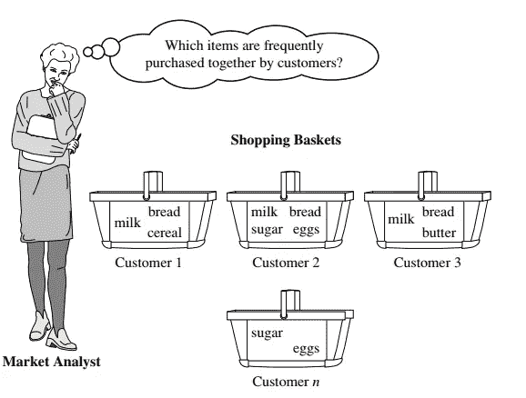
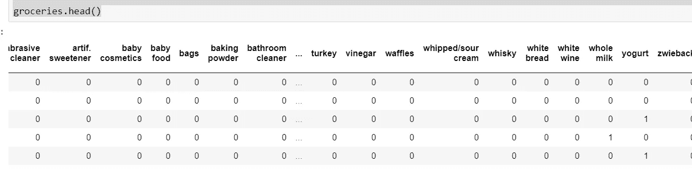
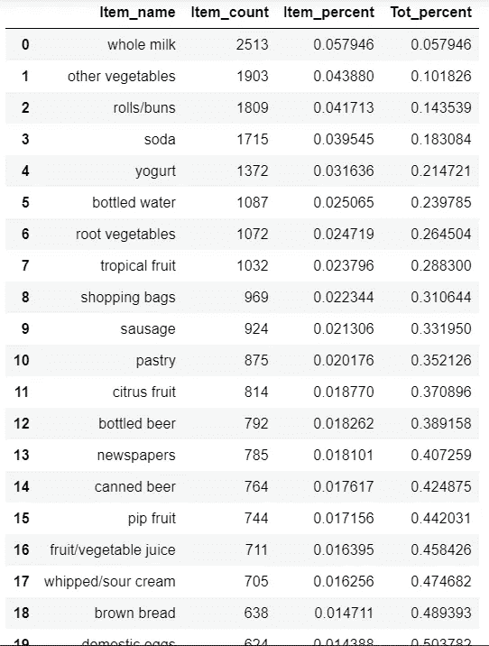
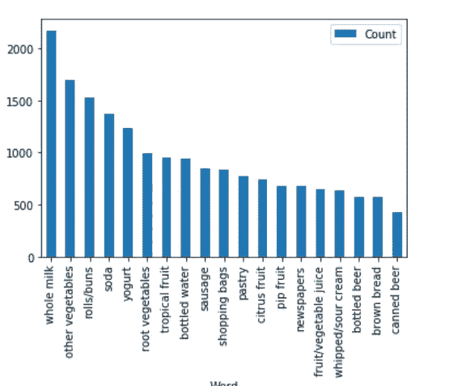
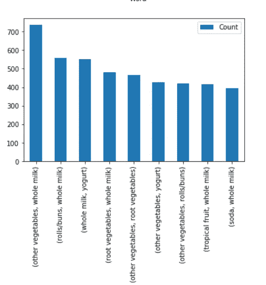
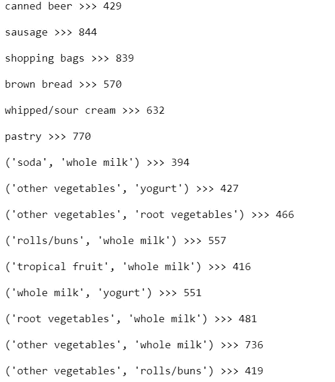
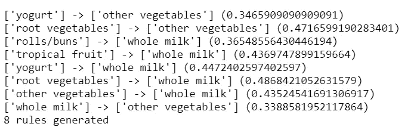
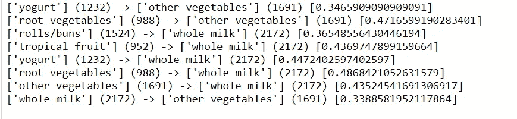

# 使用 Python 理解关联挖掘和使用 Apriori 算法的购物篮分析

> 原文：<https://medium.com/analytics-vidhya/understanding-association-mining-and-market-basket-analysis-with-apriori-algorithm-using-python-e216c0d22f3e?source=collection_archive---------7----------------------->

**关联挖掘**

S 暗示摆放，寻找物体之间的关系。例如，如果大多数人买了黄油，他们一定也买了面包。因此，一些超市将有很高可能性被一起购买的物品放在同一通道中，而另一些超市可能将它们放在两个不同的角落，以便顾客在找到其他必需品时浏览并购买其他产品。因此，关联挖掘在为目录设计、销售、市场营销等建立和改进决策和商业规则方面是非常重要的。

> 频繁模式挖掘是发现数据集中频繁出现的模式，即发现关联和相关性。模式可以是牛奶和饼干等一组物品的形式，也可以是一个序列，例如购买手机，然后是存储卡和耳机。市场购物篮分析就是一个例子，其中根据客户的“购买习惯”来分析购买习惯并建立规则。模式以规则的形式表现出来。

**模式的兴趣度**

> 反映已建立规则的可用性和确定性水平。

1.  **支持**:是涉及某个特定项目的交易占总交易数的比例。它定义了一个项目的受欢迎程度。它的范围在 0 和 1 之间。
2.  **置信度**:它是涉及两个项目 X 和 Y 的交易数与涉及 X 的交易数之比，因此，它告诉我们，在给定 X 发生的次数的情况下，项目 X 和 Y 一起发生的频率的可能性。它的范围在 0 和 1 之间。
3.  **提升**:提升表示规则的确定性。卖了 B，X 的销量增加了多少？

## 升力(X=>Y) =置信度(X，Y)/支持度(Y)

> 示例:A = > B[支持度= 5%，置信度= 80%]

所有交易的 5%显示 A 和 B 是一起购买的。80%买了 A 的顾客也买了 b。

常见的算法有 Apriori，FP-growth 等等。



来源:数据挖掘概念和技术，第三版。

亚马逊、Flipkart、Capital One、沃尔玛等公司巨头在其大数据上使用这种分析方法。例如:“经常一起购买的物品。”

**注意**:关联和推荐是不同的，因为关联不是关于某个特定个人的偏好，而是关于项目集之间的关系。

**关于数据**

关联挖掘可用于需要根据客户习惯做出更好决策的问题。

例如杂货店和基本商店、在线市场、音乐和电影类型、软件购买等。

这些数据通常是大数据和非结构化数据。也就是说，数据不会是严格的表格格式。一行中可以有任意数量的项目(列)，所以我们需要处理不同列数的问题。

# **Apriori 算法**

> **1。查找所有频繁项集**:出现频率至少与最小支持计数相同的项集。
> 
> **2。从频繁项目集生成强关联规则**:满足最小支持度和最小置信度的规则。

标准数据集— [***杂货. csv***](https://github.com/stedy/Machine-Learning-with-R-datasets/blob/master/groceries.csv)

尺寸:9834 X 41

**实施**

A.对数据进行探索性数据分析。

*   了解形状
*   找出数据集中出现的前 20 个项目
*   这 20 项占多少？—项目百分比

B.根据交易中的项目数量和总销售百分比来删减数据集。

C.应用 Apriori 算法，获取规则。

让我们开始寻找以上问题的答案吧！

1.  导入库

```
import numpy as np
import matplotlib.pyplot as plt
import pandas as pd
import csv
from apyori import apriori
import itertools
```

2.了解形状

```
data = pd.read_csv('groceries.csv')
data.shape
```

输出:

```
(9835, 41)
```

3.接下来，找出前 20 项以及它们占总百分比的多少。

```
#Finding all items present in our data - groceries.csv
#We will have to use the csv package so that we can read each line one by one and update any new grocery item.all_items = set()#set of all items
with open("groceries.csv") as f:
    reader = csv.reader(f, delimiter=",")
    for i, line in enumerate(reader):
        all_items.update(line)#Now, we count if a particular item appears in the a particular row and update it in a list format.counting = list()
with open("groceries.csv") as f:
    reader = csv.reader(f, delimiter=",")
    for i, line in enumerate(reader):
        row = {item:0 for item in all_items}
        row.update({item:1 for item in line})
        counting.append(row)#Next, convert the list in to Pandas DataFrame so that wecan do pandas operations.groceries = pd.DataFrame(counting)groceries.head()
# 0 represents that the item is not present in a particular row/ item order list.
```



输出

```
# Finding item count is now easy - we need to sum it up.# 1\. Find total number of items sum of all the sums of rows
tot_item_count = **sum**(groceries.**sum**()) # Answer is 43368# 2\. Sum the rows and sort is descending order to get top 20 items
item_sum = groceries.**sum**().sort_values(ascending = False).reset_index().head(n=20)
item_sum.rename(columns={item_sum.columns[0]:'Item_name',item_sum.columns[1]:'Item_count'}, inplace=True)# 3\. Add the percent so that we know how much it contributes. #Tot_percent of x determines the percentage of x and above elements in the total percentage i.e cumulative sum.
item_sum['Item_percent'] = item_sum['Item_count']/tot_item_count
item_sum['Tot_percent'] = item_sum.Item_percent.cumsum()
item_sum.head(20) # List of top 20 items with percents# Plotting Code
# We will plot later, so that we can plot items + frequent items.
# But the function can be called here as well.
# Alternative Codeobj = (list(item_sum['Item_name'].head(n=20)))
y_pos = np.arange(len(obj))
performance = list(item_sum['Item_count'].head(n=20))

plt.bar(y_pos, performance, align='center', alpha=0.5)
plt.xticks(y_pos, obj, rotation='vertical')
plt.ylabel('Item count')
plt.title('Item sales distribution')
```



前 5 项= 21.74%，前 20 项= 50.37%

因此，我们需要修剪/减少数据集，因为大多数元素对总销售额的贡献为零。

4.我们已经完成了项目/问题陈述的一部分。现在我们来看看 B 部分。

为此，我们将定义一个函数 prune_dataset，它可以从用户/分析师那里获取以下参数。

*   输入数据帧
*   要考虑的最小交易长度(即一行中的最小项目数)。
*   要考虑的项目的最小总销售额百分比。

```
def prune_dataset(olddf, len_transaction, tot_sales_percent):
    # Delete the last column tot_items if present
    if 'tot_items' in olddf.columns:
        del(olddf['tot_items'])
    #Finding the item_count for each item and total number of items.
    #This is the same code as in step 3    
    Item_count = olddf.sum().sort_values(ascending = False).reset_index()
    tot_items = sum(olddf.sum().sort_values(ascending = False))
    Item_count.rename(columns={Item_count.columns[0]:'Item_name',Item_count.columns[1]:'Item_count'}, inplace=True)

    # Code from Step 3 to find Item Percentage and Total Percentage.
    Item_count['Item_percent'] = Item_count['Item_count']/tot_items
    Item_count['Tot_percent'] = Item_count.Item_percent.cumsum()

    # Taking items that fit the condition/ minimum threshold for total sales percentage.
    selected_items = list(Item_count[Item_count.Tot_percent < tot_sales_percent].Item_name)
    olddf['tot_items'] = olddf[selected_items].sum(axis = 1)

    # Taking items that fit the condition/ minimum threshold for length of transaction or number of items in a row.
    olddf = olddf[olddf.tot_items >= len_transaction]
    del(olddf['tot_items'])

    #Return pruned dataframe.
    return olddf[selected_items], Item_count[Item_count.Tot_percent < tot_sales_percent] 
```

我们现在将为 len_transaction 和 tot_sales_percent 输入不同的值，以获得 apriori 的适当数据集。

*删除数据帧#1*

```
pruneddf, Item_count = prune_dataset(groceries,4,0.4)
print(pruneddf.shape)
print(list(pruneddf.columns))
```

输出(列的列表实际上是我们先验考虑的项目。)

```
(1267, 13)
['whole milk', 'other vegetables', 'rolls/buns', 'soda', 'yogurt', 'bottled water', 'root vegetables', 'tropical fruit', 'shopping bags', 'sausage', 'pastry', 'citrus fruit', 'bottled beer']
```

它有相当多的行和前 13 项(列)

*修剪后的数据帧#2*

```
pruneddf, Item_count = prune_dataset(groceries,4,0.5)
print(pruneddf.shape)
print(list(pruneddf.columns))
```

输出:

```
(1998, 19)
['whole milk', 'other vegetables', 'rolls/buns', 'soda', 'yogurt', 'bottled water', 'root vegetables', 'tropical fruit', 'shopping bags', 'sausage', 'pastry', 'citrus fruit', 'bottled beer', 'newspapers', 'canned beer', 'pip fruit', 'fruit/vegetable juice', 'whipped/sour cream', 'brown bread']
```

现在，行的数量很好，在我们的压缩数据集中也有前 19 项。

*删除数据帧#3*

```
pruneddf, Item_count **=** prune_dataset(groceries,2,0.5)
print(pruneddf.shape)
print(list(pruneddf.columns))
```

输出:

```
(5391, 19)
['whole milk', 'other vegetables', 'rolls/buns', 'soda', 'yogurt', 'bottled water', 'root vegetables', 'tropical fruit', 'shopping bags', 'sausage', 'pastry', 'citrus fruit', 'bottled beer', 'newspapers', 'canned beer', 'pip fruit', 'fruit/vegetable juice', 'whipped/sour cream', 'brown bread']
```

这是一个非常好的数据集，因为它包含了原始数据集的前 19 项和非常多(实际上是一半)的行/事务。所以，我们将继续进行。

5.b 部分已经完成。现在，我们将应用 Apriori，并在仅包含最相关数据的精简数据上生成规则和关系。

首先，我们需要将我们的数据框转换成 csv 文件，这样它看起来就像我们的原始数据集，但维度减少了。

```
# Converting 1's to appropriate item name(column name)
y = list(pruneddf.columns)
for s in y:
    pruneddf.loc[(pruneddf[s] == 1),s]=s
#Removing Zero's
lol = pruneddf.values.tolist() 
for a in lol:
    while (0 in a):
        a.remove(0)
#Making a new pruned dataset csv file
with open("pruned.csv", "w", newline="") as f:
    writer = csv.writer(f)
    writer.writerows(lol)
```

我们有一个干净和有组织的 csv 文件，我们可以在其上应用先验代码。

```
import csv
import itertools
#Delete Files prunedRules and PrunedFItems otherwise new data will be appended.
Groceries = open('pruned.csv', 'r')
#Minimum Support Count
min_support = 0.04
Rules = "prunedRules.txt"
freqItemsets = "prunedFItems.txt"
#Mininum Confidence
min_confidence = 0.30# Finding all Frequent 1-Item sets
def OneItemSets():
    #Get all 1-itemsets in the list items and their counts in the dictionary counts
    DataCaptured = csv.reader(Groceries, delimiter=',')
    data = list(DataCaptured)
    for e in data:
        e = sorted(e)
    count = {}
    for items in data:
        for item in items:
            if item not in count:
                count[(item)] = 1
            else:
                count[(item)] = count[(item)] + 1count2 = {k: v for k, v in count.items() if v >= min_support*9835}return count2, data#Ck is a superset of Lk. It is a part of Prune Step. its members may or may not be frequent, but all of the frequent k-itemsets are included in Ck.
# Generated by joing two Lk
def generateCk(Lk_1, flag, data):
    Ck = []
    if flag == 1:
        flag = 0
        for item1 in Lk_1:
            for item2 in Lk_1:
                if item2 > item1:
                    Ck.append((item1, item2))
        print("C2: ", Ck[1:3])
        print("length : ", len(Ck))
        print()else:
        for item in Lk_1:
            k = len(item)
        for item1 in Lk_1:
            for item2 in Lk_1:
                if (item1[:-1] == item2[:-1]) and (item1[-1] != item2[-1]):
                    if item1[-1] > item2[-1]:
                        Ck.append(item2 + (item1[-1],))
                    else:
                        Ck.append(item1 + (item2[-1],))
        print("C" + str(k+1) + ": ", Ck[1:3])
        print("Length : ", len(Ck))
        print()
    L = generateLk(set(Ck), data)
    return L, flag#If item in Ck belongs to a transaction, it makes it into list Ct Then Ct is thresholded to form L
# For K frequent Itemsets
def generateLk(Ck, data):

    count = {}
    for itemset in Ck:
        #print(itemset)
        for transaction in data:
            if all(e in transaction for e in itemset):
                if itemset not in count:
                    count[itemset] = 1
                else:
                    count[itemset] = count[itemset] + 1print("Ct Length : ", len(count))
    print()count2 = {k: v for k, v in count.items() if v >= min_support*9835}
    print("L Length : ", len(count2))
    print()
    return count2#  Generates association rules from the frequent itemsets
def rulegenerator(fitems):
    counter = 0
    for itemset in fitems.keys():
        if isinstance(itemset, str):
            continue
        length = len(itemset)union_support = fitems[tuple(itemset)]
        for i in range(1, length):lefts = map(list, itertools.combinations(itemset, i))
            for left in lefts:
                if len(left) == 1:
                    if ''.join(left) in fitems:
                        leftcount = fitems[''.join(left)]
                        conf = union_support / leftcount
                else:
                    if tuple(left) in fitems:
                        leftcount = fitems[tuple(left)]
                        conf = union_support / leftcount
                if conf >= min_confidence:
                    fo = open(Rules, "a+")
                    right = list(itemset[:])
                    for e in left:
                        right.remove(e)
                    fo.write(str(left) + ' (' + str(leftcount) + ')' + ' -> ' + str(right) + ' (' + str(fitems[''.join(right)]) + ')' + ' [' + str(conf) + ']' + '\n')
                    print(str(left) + ' -> ' + str(right) + ' (' + str(conf) + ')')
                    counter = counter + 1
                    #Greater than 1???
                    fo.close()
    print(counter, "rules generated")
def plotitemfreq(L):
    aux = [(L[key], key) for key in L]
    aux.sort()
    aux.reverse()
    z = aux[0:20]
    print(z)
    df = pd.DataFrame(z, columns = ['Count', 'Word'])
    df['Count']=pd.to_numeric(df['Count'])
    print(df.info())
    df.plot.bar(x='Word', y='Count')def apriori():
    L, data = OneItemSets()
    flag = 1
    FreqItems = dict(L)
    while(len(L) != 0):
        fo = open(freqItemsets, "a+")
        for k, v in L.items():

            fo.write(str(k) + ' >>> ' + str(v) + '\n\n')
        fo.close()
        plotitemfreq(L)L, flag = generateCk(L, flag, data)
        FreqItems.update(L)
    rulegenerator(FreqItems)apriori()
```

所有输出:

1.  频繁项目和项目集



项目频率



项目集的频率



PrunedFitems.txt 视图

2.生成的规则



生成的规则



prunedRules.txt 视图

至此，我们已经完成了市场篮子分析。

[完整代码- Github](https://github.com/HardiRathod/market-basket-analysis-apriori)

如有任何疑问或问题，请评论或发送邮件。

一定要看看我的[其他作品](/@rathodhardi200)。