# 理解变形金刚模型中的注意力

> 原文：<https://medium.com/analytics-vidhya/understanding-attention-in-transformers-models-57bada0cce3e?source=collection_archive---------0----------------------->

我希望在我的项目开始前就知道。

我认为建立一个语言翻译器会很酷。起初，我想我会利用一个`**recurrent neural network**` ( `**RNN**`)或者一个`**LSTM**`来这样做。但是在我做研究的时候，我开始看到一些文章提到`**transformer model**`是 NLP 的新技术。

所以我的兴趣达到了顶峰，我认为为我的项目构建一个转换器可能会很酷。

因此，现在我必须尽可能多地获取信息，努力学习如何实现它。但更重要的是，我真的很想了解它们是如何工作的。

我找到了开始这一切的研究论文——[***关注是你需要的全部***](https://arxiv.org/pdf/1706.03762.pdf) 。它是在 2017 年出版的，所以它是相当新的。但是当我读它的时候，我知道我需要一些帮助来理解一些概念。

我陷入困境的部分是位置编码和自我关注。所以我继续寻找，试图找到其他人是如何解释这些概念的。

我能找到的最好的博客文章是 Jay Alammar 的 [***插图变压器***](http://jalammar.github.io/illustrated-transformer/) 。如果你像我一样是视觉学习者，你会发现这是无价的。在那里我找到了 Jay 的另一个帖子的链接， [***可视化神经机器翻译模型(Seq2seq 模型的力学注意)***](https://jalammar.github.io/visualizing-neural-machine-translation-mechanics-of-seq2seq-models-with-attention/) 。

在这篇文章中，我将探讨`**self-attention**`的概念。这将有望成为在研究 transformer 模型时试图理解这一概念的任何人的资源。

我不会在这篇文章中谈论变形金刚，请注意。但是这里有一张架构的图片，这样你就可以知道注意力子层与模型的关系。

**变压器模型架构**

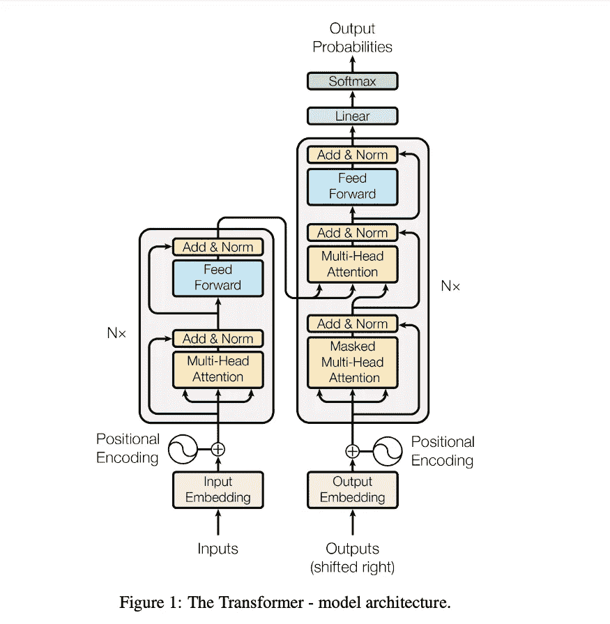

**来源:** [**注意力是你所需要的一切**](https://arxiv.org/pdf/1706.03762.pdf)

**那么，为什么关注？**

这是变形金刚里的专用酱！它解决了并行化和序列中相距较远的单词的上下文信息丢失的问题。这些都是像`**RNNs**`和`**LSTMs**`这样的`**seq2seq**`型号的问题。

这些模型中出现这些问题的主要原因是它们需要一个接一个地处理序列中的每个单词。这意味着他们需要更长的时间来训练。如果我们可以并行处理所有的单词会怎么样？

另一个问题是上下文和结构的推导方式。这些模型首先将第一个字(令牌)输入编码器，然后用随机起始状态计算一个新的`**state**`。然后在下一个时间步骤中，使用下一个单词和上一个状态创建一个新状态。重复这个过程，直到所有的单词都用完，此时产生固定长度的上下文向量。然后，上下文向量被传递给解码器以生成输出。

问题是，在计算最终的上下文向量时，关于早期状态的上下文信息可能会丢失，因为早期的计算无法访问后面的单词。此外，固定大小的上下文向量可能不够大，不足以保留所有信息。

**那么变压器是如何解决这些问题的呢？**

转换器的编码器和解码器消耗整个序列，并并行处理所有单词(嵌入)。由于这种并行性，训练时间减少了。第二，这种并行处理意味着可以从所有单词中计算出上下文，从而得到更完整的上下文。

**线性变换**

当一系列嵌入被传递到变换器的输入端(编码器和解码器)时，首先发生的是每个嵌入经历三个独立的线性变换，产生三个向量— `**query**`、`**key**`和`**value**`。当输入向量(嵌入)乘以 3 个权重矩阵时，发生这些变换。适当的重量是通过训练学会的。下图表示的是一个矢量`**sequence length**`为 2，`**embedding size**`为 4。

**为什么是三次线性变换？**

由于每个`**weight matrix**`都是用随机权重初始化的，因此每个合成向量都了解一些关于正在处理的嵌入(单词)的不同信息。这在计算注意力分数时很重要，因为我们不希望仅仅得到向量本身的点积。

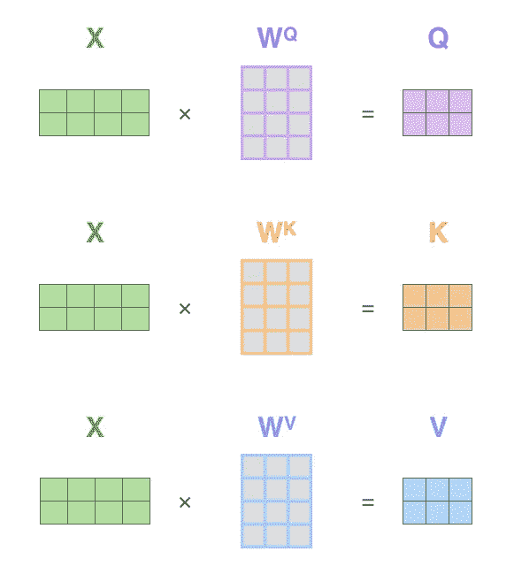

**来源:** [**图示变压器**](http://jalammar.github.io/illustrated-transformer/)

现在我们有了序列中每个嵌入的 3 个向量，我们可以计算`**attention score**`。注意力得分衡量序列中的一个单词与所有其他单词之间的关系强度。

**计算注意力的步骤**

1.获取一个单词的查询向量，用序列中每个单词的`**key vector**`的转置来计算它的`**dot product**`——包括它自己。这是`**attention score**`或`**attention weight**`。
2。然后将每个结果除以关键向量维数的平方根。这就是`**scaled attention score**`。
3。通过一个`**softmax**`函数传递它们，以便值包含在 0 和 1 之间。
4。取每个`**value vectors**`并用`**sofmax**`函数的输出计算`**dot product**`。
5。将所有的`**wighted value vectors**`加在一起。

注意下图中我们正在对`**seq_length x embedding_size**`矩阵进行矩阵运算。这显示了嵌入大小为 3 的两个单词的玩具示例。

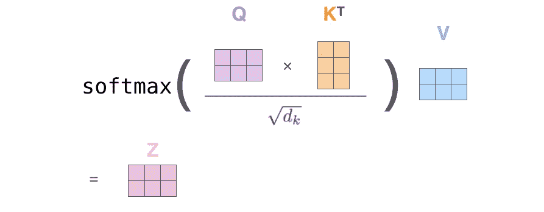

**来源:** [**图解变压器**](http://jalammar.github.io/illustrated-transformer/)

`**dot product**`产生一个`**seq_length x seq_length**`矩阵。想想`**correlation matrix**`，任何两个成员之间的关系都可以通过它们的交集找到。在这种情况下，成员是单词，它们的交集是`**attention scores**`。

将`**value matrix**`乘以`**attention matrix**`再次得到一个`**seq_length x embedding_size**`矩阵。这个矩阵保存了每次嵌入的`**contextual information**`。

**多头自我关注**

我上面描述的是`**single-head self-attention**`。在实践中我们使用`**multi-head self-attention**`。使用`**multi-head self-attention**`，每个单词都由几个注意头处理。在最初的论文中，他们使用了八个，这是我在这里使用的。

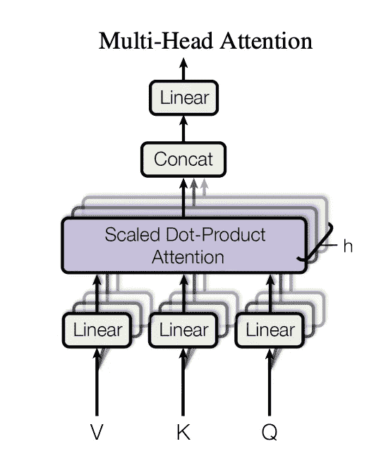

**来源:** [**注意力是你所需要的一切**](https://arxiv.org/pdf/1706.03762.pdf)

`**query**`、`**key,**`和`**value**`向量按头数划分，每段通过不同的头。这产生了八个向量，然后将它们连接在一起，并通过乘以另一个权重矩阵进行变换，使得合成向量是输入嵌入向量的大小。

来自[注意力是你所需要的一切](https://arxiv.org/pdf/1706.03762.pdf):

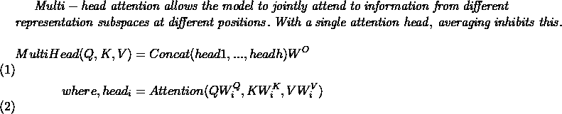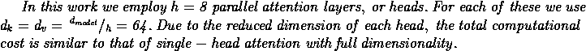

在使用`**softmax**`功能之前，我们需要对`**attention score**`应用一个遮罩。掩模将是一个`**padding mask**`或一个`**padding mask**`和一个`**look-ahead mask**`的组合。

输入到`**encoder**`和`**decoder**`的序列必须长度相同。因为句子的长度是可变的，所以必须要么截断句子，要么填充句子，使它们都是指定的长度。结果，填充可能被`**attention**`机制解释为有意义的，导致
不可靠的学习。

为了减轻这种影响，应用了一个`**padding mask**`,以便当添加到`**attention scores,**`时，填充位置中的值变得很小以至于可以忽略。这通过将掩模中的位置设置为接近`**negative infinity**`的值来实现。

填充掩码被认为是可选的，但是我相信大多数实现都选择使用它。

变形金刚是`**autoregressive models**`。它们查看序列中所有先前的输入，以便预测下一个输出(`**token**`)。但是因为与`**RNNs**`不同，它们一次接收整个序列，所以需要有一种方法来限制对任何位置的注意力，以便只关注序列中在它之前的部分。这是因为期望模型在没有峰值的情况下推断下一个位置。如果它能够看到下一个位置，那么它就会复制它。

这就是`**look-ahead mask**`的作用。序列中出现在`**query**`字右边的所有`**attention scores**`字都被屏蔽。这限制了`**query**`字关注它自己和序列中左边的所有字。

`**look-ahead mask**`仅应用于每个解码器层的第一关注子层。这是因为解码器是推理发生的地方。因此，这是模型不应该能够预见的地方。

它是如何工作的？

1.创建一个遮罩，其中对角线上方的右上角三角形的值都是 1，其余的值都是 0。
2。将遮罩乘以`***-1e9***`。
3。将遮罩添加到`**attention matrix**`中。

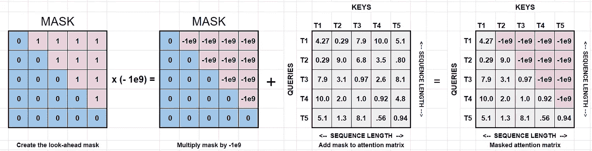

**注意力面具+注意力矩阵**

接下来，沿着`**key**`列应用 softmax，将这些值转换为`**probability distributions**`。将`**softmax**`应用于`**attention matrix**`后，所有这些极小的值都将变为零。这有什么关系呢？

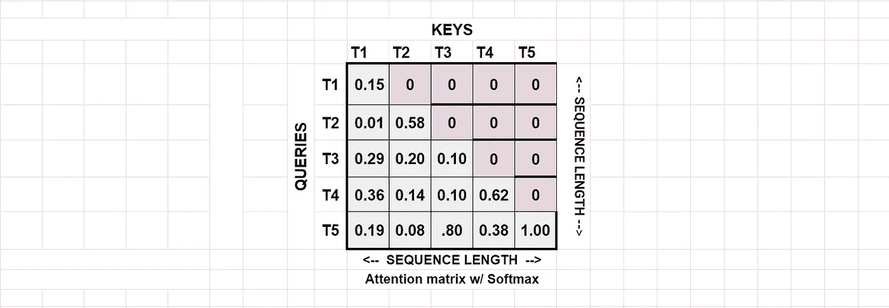

**带 softmax 的注意力矩阵**

在图中的玩具`**attention matrix**`中，我标记了两个轴[ `***T1,…,Tn***` ]。列代表记号(单词)`**keys**`，行是记号`**queries**`。any、`**query *Ti,***`的关注度得分是其所在行相对于`**key**`列[ `***T1,…,Tn***` ]的值。注意最上面的`**query,**` `***T1***`只能得到最左边的`**key**` `**T1**`的分数。`**T2,...,T5**`没有有意义的信息(值太低)。`**query**` `**T2**`可以访问`**keys**` `**[T2, $T1]**`的集合。依此类推，直到最后一个字，`**T5,**`即访问整个序列。

接下来，计算`**attention weight matrix**`和`**value matrix**`之间的`**dot product**`。这具有将权重应用于值的效果。如果您继续下去，您会注意到`***T1***`嵌入中的值只受第 1 行的`***T1***` `**attention weights**`的影响。`***T2***`嵌入只影响第 2 行的`**attention weights**`、`***T1***`和 *T2* 。如此下去，直到到达最后的嵌入(序列中的最后一个单词)，其嵌入受到最后一行中所有权重的影响。自回归就是这样实现的。

该图显示了刚才描述的内容。

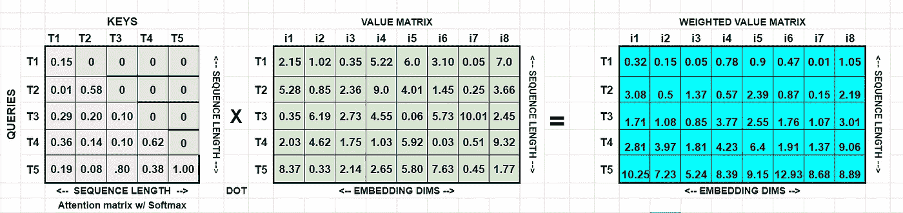

**计算加权值矩阵**

这些步骤发生在每个注意头中。下一步是连接所有的加权矩阵，并通过线性变换来恢复原始的输入维数。

这就是所有需要注意的地方。

还有一件事。注意力面具并不总是单独使用。请记住，还需要考虑填充。因此，如果我们选择使用填充遮罩，则`**look-ahead mask**`将与填充遮罩一起应用。

**自我关注公式**:

这是包括面具在内的自我关注公式。

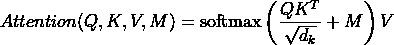

**关注度计算的表示:**

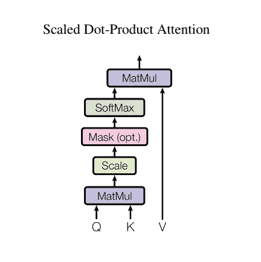

来源:[注意力是你所需要的全部](https://arxiv.org/pdf/1706.03762.pdf)

**结论**

在本文中，我们描述了`**self-attention mechanism**`，它是`**transformer model**`的核心和灵魂。我们谈到了

1.  关注的原因
2.  计算关注度的步骤
3.  对填充遮罩的需求
4.  前瞻掩码如何在解码器中解决自回归问题
5.  直观地演示了前瞻遮罩的工作原理。

谢谢你坚持到现在。我希望你喜欢这本书，并且它对理解注意力有所帮助。

资源

*   阿希什·瓦斯瓦尼等人的作品
*   杰·阿拉玛的《变形金刚》
*   [深入了解变压器架构——变压器模型的开发](https://blog.exxactcorp.com/a-deep-dive-into-the-transformer-architecture-the-development-of-transformer-models/)