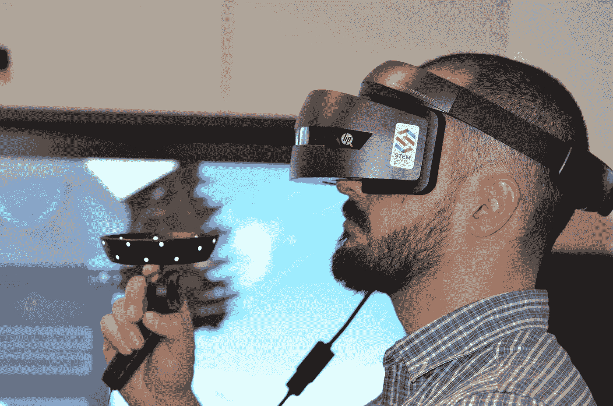
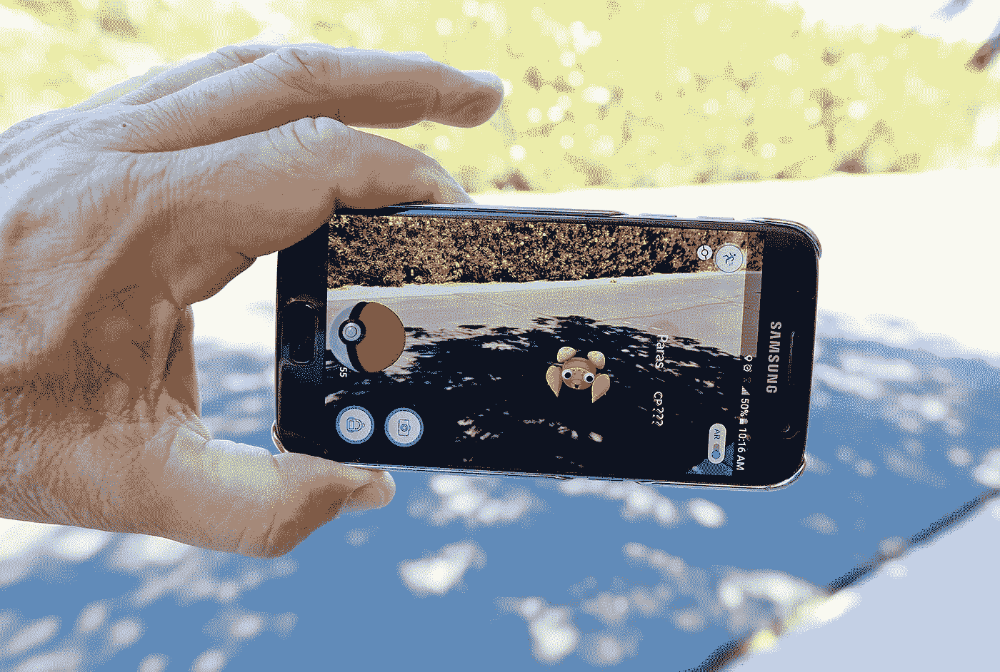
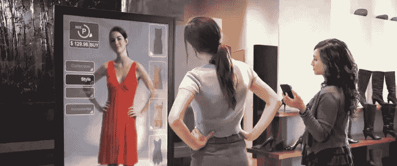
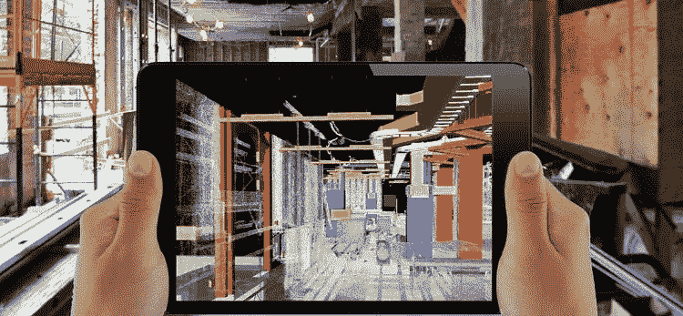
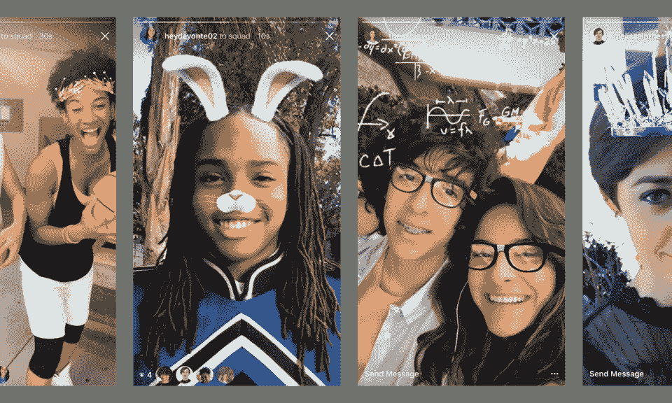
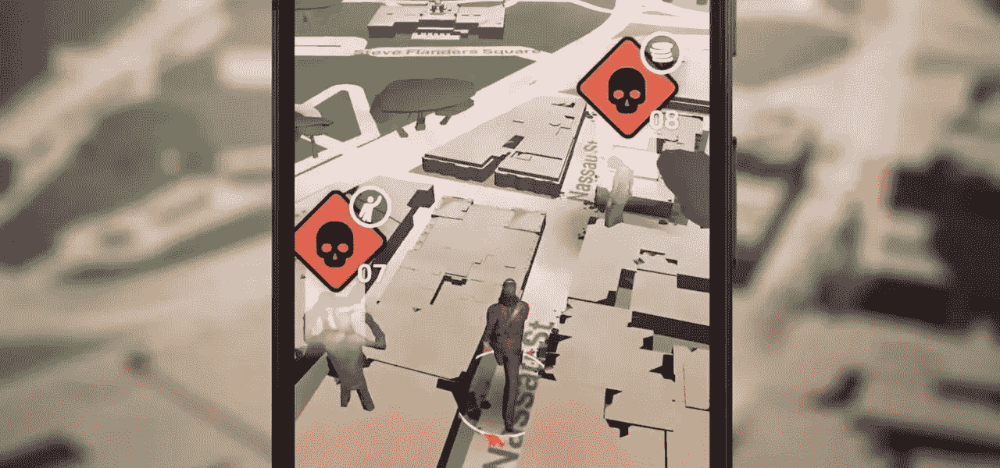
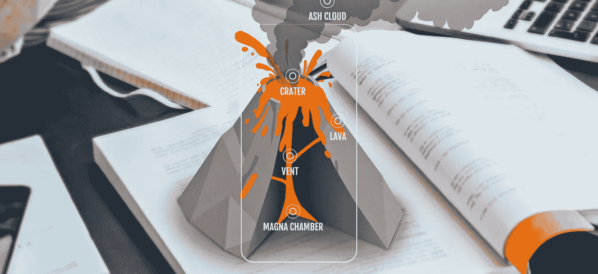

# 理解增强现实

> 原文：<https://medium.com/analytics-vidhya/understanding-augmented-reality-a24d559e24e5?source=collection_archive---------19----------------------->

扩充—在现有信息的基础上添加/创建更多信息

现实——我们都存在的真实世界环境

鉴于增强现实与其同义词的分解，这个术语是由托马斯·考德尔和大卫·米泽尔在 1992 年创造的。现在让我们来看看**虚拟现实** (VR)和**增强现实** (AR)之间的区别，因为人们经常误解其中一个。

虚拟现实是一个模拟的/人造的环境，在这个环境中，我们成为体验它的过程中的一部分，与我们的现实生活没有任何联系。相反，增强现实将给我们现有的环境带来更多的信息。AR 不会在体验它的人和他生活的真实世界之间造成脱节，而 VR 会。

***VR*** *就像你戴着眼罩，在模拟的虚拟环境中打网球，用操纵杆控制你的游戏活动*

照片由[劳伦斯·德克斯](https://unsplash.com/@flderks?utm_source=medium&utm_medium=referral)在 [Unsplash](https://unsplash.com?utm_source=medium&utm_medium=referral) 上拍摄

口袋妖怪 Go 是一个很好的例子，你可以在工具或设备的帮助下，发现你的扑克朋友和我们一样生活在同一个现实中

增强现实的历史..

1968 年——伊万·苏特尔建造的“损坏之剑”展示了一个由机械臂悬挂在顶部以观察线框房间的展览

1992 年，两位波音工程师大卫和托马斯用飞机工程师用的 AR 透明耳机取代了许多有线和麻烦的设备

2018 谷歌 ARCore

到目前为止，AR 是通过两种主要媒介来体验

1.  智能电话
2.  独立系统

一些独立的系统是谷歌眼镜，谷歌的 project tango(一种安装了软件以体验 AR 的硬件)，它更像是一部增加了硬件的智能手机

ARCore 是由 Google 创建的一个平台，作为开发移动 AR 体验的应用编程接口(API)

# ***应收账款的应用***

增强现实已经进入市场，人们已经开始体验它，尽管它还有很长的路要走，以达到全球范围内的广泛人群。从零售一直到教育和商业，AR 已经开始创造奇迹。

**零售领域的 AR..**

比方说，你想购物，并计划购买一些服装。AR 将帮助你可视化每件衣服穿在你身上的样子，为你创建一个 3D 模型。听起来是不是很酷！！！！

AR 也有助于通过虚拟地在室内和周围布置家具来可视化我们家的外观，特定的家具是否适合房间空间等。所有这些都不是用 2D 完成的，而是用真实世界大小和形状的 3D 模型完成的，所以我们可以去可视化虚拟仿真的所有三维

商业中的应收账款..

就**业务而言**解决方案 AR 有助于更贴近客户，解决他们产品的任何现实问题，帮助工程师进行设计、建造、评估和维护。

**社交媒体中的 AR..**

流行的 Instagram 和 SnapChat 过滤器是一个真实世界的例子，几乎每个社交媒体的人都经历过。是的，现在我们正处于增强现实的时代。社交媒体的下一件大事将是 AR 贴纸的出现，它将像魔法一样适合视频图片的场景。

**游戏中的增强现实..**

不要忘记病毒 2016 年 POKEMON 围棋，这是一个 AR 驱动的游戏体验，全世界都见证了。《行尸走肉》是另一个传奇的 AR 游戏体验，另外还有《哈利·波特》和《捉鬼敢死队》

**教育中的 AR..**

无论是学习还是学术，人们总是说视觉内容总是比普通的教科书有效 100 倍。是的，AR 确实在教育行业发挥了作用，通过视觉帮助他们体验和学习许多复杂的科目。它还有助于培训、测量和评估各自领域中的各种指标

**医疗保健领域的 AR..**

AR 帮助医生进行医疗手术，其 3D 模型具有与真实世界场景的高准确度和精确度。在不久的将来，将会有很多探索和研究来创造奇迹。

AR 还将有助于教育人们关于不久的将来的危险，如飓风、洪水、气候变化，这些危险将通过智能手机成为大众的第三只手来传播。这种努力将是建立意识和预警系统的有力工具

希望这给出了一个关于增强现实的公平和清晰的想法，我个人敦促你们中的每一个人探索开发并利用这种酷技术为社会做出贡献！！