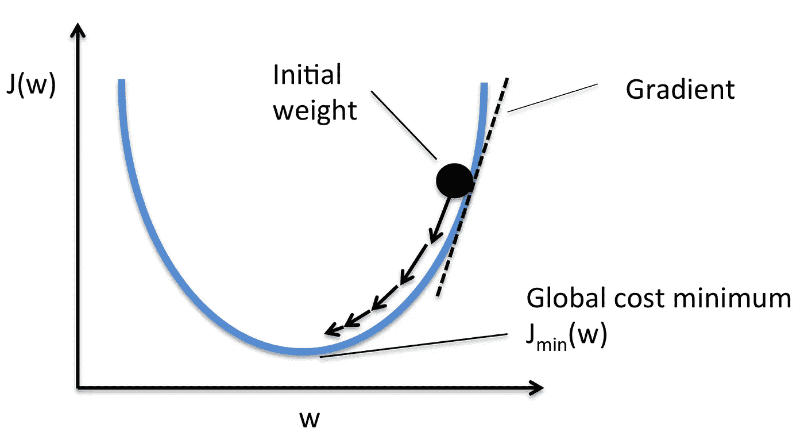

# 理解反向传播

> 原文：<https://medium.com/analytics-vidhya/understanding-backpropagation-1f0bd9d44d76?source=collection_archive---------13----------------------->

我们都知道什么是神经网络吧？这是一个神经元网络，其中每个连接都与一个权重相关联，这标志着该连接的重要性。

在神经网络中，输入数据是正向输入的。每一层接受一个输入数据，根据激活函数对其进行处理，并传递到下一层，最后得到输出。这被称为**正向传播**。

现在让我们来计算发生的错误。

# 损失函数

这里我们比较来自网络的输出(即预测值)和实际输出(这是数据集中的*标签*或*目标*值)。

损失函数—逻辑回归

关于对数函数，它要么总是增加，要么总是减少。看看下面的图表

需要注意的关键是，成本函数对自信和错误预测的惩罚大于对自信和正确预测的奖励！随着预测精度的提高(更接近 0 或 1)，成本会更低。

# 价值函数

为数据集中的每个输入计算损失。如果训练数据中有 n 行，我们计算每行的损失。**成本函数**是所有损失的平均值。

成本函数—逻辑回归

这里的“m”是训练数据中的行数。成本是指我们的模型中出现了多少误差。由于我们需要一个具有良好精度的模型，我们的工作是最小化成本函数。这就是我们需要**反向传播**的地方。

# 最小化权重和偏差

我们用的是线性函数 z = wx + b，后面是激活函数。

反向传播(又名梯度下降)的概念是调整权重和偏差，以获得尽可能小的误差。梯度下降需要一个我们想要最小化的成本函数。最小化简单地说就是找到函数中最深的谷(局部最小值)。

损失函数导数的证明超出了本文的范围(这也不重要)。经过复杂的计算，我们得到了调整权重的公式。

这里，α是学习率。这个变量被称为超参数(不可训练的参数)。如果步长(α)太小，我们将需要太多的迭代才能达到最小值。如果它太大，我们将超过最小值(即，我们将无法在最小值着陆)。所以阿尔法需要恰到好处。

梯度下降

现在让我们看看每个重量的更新表达式。这里，I 的范围是从 0 到权重的数量，Wi 是权重向量中的第 I 个权重。类似地，用 Bj 替换 Wi 以更新偏置(j 的范围从 0 到偏置量，Bj 是偏置向量中的第 j 个偏置)。

找到最佳的学习速度可能相当具有挑战性。首先，尝试使用一个小的 alpha 值，并稍微增加它。如果这不起作用，你可以尝试使用梯度下降的其他变化，如 **RMSprop** 和**自适应梯度**。

…

感谢您阅读^_^这篇文章