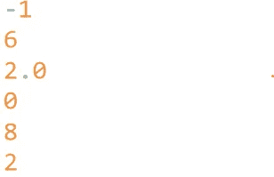
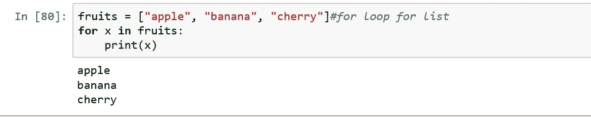

# 通过一些例子理解基本的 Python。

> 原文：<https://medium.com/analytics-vidhya/understanding-basic-python-with-some-examples-6c63d0babcc6?source=collection_archive---------15----------------------->


ython 是一种高级的解释型动态编程语言。它最初是由吉多·范·罗苏姆在 1991 年创立的。这种语言比其他任何编程语言都简单。大多数基于人工智能的应用和科学应用都是由这种编程语言实现的。因为它的成本较低，可用性、培训和效率都比其他编程语言高。强大的库是这种语言的一大优势，非常有助于机器学习和深度学习问题的轻松解决。

# 为什么是 Python？

1.  初学者友好
2.  容易理解
3.  非常灵活
4.  动态的
5.  面向对象
6.  轻便的
7.  广泛的支持库
8.  生产力

# Python 语言的使用

*   机器学习
*   数据科学
*   人工智能
*   深度学习
*   自然语言处理
*   计算机视觉
*   图像处理
*   模式识别

安装**Python 3**:[https://www.python.org/downloads/](https://www.python.org/downloads/)

**Anaconda3** 安装[https://www.anaconda.com/distribution/](https://www.anaconda.com/distribution/)

# Python 注释和文档字符串

1.注释以单个#开头。

2.python 的文档功能称为 docstring。docstring 可以是单行或多行。Docstring 也是一个注释。

```
***#this is a comment. Single line comment******"""this is                     //Multiline comment 
a multiline docstring 
"""***
```

# 1.打印功能

**print()** 功能用于在屏幕上显示特定文本消息的输出。

```
print("Hello word!")
```


打印功能的输出

# 2.创建变量

Python 没有声明变量的命令。变量的类型不需要定义。它能自动理解变量的类型。这和其他编程语言不一样。

```
a=10             *#a is int type*
b=12.45567       *#b is float type*
c="Kaisar"       *#c is string type* 
print(a)
print(b)
print(c)
```


**type()** 是一个内置函数，用于检查变量的类型。

```
print(type(a))  *# type is a built in function* 
print(type(b))
print(type(c))
```


类型函数的输出

# 3.经营者

在 python 中，操作符根据它们的操作被分成许多部分。

> 算术运算符:+、-、*、/、%、**、//
> 比较运算符:==、！=、>、<、> =、< =
> 布尔运算符:True、False
> 赋值运算符:=、+=、-=、*=、/=
> 逻辑运算符:and、or、not
> 成员运算符:in、not in
> 标识运算符:is、not is

## 算术运算

```
print(2-3)
print(2*3)
print(4/2)
print(100%25)
print(2**3)# ** 2 base 3 or 2^3 
print(5//2) #floor division
```



## 比较运算符

```
print(2==2)
print(2!=2)
print(2>2)
print(2<2)
print(2>=2)
print(2<=2)
```


## 逻辑算子

```
print(2==2 and 2==3)
print(2==2 or 2==3)
print(not 2==3)
```


## 隶属算子

```
a="Bangladesh"
b="Bangla"
print(b in b)
print(b not in a)
```


## 恒等运算符

```
print(b is a)
print(b is not a)
```


# 4.接受用户的输入

取用户输入变量之前需要定义类型。为了从用户输入中获取输入，使用了()。但是带有输入函数的变量包含一个字符串变量。

```
a=int(input("enter a int value:"))*#take integer value * b=float(input("enter a flaot value:"))*#take flaot value * c=input("enter a string:")*#take string * 
print(a) 
print(b) 
print(c)
```


# 5.数学运算

```
print((1+1)*(15-3)/2)*#following PEMDAS rules**output:   12.0*s1="ash"
print(s1*3)  #String s1 multiplied by 3 times
n=10.020233
print(n/3)   # Division function
print(n//3)  # Floor divisin*output:* ashashas
          3.3400776666666663
          3.0

a=3
print(a**3) #  ** *means the power of the variable**ouput: *  27print(eval("1 + 2 * 3 + 155"))
#eval() build in fuction for evaluate expression*output:  162*
```

# 6.线

python 中的字符串文字包含在单引号或双引号中。

> S *字符串索引号作为 s[0]，s[1]，s[2]…s[n]和逆序是从 s[-1]…s[-n]* 开始

```
s1="Bangladesh is my country" 
print(s1)*output: Bangladesh is my country*print(s1[1])*#print the string index number working as s[0],s[1],s[2]....s[n]**output:* aprint(s1[-1])*#print the string as reverse order start with s[-1]...s[-n]**output:* yprint(s1[2:10])*#print the character from position 2 to 10* 
*output:* ngladeshprint(s1[10::])*#print the character after index 10 to end od string 
output: * is my countryprint(s1[:3])*#print start to index3 string**output:* Ban
```

使用 **len()** 函数找出字符串的长度。

```
print(len(s1))*output:* 24
```

大小写转换等大小写转换将使用 **lower()** 和 **upper()** 功能

```
print(s1.lower())*#convert the srting in lower case* 
print(s1.upper())*#convert the srting in Upper case*
```


拆分文本很重要，将一个句子分成一个单词， **split()** 函数就是用来做到这一点的。

```
print(s1.split())*#split the sentence to a single wor*
```


replace()函数用于替换文本数据中的一个字符。

```
print(s1.replace("m","M"))
```


仅使用“+”运算符连接两个字符串。

```
s1="My name is " 
s2=input() 
print(s1+s2)
```


# 7.目录

清单是一个被请求的和可变的分类。在 Python 中，记录由方形部分组成。可变类型的条目不需要在列表中定义。每个值由逗号分隔。

```
l1=["kaisar","rakib","imran"]
print(l1)
```


列表索引从零、一、二等开始。逆序从负一开始，负二，依此类推。

```
print(l1[2])
print(l1[0:2])*#print before index2 value*
```


一些内置列表函数和方法的例子。

```
l1.append("ashraful")
*output:* ['kaisar', 'rakib', 'imran', 'ashraful']l1.insert(4,"shakil")*#intsert with position* print(l1)
*output:* ['kaisar', 'rakib', 'imran', 'ashraful', 'shakil']**del**(l1[4])*#delete list in specific position* 
*output:* ['kaisar', 'rakib', 'imran', 'ashraful']l1.reverse() 
*output:* ['ashraful', 'imran', 'kaisar', 'rakib']

l1.sort() 
*output: * 
     ['ashraful', 'imran', 'kaisar', 'rakib']*#some method as like pop(),remove(),clear()...etc*
```

# 8.元组

元组是不变的 Python 对象的排列。元组是一种排列，与记录非常相似。元组和记录的区别在于，虽然记录使用正方形截面，但是元组不能被改变，对于记录来说是不正常的，并且元组使用外壳。

```
Tuple = ("apple", "banana", "cherry")
print(Tuple)*output:* ('apple', 'banana', 'cherry')Tuple = ("apple", "banana", "cherry") 
print(Tuple[1])*output:* bananaprint(len(Tuple))*output: 3*
```

# 9.设置

集合是一个没有顺序和索引的集合。在 python 中，集合是用花括号写的。

```
thisset = {"apple", "banana", "cherry"}
thisset.add("orange")print(thisset)*output:* 
{'cherry', 'orange', 'banana', 'apple'}thisset.update(["orange", "mango", "grapes"])*#update the value of set* 
print(thisset)*output:*  
{'banana', 'apple', 'cherry', 'mango', 'grapes', 'orange'}
```

# 10.词典

字典是一个无序的、可变的和有索引的集合。用花括号写的，它们有键和值。

```
thisdict =	{
  "brand": "Ford",
  "model": "Mustang",
  "year": 1964
}
print(thisdict)
```


```
x = thisdict["model"] 
print(x)*output: *  Mustangx = thisdict.get("model")*#get the value of key*
print(x)*output:*  Mustang
```

在字典中，列表也被用来携带多个值。

```
d={6759:["kaisar","Student","CSE"],
   7100:"ash"
   }
print(d[6759])
```


# 11.如果…否则

else 宣告可以与 if 联接。else 声明包含代码的平方，如果 if 解释中的限制性表达设置为 0 或假值，则执行该代码。else 解释是一个任意的声明，所有的事情都可以被认为是 if 后面的一个 else 表达。

```
if expression:
   statement(s)
else:
   statement(s)
```


一行 if 和 else 的示例


二进制值的 If else 示例

# 12.For 循环

for 循环用于在一系列(列表、元组、字典、集合或字符串)上重复。


> **范围(开始、停止、步进)**
> 
> `*start*`:序列的开始编号。
> 
> `*stop*`:生成不超过本数的数。
> 
> `*step*`:序列中各个数字之间的差异。


打印 1 到 10 中以 2 为增量的值


奇数和偶数用于循环



使用 for 循环打印列表值


循环中的中断条件


循环中的继续条件

# 13.While 循环

简单 while 循环的形成过程如下所示。

```
while *expr*:
    statement(s)
```


while 循环的示例

# 14.功能

在 python 中，函数是完成特定任务的相关表达的集合。容量有助于将程序分成更小更特殊的部分。随着程序变得越来越大，函数使它逐渐变得清晰明了。此外，它保持了与迭代的战略距离，并使代码可重用。

```
def function_name(parameters): # formate of define a function
	statement(s)
```


简单函数的示例


函数中的参数传递


函数的返回语句


具有功能的用户输入

# 15.希腊字母的第 11 个

lambda 函数是一个小型的匿名函数。它可以接受任何数量的争论，但只能有一个表达。

> syntex =**λ**参数:表达式


λ函数的示例

# 16.文件

文件处理是任何编程语言的重要组成部分。Python 有几个创建、读取、更新和删除文件的函数。

> `*"r"*` = Read -打开文件进行阅读。
> 
> `*"a"*` = Append -打开一个文件进行追加。
> 
> `*"w"*` = Write -打开一个文件进行写入。
> 
> `*"x"*` -=创建-创建指定的文件。


打开文件的示例


用字符串写文件的例子


从创建的文件中读取插入的字符串

github:[https://github . com/abukaisar 24/Basic-Python-Code/blob/master/Python % 20 Basic % 20 . ipynb](https://github.com/AbuKaisar24/Basic-Python-Code/blob/master/Python%20Basic%20.ipynb)