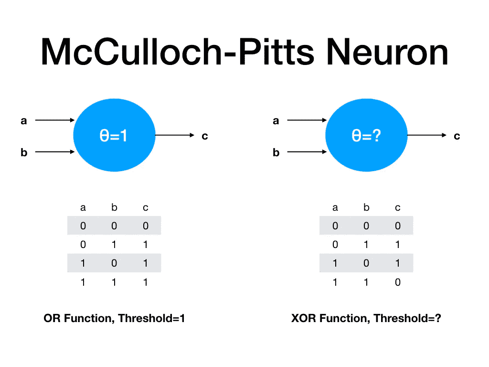
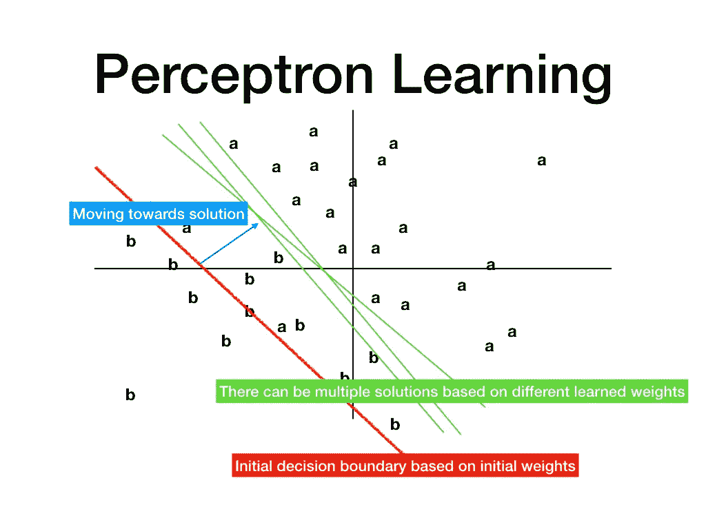
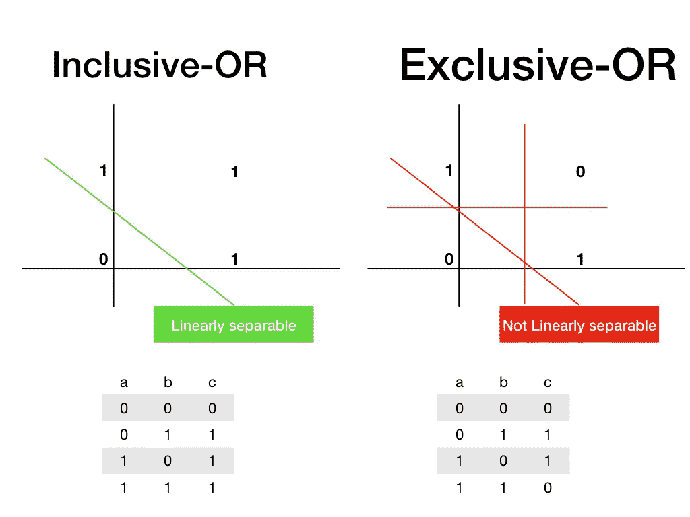
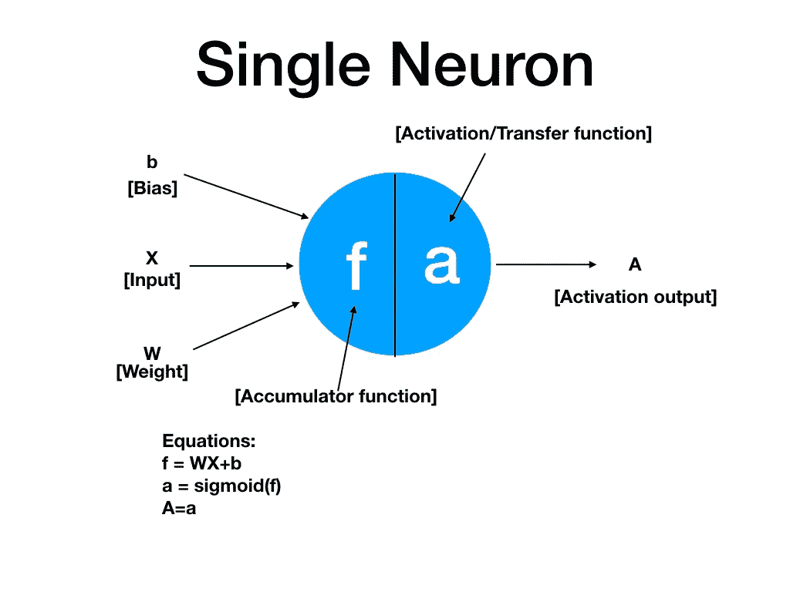
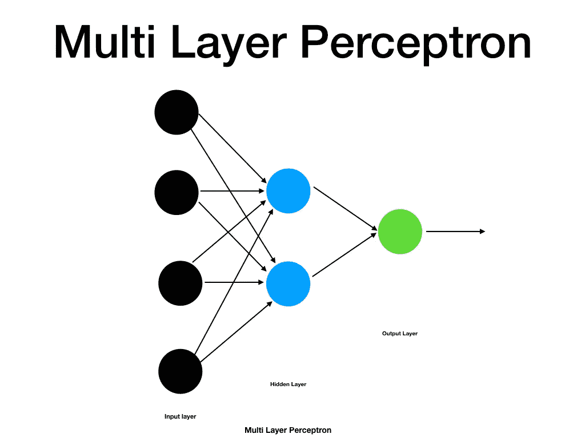
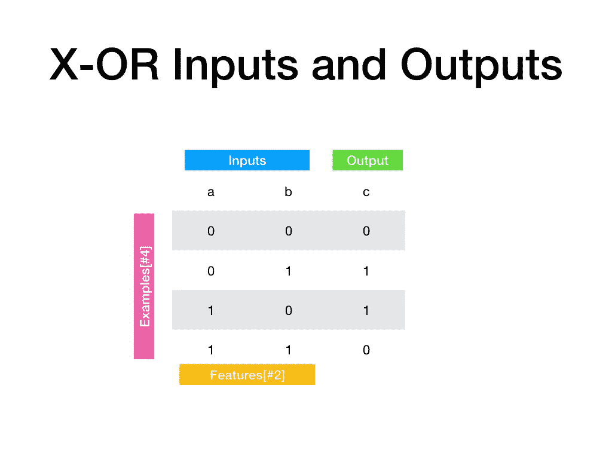
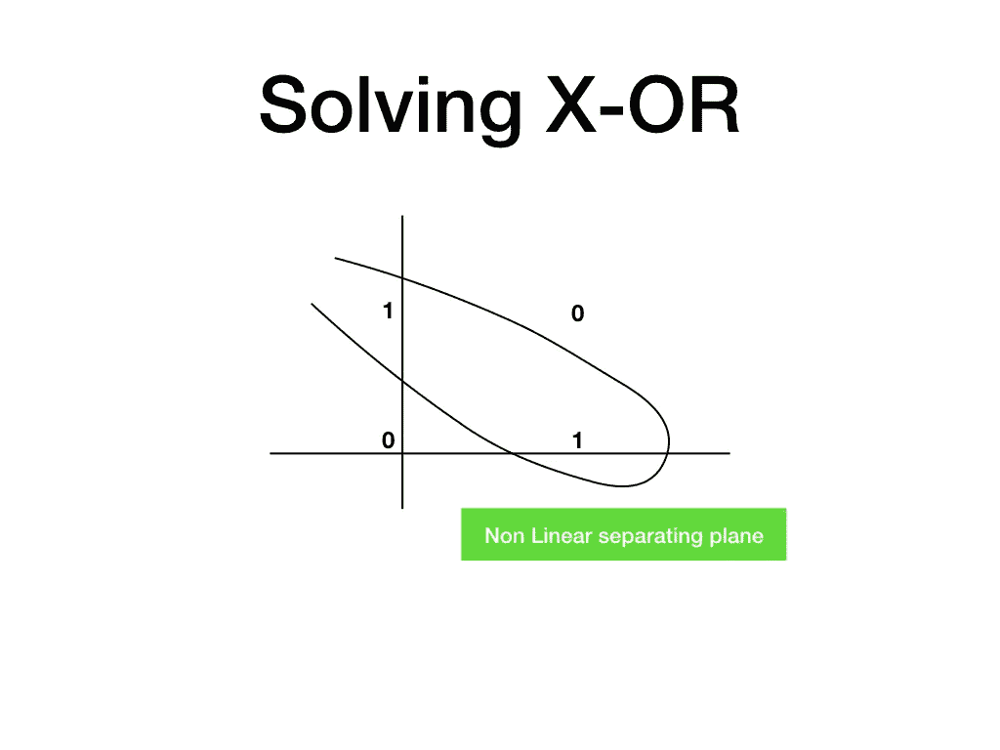

# 通过解决异或问题理解深度学习的基础

> 原文：<https://medium.com/analytics-vidhya/understanding-basics-of-deep-learning-by-solving-xor-problem-cb3ff6a18a06?source=collection_archive---------0----------------------->

## 人工智能简史

人工智能旨在使用各种数学和逻辑工具模仿人类智能。最初的人工智能系统是基于规则的系统。这些系统能够学习正式数学规则来解决问题，被认为是智能系统。但这些系统在解决没有正式规则的问题时表现不佳，作为人类，我们能够轻松解决这些问题，例如识别物体、理解口语等。为了解决这个问题，积极的研究开始于模仿人类思维，1958 年，弗兰克·罗森布拉特提出了一种叫做“感知机”的流行学习网络。感知器在当时得到了很多关注，后来随着时间的推移，感知器出现了许多变化和扩展。但是，不是每个人都相信感知器的潜力，有人认为真正的人工智能是基于规则的，而感知器不是基于规则的。Minsky 和 Papert 对感知器进行了分析，并得出结论，感知器只分离线性可分的类。他们的论文诞生了异或(X-OR)问题。

## X-OR 问题

异或问题是人工智能领域的一个经典问题，也是人工智能在 70 年代遭遇寒冬的原因之一。要理解它，我们必须了解感知器是如何工作的。感知器是基于麦卡洛克-皮茨提出的神经元结构的简化，称为麦卡洛克-皮茨神经元。在这里，我们不用深入细节，而是用更简单的语言来讨论神经元的功能。它有两个输入和一个输出，神经元有一个预定义的阈值，如果输入之和超过阈值，则输出是活动的，否则输出是不活动的[Ref。图片 1]

图 1:麦卡洛克-皮茨神经元

Minsky 和 Papert 使用感知器的这种简化来证明它无法学习非常简单的功能。图 2 显示了二维空间中感知器的学习。他们选择异或作为例子之一，证明了感知器不具备学习异或的能力。如图 3 所述，X-OR 在 2-D 中是不可分离的。因此，感知器无法提出一个分离平面来正确地对输入点进行分类。感知器无法处理 X-OR 以及其他一些因素，这导致了人工智能的冬天，神经网络的工作减少了。后来出现了许多方法，它们是基本感知器的扩展，能够解决 X-OR 问题。

图 2:感知器学习

图 3:包含或和异或

## 深度学习简介

深度学习是基本感知器模型的一种扩展，其中我们创建了一堆神经元，并将它们排列在多个层中。具有单一隐藏层的初始模型被称为多层感知器，并被认为是浅层网络。深度网络具有多层，并且在最近的工作中已经显示出有效解决诸如对象识别、语音识别、语言翻译等问题的能力。虽然神经网络是受人类思维的启发，但深度学习的目标不是复制人类思维，而是使用数学工具来创建模型，这些模型在解决图像识别、语音/对话、语言翻译、艺术生成等问题时表现良好。

## 在 Keras 中用多层感知器[MLP]求解 X-OR

多层感知器是具有神经元堆叠和多层的网络。现代架构中的一个基本神经元看起来像图 4:

图 4:单个神经元

每个神经元都有一个输入以及相关的权重和偏差。神经元有两个功能:

1)累加器功能:它本质上是输入加上偏差的加权和。激活函数:激活函数是非线性函数。顾名思义，它是一个决定一个节点的输出是否会主动参与模型的整体输出的函数。ReLu 是现在最流行的激活功能。

现在我将描述一个解决 X 的过程——或者在 MLP 的帮助下用一个隐藏层。因此，我们的模型将有一个输入层，一个隐藏层和一个输出层。我们的模型将看起来像图 5:

图 5:带有一个隐藏层的多层感知器

## 输入数据

如前所述，深度学习模型使用数学工具来处理输入数据。因此，我们需要一个输入层来以数字的形式表示数据。在许多应用程序中，我们以其他形式获取数据，如输入图像、字符串等。我们需要找到将它们表示为数字的方法，例如，对于图像，我们可以使用图像每个像素的 RGB 值，对于文本字符串，我们可以将每个单词映射到预定义的字典。在输入数据时我们需要关注两个主要方面:

1.  特征的数量:给学习模型的输入可能只有影响输出的单个特征，例如，给我们一个绿色和红色球的集合，我们希望我们的模型将它们分开输入单独的类。这里，我们只需要这个任务的一个特征，即球的颜色。但是，在大多数情况下，输出取决于输入的多个特征，例如彩色图像中的人脸识别或物体识别考虑与每个像素相关联的 RGB 值。
2.  例子的数量:对于每个问题，我们必须给我们的网络提供多个输入例子，这样它就可以在问题空间中推广。例如，如果我们希望开发一个识别猫的模型，我们将需要数以千计的不同环境、姿势、不同猫品种的猫图像。

输入以矩阵形式排列，其中行代表示例，列代表特征。因此，如果我们有说 **m** 个例子和 **n** 个特征，那么我们将有一个**m×n**矩阵作为输入。

在我们的 X-OR 示例中，我们有四个示例和两个特征，因此我们的输入是一个**4**X 2 矩阵[Ref。图片 6】。

图 6: X-OR 输入和输出

在 Keras 中，我们用以下代码行定义我们的输入和预期输出:

*x = np.array([[0，0]，[0，1]，[1，0]，[1，1])*

*y = np.array([0，1，1，0])*

## 输出

基于手头的问题，我们期望不同种类的输出，例如对于猫识别任务，我们期望系统分别为猫或非猫输出是或否[1 或 0]。这样的问题被说成是两类分类问题。对于一个例子，我们只有一个输出。然后，我们可以有多类分类问题，其中输入是多个类上的分布，例如，我们有 4 个不同颜色的球，模型应该将一个新球作为输入放入 4 个类之一。一些高级任务，如语言翻译、文本摘要生成，有复杂的输出空间，我们不会在本文中考虑。基于输出空间选择输出层中的激活函数。对于二元分类任务，sigmoid 激活是正确的选择，而对于多类分类，softmax 是最流行的选择。

在我们的 X-OR 问题中，每个输入样本的输出不是 0 就是 1。所以，这是一个两类或二元分类问题。我们将在输出层使用二进制交叉熵和 sigmoid 激活函数。[参考图 6]。

在 Keras 中，我们将输出层定义如下:

*model.add(Dense(units=1，activation="sigmoid"))*

## 隐藏单元:

深度学习网络可以有多个隐藏单元。隐藏单元的目的是学习一些输入数据的隐藏特征或表示，最终帮助解决手头的问题。例如，在猫识别的情况下，隐藏层可以首先找到边缘，第二隐藏层可以识别身体部位，然后第三隐藏层可以预测它是否是猫。

如前所述，我们使用的 MLP 只有一个隐藏层。这是一个浅层网络，我们的期望是，隐藏层将把 X-OR 的输入从一个二维平面转换成另一种形式，在这种形式中，我们可以找到一个与我们对 X-OR 输出的期望相匹配的分离平面。我们将在隐藏层中使用 ReLu 激活函数来转换输入数据。一个这样的转换如图 7 所示[我们的模型可能预测一个不同的转换]:

图 7:求解 X-OR 的超平面

下面的代码行在 Keras 中实现了我们想要的隐藏单元:

*model.add(Dense(units=2，activation="relu "，input_dim=2))*

隐藏层有 2 个单位，并使用 ReLu 作为激活。隐藏单元的输入是 4 个例子，每个例子有 2 个特征。即一个 4x2 的矩阵。因此，相关权重矩阵的维数将是 2×2。

## 权重和偏差

神经网络中的所有输入层和隐藏层都有相关的权重和偏差。这些权重和偏差是在解决方案空间中移动解决方案边界以正确分类输入的值[参考。图片 4】。权重通常是随机初始化的，偏差全部设置为零。

对于，**初始权重和偏差**的 X-OR 值如下【在我的试用期间由 Keras 实现随机设置，您的系统可能会分配不同的随机值】。我们可以使用 *model.get_weights()* 函数在 keras 中获取权重值。

***隐藏层权重:*** *数组([[ 0.6537529，-1.0085169 ]，[ 0.11241519，0.36006725]]，dtype=float32)*

***隐藏层偏置:*** *数组(【0。, 0.]，dtype=float32)*

***输出层权重:*** *数组([[-0.38399053]，[-0.0387609 ]]，dtype=float32)*

***输出层偏置:*** *数组(【0。]，dtype=float32)]*

## 学习策略

为了进行学习，我们需要用样本输入/输出对来训练我们的模型，这种学习被称为监督学习。监督学习方法在深度学习中应用于不同的任务时，如人脸识别、物体识别、NLP 任务，已经给出了惊人的结果。在机器人、汽车等任务中，大多数实际应用的深度学习模型仅基于监督学习方法。其他方法有无监督学习和强化学习。我们将坚持只有监督的方法。

我们也使用监督学习的方法来解决 X-或使用神经网络。

## 损失函数和成本函数

为了使系统在输入空间上进行归纳，并使其能够准确预测新的用例，我们需要用可用的输入来训练模型。在训练期间，我们预测不同输入的模型输出，并将预测输出与训练集中的实际输出进行比较。实际输出和预测输出之间的差异称为输入损耗。所有输入的损失总和被称为成本函数。损失函数和成本函数的选择取决于我们要达到的输出类型。对于分类，我们使用交叉熵代价函数。在 Keras 中，我们有用于二分类的*二叉交叉熵*代价函数和用于多分类的*范畴交叉熵*函数。

我们在 Keras 中编译我们的模型如下:

*model . compile(loss = ' binary _ cross entropy '，optimizer='adam '，metrics=['accuracy'])*

## 反向传播

训练的目标是最小化成本函数。这是使用反向传播算法实现的。反向传播算法是神经网络中的一个里程碑，总的来说，反向传播允许梯度通过网络反向传播，然后这些被用来调整权重和偏差，以将解空间向降低成本函数的方向移动。这里是阅读更多关于反向传播算法的维基百科链接:[https://en.wikipedia.org/wiki/Backpropagation](https://en.wikipedia.org/wiki/Backpropagation)

keras 的培训从以下几行开始:

*model.fit(x，y，历元=1000，batch_size=4)*

我们正在运行 1000 次迭代，以使模型符合给定的数据。批量大小为 4，即完整数据集，因为我们的数据集非常小。在实践中，我们使用非常大的数据集，然后定义批量变得很重要，以应用随机梯度下降[sgd]。

## 完整的 Keras 代码来解决异或

*从 keras 导入 numpy as np
从 keras.layers 导入 Dense
从 keras.models 导入 Sequential*

*model = Sequential()*

*model.add(Dense(units=2，activation='relu '，input _ dim = 2))
model . add(Dense(units = 1，activation = ' sigmoid ')*

*model . compile(loss = ' binary _ cross entropy '，optimizer='adam '，metrics=['accuracy'])*

*打印(model.summary())
打印(model.get_weights())*

*x = np.array([[0。,0.],[0.,1.],[1.,0.],[1.,1.]])
y = np.array([0。,1.,1.,0.])*

*model.fit(x，y，epochs = 1000，batch_size=4)*

*print(model . get _ weights())*

*打印(model.predict(x，batch_size=4))*

## 训练后模型的输出

**:数组([[-1.68221831，0.75817555]，
[ 1.68205309，-0.75822848]]，dtype=float32)**

***:数组([ -4.67257014e-05，-4.66354031e-05)，dtype=float32)***

*****输出层权重*** *:数组([[ 1.10278344]，
[ 1.97492659]]，dtype=float32)***

****输出层偏置** : *数组([-0.48494098)，dtype=float32)***

****对 x = [[0，0]，[0，1]，[1，0]，[1，1]]的预测****

**[[0.38107592]
【0.71518195】
【0.61200684】
【0.38105565】]**

**值<0.5 mapped to 0 and values > 0.5 映射到 1。因此，我们的模型成功地解决了 X-OR 问题。**

## **提高神经网络的性能:**

**我们将开始讨论以下组件的性能改进:**

1.  **投入**
2.  **输出**
3.  **激活功能**
4.  **权重初始化**
5.  **损失函数**
6.  **优化功能**

## **投入**

**我们 XOR 示例中的输入是:**

***x = np.array([[0。,0.],[0.,1.],[1.,0.],[1.,1.]])***

**在深度学习中，在输入级别应用的优化策略是标准化。你可以参考下面的视频了解正常化的概念:[https://www.youtube.com/watch?v=FDCfw-YqWTE](https://www.youtube.com/watch?v=FDCfw-YqWTE)**

**XOR 情况下的输入很简单。这两个特征位于相同的范围内，因此不需要归一化该输入。**

**在一些实际情况下，例如，当在线收集各种参数的产品评论时，如果参数是可选字段，我们可能会丢失一些输入值。在这种情况下，我们可以使用各种方法，比如将缺失值设置为参数中出现次数最多的值，或者将其设置为这些值的平均值。一种有趣的方法是反向使用神经网络来填充缺失的参数值。**

## **输出**

**我们的 XOR 示例中的输出是:**

***y = np.array([0。,1.,1.,0.])***

**这也是非常简单的数据，也是完整的。**

**但是，类似于输入参数的情况，对于许多实际问题，我们可用的输出数据可能会丢失某些给定输入的值。并且可以用上述相同的方法来处理。**

## **激活功能**

**在我们当前模型中使用的激活是用于隐藏层的“relu”和用于输出层的“sigmoid”。这个选择看起来很适合解决这个问题，也很容易达成解决方案。**

***model.add(Dense(units=2，activation='relu '，input _ dim = 2))
model . add(Dense(units = 1，activation = ' sigmoid ')***

**但是，通过多次选择激活功能，我观察到有时 relu 激活会导致众所周知的问题**导致 ReLu 死亡。当 ReLu 单元重复接收负值作为输入，结果输出总是 0 时，就会出现这种情况。由于 0 的梯度也将是 0，它中止了网络的学习过程。关于死亡 ReLu 的更多细节，可以参考以下文章**[https://medium . com/tiny mind/a-practical-guide-to-ReLu-b 83 ca 804 f1 f 7](/tinymind/a-practical-guide-to-relu-b83ca804f1f7)**

**它们是 relu 的各种变体来处理死亡 ReLu 的问题，所以我用它的一个变体“LeakyReLu”替换了“ReLu”来解决它。在 keras 中可以这样做:**

***从 keras.layers 导入 leaky relu
act = leaky relu(alpha = 0.3)***

**并修改隐藏层，如下所示:**

***model.add(Dense(单位=2，激活=act，输入 _ 尺寸=2))***

**这增强了模型的训练性能，并且在这种情况下使用 LeakyReLU 收敛得更快。**

## **重量初始化**

**权重初始化是神经网络体系结构的一个重要方面。**

**一种简单的方法是最初将所有权重设置为 0，但在这种情况下，随着损耗梯度 w.r.t .的变化，网络将表现得像线性模型一样。各层中的所有权重将分别相同。这将使网络对称，从而神经网络失去其能够映射非线性的优势，并且表现得更像线性模型。**

**因此，权重被初始化为随机值。有各种随机初始化权重的方案。在 Keras 中，密集层默认使用“glorot_uniform”随机初始值设定项，它也被称为 Xavier normal 初始值设定项。**

**有关权重初始化器的更多信息，您可以查看以下 keras 文档中关于初始化器的内容[https://keras.io/initializers/](https://keras.io/initializers/)**

**在我们的代码中，我们只使用了这个默认的初始化器，它对我们来说很好。**

## **损失函数**

**选择正确的损失函数非常重要，选择损失函数时应考虑以下几点**

1.  **有效测量损失，即实际值和预测值之间的距离**
2.  **使用梯度下降的可微性**

**损失函数的选择通常取决于手头的问题。以下是对应于特定问题类别的损失函数的一些例子**

1.  **分类->交叉熵**
2.  **线性回归->均方误差**

**Keras 分别为二元和多类分类提供了二元交叉熵和分类交叉熵损失函数。在 https://keras.io/losses/[检查所有 keras 支持的损失函数](https://keras.io/losses/)**

**由于我们的异或问题是一个二进制分类问题，我们使用二进制交叉熵损失。**

## **优化功能**

**优化器基本上是使用由损失函数计算的损失的函数，并且使用反向传播来更新权重参数，以在各种迭代中最小化损失。目标是向损失函数的全局最小值移动。梯度下降是神经网络中使用的最古老的优化策略。它的许多变种和高级优化功能现在都可用，一些最流行的曾经是**

1.  **随机梯度下降**
2.  **阿达格拉德**
3.  **阿达马克斯**
4.  **RMSprop**
5.  **圣经》和《古兰经》传统中）亚当（人类第一人的名字**

**sgd 适用于浅层网络，对于我们的 XOR 示例，我们可以使用 SGD。其他是更高级的优化器，例如 RMSprop 在递归神经网络中工作良好。选择合适的优化策略是一个经验问题，个人喜好和比较。Keras 默认使用“adam”优化器，所以我们也在我们的 XOR 解决方案中使用了同样的优化器，它对我们很有效。**

**因为，这篇文章的例子是一个相当简单的问题，我们不需要对我们的原始模型做太多的改变，除了使用 LeakyReLU 而不是 ReLU 函数。对于许多实际问题，我们可以直接参考行业标准或通用做法，以达到良好的效果。**

**附言:我最近才开始写博客，希望听到社区的反馈来提高自己。**