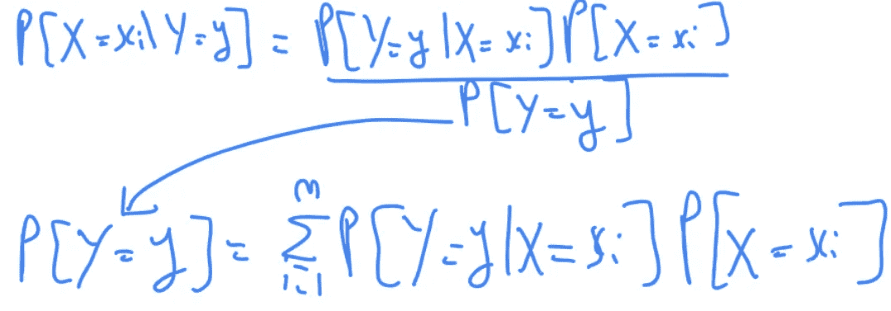
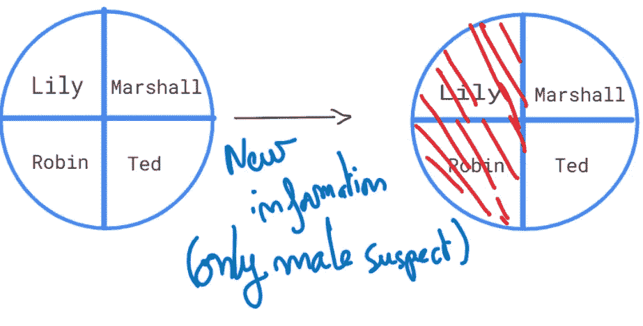
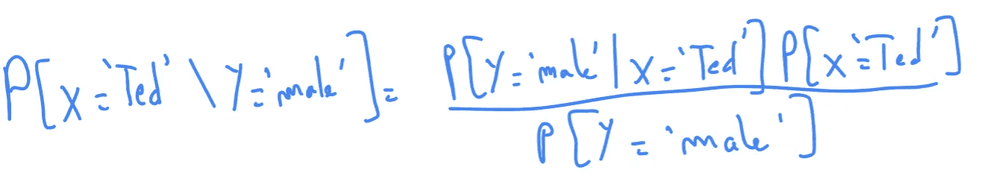
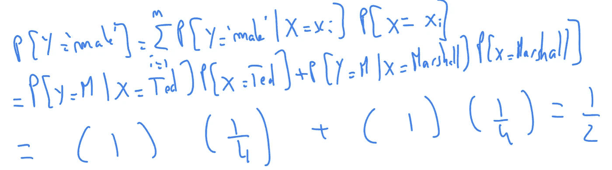

# 理解贝叶斯定理

> 原文：<https://medium.com/analytics-vidhya/understanding-bayes-theorem-dcb3bbd91c77?source=collection_archive---------41----------------------->

埃里克·麦克林在 [Unsplash](https://unsplash.com?utm_source=medium&utm_medium=referral) 上的照片

每天，我们都会根据收到的信息做出/调整自己的决定和行为。例如，由于交通堵塞，在一天中的某个时间，你更喜欢走另一条路去你的杂货店**。**

在第一部分中，我们将尝试使用我们的逻辑来推断某一事件的概率，然后我们将使用贝叶斯定理来得出与我们的直觉猜测相同的结果。

谁偷了珠宝？

警方正在调查一起珠宝盗窃案。他们推断只有四个人有机会偷珠宝。四名嫌疑人中，两名为女性，两名为男性。让我们给他们取个名字:‘莉莉’，‘罗宾’，‘特德’和‘马歇尔’。

有了这些信息，嫌疑人之一是*小偷*的*概率*为 **1/4** 。

第二天，你收到一个新的信息:小偷肯定是一个男人！从那里我们排除了女性嫌疑人，剩下泰德和马歇尔。因为我们现在只有两种结果，每个男性嫌疑人的概率是 1/2。

看到那里发生了什么吗？我们收到了一个新信息，**鉴于**这个新信息，我们**更新了**我们的**概率空间**(可能的结果)，它自动更新了我们的概率！

对罗宾和莉莉来说:他们的概率从 1/4 到 0，对特德和马歇尔来说，从 1/4 到 1/2。

**利用贝叶斯定理**

让我们首先陈述这个定理:

对于我们的问题, **X** 代表‘小偷’,**Y**代表‘性别’。

x 有四种可能的结果:{莉莉，罗宾，泰德，马歇尔}

y 只有两种可能的结果:{男性，女性}

在调查开始时，每个人是小偷的概率是 1/4，因为我们有四个结果，它们是一致的。

现在，让我们假设我们刚刚收到关于小偷是男人的新信息，让我们尝试使用贝叶斯定理更新概率！(从这里你可以看到贝叶斯定理的目的:当我们需要更新给定新信息的特定事件的概率时，我们使用它)

假设小偷是**男性**，我们来评估一下小偷是 **Ted** 的概率。

关注分母，我们基本上是在评估新信息下所有可能的结果。(通过观察上图中的两个圆圈，我们可以猜测分母应该是 1/2)

理解这一点很重要，即使我们没有新的信息，我们也可以使用贝叶斯定理，但这是没有用的，因为在分母中，Y 可能是**女**或**男**，发生这种情况的**概率**是 **100** %,除以 1 是没有用的。

计算分子很简单，注意分子已经在分母中了，因为分母包含了所有可能的**结果，分子是其中之一！**

很好，我们以和一开始用直觉猜测的一样的概率结束了。