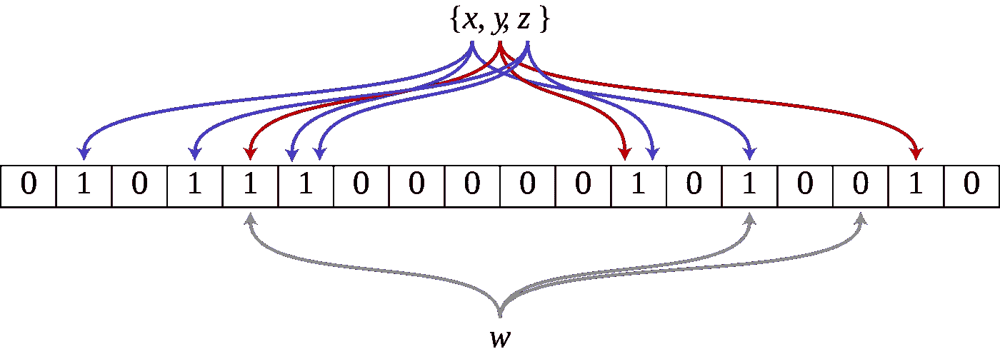

# 了解布隆过滤器第一部分

> 原文：<https://medium.com/analytics-vidhya/understanding-bloom-filter-part-i-85459df3ae37?source=collection_archive---------2----------------------->

这是一篇由两部分组成的文章。在第一部分中，我们将尝试开发布鲁姆过滤器背后的直觉。在第二部分中，我们将使用第一部分中的知识来构建 Bloom Filter 的数据结构。

## 动机

在一个相当复杂的分布式系统中，我们遇到的问题可以归结为在一个集合中寻找一个元素的存在。Bloom Filter 是一种有助于解决这个问题的数据结构。这是一个来自维基百科的布隆过滤器的应用。
*Akamai 注意到大约 75%的网络下载只下载了一次。他们认为在第二次下载时缓存 web 下载比第一次更有利。他们使用了布鲁姆过滤器来解决这个问题。有了 Bloom Filter，您可以进行缓存检查，而不必存储内容，甚至内容的散列。*

## 本文的使用案例

为了本文的目的，让我们定义一个样例用例。

> 用户将输入一个建议的密码，我们的系统应该会快速响应，无论建议的密码是可接受的还是不可接受的。

第一个想法可能是使用正则表达式来符合某些规则。这可以帮助我们给密码一些结构。仍然有一些不可接受的密码太容易被猜到。
例如，这些可能是在一种语言的字典里的单词。因此，为了这篇文章，我们可以假设有一个不可接受的密码定义列表。

*因此，该要求转化为维护不可接受密码的数据库，并快速检查建议的密码是否在不可接受密码的数据库中。*

为什么不接受密码？为什么不维护可接受的密码？可能密码的范围太大，难以维护。例如，如果我们简单地将密码视为长度为 n 的字符串，那么这个集合的大小是 52^N(taking(只有大写字母和小写字母)，

## 正式化要求

让我们将需求正式化。
**U** 代表所有可能的密码。
**S ⊂ U** 代表一组不可接受的密码。
假设 **X** 是该设置中的建议密码。

因此，要回答 **X** 是否是不可接受的密码，我们必须回答对 **X ∈ U** 的查询，是否 **X ∈ S** ？

现在我们想建立一个数据结构或散列方案，它能快速回答这些查询。

# 布鲁姆过滤器背后的直觉

## 传统方法

让我们首先来看看传统的哈希方案(称为链式哈希)在这种情况下是如何工作的。
为了维护集合 **S** ，我们将使用大小为 **n** 的散列表 **H** 。在链式哈希中，这个表 **H** 是一个大小为 **n** 的链表数组，**H【I】**是那些哈希值恰好为 **i** 的元素(不可接受的密码)的链表。
我们将使用一个散列函数 **h(X)** ，它将 **U** 中的元素映射到 **H** 中的元素。我们将假设 **h(X)** 映射到一个随机索引。此外，我们将假设这个随机映射独立于所有其他散列。因此, **h(X)** 映射到哪里与宇宙中任何其他元素映射到哪里无关。

现在，要将一个元素插入到这个子集 **S** 中，我们只需找到它的散列值索引，然后将该元素添加到链表中的特定索引处。

要进行查询，我们只需转到哈希值索引，并查看链表来检查它是否在那里。

> 现在，如果你把这个散列表的索引想象成容器，把 **S** 中的元素想象成球，那么这个散列函数所做的就是，把这些球分配到随机的容器中。我们稍后将使用这个类比来计算单个箱子中最大球数的概率，也就是最大负荷。

现在，在我们继续之前，有一点符号是有用的。
这个集合 **U** 很大，我们用大写 **N** 来表示它的大小。
哈希表的大小为 **n** 。
我们将使用 **m** 来表示我们正在维护的这个数据库 **S** 的大小。通常我们的哈希表大小至少是我们维护的数据库的大小。总结一下

> **| U | = N>| H | = N≥| S | = m**

所以 **n** 的大小至少是 **m** ，我们的目标当然是尽量保持这个数据库不会比 m 大太多。

## 时间分析

我们来看一下查询时间。我们需要多长时间来回答一个表格的问题？
是子集 **S** 中的 **X** ？。
现在，为了回答这个查询，我们要做的是查看索引 **i** 处的哈希表，也就是 H**【I】**，然后我们必须遍历整个链表，检查那个链表中是否有 **X** 。
所以，时间和这个链表的大小成正比。

> 这个链表有多大？
> 记得鲍尔斯在以宾比喻。这类似于寻找最大负载。大致最大负载为 **O(log(n))** ，概率较大。我们可以有更紧的界限，但为了简单起见，我们选择了一个宽松的界限。你可以在这里阅读更多信息[。当然，在最坏的情况下，它可能是 **O(n)** ，但这是一个不太可能的事件。](https://en.wikipedia.org/wiki/Balls_into_bins_problem)

我们回答一个查询所花费的时间与哈希值处的负载大小成正比。在高概率下，最大负载将是 **O(log(n))** ，这意味着最坏情况下的查询时间，在高概率下将是 **O(log(n))** 。现在，当 **n** 很大时，那么 **O(log(n))** 对我们来说可能太慢了。

## 缩短查询时间

那么如何才能实现更快的查询时间呢？嗯，一种方法是增加哈希表的大小。为了将这个最大负载从 **O(log(n))** 减少到顺序 **O(1)** ，我们可以将哈希表的大小从 **O(m)** 增加到 **O(m )** 。现在，这是一个很大的代价。

因此，让我们看看是否有更简单的方法来减少查询时间。

## 两种选择的力量

我们现在要做的不是使用单个哈希函数，而是选择一对哈希函数 **h1** 和 **h2，**每个哈希函数都将可能密码的 **U** 元素映射到大小为 **n** 的哈希表中。现在我们将假设这些散列函数是随机的，因此可能密码的总体中的每个元素 X 映射到散列表的一个随机元素。 **h1(X)** 是随机的， **h2(X)** 是随机的，并且这些是彼此独立的，并且独立于其他散列值。

第一个问题是，我们如何将一个元素，一个可能的密码，插入到我们的不可接受密码字典中？
让我们假设在我们的哈希表中，我们也在每个索引处维护链表的大小。我们首先要做的是计算这两个哈希值 **h1(X)** 和 **h2(X)** 。然后通过比较它们的大小来确定哪一个负载最小。然后，我们可以将 **X** 添加到适当的链表中，并增加该链表的大小。因此，这一切都可以在插入的时间内完成。

*下一个问题是，我们如何查询一个元素* ***Y*** *(建议密码)是否在我们的不可接受密码字典中？*
我们一开始同样是做加法。我们计算两个散列值 **h1(Y)** 和 **h2(Y)** 。这是 **Y** 的两个可能位置。我们无法确定它可能在这两个地点中的哪一个。
我们在 **h1(Y)** 和 **h2(Y)** 检查链表。我们在这两个链表中寻找 **Y** 。如果它在这些链表中的任何一个中，那么我们知道 **Y** 在字典中，否则 **Y** 从未被插入到不可接受密码的字典中。

那么做一次查询需要多长时间呢？

查询时间现在取决于 **h1(Y)** 和 **h2(Y)** 的负载。
因此，如果我们有最大负载的上限，那么查询时间就是最大负载的两倍。现在，如果 **m** 等于 **n** ，那么我们的不可接受密码字典的大小和我们的哈希表的大小是相同的
，那么查询时间将是 **O(log(log(n))** 。在这种情况下，只需从一个哈希函数更改为一对哈希函数，我们的查询时间就会从 **O(log(n))** 大幅减少到 **O(log(log(n)))** ，并且在空间方面没有额外的开销。这是一个很大的增益，因为 log log n 非常小，即使对于非常大的 n 也是如此。所以这几乎就像 **O(1)** 一样，非常接近，是一个非常小的量。

看到这个结果，你可能会说，“*好吧，为什么要选择两个随机哈希函数。让我们选择三个随机散列函数，也许我们会得到****log log n****。*”

嗯，原来大的收获是从一个到两个，之后就没多大收获了。特别是，如果你选择了 **d 个随机散列函数**并将第**个元素分配给所有这些链表中负载最小的，那么最大负载将是 **O(log log(n)/log(d))** ，其中 **d** 至少为-2。所以用 **d** 提升很小。**

现在我们终于可以描述出现在[第二部分](/p/79b0e23ed174)中的布隆过滤器了。