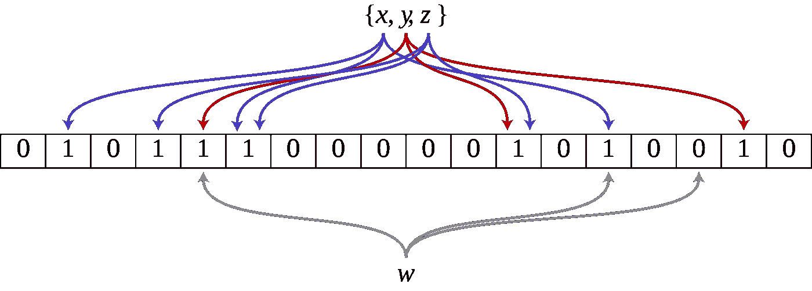

# 了解布隆过滤器-第二部分

> 原文：<https://medium.com/analytics-vidhya/understanding-bloom-filters-part-ii-79b0e23ed174?source=collection_archive---------3----------------------->

我们将描述一种具有更快查询速度的新数据结构。
在我们[之前描述的传统散列方案](/p/85459df3ae37)、
中，对于简单方案，查询时间为 **O(log(n))** ，对于使用两种选择的更高级方案，查询时间为 **O(log(log(n))** )。

这里我们要实现查询时间 **O(1)** 。所以恒定的查询时间，这是有保证的。回想一下，其他查询时间都是概率语句。在最坏的情况下，它可以是 **O(n)** 。

这种数据结构将非常简单，并且比以前占用更少的空间。没有链表之类的东西。它只是一个简单的二进制数组。现在有很多好处。它更简单，占用空间更少，查询速度更快。

## 听起来太好了，关键是什么！

*现在，这种简单性和这种更快的速度必然会带来一些代价。*
嗯，这个方案并不总是正确的。偶尔会有假阳性，这种情况发生的概率很大，我们会进行分析。

*假阳性的确切含义是什么？*
我们有一个元素 **X** ，它不在我们的不可接受密码字典中。所以这是一个可以接受的密码，但是我们的算法偶尔会说，是的，这个 **X** 在字典里。

在此设置中，误报是可以接受的。为什么？因为我们有一个可接受的密码，但是我们说这个密码是不可接受的，它在我们的字典里。所以有人输入密码，我们说，不，这是不允许的。理想情况下，应该是允许的。因此，用户必须输入新密码。但是作为这些误报的交换，我们保证了查询时间。因此，我们很快就回答了这是否是一个可接受的密码的问题。

在这种情况下，假阴性是不可接受的，这将是一个巨大的代价。当我们有一个不可接受的密码时，我们肯定想说它是不可接受的。

> 因此，在这种情况下，有一些小概率的假阳性是合理的，我们将尝试绑定。在其他设置中，误报可能是不可接受的，在这种情况下，布隆过滤器可能是一个坏主意。所以这不是一个通用的方案。您必须查看您的设置，并确定拥有更简单、更快速的方案的代价是否值得拥有误报。
> 有一些小概率的假阳性是可以接受的吗？

## 要求

我们的数据结构将支持哪些基本操作？
**第一个操作是插入 X.**
因此给定一个可能的密码 **X** ，我们要将这个密码添加到我们的不可接受密码字典中。

**第二个操作是对 X，**
的查询。如果这个建议的密码在我们的不可接受密码字典中，那么我们总是输出 **YES** ，所以在这种情况下我们总是正确的。
问题是，当这个建议的密码不在我们的字典中，所以它是一个可接受的密码时，我们通常输出 **NO** 并且我们必须绑定我们通常的意思。
但是偶尔，我们会输出 **YES** 。因此，当这个建议的密码是可接受的，偶尔我们会有一个误报，说**是**它在不可接受密码的字典中，所以这个密码是不允许的。
因此，我们有一些小比率的假阳性，我们必须限制该比率，看看它看起来像什么。

## 理解了问题，让我们定义数据结构

基本的数据结构只是一个大小为 **n** 的二进制数组 **H** 。这就是整个数据结构。

我们首先将 **H** 设置为全零。因此所有的 **n** 位都被设置为零。和以前一样，我们将使用一个随机散列函数，它将所有可能密码的元素映射到我们的大小为 **n** 的散列表中。

*我们如何将一个可能密码的元素* ***X*** *插入到我们的不可接受密码字典中？首先我们计算它的哈希值，然后我们在这个哈希值处设置数组中的位为 1。所以我们计算 **h(X)** 并设置**H[H(X)】**=**1**。现在它可能已经是 **1** ，在这种情况下，我们什么也不做。
所以这些位只能从 0 变成 1。我们从不把它们从 1 变回 0。
*这是这种数据结构的局限性之一。没有简单的方法来实现删除，因为我们从不把比特从 1 变到 0。**

现在我们如何进行查询呢？
我们如何检查一个元素 **X** 是否在我们的字典 **S** 中？
我们计算 **X** 的哈希值，并检查数组。
如果这个哈希值的位是 **1** ，那么我们输出 **yes** 。我们相信它在字典里。如果它是 0，那么我们保证它不在字典里。因为如果它是零，就意味着我们肯定没有插入它。
如果它是 **1** ，那么我们认为，我们可能已经插入了它，但我们不确定。
其他一些元素可能已经被插入到这个哈希值中，我们无法检查是否是 **X** 被插入到这个哈希值中。因为我们现在没有维护一个链表。

## 为什么会这样？

我们有一些元素 **X** 要查询。它不在我们的不可接受密码字典中，但有一些其他元素 **Y** 在我们的不可接受密码字典中。而且这两个元素， **X** 和 **Y** ，有相同的 hash 值， **h(X)等于 h(Y)** 。因此，当我们将 **Y** 插入到我们的字典中时，我们将该位置位为 **1** 。那么当我们在 **X** 上做查询的时候，这个位已经是 **1** 了。所以我们认为或者据我们所知， **X** 可能就在我们的字典里。现在我们必须输出 **yes** 因为它可能在那里。但实际上是**不，**因为没插。 **Y** 插入了相同的哈希值。假阳性就是这样产生的。

## 听起来是个问题

我们如何改善它？
我们可以试着使用我们之前在传统哈希方案中使用的二选一的方法。那我们要做什么？
我们将使用两个哈希函数，而不是一个。
现在在传统的方案中，从一个哈希函数到两个哈希函数有很大的收益，但是从两个到三个或者三个到四个，收益并不大。但在这里，这是一个略有不同的设置，从 1 到 2 可能会有很大的增益，但即使是从 2 到 3 也可能会有增益。不清楚使用多少哈希函数，我们将尝试优化哈希函数的数量选择。
所以我们将允许使用 **k** 个哈希函数，而不是两个哈希函数。
因此，我们希望将此方案推广到允许使用 **k** 个哈希函数，然后我们将返回并计算出哈希函数数量 **k** 的最佳选择。

让我们看看更健壮的设置，我们允许使用 **k** 散列函数，以及我们如何修改这个数据结构来容纳 **k** 散列函数。

所以现在我们有了 **k** 个哈希函数，而不是只有一个， **h1** ， **h2** ，直到 **hk** 。我们将把我们的哈希表初始化为全零。
所以所有的位，即 **H** 的 **n** 位都被设置为零。

*我们如何添加一个元素* ***X*** *？*
之前我们计算了这个散列值 **h(X)** ，并且我们将那个位设置为 **1** 。我们现在要做什么？
现在我们计算 **k** 哈希值，并将所有这些 **k** 位设置为 **1** 。
所以我们迭代哈希函数 1 到 **k** ，然后我们计算它的哈希值，我们将这个位设置为 **1** 。它可能已经和以前一样是 1，但是我们总是像以前一样从 0 到 1 改变比特。

我们如何检查一个元素 X 是否被插入到我们的字典 S 中？
我们计算它的 **k** 哈希值，并检查这些 **k** 位是否都被设置为 1。如果所有这些 **k** 位都被设置为 1，那么我们最好的猜测是 **X** 被插入到数据库 **S** 中。如果其中任何一个仍然是 **0** ，那么我们保证 **X** 没有被插入到数据库中。

让我们看看这个算法对于我们的查询的正确性。
假设 **X** 被插入到我们的数据库 S 中，我们对 **X** 进行查询。我们输出什么？嗯，当我们将 **X** 插入数据库时，我们将所有这些 **k** 位设置为 1。因此，当我们执行查询时，我们保证所有这些位都被设置为 1，因此我们将输出 **Yes** ，因为没有一个位会从 1 变为 0。
比特只从 0 变到 1。这是一个单向的过程。因此，如果 **X** 被插入到数据库中，当我们对 **X** 进行查询时，我们总是输出 Yes。它在数据库里。

现在，假设 **X** 没有插入数据库，我们对 **X** 进行查询。有时，我们可能会说是的，我们相信它在数据库中。在这种情况下，我们得到一个假阳性。我们错误地说，是的，它在数据库里。

*怎么会这样？*
如果所有的 **k** 位都被其他插入设置为 1，就会发生这种情况。
有一些元素 **Z** 被插入到数据库 **S** 中，并且 **Z** 的 **k** 位中的一个与 x 的**位**位完全匹配。

****k****中的哪一位为 Z？*
先说**Z**的第 j 位。因此， **Z** 的**第 j**位与 X
的**第**位相匹配，换句话说， **X** 的**H[I]**=**H[j]**的 **Z** 。
这意味着当 **Z** 被插入数据库时，我们将与 **X** 的**和**位相匹配的这个位设置为 1。
并且如果这对于 **X** 的每一位都是真的，那么 **X** 的所有 **k** 位通过一些其他插入被设置为 1。那么我们将在 **X** 上得到一个误报。
所以这个方案有这个额外的鲁棒性或者冗余。
为了得到误报，我们需要通过一些其他插入将所有这 k 个位设置为 1，而之前的方案只有一个我们正在检查的位。
现在我们有了 **k 个**位，它们需要被设置为 1，以便得到误报。随着 k 的增加，情况似乎有所改善。但事实上有一个最优选择。*

**如果* ***k*** *变得太大，假阳性率又开始飙升。这是为什么呢？*
好吧，如果 **k** 是巨大的，那么每插入一次，你就把 **k** 位设置为 1。如果 k 很大，你就把许多位设置为一。这意味着对于每一个插入，在 **S** 中的每一个元素，它们有许多位，许多选择 **j** 被设置为 1。
因此，如果 **k** 很大，那么这些 **k** 位中的一个将与 **X** 位中的一个匹配。
因此，如果 **k** 太大，每次插入都会将太多的位设置为 1。如果 **k** 很小，当我们对 **X** 进行查询时，我们检查的位太少。所以 k 有一些最佳选择，不太大也不太小。*

*我们现在要做的是更精确地分析这些误报。假阳性的概率有多大？
我们希望将其视为 **k** 的函数，然后我们可以计算出 **k** 的最优选择，以最小化假阳性率。然后我们可以进行比较，看看误报率是多少，看看这是不是一个好的数据结构。*

## *假阳性分析*

*像以前一样，让 **m** ，表示我们维护的数据库或字典的大小。
并且让 **n** 表示我们的散列表的大小。
现在，大概， **n** ，我们的哈希表的大小将至少是我们维护的数据库的大小。
因此，重要的参数将是这些尺寸的比率。
所以，让 **c** 表示这个比值。与数据库大小相比，哈希表的大小。至少会有一个。
我们的目标是尽可能地获得最小的。
我们哈希表的大小是 **c** 乘以 **m** 。*

*现在，对于一个元素 **X** ，它不在我们的数据库中。我们来看看这个 **X** 的误报概率。*

*为了实现这一点，我们需要将所有的 **k** 位 **h1(X)** 、 **h2(X)** 直到 **hk(X)** 都设置为 1。
如果所有这些位都是 1，但 **X** 从未被插入数据库，那么我们将得到一个误报。
那么，我们来试着分析一下，所有这 **k** 位都被设为 1 的这个概率。
让我们先来看一个更简单的特定位的问题， **b** ，范围在 **0** 和 **n-1** 之间。*

*特定位设置为 1 的概率是多少？
看这个特定位被设置为零的互补事件会稍微容易一些。因此，这个特定位为 1 的概率是*

**

*k 比特的概率被设置为 1*

*现在，为了分析它仍然设置为 0 的概率，我们要做的是检查所有的插入是否错过了这一位。*

*现在，我们有 **m** 个插入。在我们简单的散列方案中，这些插入对应于将球扔进垃圾箱。所以，这相当于把 **m** 个球扔进垃圾箱。但是请注意，对于每次插入，我们都要查看 **k** 哈希值。并且我们将这些值中的 **k** 设置为 **1** 。因此，每次插入对应于 **k 个**球。因此，我们将把 m 乘以 k 的球扔进 n 个垃圾箱。

为了让这个位仍然为零，我们需要所有这些 **m 乘以 k** 的球都错过这个特定的 bin， **b** 。
所以这个位为 0 的概率等于所有的 **m 乘以 k** 球错过这个特定面元的概率。对于一个球来说，它错过特定框的概率是多少？*

**

*现在，这个表达式不是很复杂，但是对于我们来说，有一个稍微简单一点的表达式会方便得多。让我们试着
操纵这个来得到一个稍微方便一点的表达。让我们看看下面指数函数的泰勒级数。*

**

*这是一个无穷级数。现在对于小的 **a** 来说，这个级数是递减的，
并且随着 **a** 变为零，那么这个级数就近似为 **1-a** 。因此，当**和**足够小时，这是一个很好的近似值。在我们的例子中，这相当于 **n** 足够大。所以让我们用这个近似值来简化我们对假阳性率的分析。*

**

*现在我们有了一个非常简单的表达式，来表示一个特定位为零的概率。*

*那么这些特定的位被设置为 1 的概率是多少？..
并且我们希望 **k** 特定位全部设置为 1。所以它的概率是，
的 k 次方。*

*总结一下，*

**

*假阳性分析*

*这个表达式就是假阳性概率。现在不是很好，因为我们有这个 **k** 。我们能不能通过去掉 **k** 来简化这一点？*

**我们能不能算出什么是最优的* ***k*** *才能把这个误报概率降到最低？*
回想一下我们之前的直觉，我们希望 **k** 不要太小，
如果 **k** 很小，那么当我们进行查询时，我们检查的位太少。
但是如果 **k** 很大，那么当我们进行插入时，我们将过多的位设置到 **1** 。因此，有一些中间地带，我们想找出最佳选择的 **k** ，以尽量减少这种假阳性概率。*

**那么我们要做什么？我们要对这个函数求导。将其设置为零，并找到最佳选择 **k** 以最小化该表达式。

*那个最优发生在哪里？*
事情发生在***k****=****c LN2***。那是 **c** 乘以 2 的自然对数。
我们把这个选择 ***k*** 插回这个表达式。**

**

****c*** 是我们的哈希表相对于我们的数据库的大小的比率。现在我们有了假阳性概率的简单表达式。所以如果你告诉我你愿意做多大的散列表，我就能告诉你误报的概率是多少。*

## *天真计划的例子*

*现在让我们看一些具体的例子，看看这是如何执行的。让我们假设我们做了简单的方案，其中 k = 1。
我们没有做 **k** 的最优选择。我们只设置了一个哈希函数。
再来看看我们做 10 倍大或者 100 倍大的情况。
为了分析这个 **k** = 1 的情况，我们得回到我们的表达式 ***f(k)*** 。我们得到以下结果*

**

## *最佳方案示例*

*现在，假设我们做 **k** 的最优选择。所以，*

**

*考虑一个大 100 倍的哈希表是非常合理的，因为这只是一个二进制字符串。
现在的误报概率是 **1.3 乘以 10 的负 21 次方**。
关键是这在 **c** 中是指数的。所以，取 **c = 100** ，很微小。这真的是微乎其微的概率。如果这对你来说还不够小，你可以去 c = 200，或者 300，你会得到一个非常非常小的假阳性概率。*

*所以，如果你愿意有一个非常小的误报概率，
那么你有这个非常简单的数据结构，它仅仅对应于一个二进制字符串。它的维护非常简单，而且查询速度非常快。假阳性概率也非常小。*

*这种数据结构的缺点是，有时，
您可能会有一些误报，并且它不容易允许从数据库中删除。尽管有一些允许删除的试探法，这些是被称为计数布隆过滤器的修改。*