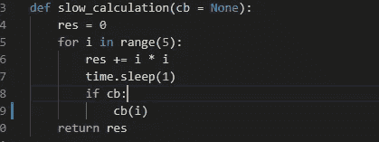
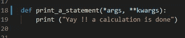
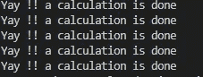
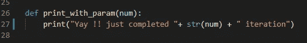
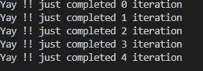
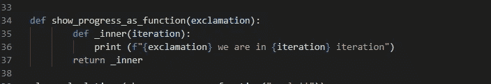
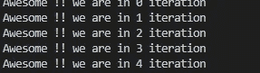
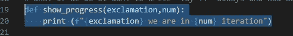
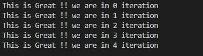

# 使用 Python 理解回调第 1 部分

> 原文：<https://medium.com/analytics-vidhya/understanding-callbacks-a22e8957a73b?source=collection_archive---------1----------------------->

[https://inspireski.com/](https://inspireski.com/)

首先，回调是作为参数发送给另一个函数的函数。让我们直接进入代码来理解这个概念:

你可以在 [Github](https://github.com/eranandagarwal/callbacks) 中找到代码

我们从上面 [github](https://github.com/eranandagarwal/callbacks) 的 simple_example.py 开始。我将从下面复制一些片段来解释这个概念。

我们有一个在 0–4 上迭代的函数，将变量“res”中的平方或每个数字相加。它很慢，因为我们在每次迭代中引入了 1 秒的睡眠。请注意我们在“cb”中采用的参数，我们稍后会理解它是一个可以传递的回调。现在我们可以称这个函数为

**slow_calculation()** ，没有任何参数，您应该会看到输出为 30。

现在我们已经设置了基本函数，让我们来讨论我们想要赋予这个函数的许多特性。假设我们想打印“耶！！在每次迭代中都会进行一次计算。

我们可以在上面的函数中引入一个打印语句，或者我们可以在上面的函数中使用回调函数“cb”。

现在我们可以调用**慢 _ 计算(print_a_statement)** 。注意，我们将 print_a_statement 传递给 slow_calculation，而不是调用它。因此，我们在 print_a_statement 中不使用括号。另外需要注意的是，我们在函数中传递了*args 和**kwargs。这是为了确保没有或可以传递任何数量的参数。

现在，由于 cb 不是 None，它被调用，返回 print_a_statement，输出是

输出

现在，我们希望将迭代编号与上面的打印语句一起打印出来。为此，我们需要将回调函数修改为:

接受一个参数的回调

现在我们的基函数可以调用:**slow _ calculation(print _ with _ param)。**

而回调本身带一个参数，这个参数是调用 **cb(i)的基函数中的迭代次数。因此现在我们将得到输出:**

带有迭代号的输出

这些是我们可以在基本函数之外进行的调整。您会注意到，对于我们正在进行的任何定制，我们都没有更改基本函数 slow_calculation。让我们提出更多要求。

下面解释的代码来自 [Github](https://github.com/eranandagarwal/callbacks) 中包含的 more_callback.py 文件

让我们灵活地将感叹句改为“耶！!"。如果我们要写“**牛逼怎么办！！只需完成 0 次迭代**即可，以此类推。这里我们可以使用闭包的概念。简单地说，闭包是一个函数记住其他函数的输入的能力。

这里 show_progress_as_function 接受一个感叹号参数，内部函数有一个迭代参数。返回的函数打印了感叹号和迭代。

我们可以称我们的基本函数为:

**慢 _ 计算(show_progress_as_function("牛逼！!"))**

请注意，这可以分两步完成:

1.  f1 =**show _ progress _ as _ function("牛逼！!")**
2.  慢速计算(f1)

输出为:

用牛逼输出！！感叹

将 2 参数函数改为 1 参数函数在 python 中很常见，就像我们上面所做的那样，为此我们有了 python 库。

双参数函数

上面的函数接受 2 个参数，但是在 functool 模块的部分功能的帮助下，我们可以将其更改为 1 个参数的函数，如下所示

**从 functool 导入部分**

f1 = partial (show_progress，“牛逼！!")

现在 f1 是一个接受 1 个参数的函数，其中 show_progress 中的感叹号参数很牛逼！！

因此，现在我们可以把基函数称为:

**slow _ calculation(partial(show _ progress，'这太棒了！!'))**

因此我们可以看到，拥有回调是一种修改行为和从修改需求的基本功能中提取独立性的非常圆滑的方式。

编辑:回调的高级步骤很少，比如让一个类作为回调而不是函数。我在这个博客的第二部分[这里](/@anandagarwal_13834/understanding-callbacks-using-python-part-2-e71c17fed7e2)讨论了这个问题。

请阅读第 2 部分，了解更多关于回调的信息

鸣谢:这篇博客不能不感谢杰瑞米·霍华德对回拨的精彩解释。他是 Fastai 深度学习库的创建者。