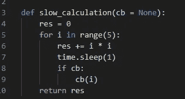
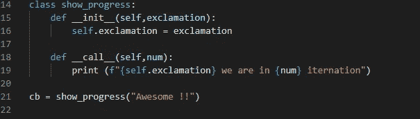
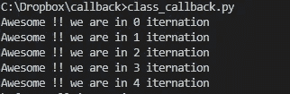
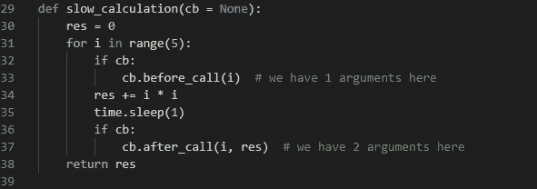
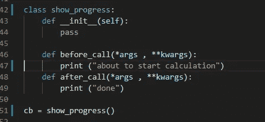
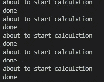
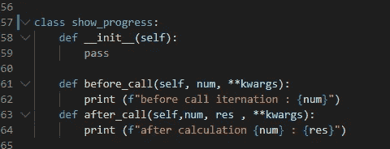
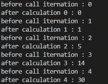
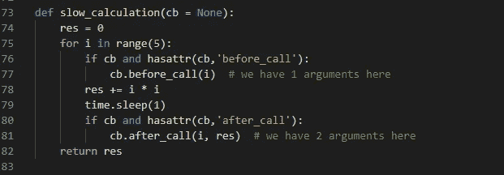

# 使用 Python 理解回调——第 2 部分

> 原文：<https://medium.com/analytics-vidhya/understanding-callbacks-using-python-part-2-e71c17fed7e2?source=collection_archive---------4----------------------->

[https://inspireski.com/](https://inspireski.com/)

这篇博客是上一篇博客的延续，在上一篇博客中，我们讨论了回调函数，以及如何为我们编写的基本函数添加功能。我推荐在这里阅读[第一部分](/@anandagarwal_13834/understanding-callbacks-a22e8957a73b)，以获得这个博客的逻辑流程。作为第一部分，博客将直接解释来自这个 [Github](https://github.com/eranandagarwal/callbacks) 的代码。编程语言是 Python，读者应该理解 Python 中使用的类的非常基础的知识才能继续前进。

正如下面的总结是我们到目前为止使用的基本函数，这个名为 slow_calculation 的函数计算从 0 到 4 的平方数，然后将它们加到返回的变量上

慢速计算功能

在前一篇博客中，我们写了回调函数，然后作为参数“cb”传递给 slow_calculation 函数。如果回调函数被传递，那么它将运行，向基本函数添加修改的特性。

现在，为了扩展这个概念，我们将为回调编写一个类，并尝试传递它。请参考 [Github](https://github.com/eranandagarwal/callbacks) 中的 [class_callback.py](https://github.com/eranandagarwal/callbacks/blob/master/class_callback.py) 获取我在这里粘贴快照的代码。

在这里，随着计算，我们要打印“**真棒！！我们在 0 迭代**”ans 等等。此外，问题是感叹号不应该固定为真棒，可以是任何东西。因此，我们有一个 show_progress 类，它在创建该类时将感叹号作为输入。这是由 __init__ 函数完成的。这些函数被称为邓德函数，它们具有特殊的功能。__init__ 是类实例化时调用的函数。类似地，还有另一个函数 __call__ function，当我们调用这个类的对象时会调用它。因此，当我们调用它时，它接受感叹号和一个 num 作为输入。

用 **cb = show_progress("牛逼！!")**，我们得到一个 show_progress 类的对象，现在可以调用为 **cb(num)，**感谢 dunder function __call__。

为了在我们的 slow_calculation 函数中包含这个特性，我们可以将上面的对象传递给它，如下所示:

**慢速 _ 计算(cb)**

类回调的输出

这很好，但是现在的要求是我们需要在计算完成之前做一些事情(例如打印“即将开始计算”)，以及在计算完成之后做一些事情(例如打印“完成”)

为了增加这些功能，我们以如下方式修改基本函数和回调类:

首先修改 slow_calculation 函数:

改进的慢速计算功能

这个函数的变化是我们引入了在计算完成之前检查回调函数是否通过。如果通过，它将尝试调用 before_call 和 after_call 函数，这些函数将在下面描述的回调类中实现。

带有附加方法的回调类

现在我们的回调类有了两个新方法 before_call 和 after_call，如果回调被传递，它们将出现在 slow_calculation 函数中。我们将*args 和**kwargs 作为这些方法的输入，这样，如果我们没有或没有任何数量的参数，我们的代码也不会中断。这些函数简单地打印了 snapsort 中提到的字符串。

如前所述，我们通过以下方式为此类创建一个对象:

**cb = show_progress()**

现在我们可以把这个 cb 传递给 slow_calculation 为: **slow_calculation(cb)。**

回调的输出

一旦通过，cb.before_call()和 cb.after_call()将在计算前后运行。这个例子向我们展示了回调的威力，它可以修改函数的各个部分，赋予它自定义的功能。

现在让我们说，我们需要做的不仅仅是打印计算前后的状态。我们必须打印之前的迭代次数和之后的迭代次数和计算结果。这意味着回调方法应该为 before_call 方法传递 1 个参数，为 after_call 传递 2 个参数。下面的代码片段:

不同方法的可变参数回调

这里我们看到 show_progress 类有两个方法，并带有可变参数。before_call 接受一个参数，slow_calculation 函数传递迭代次数。类似地，after_call 通过迭代传递，并在每次迭代中产生结果。

**cb = show_progress()**

**慢速 _ 计算(cb)**

输出:

为了在这里添加错误检查，我们的 slow_calculation 程序可以检查 cb，传递的回调函数是否实现了 before_call 和 after_call 方法。这可以通过如下修改 slow_calculation 函数来实现:

具有 hasattrr 的慢速计算功能

这里使用的 hasattr 是一种知道某个属性是否是 not 对象的一部分的方法，如果属性是一部分，则返回 True，否则返回 False。这确保回调如果没有用 before_call 和 after_call 方法实现，将被跳过，并且不会打印任何内容。这确保了事情不会因为回调中的一些错误而中断。

这就把我们带到了回调及其不同用法的结尾。我希望你会喜欢回调处理许多定制需求而不修改基本函数的方法。

因此，总的来说，回调给了我们一种将一个函数传递给另一个函数并在需要时调用它的方法。

鸣谢:这篇博客不能不感谢杰瑞米·霍华德对回拨的精彩解释。他是 Fastai 深度学习库的创建者。