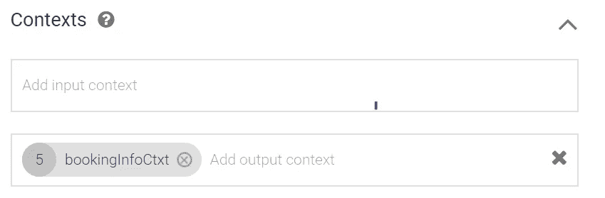
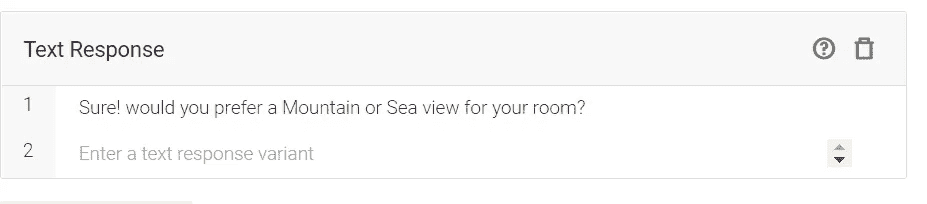
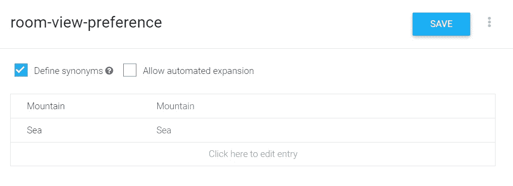
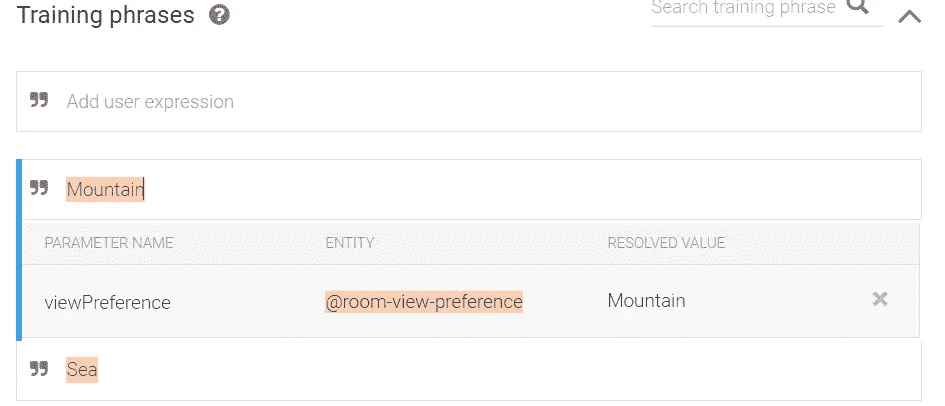
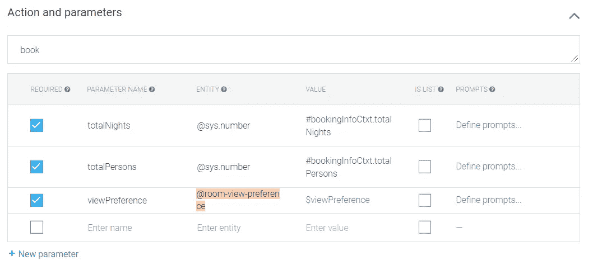
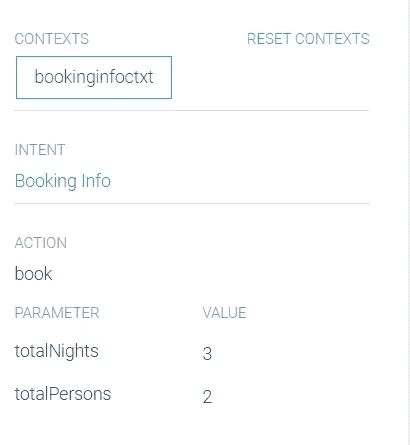
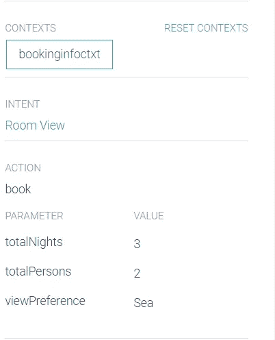
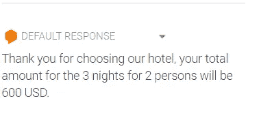

# 使用 Dialogflow 了解聊天机器人上下文

> 原文：<https://medium.com/analytics-vidhya/understanding-chatbot-context-using-dialogflow-b96906cc0c42?source=collection_archive---------0----------------------->

到目前为止，在我们的上一篇文章中:[使用 C#和 Dialogflow 构建一个聊天机器人](/@fouadromieh/build-a-chatbot-using-c-and-dialogflow-93b50be39d7c)我们已经看到了 Dialogflow 如何从意图的角度处理对话，即用户键入一条消息，它与预定义的意图匹配，如果匹配发生，则使用该意图的响应，否则将从默认的回退意图返回响应。

真实世界的对话并不总是一个问题和一个回答，它通常是多个问题/输入触发多个回答/输出。例如，查看下面的场景表单[对话流文档](https://cloud.google.com/dialogflow/docs/contexts-overview):

1.  最终用户询问有关其支票账户的信息。
2.  Dialogflow 将这个最终用户表达与`CheckingInfo`意图相匹配。这个意图有一个`checking`输出上下文，因此该上下文被激活。
3.  代理向最终用户询问他们想要的关于其支票账户的信息类型。
4.  最终用户回复“我的余额”。
5.  Dialogflow 将这个最终用户的表达与`CheckingBalance`的意图相匹配。这个意图有一个`checking`输入上下文，它需要被激活以匹配这个意图。当`savings`上下文活动时，也可能存在类似的`SavingsBalance`意图来匹配相同的最终用户表达。
6.  在您的系统执行必要的数据库查询后，代理会以支票帐户余额作为响应。

这就是聊天机器人上下文发挥作用的地方，以维护当前正在发生的对话的状态，其中也有以前的消息，可能还有相关的未来消息。正如你所看到的，在上面的例子中，第四个用户输入了“我的余额”，如果没有上下文，聊天机器人可能会回答:对不起，我不知道你是什么意思！

因此，只有当对话发生在某个上下文中时，聊天机器人才会联系用户所指的内容。在聊天机器人开发世界中，上下文是一个非常重要的特性，它使我们接近人类的对话，这是构建聊天机器人的最终目标。

# 对话流上下文类型

我不打算从官方文档中添加更多的解释:

> **输入和输出上下文**
> 
> 通过上下文，您可以定义特定的状态来控制会话流，会话必须处于这些状态才能进行匹配。通常，如果 Dialogflow 的训练短语非常类似于最终用户的表达，则它匹配一个意图。但是，当您将上下文应用于某个意图时，如果上下文处于活动状态，Dialogflow 将仅考虑该意图进行匹配。
> 
> 有两种类型的上下文允许您激活和停用上下文，并且可以控制您的对话流:
> 
> [**输入上下文**](https://cloud.google.com/dialogflow/docs/contexts-input-output#input_contexts) :当应用于意图时，输入上下文告诉 Dialogflow 仅在最终用户表达式是近似匹配且上下文是活动的情况下才匹配意图。
> 
> [**输出上下文**](https://cloud.google.com/dialogflow/docs/contexts-input-output#output_contexts) :当应用于一个意图时，一个输出上下文告诉 Dialogflow 激活一个还没有激活的上下文，或者在该意图匹配后保持该上下文。

让我们看一个 Dialogflow 中上下文的实际例子。

# 扩展 Hotelbooking 代理以添加上下文

在我们为酒店预订演示聊天机器人构建的示例中，预订基于提供的人数和总住宿天数。我们将扩展这个来询问用户他/她是否喜欢他们房间的山景/海景，并且除了其他参数之外，还将这个新参数传递给我们的 web hook:*total nights*和 *totalPersons*

1.  转到 Dialogflow 控制台并单击*预订信息*意向。
2.  在上下文部分键入 *bookingInfoCtxt* 作为输出上下文，然后单击 enter。



3.转到*文本响应*部分，如下所示:



通常，在真实的场景中，您会希望用户以同样的意图告诉您偏好，因此这可以以不同的方式处理，但出于上下文演示的目的，本文将跳过这一步。

4.向下滚动到 fulfillment 部分并关闭:*为此目的启用 webhook 调用。*web hook 调用将被转移到另一个意图*。*

正如您在上面看到的，我们为此意图创建了一个输出上下文，该输出上下文将用于传递给另一个意图，该意图捕获用户对其房间的视图偏好。让我们看看如何:

1.  创建新的意图，并将其命名为房间视图。
2.  在 *Contexts* 部分，用我们在前面步骤中创建的值填充输入上下文: *bookingInfoCtxt* 并点击 enter
3.  对于训练短语，我刚刚添加了*海*和*山*的值，当然你可以添加更多来提高捕捉用户意图的准确性。
4.  点击*保存*，进入左侧菜单*实体*，新建一个实体，名为:*房间-视图-偏好*。实体只是一种可以从意图中提取的类型，我用下面的两个值创建了它。



5.现在回到房间视图意图，为训练短语设置实体如下(两者都是):



6.转到“操作和参数”部分，填写如下，通过使用#[ContextName]检查上下文中的参数。[ParamName]:



7.点击保存，让我们通过键入`book me a room for 2 person 3 nights`在模拟器中尝试一下，您会注意到上下文填充如下:



通过在模拟器中键入`Sea`或`Mountain`来回答视图偏好的问题。请注意，我们提取了为此目的配置的 3 个值，其中 2 个不在上下文中。



8.现在转到我们在上一篇文章[中创建的 webhook，创建一个 C#。net core webhook，并更新其代码以检索新的`viewPreference`参数，还更新代码以根据用户的视图选择返回不同的价格。](/@fouadromieh/create-a-c-netcore-webhook-for-a-dialogflow-chatbot-e22d53c40d64)

```
public class BookingController : ControllerBase{// A Protobuf JSON parser configured to ignore unknown fields. This makes// the action robust against new fields being introduced by Dialogflow.private static readonly JsonParser jsonParser =new JsonParser(JsonParser.Settings.Default.WithIgnoreUnknownFields(true));[HttpPost]public ContentResult DialogAction(){// Parse the body of the request using the Protobuf JSON parser,// *not* Json.NET.WebhookRequest request;using (var reader = new StreamReader(Request.Body)){request = jsonParser.Parse<WebhookRequest>(reader);}double totalAmount = 0;double totalNights = 0;double totalPersons = 0;string viewPreference;if (request.QueryResult.Action == “book”){//Parse the intent paramsvar requestParameters = request.QueryResult.Parameters;totalPersons = requestParameters.Fields[“totalPersons”].NumberValue;totalNights = requestParameters.Fields[“totalNights”].NumberValue;viewPreference = requestParameters.Fields[“viewPreference”].StringValue;if (viewPreference == “Sea”){totalAmount = totalNights * 200;}else{totalAmount = totalNights * 100;}}// Populate the responseWebhookResponse response = new WebhookResponse{FulfillmentText = $”Thank you for choosing our hotel, your total amount for the {totalNights} nights for {totalPersons} persons will be {totalAmount} USD.”};// Ask Protobuf to format the JSON to return.// Again, we don’t want to use Json.NET — it doesn’t know how to handle Struct// values etc.string responseJson = response.ToString();return Content(responseJson, “application/json”);}
```

再次部署您的 webhook，并在模拟器中测试结果。您现在应该会从 webhook 获得以下响应，如果您在海景和山景之间切换，将会返回不同的价格:



聊天机器人领域中的上下文讨论肯定比这要多，但是我希望这篇文章能很好地介绍如何处理上下文。