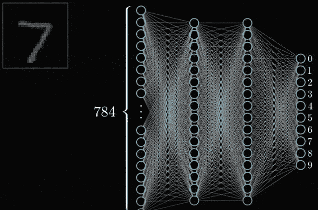

# 了解 CNN！

> 原文：<https://medium.com/analytics-vidhya/understanding-cnns-68da06af1dfb?source=collection_archive---------25----------------------->

CNN MNIST 报道

## ***当你作为一个人类看待一个世界时，你会怎么想？***

我们可以很容易地说出世界上有什么东西，它的颜色、形状、大小、质地……一切。

## ***但如何？***

人脑在**视觉皮层**中有视觉区域，负责检测运动、立体、边缘、颜色、纹理分离、分割等。