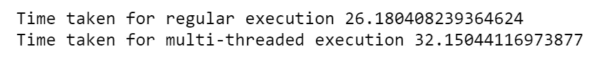
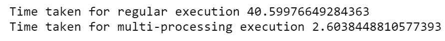
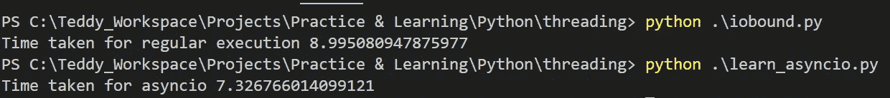

# 理解 Python 中的并发性

> 原文：<https://medium.com/analytics-vidhya/understanding-concurrency-in-python-d7ada0516d01?source=collection_archive---------7----------------------->


"每个学习并发的人都认为他们理解并发！"—赫伯·萨特

我们都或多或少地理解并发和并行的概念。同时执行多个进程或线程的技术/机制，同时最大限度地利用 CPU。不管是什么，但是并发作为一个概念是非常棘手的！

> 并发性是指通过上下文切换在一个处理器上执行多个进程，并且这些进程似乎是同时运行的。
> 
> 并行性是指进程在多个处理器或内核上执行，并且实际上是同时运行的。

Python 提供了多个库来实现并发，即— ***线程*** 、 ***多处理*** 和 ***asyncio*** 。如果我们了解 Python 中并发性的几个方面，这些库将被更好地利用。

* CPython 强制执行 [GIL(全局解释器锁](https://en.wikipedia.org/wiki/Global_interpreter_lock)),它规定一次只能执行一个线程，每次执行任何字节码之前，线程都需要获取这个独占锁。

*当进程受限于 I/O 或 CPU 时，首选并发。 *I/O 绑定进程是那些与比处理器*慢的设备进行通信的进程。例如，与不良网络连接、打印机/扫描仪等对话的进程。是一个 I/O 绑定的进程。 *CPU 受限进程是指那些进行大量 CPU 密集型计算的进程*。这里，限制执行速度的资源是 CPU，而不是 I/O 绑定的进程。

*在 I/O 受限或 CPU 受限的进程中，线程无需争用/争夺 GIL。

*当进程受限于 I/O 时，*线程*和 *asyncio* 库将很好用，当进程受限于 CPU 时，*多处理*库将很好用。

让我们详细了解如何使用这些库——

1.  ***穿线***

如前所述，“线程”库最适合处理 I/O 绑定函数。

因此，让我们考虑一个 I/O 绑定函数，用于从几个网站获取响应。让我们以常规和多线程的方式执行这个任务，并捕获从所有站点获取响应所用的时间，以证明在多线程执行的情况下速度更快，而在常规执行的情况下速度更慢。

*   我们首先导入必要的库和模块

```
import threading
import time
import requests
```

*   然后我们定义一个函数`*get_response()*` ，它接受`*site*` 作为输入，并使用`*requests.get()*` 方法从那个`*site*` 中获取响应数据。

```
def get_response(site):
    return requests.get(site)
```

*   然后创建几个网站的列表。将任意站点和任意数量的站点添加到列表中。

```
sites = ["[http://www.google.com](http://www.google.com)", "[http://www.linkedin.com](http://www.linkedin.com)", "[http://www.quora.com](http://www.quora.com)", "[http://www.facebook.com](http://www.facebook.com)"]
```

*   遍历这个站点列表，并为每个站点调用`*get_response()*` 方法。使用`*time.time()*` 方法捕获并打印这个完整迭代所用的时间。

```
start_time = time.time()
for site in sites:
    get_response(site)
print("Time taken for regular execution", time.time()-start_time)
```

*   现在，使用`*threading*` *库*定义`threads` ，目标为`*get_response()*` 函数，参数设置为列表中的`sites` 。

```
threads = [threading.Thread(target=get_response, args=(site,)) for site in sites]
```

*   迭代这些线程，使用`*thread.start()*` 方法启动这些线程，使用`*thread.join()*` 方法等待线程执行完成。同样，使用`*time.time()*` 方法捕获时间，以查看完成执行所用的时间。

```
start_time = time.time()
for thread in threads:
    thread.start()
for thread in threads:
    thread.join()
print("Time taken for multi-threaded execution", time.time()-start_time)
```

以多线程方式打印出执行所花费的时间。从我的执行中，我得到了以下结果—


可以看出，这个 I/O 绑定任务的多线程执行比常规执行要快得多。在只有四个站点可以获取响应的场景中，多线程执行的效率非常重要。想象一下，当网站列表变得更长时，我们将会看到多大的优势！你是不是刚刚想到要做一个令人兴奋的网页抓取项目？

合并后的代码如下所示—

```
import threading
import time
import requestsdef get_response(site):
    requests.get(site)sites = ["[http://www.google.com](http://www.google.com)", "[http://www.linkedin.com](http://www.linkedin.com)", \
         "[http://www.quora.com](http://www.quora.com)", "[http://www.facebook.com](http://www.facebook.com)"]start_time = time.time()
for site in sites:
    get_response(site)
print("Time taken for regular execution", time.time()-start_time)threads = [threading.Thread(target=get_response, args=(site,)) for site in sites]

start_time = time.time()
for thread in threads:
    thread.start()
for thread in threads:
    thread.join()
print("Time taken for multi-threaded execution", time.time()-start_time)
```

现在，让我们实际考虑一个 CPU 绑定函数，看看`threading` 库没有多大帮助。

*   同样，首先导入必要的库和模块

```
import threading
import time
import requests
```

*   这一次，定义一个 CPU 密集型函数`*cpu_bound()*` ，该函数接受一个`number`，将其乘以 10⁶，并计算 0 到该乘积范围内所有数字的总和。

```
def cpu_bound(num):
    return sum([i for i in range(num*1000000)])
```

*   随机创建一些数字的列表

```
numbers = [11,23,53,34]
```

*   就像上一个例子一样，迭代这些数字并调用 cpu 密集型函数`*cpu_bound()*` *。*捕捉完成执行所用的时间。打印出常规执行所花费的时间。

```
start_time = time.time()
for number in numbers:
    cpu_bound(number)
print("Time taken for regular execution", time.time()-start_time)
```

*   同样，如前所示，使用`*threading.Thread()*` 方法定义`threads` ，目标函数设置为`*cpu_bound*` ，参数设置为列表中的`numbers`

```
threads = [threading.Thread(target=cpu_bound, args=(number,)) for number in numbers]
```

*   迭代这些线程，使用`*thread.start()*` 方法启动这些线程，使用`*thread.join()*` 方法等待线程执行完成。同样，使用`*time.time()*` 方法捕获时间，查看完成执行所用的时间，并将其打印出来。

```
start_time = time.time()
for thread in threads:
    thread.start()
for thread in threads:
    thread.join()
print("Time taken for multi-threaded execution", time.time()-start_time)
```

以下是我的结果-



可以看出，使用线程模块并没有帮助我们在执行 CPU 绑定函数时提高速度，因为逐行执行可能比等待一个线程完成和另一个线程获得 GIL 并继续执行更快。

合并后的代码会像这样—

```
def cpu_bound(num):
    return sum([i for i in range(num*1000000)])
numbers = [11,23,53,34]start_time = time.time()
for number in numbers:
    cpu_bound(number)
print("Time taken for regular execution", time.time()-start_time)threads = [threading.Thread(target=cpu_bound, args=(number,)) for number in numbers]start_time = time.time()
for thread in threads:
    thread.start()
for thread in threads:
    thread.join()
print("Time taken for multi-threaded execution", time.time()-start_time)
```

因此，在处理 CPU 绑定函数时，我们通常会看到多线程执行比常规执行花费更多或几乎相当的时间。

对这两个例子的理解是— *不管你的计算机上有多少个内核；* ***线程****Python 的库不会帮助你完全利用多线程的能力。因此，任何 CPU 密集型功能都不会从多线程执行中受益*。

我们是否有任何拯救方法，可以完全利用我们计算机拥有的所有内核，并有效处理特别是 CPU 绑定的功能？

是啊！感谢**的库*多处理。*** 现在，让我们试着多了解一下。

2. ***多重处理*** —

**多重处理**允许你在不同的内核上运行独立的 Python 进程，尽管这些进程是独立的，但它们仍然可以相互通信(如果需要的话)。让我们看一个例子，多重处理帮助我们实现更快的速度来处理 CPU 受限的功能。

*   导入必要的库和模块

```
import multiprocessing
import time
```

*   定义一个 CPU 密集型函数(使用上一个例子中的相同函数)`*cpu_bound()*`,该函数接受一个数，将其乘以 10⁶，并计算从 0 到该乘积范围内所有数的和。还创建了一个随机数列表。

```
def cpu_bound(num):
    return sum([i for i in range(num*1000000)])numbers = [11,23,53,34]
```

*   我们已经知道了这个函数在数字列表上迭代的常规执行所花费的时间。现在，让我们使用多处理库来调用多个进程来处理这个 CPU 密集型函数，并捕获执行所用的时间。

```
start_time = time.time()
for number in numbers:
    p = multiprocessing.Process(target=cpu_bound, args=(number,))
    p.start()
print("Time taken for multi-threaded execution", time.time()-start_time)
```

当我重新执行常规的多重处理代码时，下面是我的结果



太棒了。您可以看到，将列表中的数字作为独立的进程执行相同的`*cpu_bound()*` 功能所用的时间大幅减少。

合并后的代码看起来会像这样—

```
import multiprocessing
import timedef cpu_bound(num):
    return sum([i for i in range(num*1000000)])numbers = [11,23,53,34]start_time = time.time()
for number in numbers:
    cpu_bound(number)
print("Time taken for regular execution", time.time()-start_time)start_time = time.time()
for number in numbers:
    p = multiprocessing.Process(target=cpu_bound, args=(number,))
    p.start()
    p.join()

print("Time taken for multi-processing execution", time.time()-start_time)
```

如果您在 windows 上工作，那么您可以在运行上述 Python 代码的同时打开任务管理器，查看为您的目的而生成的 Python 进程的数量


正在生成多个 Python 进程-任务管理器

3. ***Asyncio —***

你看，在线程和多处理库中，库不能控制上下文切换。这就是为什么程序员必须使用锁定和等待机制来处理同步问题。如果有一个库可以让应用程序控制上下文切换，并以协作的方式执行多种功能，会怎么样？这就是 ***asyncio*** 进入画面的地方。

***asyncio*** 在 3.4 版本中与 Python 相关联，它是一个单线程-单进程协作多任务库，利用所谓的协同例程、事件循环和可实现的对象来实现并发。

asyncio 任务独占使用 CPU，直到它希望将 CPU 让给事件循环。同样，asyncio 在 I/O 受限操作的情况下非常有用，而在 CPU 受限操作的情况下没有太大优势。

让我们考虑同一个旧的 I/O 绑定示例，从站点获取响应，并看看如何使用 asyncio 实现它

*   导入必要的库和模块

```
import asyncio
import requests
import time
```

*   定义协同例程。协同例程可以通过在函数定义前添加关键字`async`来定义。*asyncio 协同程序是一个在执行过程中可以暂停和恢复的功能*。或多或少像一个产生结果而不是回报的发生器。

```
async def get_response(site):
    return requests.get(site)async def main():
    # define some sites to query 
    tasks = []
    sites = ["[http://www.google.com](http://www.google.com)", \
             "[http://www.linkedin.com](http://www.linkedin.com)", \
             "[http://www.quora.com](http://www.quora.com)", \
             "[http://www.facebook.com](http://www.facebook.com)"]
    for site in sites:
        tasks.append(asyncio.ensure_future(get_response(site)))

    await asyncio.gather(*tasks)
```

*   接受一个协同例程并返回它的未来版本。基本上，它相信最终会在某个时间点给出一个结果。当一个协同例程正在等待时，它的执行被暂时挂起。一旦该协同例程的未来被设置为某个结果，则该协同例程被恢复。
*   现在，让我们创建事件循环并调用协同例程来获取响应和捕获时间，以查看和比较 asyncio 的执行情况。

```
start_time = time.time()
loop = asyncio.get_event_loop()
loop.run_until_complete(main())
loop.close()
print("Time taken for asyncio", time.time()-start_time)
```

我得到了以下结果-



可以看出，与 I/O 绑定操作的常规迭代执行相比，asyncio 执行花费的时间相对较少。

合并后的代码看起来会像这样—

```
import asyncio
import requests
import timeasync def get_response(site):
    return requests.get(site)async def main():
    # define some sites to query 
    tasks = []
    sites = ["[http://www.google.com](http://www.google.com)", \
             "[http://www.linkedin.com](http://www.linkedin.com)", \
             "[http://www.quora.com](http://www.quora.com)", \
             "[http://www.facebook.com](http://www.facebook.com)"]
    for site in sites:
        tasks.append(asyncio.ensure_future(get_response(site)))

    await asyncio.gather(*tasks)start_time = time.time()
loop = asyncio.get_event_loop()
loop.run_until_complete(main())
loop.close()
print("Time taken for asyncio", time.time()-start_time)
```

***结论***——

现在您已经对 Python 中的并发库有了基本的了解——

*   穿线
*   多重处理
*   阿辛西奥

您还学会了根据操作是受 I/O 限制还是受 CPU 限制来决定使用哪个库。总之，您现在已经对并发的基础有了更好的理解。还有更多的吗？ ***决*** ！

您可能需要探索更多关于线程中的锁、多处理中的池以及 asyncio 中其他一些很酷的特性。我只是把你介绍给他们，我希望你喜欢过山车！

如果您有任何反馈、意见或担忧，请在下面的回复中留下。这将有助于我学习和提高。

感谢和问候，泰迪·温特斯