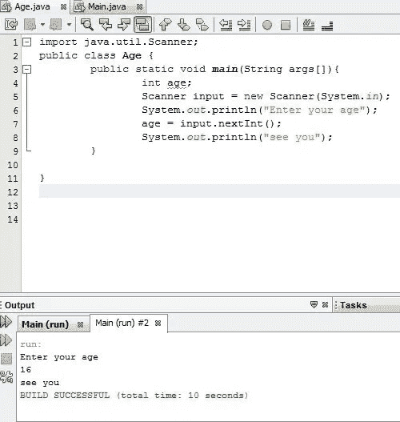
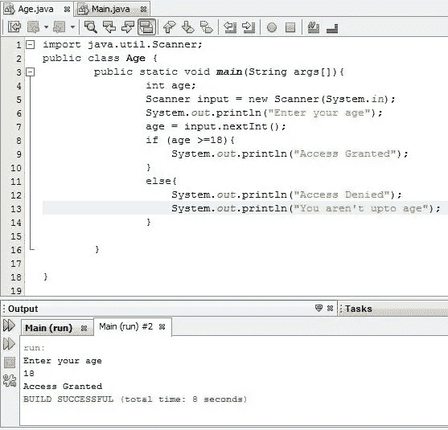
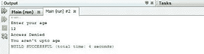
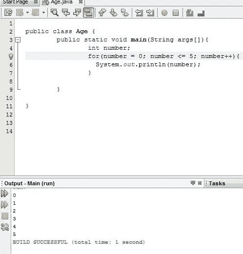

# 理解 Java 中的控制结构

> 原文：<https://medium.com/analytics-vidhya/understanding-control-structures-in-java-3eacbc294600?source=collection_archive---------2----------------------->

图片由 [8926](https://pixabay.com/users/8926-8926/?utm_source=link-attribution&utm_medium=referral&utm_campaign=image&utm_content=1909992) 来自 [Pixabay](https://pixabay.com/?utm_source=link-attribution&utm_medium=referral&utm_campaign=image&utm_content=1909992)

众所周知，程序是由一系列指令组成的。控制结构是程序块，它可以改变我们是否通过那些指令的路径。它是程序设计语言中表达控制流的一种语法形式。

在 java 和其他编程语言中，有三种基本的控制结构:

*   序列结构
*   重复结构
*   选择结构

## **序列结构**

这涉及到 java 语句按照它们在源代码中的编写顺序一个接一个地顺序执行——就像阅读准备食物的食谱或书籍一样。它们可以执行一系列读或写操作、算术运算或变量赋值。这是三种基本 java 控制结构中最简单的一种。下面是说明这种类型的控制结构的示例代码。

查看上面的代码，我们可以很容易地看到操作的顺序或序列，如下所示。

1.  我们创建了一个名为 age 的类，并提示用户输入他们的年龄。
2.  我们读取用户输入的整数，并将其存储在一个名为 age 的整数变量中。
3.  我们在控制台上显示“再见”。

正如我们所看到的，从程序输出来看，代码中的各种指令是按顺序执行的。如果我们想让这个程序运行多少次，就要遵循同样的顺序。

## **选择结构**

在 java 中，选择语句也称为决策语句或分支语句或条件控制语句。它们用于根据条件选择要执行的程序部分。它们允许在两个或多个路径之间进行选择来执行任何特定的程序。java 中使用了三种类型的选择语句；

*   一次选择
*   双重选择或双向选择器
*   多重选择或 n 向选择器

1.  **单选** : ***if 语句*** 就是这类选择语句的一个例子。它选择或忽略单个操作或单组操作，也就是说，如果给定的条件为真，它将执行给定的操作，但如果为假，它将忽略该操作，并在被忽略的 if 语句块之后立即继续执行下一条语句或下一行代码。
2.  **双重选择** : ***if …else*** 语句就是这种类型的一个例子。这种类型的选择语句在特定条件为真时执行一组 if 操作，在条件为假时执行另一组操作。
3.  **多重选择**:这种类型的一个例子是 ***switch case 语句。*** 不同于如果和如果..else 分别为单选和双选，switch 语句可以有多条执行路径，其中只有一条条件为真的执行路径。

查看各种选择语句结构，可以看到执行不是顺序的，而是取决于程序中使用的任何选择类型的条件。如果条件为真，则执行所使用的选择类型中包含的代码块；如果条件为假，则跳转或跳过该代码块，然后继续执行选择语句块之后的下一行代码。

使用已经编写的程序，让我们修改它，这样当一个人输入他或她的年龄时，程序可以决定他/她是否可以被允许进入研讨会的场所-假设一个人被允许进入研讨会的资格年龄范围是 18 岁或以上。

这里，用户输入 18 岁作为年龄，因此输出

利用上面的代码及其输出来说明选择结构，我们可以看到，从 import 语句(第 1 行)开始，程序的执行是连续的，但是在到达 if…else 语句块(第 8 行)的开始时，程序检查用户输入的年龄，以了解它是否满足条件(年龄大于或等于 18)，如果为真，则执行 if 语句中的代码块， 控制台上显示“允许访问”,但如果条件为假，则跳过“if”块，执行 else 块，控制台上显示“拒绝访问”和“您未满年龄”,如下所示。

这里，用户输入 12 作为年龄，因此输出

从前面可以看出，这个程序没有遵循顺序结构，选择语句帮助我们在 java 中实现这一点。

## **3。重复结构**

重复语句也称为循环，它是一个要执行固定次数的代码块，或者直到满足某个特定的条件。它暂时环绕着水流。该结构类似于选择结构，因为一旦所述或指定的一个或多个条件被满足或为真，重复语句块就被执行，但是不同之处在于，该块的执行是连续进行的(循环),直到条件变为假，然后退出该块，并且控制流从紧接在重复语句之后的下一行代码或语句继续。Java 提供了三种重复语句或循环语句，使程序员能够控制执行流程，它们是:

*   While 重复语句
*   Do…While 重复语句
*   For 重复语句

在我们逐一研究它们之前，我们必须知道所有类型的循环或重复语句都有一个通用的结构，例如:

1.  有一个控制变量，称为循环计数器，它必须被初始化(即声明时给一个初始值)。
2.  确定循环是应该继续还是应该中断的循环条件。
3.  控制变量的增量/减量，每次循环迭代发生时都会修改。
4.  **While 重复语句**:这里，首先评估条件，如果条件返回 true，则执行 While 循环中的语句，包括上面列出的三种结构。当此条件返回 false 时，控制将退出循环，并跳转到 while 循环后的下一条语句。
5.  **Do …While 重复语句**:这类似于 While 循环，除了 Do …While 循环保证至少执行一次。要测试的布尔表达式或条件出现在循环的末尾，因此循环中的语句在测试条件之前执行一次。如果条件返回 true，控制跳回到语句，循环中的语句再次执行。这一直持续到循环条件变为假。它还包含前面列出的三种结构或由这三种结构组成。
6.  **对于重复语句**:这个循环的结构也类似于 while 和 do…while 循环。建议在迭代次数固定时使用。此外，控制变量声明和初始化、循环条件以及控制变量的增量或减量都在一行代码中进行了说明，如果其中任何一项被省略或没有按照上述顺序执行，将会导致语法错误。

使用 for 循环打印前五个数字的示例代码和输出

正如我们已经看到的，重复结构的执行不是连续的，而是控制流围绕重复语句循环，只要指定的条件为真，当条件为假时退出。

# 结论

我们已经看到，java 程序的默认执行结构是序列结构，但是程序员可以决定控制执行流，并通过利用选择或重复结构语句将其改变为他/她期望的流，这种情况下可能实现程序员期望实现的任何目标或程序。此外，本文讨论的这三种控制结构构成了任何 java 程序的基础，有了这三种 java 控制结构或其组合，任何类型的程序都可以成功地用 java 编写。