# 理解卷积神经网络-第二部分

> 原文：<https://medium.com/analytics-vidhya/understanding-convolution-neural-networks-part-ii-10ddfd6b8bcd?source=collection_archive---------23----------------------->

本文是[第一部分](/@mustufain.abbas/understanding-convolution-neural-networks-part-i-e86c14a34be3)的延续。如果你没有读过《T2》第一部，我强烈建议你去读一读

在第二部分，我们将建立如图 1.1 所示的网络

让我们定义一些我们将在本文中使用的术语。

f =过滤器尺寸

n_filers =过滤器数量

p =填充

s =步幅

m =培训示例的数量

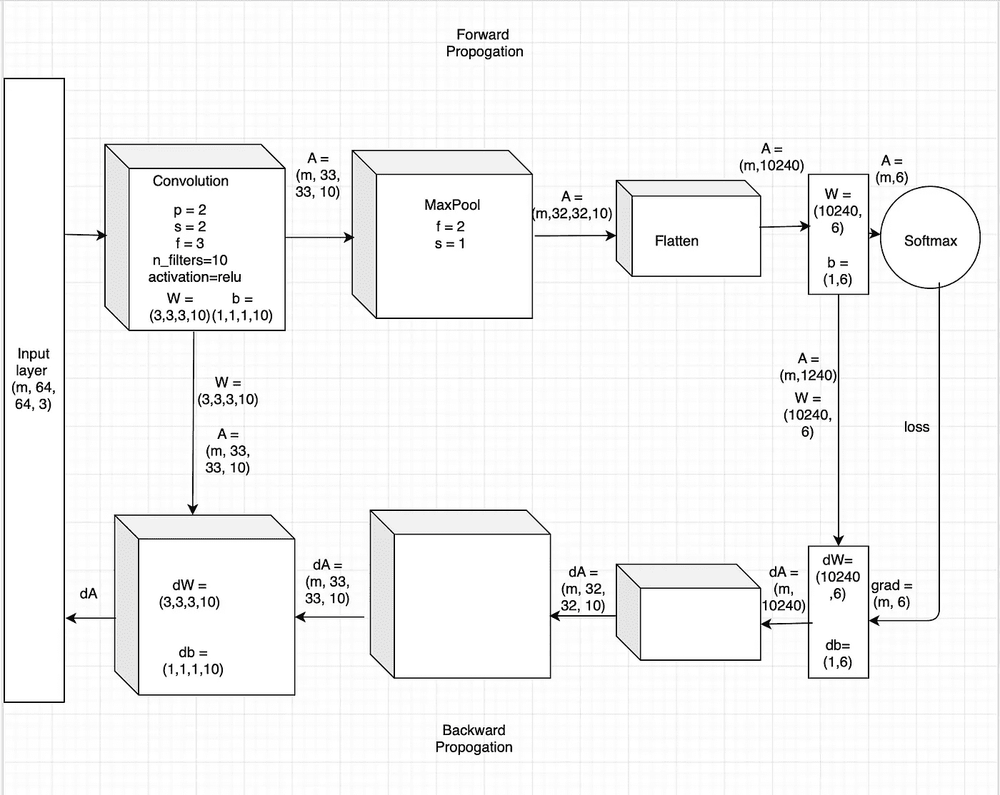

图 1.1 卷积神经网络

**数据**

我们将使用包含 64 x 64 x 3 形状图像的数字符号数据集。训练集由 1080 幅图像组成，测试集由 120 幅图像组成。类别数为 6，包含数字符号 0、1、2、3、4、5。


图 1.2 显示 4 位数字符号的图像。


图 1.3 显示 4 位数字符号的图像。


图 1.4 显示 5 位数标志的图像。

我们将利用我们在[第一部分](https://medium.com/p/e86c14a34be3/edit)中所学的概念，从头开始构建一个卷积神经网络。

**卷积神经网络**

图 1.1 中描述的网络由*卷积层*，r *elu 层*， *max pool 层*，*平坦层*，*密集层*组成，后面是 *softmax 激活函数*，因为我们有不止一个类。我们将利用 *Adam 优化器*来训练网络。在所有层中，使用 he 初始化[He *et 初始化权重。艾尔。随着网络被重新激活。*

# **正向传播**

## **卷积层**

卷积层的超参数是:

*   *p* 是 2
*   *s* 是 2
*   *f* 是 3×3
*   *n_filters* 是 10

图 1.5 卷积的单步

卷积层中的正向传播包括三个步骤:

*   用数量 *p* 为图像填充零

```
def zero_pad(self, X, pad):
    *"""
    Set padding to the image X.

    Pads with zeros all images of the dataset X.
    Zeros are added around the border of an image.

    Parameters:
    X -- Image -- numpy array of shape (m, n_H, n_W, n_C)
    pad -- padding amount -- int

    Returns:
    X_pad -- Image padded with zeros around width and height. -- numpy array of shape (m, n_H + 2*pad, n_W + 2*pad, n_C)

    """* X_pad = np.pad(X, ((0, 0), (pad, pad), (pad, pad), (0, 0)), 'constant')
    return X_pad
```

*   基于 *s* 获取图像窗口

```
def get_corners(self, height, width, filter_size, stride):
    *"""
    Get corners of the image relative to stride.

    Parameters:
    height -- height of an image -- int
    width -- width of an image -- int
    filter_size -- size of filter -- int
    stride -- amount by which the filter shifts -- int

    Returns:
    vert_start -- a scalar value, upper left corner of the box.
    vert_end -- a scalar value, upper right corner of the box.
    horiz_start -- a scalar value, lower left corner of the box.
    horiz_end -- a scalar value, lower right corner of the box.

    """* vert_start = height * stride
    vert_end = vert_start + filter_size
    horiz_start = width * stride
    horiz_end = horiz_start + filter_size
    return vert_start, vert_end, horiz_start, horiz_end
```

*   应用卷积运算，用 *f.* 做图像窗口的逐元素乘积

```
def convolve(self, image_slice, W, b):
    *"""
    Apply a filter defined by W on a single slice of an image.

    Parameters:
    image_slice -- slice of input data -- numpy array of shape (f, f, n_C_prev)
    W -- Weight parameters contained in a window - numpy array of shape (f, f, n_C_prev)
    b -- Bias parameters contained in a window - numpy array of shape (1, 1, 1)

    Returns:
    Z -- a scalar value, result of convolving the sliding window (W, b) on image_slice

    """* s = np.multiply(image_slice, W)
    z = np.sum(s)
    Z = z + float(b)
    return Z
```

综上所述，卷积层中的前向传播将是以下完整的训练数据。

```
def forward(self, A_prev):
    *"""
    Forward proporgation for convolution.

    This takes activations from previous layer and then convolve it
    with a filter defined by W with bias b.

    Parameters:
    A_prev -- output activations of the previous layer, numpy array of shape (m, n_H_prev, n_W_prev, n_C_prev)

    Returns:
    Z -- convolution output, numpy array of shape (m, n_H, n_W, n_C)

    """* np.random.seed(self.seed)
    self.A_prev = A_prev
    filter_size, filter_size, n_C_prev, n_C = self.params[0].shape
    m, n_H_prev, n_W_prev, n_C_prev = self.A_prev.shape
    Z = np.zeros((m, self.n_H, self.n_W, self.n_C))
    A_prev_pad = self.zero_pad(self.A_prev, self.pad)

    for i in range(m):
        a_prev_pad = A_prev_pad[i, :, :, :]
        for h in range(self.n_H):
            for w in range(self.n_W):
                for c in range(n_C):
                    vert_start, vert_end, horiz_start, horiz_end = self.get_corners(h, w, self.filter_size, self.stride)
                    a_slice_prev = a_prev_pad[vert_start:vert_end, horiz_start:horiz_end, :]
                    Z[i, h, w, c] = self.convolve(
                            a_slice_prev, self.params[0][:, :, :, c], self.params[1][:, :, :, c])
    assert (Z.shape == (m, self.n_H, self.n_W, self.n_C))
    return Z
```

卷积层的输出将是形状(m，33，33，10)。计算卷积层输出高度和宽度的一般公式:

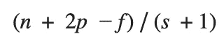

图 1.6 卷积层的输出高度和宽度。

其中 n 是输入尺寸。这有助于在实现过程中检查矩阵形状。然后输出形状变为(m，高度，宽度，通道数)，其中通道数等于 n_filters。

## **热卢层**

ReLU 中的正向传播

```
def forward(self, Z):
    *"""
    Forward propogation of relu layer.

    Parameters:
    Z -- Input data -- numpy array of shape (m, n_H_prev, n_W_prev, n_C_prev)

    Returns:
    A -- Activations of relu layer-- numpy array of shape m, n_H_prev, n_W_prev, n_C_prev)

    """* self.Z = Z
    A = np.maximum(0, Z)  # element-wise
    return A
```

relu 层的输入是卷积层的输出。relu layer 不会改变矩阵尺寸，因此输出形状保持不变。

## 最大池层

最大池的超级参数是:

*   *f* 是 2×2
*   *s* 是 1

maxpool 层中的前向传播包括两个步骤:

*   根据 *s* 得到输入窗口

```
def get_corners(self, height, width, filter_size, stride):
    *"""
    Get corners of the image relative to stride.

    Parameters:
    height -- height of an image -- int
    width -- width of an image -- int
    filter_size -- size of filter -- int
    stride -- amount by which the filter shifts -- int

    Returns:
    vert_start -- a scalar value, upper left corner of the box.
    vert_end -- a scalar value, upper right corner of the box.
    horiz_start -- a scalar value, lower left corner of the box.
    horiz_end -- a scalar value, lower right corner of the box.

    """* vert_start = height * stride
    vert_end = vert_start + filter_size
    horiz_start = width * stride
    horiz_end = horiz_start + filter_size
    return vert_start, vert_end, horiz_start, horiz_end
```

*   在输入窗口上应用 Maxpool 操作，并在完整的训练数据上向前传播。

```
def forward(self, A_prev):
    *"""
    Forward prpogation of the pooling layer.

    Arguments:
    A_prev -- Input data, numpy array of shape (m, n_H_prev, n_W_prev, n_C_prev)

    Returns:
    Z -- output of the pool layer, a numpy array of shape (m, n_H, n_W, n_C)

    """* self.A_prev = A_prev
    m, n_H_prev, n_W_prev, n_C_prev = self.A_prev.shape
    Z = np.empty((m, self.n_H, self.n_W, n_C_prev))
    for i in range(m):
        a_prev = self.A_prev[i]
        for h in range(self.n_H):
            for w in range(self.n_W):
                for c in range(self.n_C):
                    vert_start, vert_end, horiz_start, horiz_end = self.get_corners(
                        h, w, self.filter_size, self.stride)
                    #if horiz_end <= a_prev.shape[1] and vert_end <= a_prev.shape[0]:
                    a_slice_prev = a_prev[
                            vert_start:vert_end, horiz_start:horiz_end, c]
                    Z[i, h, w, c] = np.max(a_slice_prev)
    assert(Z.shape == (m, self.n_H, self.n_W, n_C_prev))
    return Z
```

Maxpool 层的输出将是(m，32，32，10)的形状。计算 maxpool 层输出高度和宽度的通用公式如图 1.6 所示。然后，输出形状变为(m，高度，宽度，通道数)，其中通道数是输入维度的最后一个轴。

## 展平图层

平坦层中正向传播

```
def forward(self, A_prev):
    *"""
    Forward propogation of flatten layer.

    Parameters:
    A_prev -- input data -- numpy of array shape (m, n_H_prev, n_W_prev, n_C_prev)

    Returns:
    Z -- flatten numpy array of shape (m, n_H_prev * n_W_prev * n_C_prev)

    """* np.random.seed(self.seed)
    self.A_prev = A_prev
    output = np.prod(self.A_prev.shape[1:])
    m = self.A_prev.shape[0]
    self.out_shape = (self.A_prev.shape[0], -1)
    Z = self.A_prev.ravel().reshape(self.out_shape)
    assert (Z.shape == (m, output))
    return Z
```

输出形状为(m，10240)。

## 致密层

这是一个全连接的神经网络层。

```
def forward(self, A_prev):
    *"""
    Forward propogation of Dense layer.

    Parameters:
    A_prev -- input data -- numpy of array shape (m, input_dim)

    Returns:
    Z -- flatten numpy array of shape (m, output_dim)

    """* np.random.seed(self.seed)
    m = A_prev.shape[0]
    self.A_prev = A_prev
    Z = np.dot(self.A_prev, self.params[0]) + self.params[1]
    assert (Z.shape == (m, self.output_dim))
    return Z
```

这主要用在损失函数之前。因为类的数量是 6，所以这一层的输出形状将是类的数量。

## **Softmax 损失**

因为这是一个多类分类问题，所以我们将使用 softmax 损失函数，也称为类别交叉熵损失。我们将使用 softmax 激活函数为每个单独的类生成概率，所有概率之和为 1，如图 1.6 所示。

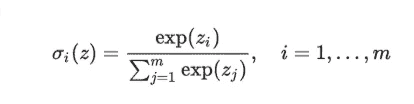

图 1.6 软最大概率

```
def softmax(z):
    *"""* ***:param*** *Z: output of previous layer of shape (m, 6)* ***:return****: probabilties of shape (m, 6)
    """* # numerical stability
    z = z - np.expand_dims(np.max(z, axis=1), 1)
    z = np.exp(z)
    ax_sum = np.expand_dims(np.sum(z, axis=1), 1)

    # finally: divide elementwise
    A = z / ax_sum
    return A
```

Softmax 函数容易出现两个问题:**溢出**和**下溢**

**溢出**:这意味着在爆炸梯度的情况下，权重会显著增加，这使得概率变得无用。

**下溢**:它发生在消失梯度的情况下，权重可能接近于零，因此具有相同的概率。

为了在进行 softmax 计算时解决这些问题，一个常见的技巧是通过从所有元素中减去最大元素来移动输入向量。对于输入向量 z，定义 z 如下:

```
z = z - np.expand_dims(np.max(z, axis=1), 1)
```

*m* 训练数据的损失函数定义为:

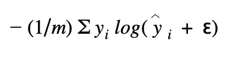

图 1.7 Softmax 损失函数

```
def softmaxloss(x, labels):
    *"""* ***:param*** *x: output of previous layer of shape (m, 6)* ***:param*** *labels: class labels of shape (1, m)* ***:return****:
    """* one_hot_labels = convert_to_one_hot(labels, 6)
    predictions = softmax(x)
    epsilon = 1e-12
    predictions = np.clip(predictions, epsilon, 1\. - epsilon)
    N = predictions.shape[0]
    loss = -np.sum(one_hot_labels * np.log(predictions + 1e-9)) / N
    grad = predictions.copy()
    grad[range(N), labels] -= 1
    grad /= N
    return loss, grad
```

在损失函数中，我们通过*ε*对 softmax 预测进行了剪裁，以防止可能导致数值不稳定的过大值。

```
epsilon = 1e-12
predictions = np.clip(predictions, epsilon, 1\. - epsilon)
```

# **反向传播**

## 软最大损失

现在，我们将传播我们的梯度回到第一层。首先，我们将使用 softmax 计算相对于密集层的交叉熵损失的导数(输入到 softmax)。

```
grad = predictions.copy()
grad[range(N), labels] -= 1
grad /= N
```

## 致密层

在致密层中，我们接收相对于致密层的交叉熵损失的梯度作为输入。然后，我们计算 dW、db 和 dA_prev。*注意，我们会互换使用损失或成本函数*。

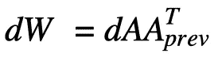

图 1.8 相对于成本函数的权重梯度。

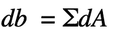

图 1.9 相对于成本函数的偏差梯度。

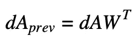

图 1.10 相对于密集层输入的成本梯度。

```
def backward(self, dA):
    *"""
    Backward propogation for Dense layer.

    Parameters:
    dA -- gradient of cost with respect to the output of the Dense            layer, same shape as Z

    Returns:
    dA_prev -- gradient of cost with respect to the input of the .                Dense layer, same shape as A_prev

    """* np.random.seed(self.seed)
    m = self.A_prev.shape[0]
    dW = np.dot(self.A_prev.T, dA)
    db = np.sum(dA, axis=0, keepdims=True)
    dA_prev = np.dot(dA, self.W.T)
    assert (dA_prev.shape == self.A_prev.shape)
    assert (dW.shape == self.params[0].shape)
    assert (db.shape == self.params[1].shape)

    return dA_prev, [dW, db]
```

## 展平图层

展平层没有参数来训练，所以我们不会计算 dW 和 db。对于向后传播梯度，它只是将 dA 整形为 A_prev，即(m，10240)。

```
def backward(self, dA):
    *"""
    Backward propogation of flatten layer.

    Parameters:
    dA -- gradient of cost with respect to the output of the flatten layer, same shape as Z

    Returns:
    dA_prev -- gradient of cost with respect to the input of the flatten layer, same shape as A_prev

    """* np.random.seed(self.seed)
    dA_prev = dA.reshape(self.A_prev.shape)
    assert (dA_prev.shape == self.A_prev.shape)
    return dA_prev, []
```

## 最大池层

在进行反向传播之前，我们将创建一个函数来跟踪矩阵的最大值在哪里。True (1)表示矩阵中最大值的位置，其他条目为 False (0)。

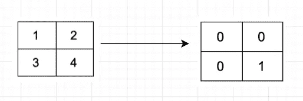

图 2.1 寻找矩阵中最大值的掩码

```
def create_mask_from_window(self, image_slice):
    *"""
    Get  mask from a image_slice to identify the max entry.

    Parameters:
    image_slice -- numpy array of shape (f, f, n_C_prev)

    Returns:
    mask -- Array of the same shape as window, contains a True at the position corresponding to the max entry of image_slice.

    """* mask = np.max(image_slice)
    mask = (image_slice == mask)
    return mask
```

我们跟踪矩阵中的最大值，因为这是最终影响输出的输入值，因此也影响成本。反向投影计算的是相对于成本的梯度，因此任何影响最终成本的因素都应该有一个非零的梯度。因此，反向传播会将梯度“传播”回影响成本的特定输入值。

因为 Maxpool 没有参数，所以我们不会计算 dW 和 db。

```
def backward(self, dA):
    *"""
    Backward propogation of the pooling layer.

    Parameters:
    dA -- gradient of cost with respect to the output of the pooling layer,
          same shape as Z

    Returns:
    dA_prev -- gradient of cost with respect to the input of the pooling layer,
               same shape as A_prev

    """* m, n_H_prev, n_W_prev, n_C_prev = self.A_prev.shape
    m, n_H, n_W, n_C = dA.shape
    dA_prev = np.zeros((m, n_H_prev, n_W_prev, n_C_prev))
    for i in range(m):
        a_prev = self.A_prev[i]
        for h in range(n_H):
            for w in range(n_W):
                for c in range(n_C):
                    vert_start, vert_end, horiz_start, horiz_end = self.get_corners(h, w, self.filter_size, self.stride)
                    a_prev_slice = a_prev[vert_start:vert_end, horiz_start:horiz_end, c]
                    mask =self.create_mask_from_window(a_prev_slice)
                    dA_prev[i, vert_start: vert_end, horiz_start: horiz_end, c] += mask * dA[i, h, w, c]
    assert(dA_prev.shape == self.A_prev.shape)
    return dA_prev, []
```

## Relu 层

relu 中的反向传播如图 2.2 所示

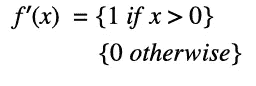

图 2.2 相对于 relu 输入的成本梯度。

```
def backward(self, dA):
    *"""
    Backward propogation of relu layer.

    f′(x) = {1 if x > 0}
            {0 otherwise}

    Parameters:
    dA -- gradient of cost with respect to the output of the relu layer, same shape as A

    Returns:
    dZ -- gradient of cost with respect to the input of the relu layer, same shape as Z

    """* Z = self.Z
    dZ = np.array(dA, copy=True)
    dZ[Z <= 0] = 0
    assert (dZ.shape == self.Z.shape)
    return dZ, []
```

## 卷积层

在卷积层，我们将计算三个梯度，dA，dW，db。

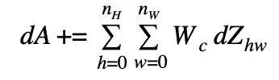

图 2.3 dA 关于某一滤波器的成本。

在图 2.3 中， *Wc* 是一个滤波器， *dZhw* 是一个标量，对应于第 h 行第 w 列卷积层 *Z* 输出的成本梯度(对应于第 I 步向左和第 j 步向下的点积)。注意，每次更新 *dA* 时，我们都将同一个滤波器 *Wc* 乘以不同的 *dZ* 。我们这样做主要是因为当计算正向传播时，每个滤波器由不同的 a_slice 点状排列和求和。因此，当计算 *dA* 的后投影时，我们只是将所有 a_slices 的梯度相加。图 2.3 中的公式转化为反向传播中的以下代码:

```
da_prev_pad[vert_start:vert_end, horiz_start:horiz_end, :] += self.params[0][:, :, :, c] * dZ[i, h, w, c]
```

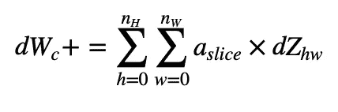

图 2.4 一个滤波器相对于损耗的梯度。

aslice 对应于用于生成激活 Zij 的切片。因此，这最终给出了 W 相对于该切片的梯度。因为是同一个 W，我们就把所有这样的梯度加起来得到 dW。

在反向传播中，图 2.4 中的公式转化为下面的代码。

```
dW[:, :, :, c] += a_slice_prev * dZ[i, h, w, c]
```

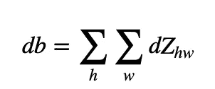

图 2.5 特定滤波器相对于成本的偏差梯度。

在反向传播中，图 2.4 中的公式转化为下面的代码。

```
db[:, :, :, c] += dZ[i, h, w, c]
```

综上所述，卷积层的反向传播如下所示:

```
def backward(self, dZ):
    *"""
    Backward propagation for convolution.

    Parameters:
    dZ -- gradient of the cost with respect to the output of the conv layer (Z), numpy array of shape (m, n_H, n_W, n_C)

    Returns:
    dA_prev -- gradient of the cost with respect to the input of the conv layer (A_prev), numpy array of shape (m, n_H_prev, n_W_prev, n_C_prev)
    dW -- gradient of the cost with respect to the weights of the conv layer (W) numpy array of shape (f, f, n_C_prev, n_C)
    db -- gradient of the cost with respect to the biases of the conv layer (b) numpy array of shape (1, 1, 1, n_C)

    """* np.random.seed(self.seed)
    m, n_H_prev, n_W_prev, n_C_prev = self.A_prev.shape
    f, f, n_C_prev, n_C = self.params[0].shape
    m, n_H, n_W, n_C = dZ.shape
    dA_prev = np.zeros(self.A_prev.shape)
    dW = np.zeros(self.params[0].shape)
    db = np.zeros(self.params[1].shape)
    # Pad A_prev and dA_prev
    A_prev_pad = self.zero_pad(self.A_prev, self.pad)
    dA_prev_pad = self.zero_pad(dA_prev, self.pad)
    for i in range(m):
        a_prev_pad = A_prev_pad[i, :, :, :]
        da_prev_pad = dA_prev_pad[i, :, :, :]
        for h in range(n_H):
            for w in range(n_W):
                for c in range(n_C):
                    vert_start, vert_end, horiz_start, horiz_end = self.get_corners(h, w, self.filter_size, self.stride)
                    a_slice_prev = a_prev_pad[
                    vert_start:vert_end, horiz_start:horiz_end, :]
                    da_prev_pad[vert_start:vert_end, horiz_start:horiz_end, :] += self.params[0][:, :, :, c] * dZ[i, h, w, c]
                    dW[:, :, :, c] += a_slice_prev * dZ[i, h, w, c]
                    db[:, :, :, c] += dZ[i, h, w, c]        dA_prev[i, :, :, :] = da_prev_pad[self.pad:-self.pad, self.pad:-self.pad, :]
    assert(dA_prev.shape == (m, n_H_prev, n_W_prev, n_C_prev))
    return dA_prev, [dW, db]
```

## **梯度检查**

梯度检查在验证反向传播和正确计算梯度时非常有用。它使用双侧差分在数值上近似梯度。我们将从训练数据中随机选择 2 个数据点，并对其进行梯度检查。注意:因为梯度检查非常慢，所以不要在训练中使用它。

```
def grad_check():

    train_set_x, train_set_y, test_set_x, test_set_y, n_class = load_data()
    # select randomly 2 data points from training data
    n = 2
    index = np.random.choice(train_set_x.shape[0], n)
    train_set_x = train_set_x[index]
    train_set_y = train_set_y[:, index]
    cnn = make_model(train_set_x, n_class)
    print (cnn.layers)
    A = cnn.forward(train_set_x)
    loss, dA = softmaxloss(A, train_set_y)
    assert (A.shape == dA.shape)
    grads = cnn.backward(dA)
    grads_values = grads_to_vector(grads)
    initial_params = cnn.params
    parameters_values = params_to_vector(initial_params) # initial parameters
    num_parameters = parameters_values.shape[0]
    J_plus = np.zeros((num_parameters, 1))
    J_minus = np.zeros((num_parameters, 1))
    gradapprox = np.zeros((num_parameters, 1))
    print ('number of parameters: ', num_parameters)
    epsilon = 1e-7
    assert (len(grads_values) == len(parameters_values))
    for i in tqdm(range(0, num_parameters)):

        thetaplus = copy.deepcopy(parameters_values)
        thetaplus[i][0] = thetaplus[i][0] + epsilon # parameters
        new_param = vector_to_param(thetaplus, initial_params)
        difference = compare(new_param, initial_params)
        # make sure only one parameter is changed
        assert ( difference == 1) 
        cnn.params = new_param
        A = cnn.forward(train_set_x)
        J_plus[i], _ = softmaxloss(A, train_set_y)

        thetaminus = copy.deepcopy(parameters_values)
        thetaminus[i][0] = thetaminus[i][0] - epsilon
        new_param = vector_to_param(thetaminus, initial_params)
        difference = compare(new_param, initial_params)
        # make sure only one parameter is changed
        assert (difference == 1)  
        cnn.params = new_param
        A = cnn.forward(train_set_x)
        J_minus[i], _ = softmaxloss(A, train_set_y)

        gradapprox[i] = (J_plus[i] - J_minus[i]) / (2 * epsilon)

    numerator = np.linalg.norm(gradapprox - grads_values)
    denominator = np.linalg.norm(grads_values) + np.linalg.norm(gradapprox)
    difference = numerator / denominator

    if difference > 2e-7:
        print("\033[93m" + "There is a mistake in the backward propagation! difference = " + str(
                difference) + "\033[0m")
    else:
        print("\033[92m" + "Your backward propagation works perfectly fine! difference = " + str(
                difference) + "\033[0m")

    return difference
```

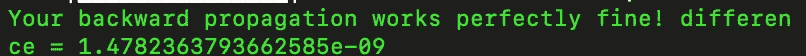

图 2.6 梯度检查结果。

如果您的反向传播有效，它将输出如图 2.6 所示的消息。如果在你的反向传播中有一些错误，一件事就是比较近似梯度和原始梯度的单个值，检查差异大的地方，并寻找那些梯度的实现。还有一点要注意的是，我们可能会遇到*扭结*，这可能是无法通过等级检查的不准确来源。纽结是指目标函数的不可微部分，由 ReLU ***(max(0，x))*** *等函数引入。*例如，考虑在 *x = -1e-8 处进行梯度检查。*您可能还记得图 2.2 中的 ReLU 反向传播，因为 x <为 0，所以它会计算一个零梯度。然而，当计算两侧差(x+ε)时，ε作为 *1e-7* 计算 *9e-08* ，这将引入非零梯度。

## Adam 优化器

Adam optimizer 被用作最小化损失函数的优化算法。众所周知，它可以很好地处理各种问题。Adam 的 Hyper 参数有:*学习率*，*β1*，*β2*，*ε*。 *beta1* 的默认选择是 0.9，而 *beta2* 的默认选择是 0.999。*ε*的选择关系不大，设置为 1e-08。一般来说，所有其他超级参数都使用默认值，学习率是可调的。*β1*计算导数的平均值，称为一阶矩，而*β2*用于计算平方的指数加权平均值。也就是所谓的二阶矩。Adam 具有相对较低的内存需求，即使除了学习速率之外的超参数调整很少，也通常工作良好。[金马*等* 2014]

```
class Adam(object):

    def __init__(self, model, X_train, y_train,
                 learning_rate, epoch, minibatch_size, X_test, y_test):
        self.model = model
        self.X_train = X_train
        self.y_train = y_train
        self.learning_rate = learning_rate
        self.beta1 = 0.9
        self.beta2 = 0.999
        self.epsilon = 1e-08
        self.epoch = epoch
        self.X_test = X_test
        self.y_test = y_test
        self.num_layer = len(self.model.layers)
        self.minibatch_size = minibatch_size

    def initialize_adam(self):
        VdW, Vdb, SdW, Sdb = [], [], [], []
        for param_layer in self.model.params: # layers which has no learning
            if len(param_layer) is not 2: VdW.append(np.zeros_like([]))
                Vdb.append(np.zeros_like([]))
                SdW.append(np.zeros_like([]))
                Sdb.append(np.zeros_like([]))
            else:
                VdW.append(np.zeros_like(param_layer[0]))
                Vdb.append(np.zeros_like(param_layer[1]))
                SdW.append(np.zeros_like(param_layer[0]))
                Sdb.append(np.zeros_like(param_layer[1]))

        assert len(VdW) == self.num_layer
        assert len(Vdb) == self.num_layer
        assert len(SdW) == self.num_layer
        assert len(Sdb) == self.num_layer

        return VdW, Vdb, SdW, Sdb

    def update_parameters(self, VdW, Vdb, SdW, Sdb, grads, t):

        VdW_corrected = [np.zeros_like(v) for v in VdW]
        Vdb_corrected = [np.zeros_like(v) for v in Vdb]
        SdW_corrected = [np.zeros_like(s) for s in SdW]
        Sdb_corrected = [np.zeros_like(s) for s in Sdb]

        # compute dW, db using current mini batch

        grads = list(reversed(grads))
        for i in range(len(grads)): # layer which contains weights and biases
            if len(grads[i]) is not 0:   
                # Moving average of the gradients (Momentum)

                a = self.beta1 * VdW[i]
                b = (1 - self.beta1) * grads[i][0]
                VdW[i] = np.add(a, b)

                a = self.beta1 * Vdb[i]
                b = (1 - self.beta1) * grads[i][1]
                Vdb[i] = np.add(a, b)

                # Moving average of the squared gradients. (RMSprop)
                a = self.beta2 * SdW[i]
                b = (1-self.beta2) * np.power(grads[i][0], 2)
                SdW[i] = np.add(a, b)

                a = self.beta2 * Sdb[i]
                b = (1-self.beta2) * np.power(grads[i][1], 2)
                Sdb[i] = np.add(a, b)

                # Compute bias-corrected first moment estimate

                den = (1-(self.beta1 ** t))
                VdW_corrected[i] = np.divide(VdW[i], den)
                Vdb_corrected[i] = np.divide(Vdb[i], den)

                # Compute bias-corrected second raw moment estimate
                den = 1-(self.beta2 ** t)
                SdW_corrected[i] = np.divide(SdW[i], den)
                Sdb_corrected[i] = np.divide(Sdb[i], den)

                # weight update
                den = np.sqrt(SdW_corrected[i]) + self.epsilon
                self.model.params[i][0] = self.model.params[i][0] - self.learning_rate * np.divide(VdW_corrected[i], den)

                # bias update
                den = np.sqrt(Sdb_corrected[i]) + self.epsilon
                self.model.params[i][1] = self.model.params[i][1] - self.learning_rate * np.divide(Vdb_corrected[i], den)

    def minimize(self):
        costs = []
        t = 0
        np.random.seed(1)
        VdW, Vdb, SdW, Sdb = self.initialize_adam()
        for i in tqdm(range(self.epoch)):
            start = time.time()
            loss = 0
            minibatches = get_minibatches(self.X_train,
                                          self.y_train,
                                          self.minibatch_size)
            for minibatch in tqdm(minibatches):
                # Select a minibatch
                (minibatch_X, minibatch_Y) = minibatch
                # forward and backward propogation
                loss, grads = self.model.fit(minibatch_X, minibatch_Y)
                loss += loss
                t = t + 1  # Adam counter
                # weight update
                self.update_parameters(VdW, Vdb, SdW, Sdb, grads, t)

            # Print the cost every epoch
            end = time.time()
            epoch_time = end - start
            train_acc = accuracy(self.model.predict(self.X_train),
                                 self.y_train)
            val_acc = accuracy(self.model.predict(self.X_test),
                               self.y_test)
            print ("Cost after epoch %i: %f" % (i, loss),
                   'time (s):', epoch_time,
                   'train_acc:', train_acc,
                   'val_acc:', val_acc)
            costs.append(loss)
        print ('total_cost', costs)

        return self.model, costs
```

现在我们已经到了文章的结尾，希望你已经跟上了。如果你喜欢它，别忘了给它一个大拇指:)

可以在 LinkedIn 上加我:[https://www.linkedin.com/in/mustufain-abbas/](https://www.linkedin.com/in/mustufain-abbas/)

该文章的代码可以在:[https://github.com/Mustufain/Convolution-Neural-Network-](https://github.com/Mustufain/Convolution-Neural-Network-)找到

# 参考

coursera 上的吴恩达课程:[https://www . coursera . org/learn/convolutionary-neural-networks-tensor flow](https://www.coursera.org/learn/convolutional-neural-networks-tensorflow)

深入研究整流器:在 imagenet 分类上超越人类水平的表现 IEEE 计算机视觉国际会议论文集。2015

金玛，迪德里克 p .和吉米巴。"亚当:随机最优化的方法." *arXiv 预印本 arXiv:1412.6980* (2014)。

泽勒，马修 d 和罗布弗格斯。"可视化和理解卷积网络."*欧洲计算机视觉会议*。施普林格，查姆，2014 年。