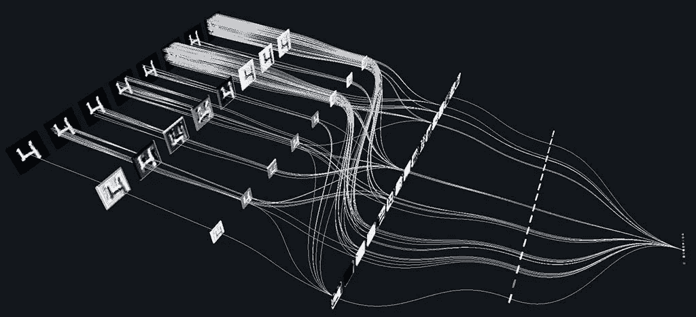
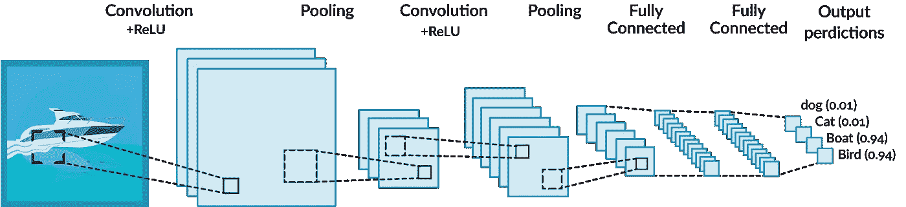
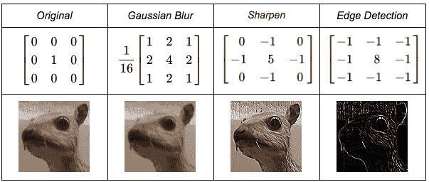
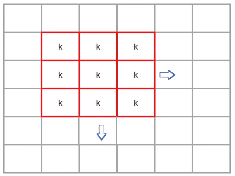
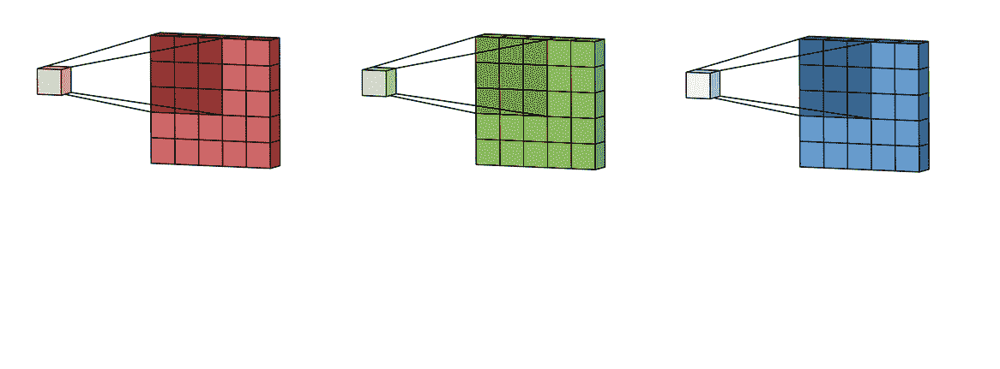
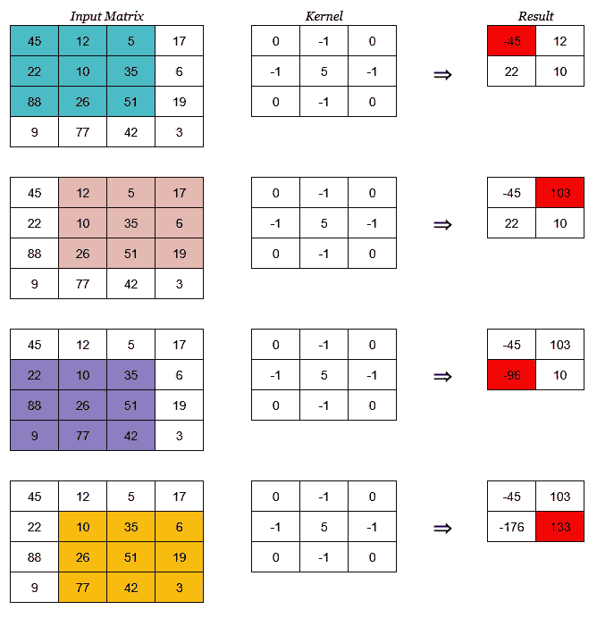

# 理解 CNN 中的“卷积”运算

> 原文：<https://medium.com/analytics-vidhya/understanding-convolution-operations-in-cnn-1914045816d4?source=collection_archive---------5----------------------->

CNN 架构

人工智能的首要目标是将人类的思维能力带入机器，它在一定程度上实现了这一目标。大多数机器学习方法缺乏微调其内部机制的能力，而这正是神经网络通过其众多可训练参数和潜在的永无止境的训练曲线来拯救的地方。

在人工智能的无数领域中，最突出的领域之一是计算机视觉，其目标是分类、标记、重建和识别图像/视频中的组件。深度学习的进展与计算机视觉的想法相结合，导致我们创建了一个**卷积神经网络，也称为 Convnets。**

# 什么是卷积神经网络？它是基于什么？

convnet 中的分类

卷积网络属于一类神经网络，它将图像作为输入，对其进行权重和偏差的组合，提取特征并输出结果。它们倾向于通过使用核来降低输入图像的维度，与一般的密集神经网络相比，这使得提取特征更容易。卷积网络的基础可以追溯到矩阵上的**卷积运算**。

Convnets 受到生物过程的启发，因为神经元之间的连接模式类似于动物视觉皮层的组织。个别的皮质神经元只在视野中称为感受野的有限区域对刺激做出反应。不同神经元的感受野部分重叠，从而覆盖整个视野。

# 卷积运算

“卷积神经网络”这一名称表明该网络采用了一种称为卷积的数学运算。卷积是一种特殊的线性运算。Convnets 是简单的神经网络，它至少在一层中使用卷积来代替一般的矩阵乘法。

> 数学中两个函数之间的卷积产生第三个函数，表示一个函数的形状如何被另一个函数修改

## 卷积核

内核是一个小的 2D 矩阵，其内容基于要执行的操作。核通过简单的矩阵乘法和加法映射到输入图像上，所获得的输出具有较低的维数，因此更容易处理。

内核类型

上面是一个应用高斯模糊(在处理之前平滑图像)、锐化图像(增强边缘深度)和边缘检测的内核的例子。

核的形状很大程度上取决于图像的输入形状和整个网络的结构，通常核的大小是 **(MxM)** ，即一个正方形矩阵。内核的运动总是从左到右，从上到下。

内核运动

**步距**定义了内核移动的步距，例如步距 1 使内核每次滑动一行/列，步距 2 使内核移动 2 行/列。

步幅=1 的多核滤波器

对于具有 3 个或更多通道(如 RGB)的输入图像，应用**过滤器**

> 滤波器比内核高一个维度，可以被视为多个内核相互堆叠，其中每个内核用于一个特定的通道。

因此，对于(32×32)的 RGB 图像，我们有一个形状为(5x5x3)的过滤器

现在让我们看看一个内核是如何操作样本矩阵的

卷积运算

这里，输入矩阵具有 4x4x1 的形状，并且核的大小为 3x3。由于输入的形状大于核，所以我们能够实现滑动窗口协议，并且在整个输入上应用核。卷积结果中的第一项计算如下:

> 45*0 + 12*(-1) + 5*0 + 22*(-1) + 10*5 + 35*(-1) + 88*0 + 26*(-1) + 51*0 = -45

滑动窗口协议:

1.  内核位于输入矩阵的左上角。
2.  然后它开始从左向右移动，计算点积并保存到一个新的矩阵中，直到它到达最后一列。
3.  接下来，内核重置它在第一列的位置，但是现在它滑动一行到底部。从而跟随时尚左右上下。
4.  重复步骤 2 和 3，直到处理完所有输入。

对于 3D 输入矩阵，内核的移动将是从前到后、从左到右和从上到下。到目前为止，您必须对卷积运算有一个基本的了解，卷积运算是卷积神经网络的本质。

# 下一步是什么？

您可以在 Keras/tensor flow/the ano/py torch 中实现自己的 conv net，也可以更深入地了解它们是如何工作的。说说你的选择吧！感谢您的阅读！保持更新，保持安全:)

# 推荐读物

[用于视觉识别的 CS231n 卷积神经网络](https://cs231n.github.io/convolutional-networks/)

[Keras Conv2D:在 Keras 中使用 CNN 2D 卷积](https://missinglink.ai/guides/keras/keras-conv2d-working-cnn-2d-convolutions-keras/)