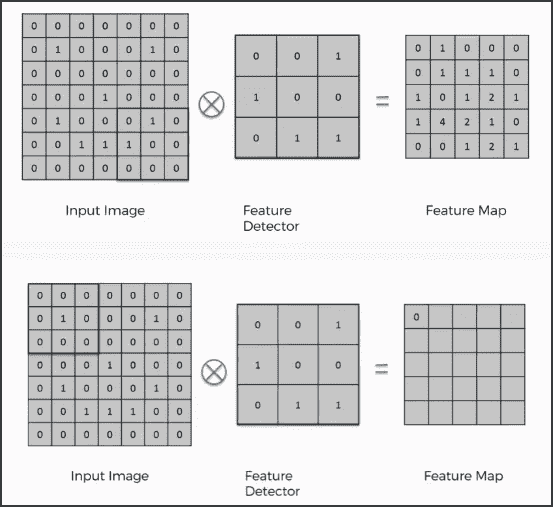
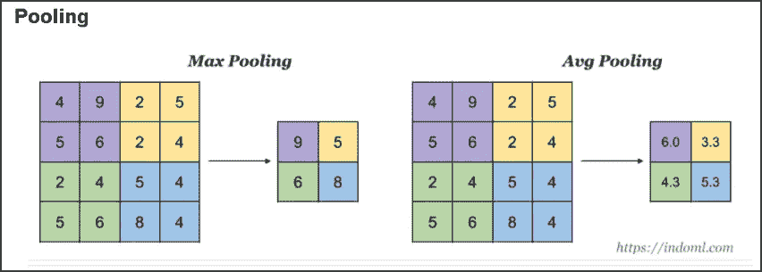
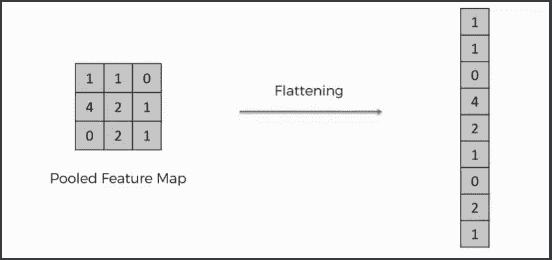
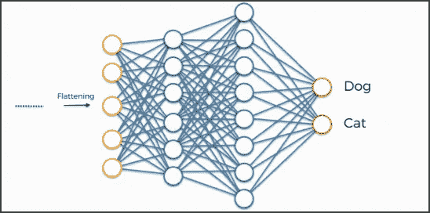

# 了解卷积神经网络(CNN 或 ConvNet)

> 原文：<https://medium.com/analytics-vidhya/understanding-convolutional-neural-networks-cnn-or-convnet-128dc51811f3?source=collection_archive---------7----------------------->

想知道计算机是如何理解一幅狗的图像是否真的是一只狗的吗？或者说它怎么知道狗的鼻子其实是不是鼻子？这一切都始于一个卷积神经网络。

在本节中，我们将了解以下内容，以便理解 CNN:

1.  计算机如何读取图像？
2.  为什么不用全连接神经网络进行图像识别？
3.  什么是卷积神经网络？。
4.  CNN 是如何工作的？
5.  CNN 的使用案例

让我们开始…

## 1.计算机如何读取图像？

因此，每个图像有 3 个通道，即:红色、绿色和蓝色通道，简称为 RGB 通道。这些通道中的每一个都有它们各自的像素值，这些像素值按行和列排列。假设我们有一个规格为 200x200x3 的图像，这意味着我们有 200 行、200 列和 3 个通道。这主要是针对彩色图像，黑白图像只有两个通道。这基本上是计算机读取图像的方式。

现在，让我们进入第二个问题…

## 2.为什么不用全连接神经网络进行图像识别？

假设我们有一个 MNIST 数据集，这是一个手写数字图像的数据集，图像大小仅为 28x28x1 (28 行，28 列，1 个颜色通道)。因此，全连接神经网络的第一隐藏层中的单个全连接神经元将具有 28×28×1 = 786 个权重。还假设我们有 3 个颜色通道，即 28×28×3，那么我们在第一个隐藏层中也将有 2352 个权重。这个数额似乎仍然可以应付，

*但是如果我们转向更大的图像呢？*例如，更大尺寸的图像，例如 200x200x3，将导致神经元具有 200x200x3 = 120，000 个权重。我们需要处理如此大量的参数，而且，我们几乎肯定会有更多数量的这样的神经元。这将最终导致**过度拟合**。是的，你猜对了！这是我们不使用全连接神经网络进行图像分类的主要原因。

我们先来了解一下什么是**卷积神经网络**以及我们为什么需要它们。

## 3.什么是卷积神经网络？

现在，你们大多数人一定想知道术语**卷积**是什么意思？在纯数学术语中，卷积是通过积分从两个给定函数导出的函数，它表示一个函数的形状如何被另一个函数修改。哇哦。哇哦。这是什么？简而言之，卷积仅仅意味着一个函数的形状如何被另一个函数修改。就是这样！

但是等等，就神经网络而言，这意味着什么？这是一种从图像中提取特征的操作，网络将进一步使用这些特征来了解特定的图像。假设我们有一张狗的图片。所以特征可以是狗的鼻子、耳朵或眼睛等的形状。

现在，让我们转到我们的主要问题，**CNN 是什么？**

卷积神经网络是一类用于分类/分析图像的深度神经网络。这是一种前馈神经网络，其中神经元之间的连接模式受到动物视觉皮层组织的启发。视觉皮层基本上是我们大脑中的一小块区域，对视野的特定区域很敏感。

因此，基本思想是，与传统的神经网络相反，在传统的神经网络中，每个神经元都与其他每个神经元相连，以获得其输入(这就是为什么我们称之为全连接神经网络)，在 CNN 中，在每一层中，每个输出值都只取决于少量的输入。这使得 CNN 网络易于在较小的训练数据集上训练，并且不容易过度拟合。这种现象也被称为**连接的稀疏性**。

好吧，但是 CNN 是怎么工作的？

## 4.CNN 是如何工作的？

所以基本上 CNN 有 4 层，即:

a)卷积层 b) ReLU 层 c)汇集层和 d)扁平化和全连接网络

## a)卷积层:

现在，在第一层即**卷积层**中，借助三个元素执行卷积:

1.  **输入图像-** 要卷积的图像。
2.  **特征检测器/内核/过滤器-** 它们是矩阵形式的一串数字，用于从图像中提取特征。它们可以是一维、二维或三维的。
3.  **特征图/激活图-** 图像和特征检测器之间执行的卷积运算的结果给出了特征图。

了解如何从输入图像和特征检测器创建特征。

那么卷积运算到底是如何工作的呢？

1.  我们首先从左上角开始将特征检测器/滤波器投影到输入图像上。假设我们拿一个 3x3 的特征检测器。所以我们把它投射到输入图像的前 3×3 像素上。
2.  将特征检测器中的数字乘以输入图像单元中的数字。我们将特征检测器的数量与输入图像单元的前 3×3 像素的数量相乘。
3.  将细胞数相乘得到的所有数字相加，并将该数字放在特征图的第一个左上角。
4.  现在向右移动特征检测器/过滤器，重复步骤 1 到 3，直到你得到特征图。

整个卷积过程如下所示:

卷积过程

因此，如果输入图像大小为 5×5，特征检测器大小为 3×3，则输出(即特征图)的大小为 3×3。

现在，您可能会认为，由于输入图像大小与输出特征检测器的大小不匹配，因此存在信息丢失。是的，你是对的！特征检测器的真正目的是筛选输入图像中的信息，并过滤与其不可分割的部分，排除其余部分。

## B) ReLU(整流线性单位)层:

ReLU 是仅当输入值高于阈值时才激活节点的功能。如果输入值低于零，则输出为零，如果高于某个阈值，则输出与因变量成线性关系。这意味着我们从过滤后的图像中移除负值并用零来代替它。我们为什么要这么做？这样做是为了避免将这些值相加为零。

应用整流器功能的目的是增加图像中的非线性。我们想这么做的原因是图像天生就是非线性的。通常，一幅图像由许多非线性特征组成。但是我们有可能在卷积层施加一些线性。为了避免这种情况，我们使用整流器来进一步分解线性度。

ReLU 函数看起来像这样:

ReLU 函数

## c)汇集层:

汇集有两种类型:1)最大汇集和 2)平均汇集。这两者背后的想法如下图所示:

池化:最大池化和平均池化

从上图我们可以稍微了解到，池化缩小了图像的大小。但是我们到底为什么要共用呢？这对我们有什么好处？嗯……以下几点会让你明白:

1.  缩小图像的大小，以便我们只关注图像的重要方面，而不是图像的整体。
2.  以减少要计算的参数数量，从而提高计算速度。
3.  使一些检测重要事物的功能更加强大。

汇集涉及的步骤是:

1.  我们首先选择大小为 2 或 3 的窗口
2.  然后我们决定我们想要多少步，通常是 2 步
3.  然后，我们将窗口投影到过滤后的图像上，每次取最大值。

但是等等！我们这样做不是会丢失信息吗？是的，我们当然是！但这里的问题是，在不影响模型预测的情况下，我们能承受多少信息的损失。也许选择多长时间(经过多少次回旋)和在网络的哪个部分(在网络的开始或中间或末端)使用最大池的标准完全取决于这个网络的用途。

## d)扁平化和全连接网络:

一旦我们得到了图像的汇集特征图，下一步就是将汇集特征图展平成一个列向量，如下图所示:

将汇集的特征映射转换为展平的列向量。

我们为什么要这么做？因为我们要把这个向量插入到一个全连接的神经网络中进行进一步处理。这个向量作为神经网络的输入，神经网络的作用是组合更广泛的属性，使 CNN 更有能力对图像进行分类。

## 5.CNN 的使用案例:

以识别输入图像是猫还是狗以及类似的此类用例。

我希望你已经在高层次上理解了什么是卷积神经网络，以及它是如何工作的。

使用展平后的全连接神经网络进行更好的分类。

# 参考资料:

[https://www.youtube.com/watch?v=umGJ30-15_A](https://www.youtube.com/watch?v=umGJ30-15_A)

[https://www . superdata science . com/blogs/convolutionary-neural-networks-CNN-step-1-convolution-operation](https://www.superdatascience.com/blogs/convolutional-neural-networks-cnn-step-1-convolution-operation)

[https://www . superdata science . com/blogs/convolutionary-neural-networks-CNN-step-1 b-relu-layer/](https://www.superdatascience.com/blogs/convolutional-neural-networks-cnn-step-1b-relu-layer/)

[https://www . superdata science . com/blogs/convolutionary-neural-networks-CNN-step-2-max-pooling/](https://www.superdatascience.com/blogs/convolutional-neural-networks-cnn-step-2-max-pooling/)

[https://www . superdata science . com/blogs/convolatile-neural-networks-CNN-step-3-flattening/](https://www.superdatascience.com/blogs/convolutional-neural-networks-cnn-step-3-flattening/)

[https://www . superdata science . com/blogs/convolutionary-neural-networks-CNN-step-4-full-connection](https://www.superdatascience.com/blogs/convolutional-neural-networks-cnn-step-4-full-connection)