# 使用 Python 进行新冠肺炎数据分析

> 原文：<https://medium.com/analytics-vidhya/understanding-coronavirus-using-data-analysis-with-python-f6cf726cbba9?source=collection_archive---------9----------------------->

大家好。我希望你在这段艰难的日子里平安无事。冠状病毒正在所有国家广泛传播。数据分析有助于我们了解冠状病毒是如何在全球传播的。我使用三个数据集(确诊病例、恢复病例、死亡病例)进行分析。以下链接提供了数据集。[https://data . hum data . org/dataset/novel-coronavirus-2019-ncov-cases](https://data.humdata.org/dataset/novel-coronavirus-2019-ncov-cases)。数据取自本网站。可能不太准确。我们开始吧。

冠状病毒数据集来自 1 月 22 日，每天都会更新。您可以从上面的链接下载最新的数据集，并用新的文件名更改标题。首先，让我们导入分析所需的所有库。

让我们来添加数据集。我在分析开始时读取所有数据集，这样有助于每个人轻松地更改名称和文件路径。

让我们先来看看确诊病例数据集。我为我们提供了帮助我们进行分析的数据集概述。

```
print(covid_confirmed_dataset)
```

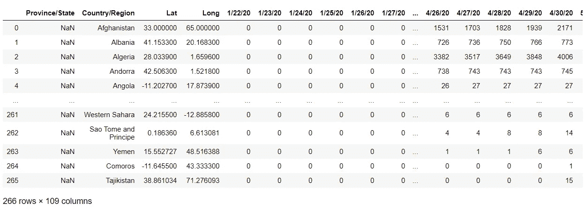

现在，我们将查看每天确诊的病例，并绘制一个图表，看看它增加了多少，目前，它正在增加或变平。“iloc”基本上是基于整数位置的索引，用于按位置选择。iloc[:，4:]表示所有行，从第 4 列开始到所有列。

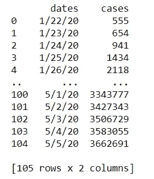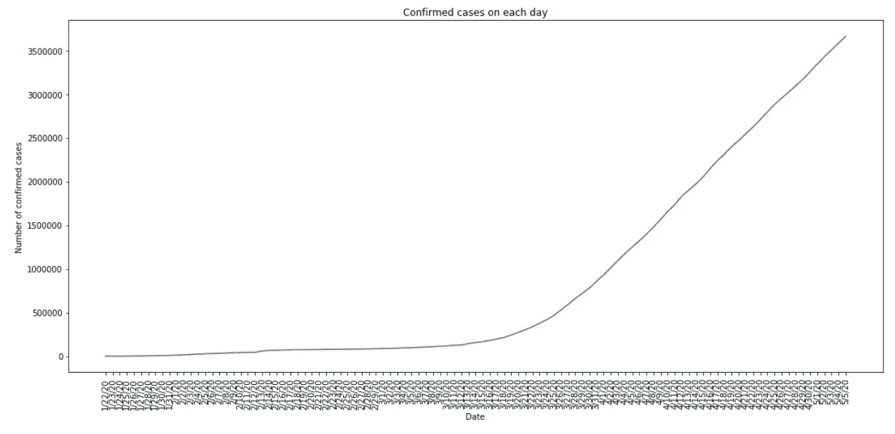

所以，我们可以看到图表每天都在呈指数增长。接下来，我们将查看从 2020 年 1 月 22 日的第一天开始，每周增加的病例总数。为此，我们必须找到每 7 天的数据，并为其创建一个表。“copy()”将创建数据集的副本，因此它不会更改为原始数据集。

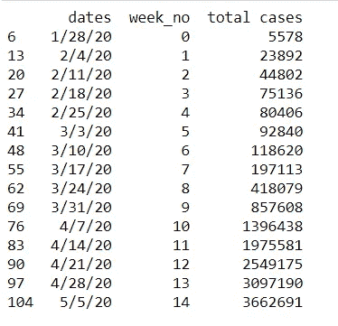

现在，我们将绘制图表，看看每周确诊病例是如何增加的。我们绘制了两个图，一个线形图和一个对数线形图。对数刻度对于绘制包含非常小的数字和非常大的数字的数据非常有用。所以我们可以很容易地看到所有的数字，而不会把小数字挤得太近。

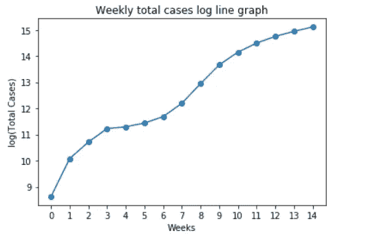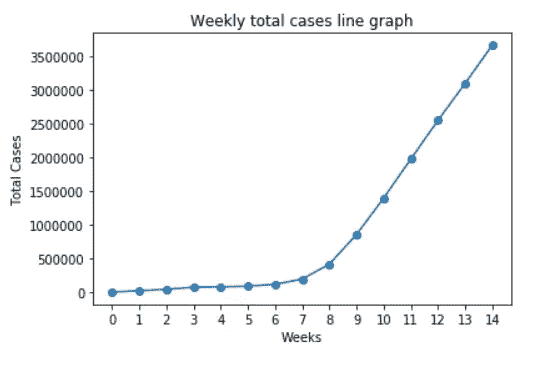

除此之外，我们将看到每周有多少新的确诊病例。我们可以从数据中看出是否达到峰值。冠状病毒的高峰期是病例数量最多的一天/一周。

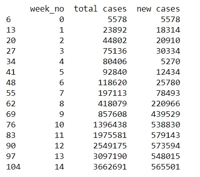

我们可以看到，这一周的病例数最低，但在那之后，病例数急剧增加。现在，我们将绘制一个柱状图来进行可视化，

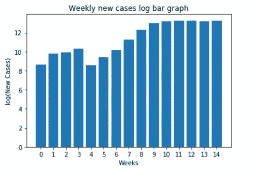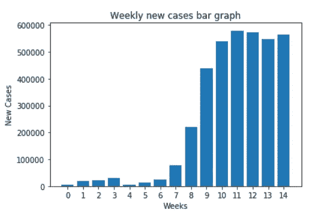

我们将对死亡数据集做同样的处理。我们创建了一个每周总死亡人数和每周新死亡人数的表格。

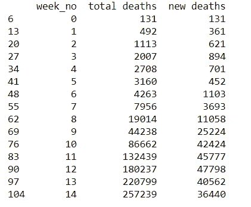

让我们绘制每周新死亡人数的折线图和对数线图。

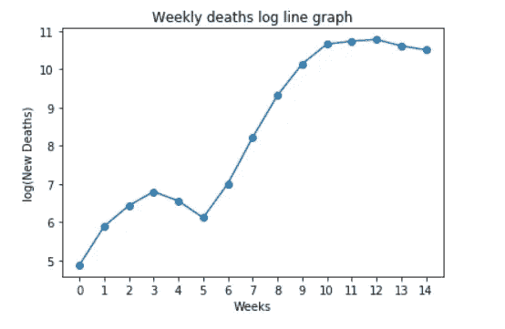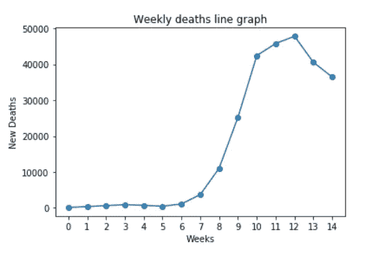

现在，我们将看到确诊病例最多的前 10 个国家。为此，我们将使用“分组”功能。“groupby”操作涉及拆分对象、应用函数和组合结果的某种组合。我们可以看到美国的病例数最高。

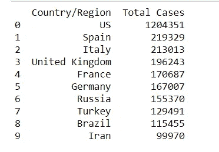

总病例数仅给出最新确诊病例，但如果我们想知道前 10 个国家的病例何时开始增加呢？为了找到答案，我们每周都会发现新的确诊病例。

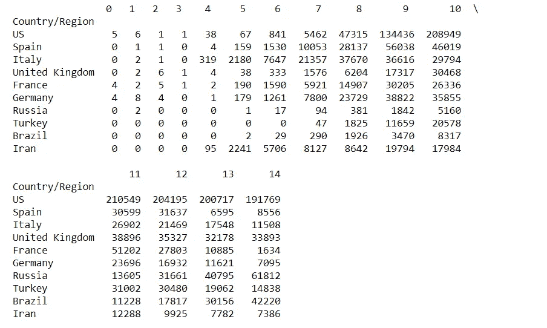

让我们绘制图表来理解每周的模式。所以在第七周之后，这些国家的新病例每周都在增加。我们可以看到，在第 14 周结束时，一些国家的新增病例大幅减少。

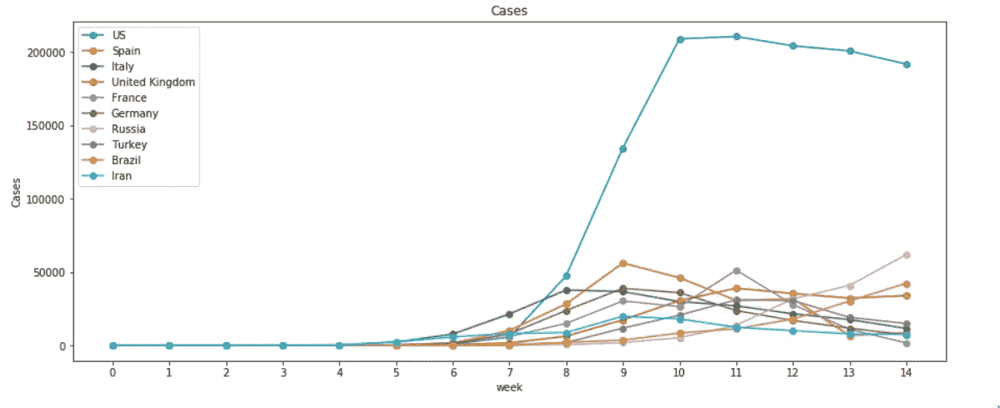

现在，我们将查看恢复的病例数据集，并找出受影响最严重的前 10 个国家中有多少人。我们将制作一个表格，列出确诊病例总数和痊愈病例总数。

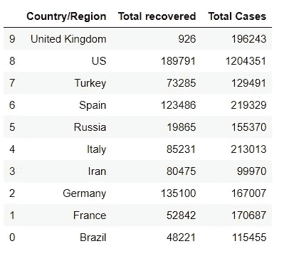

让我们来看看前 10 个受影响最严重的国家每周恢复的病例。这将告诉我们每个国家如何处理这种致命的病毒。

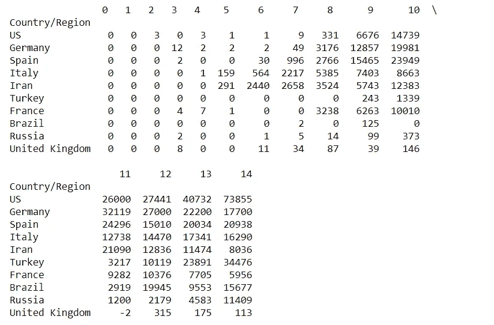

我们将绘制数据以了解每周的模式。

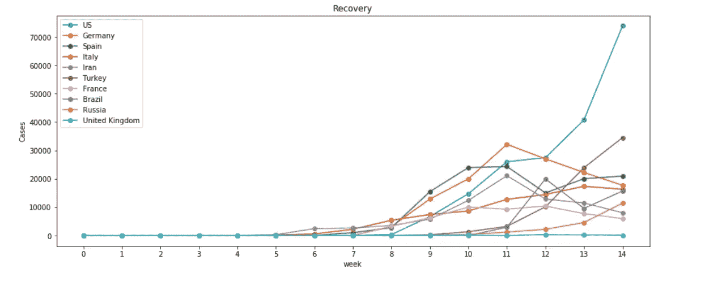

就是这样。我们已经看到了三个相同格式的不同数据集，并进行了各种分析。我们发现每天、每周都有新病例、痊愈病例和死亡病例。我们还找到了受影响最严重的国家，并根据恢复率观察他们如何处理病毒。我们使用数据可视化来显示不同类型的图表，以便更好地理解分析。

完整的代码可以在我的 GitHub 储存库中找到:[https://GitHub . com/dhruvilshah 35/Understanding-Coronavirus-using-Data-Analysis-with-Python](https://github.com/dhruvilshah35/Understanding-Coronavirus-using-Data-Analysis-with-Python)。希望你能学到新东西。如果你喜欢我的作品，请在最后鼓掌，关注我的博客并提出你的宝贵建议。谢谢你..！！