# 通过数据可视化了解新冠肺炎的影响。

> 原文：<https://medium.com/analytics-vidhya/understanding-covid-19-impact-via-data-visualizations-3a040400aaf5?source=collection_archive---------19----------------------->

*探索性数据分析。*

[冠状病毒疾病(新冠肺炎)](https://www.who.int/emergencies/diseases/novel-coronavirus-2019)是 2019 年发现的一种新毒株，此前尚未在人类中发现。

2019 新型冠状病毒(2019-nCoV)是一种病毒(更具体地说，是一种[冠状病毒](https://en.wikipedia.org/wiki/Coronavirus))，被确定为首次在中国武汉检测到的呼吸道疾病爆发的原因。现在这种病毒影响了 80 多个国家。它在人与人之间传播，但这可以通过保持良好的卫生习惯来预防。

**新冠肺炎目前在全球范围内呈指数增长，我们将在前面的文章中看到这一点。**

该数据集包含每日更新的受影响病例、死亡和康复数量的信息。请注意，这是一个时间序列数据集，因此任何一天的病例数都是累积数。

## 让我们开始吧:

首先，导入所需的库:

Python 库。

加载数据集:

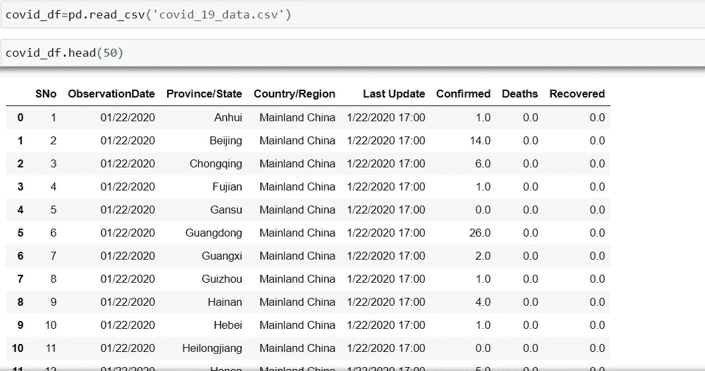

新冠肺炎数据集。

如您所见，我们有 7 列，包含各国的确诊、康复和死亡病例。

检查**空值**并检查每列的**数据类型**:

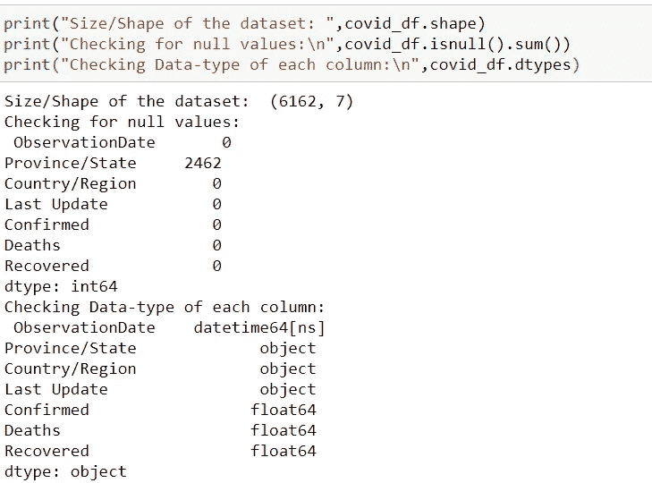

关于数据集的详细信息。

让我们从数据集中提取更多信息:

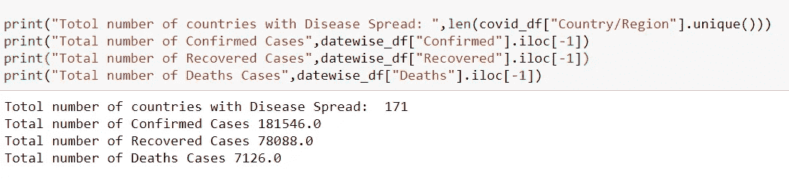

由此我们可以看到总共 171 个国家中确诊、痊愈和死亡病例的确切数字。

删除列“ **SNo** ”，因为没有用，将“ **ObservationDate** ”转换为日期时间格式:

Drop SNo 色谱柱

转换成日期时间格式。

## 日期分析:

在这里，我根据观察日期对确诊、康复和死亡病例进行了分组。

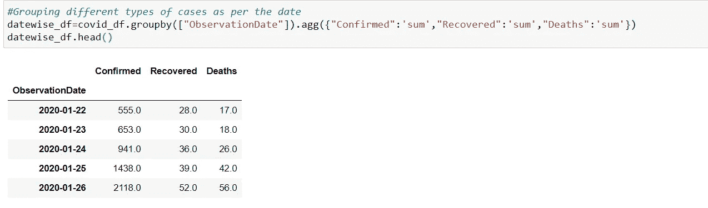

按日期分组

现在绘制曲线，查看**确诊病例、痊愈病例和死亡病例(全球)每天的增长**:

对于确诊病例:

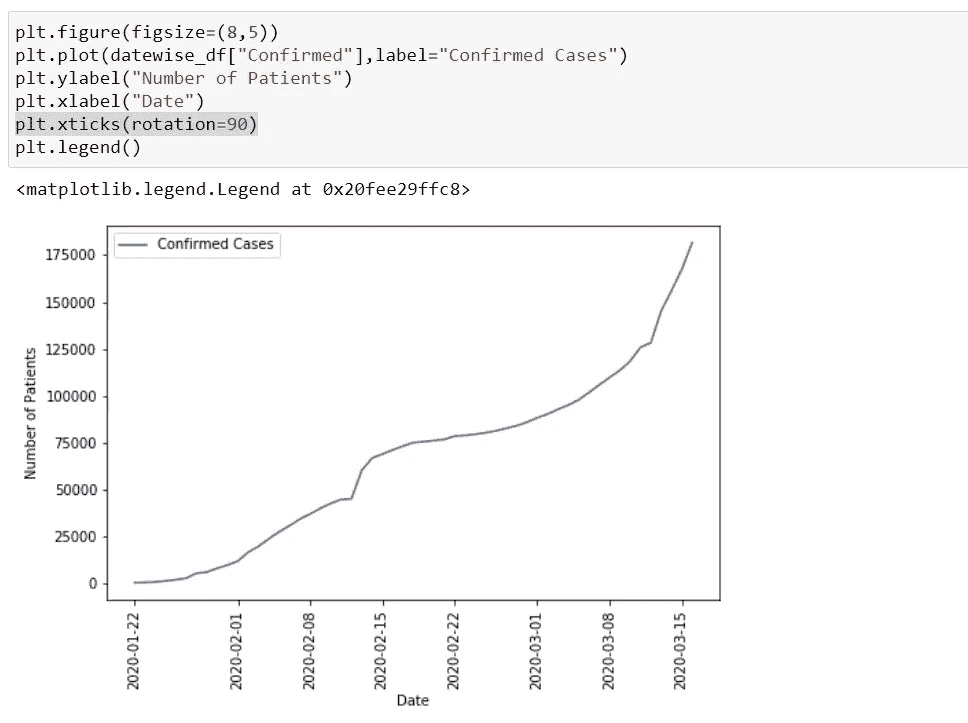

确诊病例曲线(全球)

对于恢复的案例:

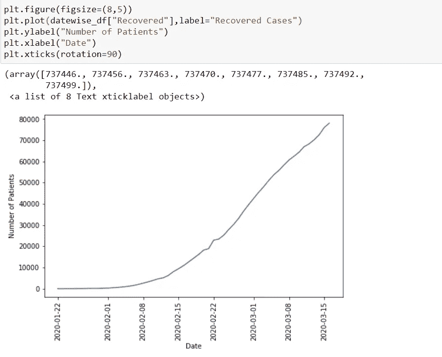

恢复案例曲线。

对于死亡病例:

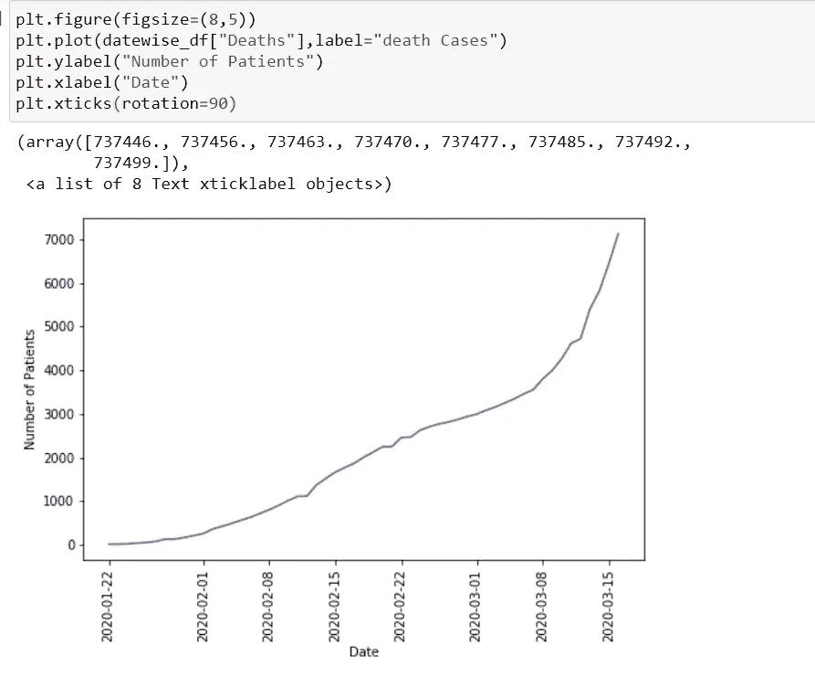

死亡案例曲线。

同时计算**死亡率**和**恢复率**(每天):

死亡率可计算为**(总** **死亡病例/总确诊病例)*100。**

同样，治愈率可计算为**(总治愈例数/总确诊例数)*100。**

让我们来看看计算死亡率和恢复率后的数据集:

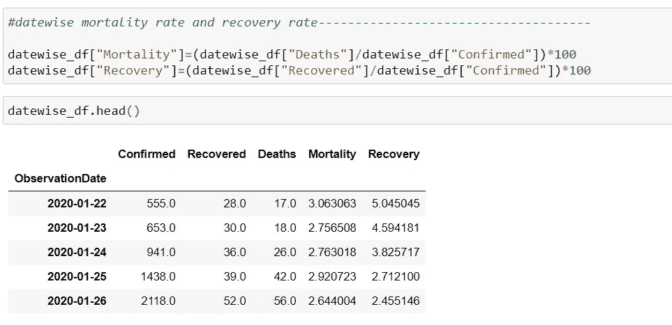

情节:

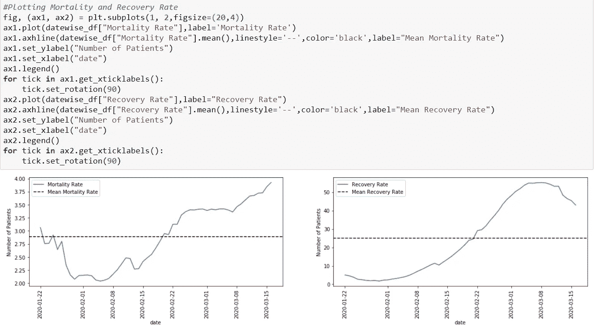

第一个显示死亡率，另一个显示恢复率。

这条虚线表示平均死亡率和恢复率。

## 国别分析:

现在，我们将按国家分析数据集:

在这里，我根据国家对不同的案例进行了分组。

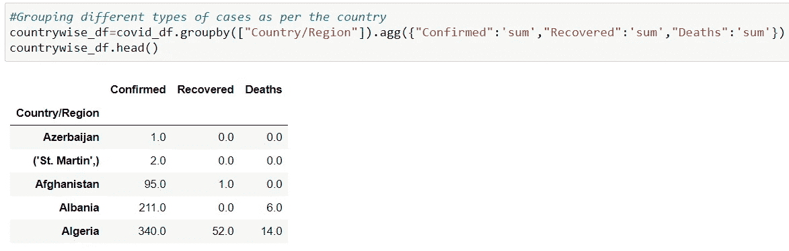

这里我做了一个函数来分析病毒对特定国家的影响，例如:

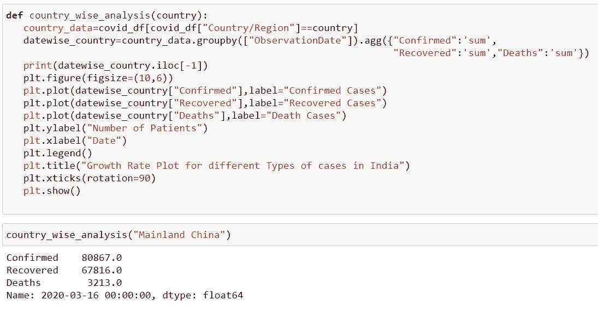

情节:

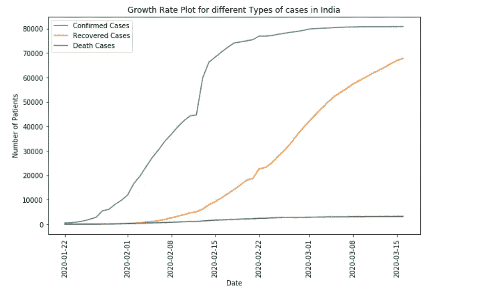

浅析 Mainland China

同样，你可以绘制印度的曲线:

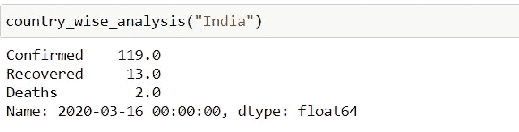

印度不同病例总数。

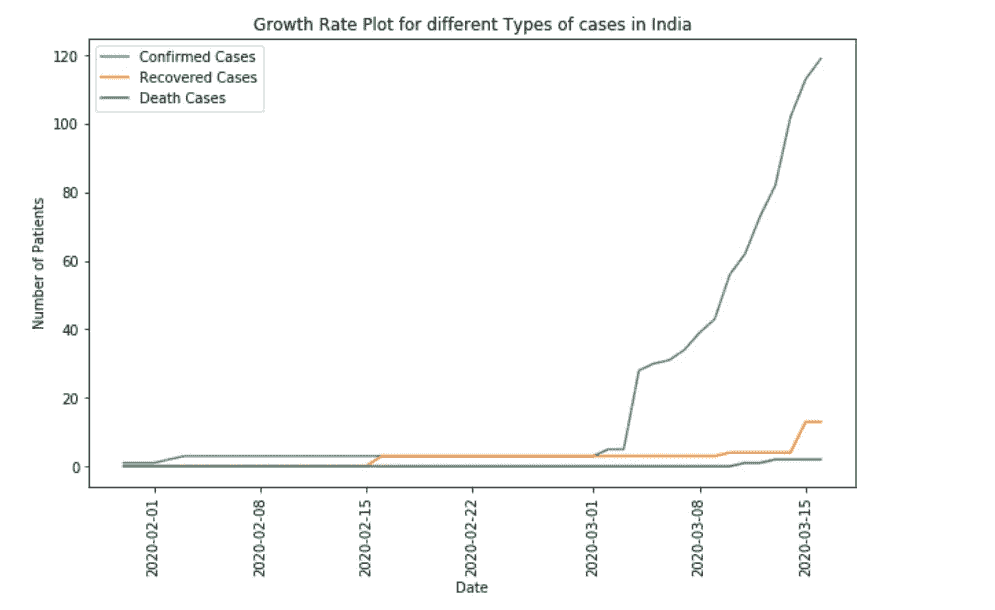

印度分析

计算国家死亡率和恢复率:

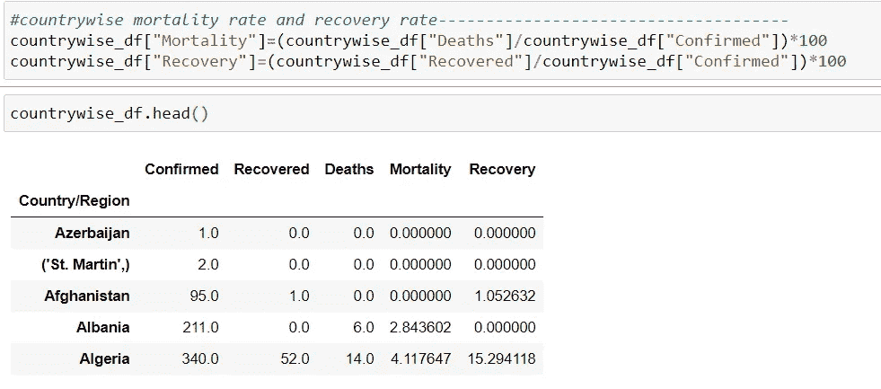

情节:

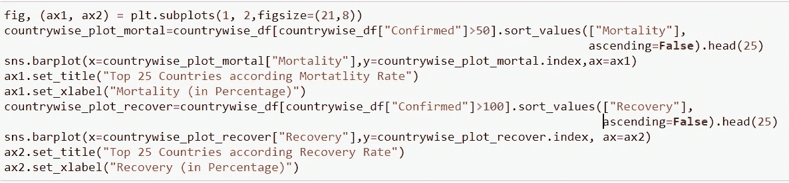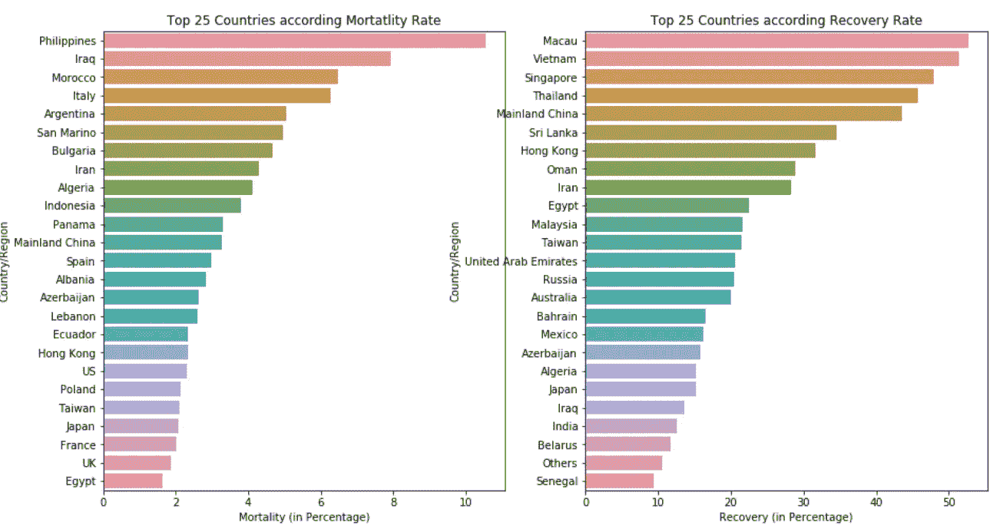

第一张图显示死亡率，另一张图显示恢复率。

## 结论:

新冠肺炎没有很高的死亡率，我们可以看到这是最积极的一点。此外，健康增长的恢复率意味着这种疾病是可以治愈的。唯一令人担忧的是感染(确诊病例)的指数式增长。

预防感染传播的标准建议包括定期洗手，咳嗽和打喷嚏时捂住口鼻，彻底煮熟肉类和鸡蛋。避免与任何有呼吸道疾病症状(如咳嗽和打喷嚏)的人密切接触。

注意安全，感谢阅读！