# 了解客户角色，进行有针对性的营销

> 原文：<https://medium.com/analytics-vidhya/understanding-customer-persona-for-targeted-marketing-c38652d6f1bb?source=collection_archive---------7----------------------->

(关于代码的更多细节，请查看 Github 上的 RMD。)

*由* [*钟*](https://www.linkedin.com/in/sheng-rachel-zhong/)*[*【妮莎】*](https://www.linkedin.com/in/nishatantivess/)*[*谢*](https://www.linkedin.com/in/yvonne-xie-550209105/)*[*明玉顾*](https://www.linkedin.com/in/mingyu05/) *，以及* [*有田尚*](https://www.linkedin.com/in/aritrashome/?lipi=urn%3Ali%3Apage%3Ad_flagship3_pulse_read%3BkW18J8FcTuin5LQv%2F4iMDQ%3D%3D)***

****

> ****我不想从一次销售中获得全部利润——我想把机器做得如此之好，以至于农民和他的儿子们会一次又一次地回来购买更多——麦考密克机器****

**Cyrus McCormick 是第一个成功执行以客户为中心的营销和广告战略的公认的美国商人。我们能从 19 世纪的麦考密克的策略中学到什么，并用今天的技术和知识扩充它？关键是先了解客户。**

**乘着数据科学浪潮的营销人员跳入速效的黑盒解决方案，以估计和预测客户流失。一旦你有了一份最有可能离开你的服务的客户名单，管道或路线图就会在瞄准这些客户的过程中出现缺口。我如何瞄准他们？我如何赢回他们？它们对我有多有利？**

# *****我们如何更好地了解我们的客户群，并以此来策划更好、更有针对性的营销内容？*****

**顾客表现出不同的购买行为——一些人定期购买相对便宜的商品，而另一些人偶尔光顾，但会下大宗订单。因此，了解这些行为对于更精确地定位细分市场非常重要。特别是，我们希望通过这个数据集实现两个目标。首先，我们希望增加客户支出和他们的访问频率，以增加客户的终身价值，从而实现长期收入最大化。第二，我们希望识别那些有流失风险但对我们有很高价值的客户，这样我们就可以通过个性化的营销内容提供激励。这一点很重要，因为获得一个新客户的成本比留住一个客户的成本高得多(5 倍)。营销人员可能会围绕客户洞察提出如下问题:**

1.  **它们对我有多大价值？**
2.  **他们会不再回来吗？**
3.  **它们多频繁？他们最后一次购买是什么时候？**
4.  **退货有什么模式吗？**
5.  **它们表现出什么样的季节模式？**
6.  **有没有我错过/参与得更好的高价值细分市场？**
7.  **我如何将我的顾客推向更高的消费层次？**

**我们想回答这些问题以及更多的问题。通过了解客户、他们的驱动力以及他们来你的公司(无论是餐馆还是你的网站)背后的因素，就可以创造商业价值。为了解决这些问题，我们开始寻找一个能让我们开发客户细分的数据集。下面是概述我们任务目标的视觉描述。**

**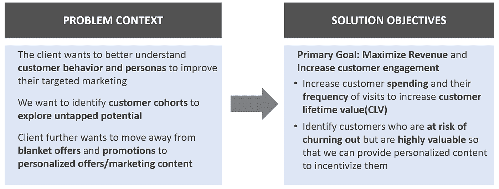**

> **我们相信上帝，所有其他人都必须带来数据——W·爱德华兹·戴明**

**我们在 [UCI 机器学习](https://archive.ics.uci.edu/ml/datasets/online+retail#)仓库中发现了一个数据集，其中有 50 万条顾客在零售商网站上购买家装产品的交易记录。该网站将该数据集描述为-**

***“这是一个跨国数据集，包含一家总部位于英国的注册无店铺在线零售商在 2010 年 1 月 12 日至 2011 年 9 月 12 日之间发生的所有交易。该公司主要销售独特的适合各种场合的礼品。这家公司的许多客户都是批发商。***

**我们有交易的日期和时间戳、产品的价格、数量、产品的简要描述以及客户的居住国。下面是来自零售商的原始数据的快照。**

**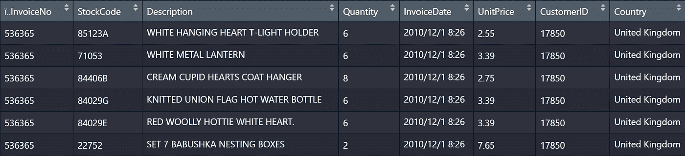**

# **让我们现在动手清理数据**

*   **删除重复项—有些行的每一列都包含相同的数据，因此我们删除了它们**
*   **删除缺少客户 ID 的交易—该项目旨在分析客户，只有当特定客户在购物时登录(不是作为客人)时才有可能。所有“以客人身份结账”的客户都有一个空白的客户 ID，并已从该分析中删除。移除这些交易还会移除带有糟糕描述的项目，如“？?", "?？缺失”、“成套出售”等。**
*   **有字母的股票代码——一些交易有字母作为他们的股票(不到 1%的销售额)。这些包括折扣、银行费用、手册和邮费。我们本来可以保留这些交易，并相应地标记它们，但对于不到百分之一的交易，没有必要经历这些复杂的事情**
*   **将 date_time 列从“字符”转换为“POSIXct”**
*   **添加了一个名为收入(数量 x 单价)的列**

**我们要解决的其他异常情况有**

*   **负数量—我们发现，对于数量为负的交易，也会有数量为正的类似交易。因此，当客户退回之前购买的商品时，就会出现负数量**
*   **单价要么很高，要么很低——某些物品如卷笔刀、铅笔的价格低于一欧元。零价格物品可以是免费物品(需要以后再探讨)。单价非常高的物品有古董套、厨柜等。**

# **现在是时候在客户层面创建一个分析数据集了，其中的指标将进一步帮助我们进行细分**

**我们列出了对客户进行分类的所有可能变量，如下所示:**

*   **交易总数(有效/未返回)—唯一发票总数**
*   **%退货交易—(数量为< 0)/ (Total Count of InvoiceNumber)**
*   **Average inter purchase interval — Average number of days between a customer’s transaction**
*   **Recency — Days between the most recent purchase and the Max InvoiceData for the whole dataset**
*   **Total Revenue — Sum of Revenue for each customer**
*   **Units purchased — Sum of Quantity for each customer**

**After the transformation, we have 4236 unique customers who satisfy the following requirements:**

*   **With the unit purchase > 0 的 InvoiceNumber 的总计数:如果客户有负的单位购买量，他已经在时间范围内退货。这可能会使我们的预测有偏差，因为我们错过了根据购买行动**
*   **with return _ quantity _ percent< 100: For those who were not satisfied with some of their purchases and returned it within the timeframe.**
*   **With TotalTransaction >1:我们只考虑交易次数超过一次的客户，因为这时我们有足够的数据对客户进行分类，并了解他/她的角色**

**对于客户级别的数据，我们将根据上述一些变量执行聚类(对于有两笔以上交易的客户)。聚类后，我们将通过识别每个聚类的关键特征来描述聚类，并训练分类模型来为每个新客户分配一个聚类(部署)。**

> ****数据是新的石油吗？不，数据是新土壤****

**用 David McCandness 的话说，在 ggplot2 的朋友的帮助下，我们开始在我们的土地上建立视觉效果或种植植物。跨月份的交易和购买数量—不同月份的总交易和总数量均有差异，均在 11 月达到峰值**

**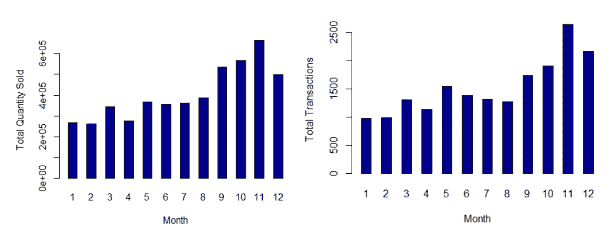****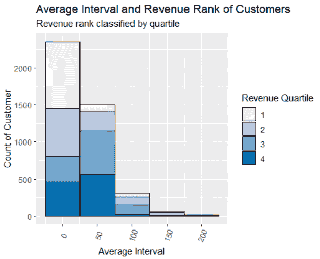**

**客户更有可能在交易之间有短暂的时间间隔。为了探究不同平均时间间隔的客户的不同支出水平，变量*总收入*被分成四个四分位数(第一个四分位数是支出最多的客户，第四个四分位数是支出最少的客户)。在分析中加入这一变量后，很明显，交易间隔越短，客户越有可能成为大买家。这很有可能是因为许多旅行都是在网站上进行的。**

**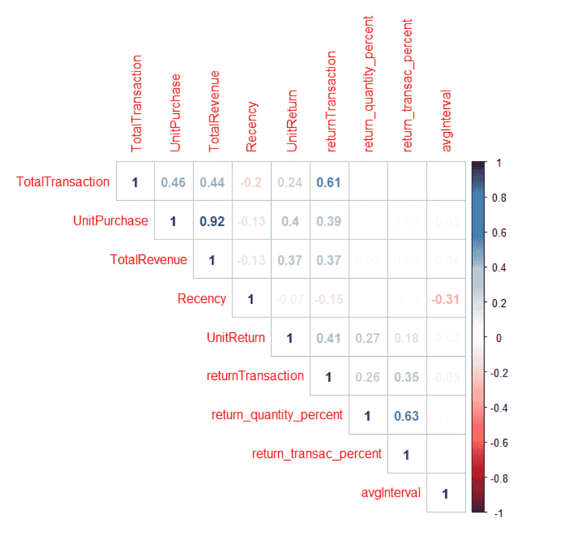**

**使用客户层面的数据绘制跨变量的相关性图——我们看到单位购买量与总收入、总交易量和退货交易量高度相关。因此，我们不会在聚类中同时使用具有高度相关性的变量对。关联图将帮助我们选择变量，这些变量将有助于我们对新客户进行细分和分类。**

# *****现在让我们开始将客户分组*****

**但是首先，我们为什么要使用集群？**

**首先，为了更好地了解 4，236 名客户，我们需要根据某些特征对他们进行细分。我们希望根据客户过去的购买行为对他们进行描述，并利用这些信息通过提供个性化的促销和优惠来提高 CLV 和减少流失。我们希望确定的细分市场包括不常光顾的客户和高消费客户。**

**使用不同变量的聚类—无监督学习**

**基于不同变量的相关性，我们选择 3 组不同的变量作为输入。对于每个集合，我们使用剪影和 WSS 来确定 k 均值聚类的最佳 k 值。有时这两种方法不会产生相同的最佳 k，因此我们根据结果尝试不同的 k 值:**

**1.输入变量:*unit purchase*+*total transaction*+*avg interval*+*return _ quantity _ percent***

**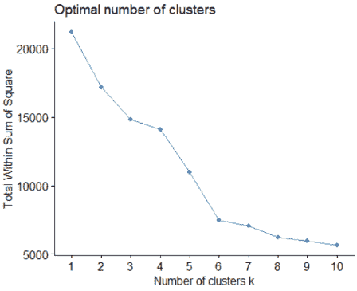**

**使用 WSS 选择最佳 k，从图中我们选择 6 个集群，因为这是肘状断裂的地方。试用过的具有多个 k 的其他输入组合如下:**

**2.输入变量:*总收入* + *最近收益* + *单位回报*+*avg interval*+*单位采购***

**3.输入变量:*总收入* + *单位回报* + *单位间隔* + *单位采购***

**这些迭代被拒绝，因为每个集群之间的差异对于高效部署来说不够明显。**

# ****我们如何利用这些细分市场来理解客户角色？****

**具有六个聚类的最终 k 均值的输出如下**

**前两个集群包含不到 100 个客户。深入研究它们的属性，我们看到聚类 1 由有大量退货交易的客户组成。平均来说，顾客会有 2%的退货交易。然而，这个部分平均 50%的时间返回一个项目。我们将此视为微分段。**

**聚类 2 由每笔交易购买了大量商品的客户组成。在此期间，顾客平均购买约 1200 件。然而，该部门购买了大约 60，000 件商品。我们把这个微细分市场当做“批发商”。**

**然后，我们决定删除这两个部分，并转向其他四个部分。此外，我们删除了“ *return_txn_percen* t ”,因为大多数其他客户群的退货交易百分比相似，因此它不会影响**

**对于我们开发的其他人物角色，我们添加了一些演示文稿中的视觉效果，以便更好地描绘画面。我们还命名了这些配置文件，以便能够无缝地引用它们，用于未来的营销目的。**

## *****需要赢回来*** —以前那段很活跃，现在已经半年多没回来了**

**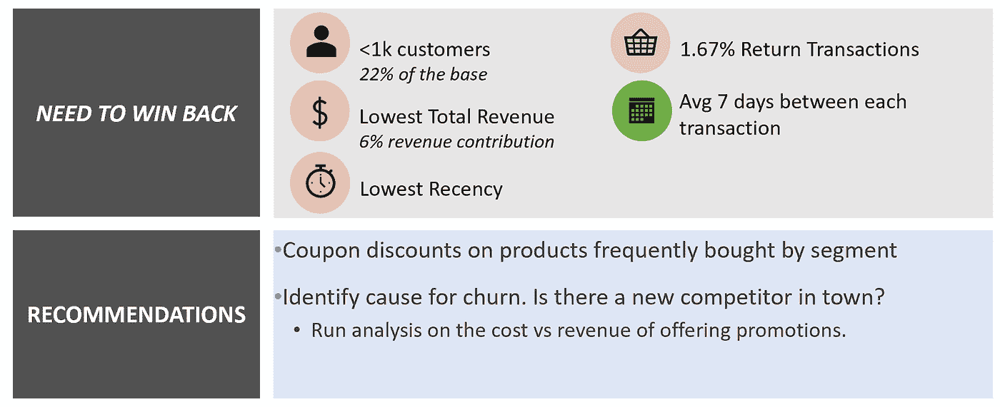**

## **零星的游客——这些人很少和我们一起购物——但是他们来的时候会花很多钱**

**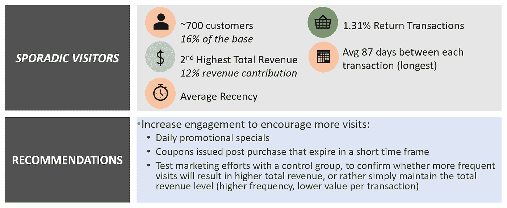**

## **高端客户——活跃且喜欢昂贵商品的客户**

**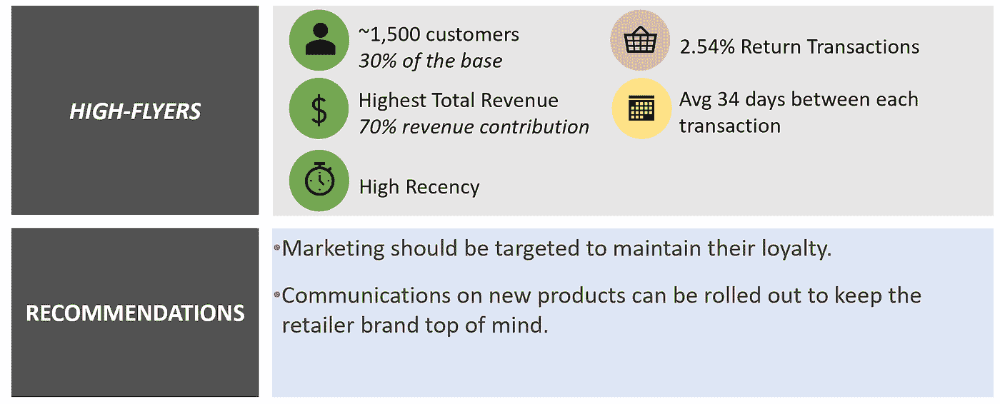**

## **普通人群——由经常购物但购买贵重物品的人群组成的细分市场**

**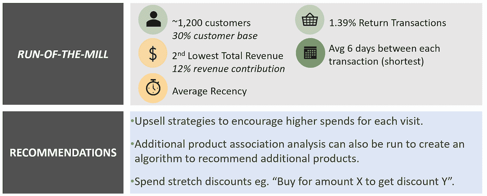**

**从下图中我们可以看到“*需要赢回*”和“*一般*”客户在*平均 IPI* 和*收入*贡献方面非常相似。这两个集群的唯一区别是属性*Days _ since _ last _ purchase*，该属性对于“*需要赢回*”段非常重要。我们还看到“*高飞者”*都集中在图的左上角——*平均 IPI* (常客)少而收入*高*。零星的是那些对收入贡献一般但 IPI 高的(不频繁)。**

**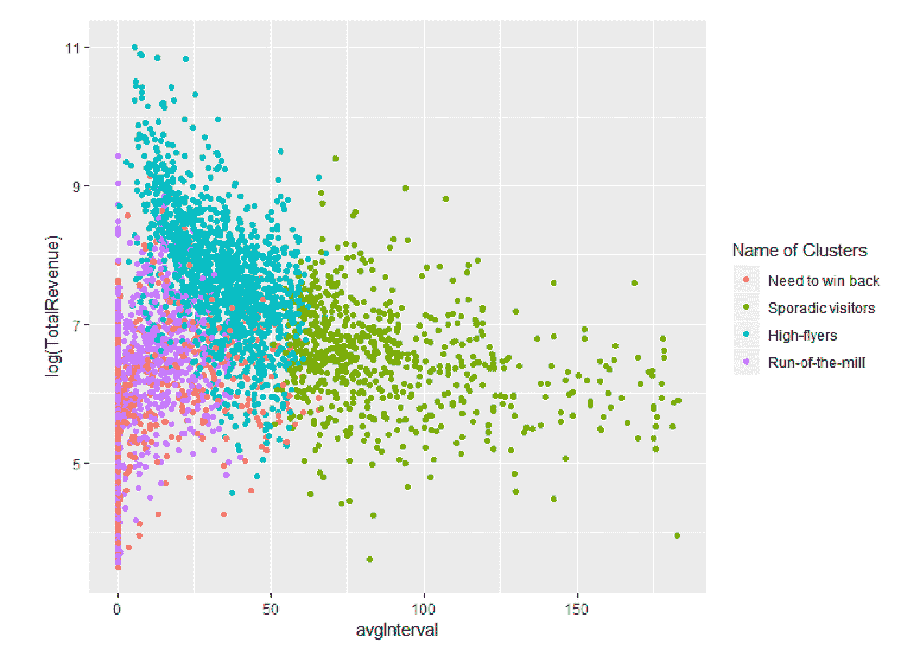****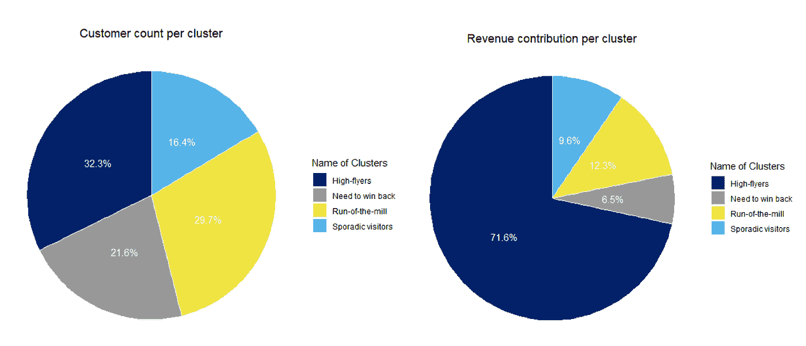**

# **实施解决方案并展望未来—下一步是什么？**

**为了扩展和实施该解决方案，我们必须制定一个部署计划。自动将每个新客户(有 2 笔或更多交易)标记到预定义配置文件的模型。**

**对于前两个聚类或微细分中的客户(返回大量购买商品的客户和批发商)，我们采用基于规则的细分方法，而不是 ML 分类模型。这背后的原因是他们的基础非常小，对于分类器来说，将客户标记为低代表性的人物角色将是困难的。**

1.  **如果顾客有超过 40%的交易是退货——将他们标记为有很多退货交易的顾客**
2.  **如果顾客在一年内购买了超过 40，000 件商品，将他们标记为批发商**

**为了将人物角色(需要赢回、零星的、优秀的和一般的)分类并分配给其他客户，我们训练了一个分类器。**

**我们用不同的分类模型(即逻辑和随机森林)来训练分类器。为该模型选择的变量基于我们对每个集群的分析。我们可以通过查看他们的平均*收入*、平均 *IPI* 和他们的*最近*(自上次购买后的天数)来定义每个集群。**

**多项式逻辑分类器的样本外预测输出给出了 95%的准确度，而在 RF 为 94%。在集群级别上，我们看到在分配集群时有一些错误分类率(*高期望*和*一般*)。**

**理想情况下，我们会尝试更多的分类器，并进一步对它们进行压力测试——交叉验证，定期检查特定节奏后的集群分配和行为。应该跟踪客户群之间的转移，并且可以用下面的示例来可视化。**

**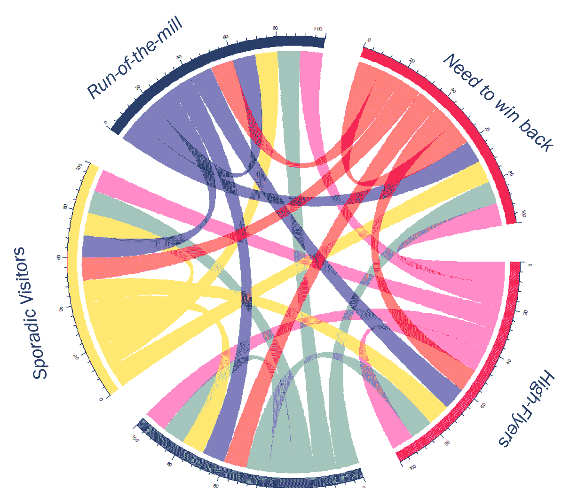**

# **结论**

**对于这家家装零售商，我们利用原始交易级别的数据集来开发客户级别的见解和策略。我们还将整个客户群划分为不同的群组，销售和营销团队可以利用这些群组来个性化他们提高收入和转化率的努力。为了向未来的客户扩展这一解决方案，我们开发了一个模型，可以在未来以固定的节奏(例如每三个月)继续运行，以创建客户群。**

****参考文献****

**Rohit Despande 的《以客户为中心》(哈佛商学院)**

**福斯特·普罗沃斯特和汤姆·福塞特的《商业数据科学》**

**https://archive.ics.uci.edu/ml/datasets/online+retail UCI 机器学习知识库数据集—**

**Istock.com 特色图片。**