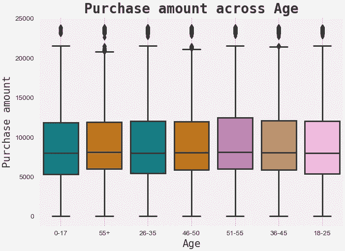

# 了解顾客在黑色星期五的行为

> 原文：<https://medium.com/analytics-vidhya/understanding-customers-behaviour-during-black-friday-2cc2d644d7a?source=collection_archive---------8----------------------->

## 使用机器学习预测销售。

在这个项目中，我们将使用年龄、性别、婚姻状况等各种特征来预测顾客在黑色星期五会花多少钱。我们将要使用的数据集是来自 Kaggle 的黑色星期五数据集，它包含大约 550068 行和 12 个特征，可以在这里[下载](https://www.kaggle.com/sdolezel/black-friday)。我们将遵循从数据收集到模型部署的数据科学生命周期的所有步骤。

> web app:【https://black-friday-sales-prediction.herokuapp.com/ 


由[马库斯·斯皮斯克](https://unsplash.com/@markusspiske?utm_source=medium&utm_medium=referral)在 [Unsplash](https://unsplash.com?utm_source=medium&utm_medium=referral) 上拍摄

## 动机

预测客户行为是机器学习在金融、销售、营销等各个领域最受欢迎的应用之一。通过构建这样的预测模型，我们可以预测所采取的决策对我们组织发展的影响。

## 理解问题

在我们开始之前，重要的是我们理解这个问题，以便我们能够容易地选择可以应用于从数据集学习的算法类型。数据集包含我们必须预测哪个是从属特征“购买”的标签。此外，该特征的数据类型是连续的。所以我们的问题是一个**监督回归**类型。

## 步骤 0:导入库和数据集

所有的标准库，如 numpy、pandas、matplotlib 和 seaborn 都是在这一步导入的。我们使用 numpy 进行线性代数运算，pandas 使用数据框，matplotlib 和 seaborn 绘制图形。使用 pandas 命令 *read_csv()* 导入数据集。

```
*# Import libraries*
import pandas as pd
import numpy as np
import matplotlib.pyplot as plt
import seaborn as sns*# Importing dataset*
train = pd.read_csv('train.csv')
```

## 步骤 1:描述性分析

```
*# Preview dataset*
train.head()
```


数据集预览

```
*# Dataset dimensions - (rows, columns)*
print('Rows: {} Columns:{}'.format(train.shape[0],train.shape[1]))**Output:**
Rows: 550068 Columns: 12*# Features data-type*
train.info()**Output:** <class 'pandas.core.frame.DataFrame'>
RangeIndex: 550068 entries, 0 to 550067
Data columns (total 12 columns):
 #   Column                      Non-Null Count   Dtype  
---  ------                      --------------   -----  
 0   User_ID                     550068 non-null  int64  
 1   Product_ID                  550068 non-null  object 
 2   Gender                      550068 non-null  object 
 3   Age                         550068 non-null  object 
 4   Occupation                  550068 non-null  int64  
 5   City_Category               550068 non-null  object 
 6   Stay_In_Current_City_Years  550068 non-null  object 
 7   Marital_Status              550068 non-null  int64  
 8   Product_Category_1          550068 non-null  int64  
 9   Product_Category_2          376430 non-null  float64
 10  Product_Category_3          166821 non-null  float64
 11  Purchase                    550068 non-null  int64  
dtypes: float64(2), int64(5), object(5)
memory usage: 50.4+ MB*# Statistical summary*
train.describe().T
```


数据集描述

```
*# Checking for Null values*
round((train.isnull().sum()/train.shape[0])*100,2).astype(str)+ ' %'**Output:** User_ID                         0.0 %
Product_ID                      0.0 %
Gender                          0.0 %
Age                             0.0 %
Occupation                      0.0 %
City_Category                   0.0 %
Stay_In_Current_City_Years      0.0 %
Marital_Status                  0.0 %
Product_Category_1              0.0 %
Product_Category_2            31.57 %
Product_Category_3            69.67 %
Purchase                        0.0 %
dtype: object*# Checking the counts of unique values*
round((train['Age'].value_counts(normalize = True).mul(100)), 2).astype(str) + ' %'**Output:** 26-35    39.92 %
36-45     20.0 %
18-25    18.12 %
46-50     8.31 %
51-55      7.0 %
55+       3.91 %
0-17      2.75 %
Name: Age, dtype: object*# Checking the counts of unique values*
round((train['Stay_In_Current_City_Years'].value_counts(normalize = True).mul(100)), 2).astype(str) + ' %'**Output:** 1     35.24 %
2     18.51 %
3     17.32 %
4+     15.4 %
0     13.53 %
Name: Stay_In_Current_City_Years, dtype: object
```

> **观察:**
> 
> 1.特征‘Product _ Category _ 2’包含 31.57%可以估算的空值，而‘Product _ Category _ 3’包含 69.67%的空值，因此我们可以删除此特征。
> 
> 2.特征“年龄”和“停留在当前城市年数”包含一些值，这些值中包含需要替换的“+”。

## 步骤 2:探索性数据分析

***2.1 单因素分析:***


***2.2 双变量分析:***



***2.3 多元分析:***


> **观察:**
> 
> 1.从性别分布图中可以观察到一个有趣的现象，在黑色星期五购物的女性人数少于男性。
> 
> 2.从关联热图中，我们可以观察到从属特征“购买”与“产品 _ 类别 _1”和“产品 _ 类别 _2”高度相关。

## 步骤 3:数据预处理

“年龄”和“停留当前城市年数”中的“+”值需要固定，这可以通过使用*来完成。替换()*命令。

```
train['Age'] = train['Age'].apply(lambda x:str(x).replace('55+', '55'))train['Stay_In_Current_City_Years'] = train['Stay_In_Current_City_Years'].apply(lambda x : str(x).replace('4+', '4'))train['Stay_In_Current_City_Years'] = train['Stay_In_Current_City_Years'].astype('int')
```

功能“用户标识”和“产品标识”不相关，需要删除这些功能。功能“Product_Category_3”包含 69.67 %的空值，因此也需要删除。

```
train.drop(['User_ID', 'Product_ID', 'Product_Category_3'], axis = 1, inplace = True)
```

“年龄”、“性别”和“城市类别”是我们数据集中的离散对象特征，需要对其进行编码以便进一步使用。这可以使用 sklearn 预处理库中的**标签编码器**来完成。

```
from sklearn.preprocessing import LabelEncoderlabel_encoder_gender = LabelEncoder()
train['Gender'] = label_encoder_gender.fit_transform(train['Gender'])

label_encoder_age = LabelEncoder() 
train['Age'] = label_encoder_age.fit_transform(train['Age'])label_encoder_city = LabelEncoder()
train['City_Category'] = label_encoder_city.fit_transform(train['City_Category'])
```

功能“Product_Category_2”包含 31.57%的空值，可以通过使用功能的中值填充它们来轻松修复。

```
train['Product_Category_2'].fillna(train['Product_Category_2'].median(), inplace = True)
```

然后，数据集被分成包含所有独立功能的 X 和包含相关功能“购买”的 Y。

```
X = train.drop("Purchase", axis = 1)
Y = train["Purchase"]
```

我们可以通过执行**特征选择**来处理多重共线性的诅咒。使用*提取树回归器*可以很容易地找到特征的重要性。它告诉我们，“性别”、“城市类别”和“婚姻状况”是数据集中被丢弃的最不重要的特征。

```
from sklearn.ensemble import ExtraTreesRegressor 
selector = ExtraTreesRegressor()selector.fit(X, Y)
feature_imp = selector.feature_importances_for index, val in enumerate(feature_imp):
    print(index, round((val * 100), 2))**Output:**0 0.54
1 2.16
2 5.03
3 0.76
4 2.7
5 0.63
6 75.79
7 12.37X.drop(['Gender', 'City_Category', 'Marital_Status'], axis = 1, inplace = True)
```

为了有效地建立模型，我们可以使用**特征缩放**来标准化数据集。这可以用 sklearn 预处理库中的 *StandardScaler()* 来完成。

```
from sklearn.preprocessing import StandardScaler
scaler = StandardScaler()for col in X.columns:
  X[col] = scaler.fit_transform(X[col].values.reshape(-1, 1))
```

使用 *train_test_split()* 命令将数据集分割成比例为 80:20 的训练数据和测试数据。

```
from sklearn.model_selection import train_test_split
X_train, X_test, Y_train, Y_test = train_test_split(X, Y, test_size = 0.2, random_state = 42)print("X_train shape:", X_train.shape)
print("X_test shape:", X_test.shape)
print("Y_train shape:", Y_train.shape)
print("Y_test shape:", Y_test.shape)**Output:** 
X_train shape: (440054, 5) 
X_test shape: (110014, 5) 
Y_train shape: (440054,) 
Y_test shape: (110014,)
```

## 步骤 4:数据建模

极端梯度推进回归器:

```
from xgboost import XGBRegressor 
xgb = XGBRegressor(random_state = 42)

xgb.fit(X_train, Y_train)
Y_pred_xgb = xgb.predict(X_test)
```

> 理解算法:

极端梯度推进或 XGBoost 回归器是一种集成学习技术，其中按顺序构建树，使得每棵树从其前任学习残差。XGBoost 背后的基本思想是，我们构建一个模型，对参数和特性重要性进行假设。然后，我们利用这些结论建立一个更好的模型，从前人的错误中学习，并试图减少它。


[图像信用](/ml-research-lab/boosting-ensemble-meta-algorithm-for-reducing-bias-5b8bfdce281)

XGBoost 有许多可以在训练前设置的调优参数。最常见的有 learning_rate、max_depth、subsample、colsample_bytree、n_estimators、objective 和正则化参数，如 gamma、alpha、lambda。学习率定义步长，max_depth 确定允许每棵树生长多深，subsample 是每棵树使用的样本的百分比，colsample_bytree 定义特征的数量，n_estimators 是树的数量，objective 确定损失函数。Gamma 控制给定节点是否会根据拆分后预期的损失减少量进行拆分。α控制 L1 正则化，λ控制 L2 正则化。

XGBoost 是一种流行的梯度提升方法，这是由于它的一些功能，如防止过度拟合的正则化、处理丢失值的稀疏数据、用于更快计算的并行学习以及用于优化硬件使用的缓存感知。由于其速度和出色的性能，它是竞赛和黑客马拉松中最受欢迎的建模算法之一。

## 第五步:模型评估

为了评估该模型，我们将使用两个指标，均方根误差(RMSE)和 R 平方得分(r2 得分)。RMSE 是误差方差的平方根。RMSE 值越低，模型越好。R 平方是数据与拟合回归线接近程度的统计度量。其值范围从 0 到 1，值越高，模型越好。R2 评分通常用于比较各种预测模型。

```
from sklearn.metrics import mean_squared_error
from sklearn.metrics import r2_scoreprint("XGB regression:")
print("RMSE:",np.sqrt(mean_squared_error(Y_test, Y_pred_xgb)))
print("R2 score:", r2_score(Y_test, Y_pred_xgb))**Output:**
XGB regression:  
RMSE: 3024.8703086442342 
R2 score: 0.6358443502285505
```

## 步骤 6:超参数调整

每个机器学习模型的核心都有一个数学模型，其中包含许多需要从数据中学习的参数。超参数是一种特殊的参数，它不能从数据中学习，并且在训练开始之前是固定的。在这一步中，我们将为我们的模型选择正确的超参数，这将为我们提供更好的预测。

可以使用 RandomizedSearchCV 或 GridSearchCV 来调整超参数。我们将对这个数据集使用 RandomizedSearchCV。RandomziedSearchCV 通过随机搜索找到最佳超参数，避免不必要的计算。

```
from sklearn.model_selection import RandomizedSearchCVmax_depth = [int(x) for x in np.linspace(start = 5, stop = 20, num = 15)]
learning_rate = ['0.01', '0.05', '0.1', '0.25', '0.5', '0.75', '1.0']
min_child_weight = [int(x) for x in np.linspace(start = 45, stop = 70, num = 15)]params = {
"learning_rate"    : learning_rate,
"max_depth"        : max_depth,
"min_child_weight" : min_child_weight,
"gamma"            : [0.0, 0.1, 0.2 , 0.3, 0.4],
"colsample_bytree" : [0.3, 0.4, 0.5 , 0.7]
}xgb_tune = XGBRegressor(random_state = 42)xgb_cv = RandomizedSearchCV(xgb_tune, param_distributions = params, cv = 5, verbose = 0, random_state = 42)xgb_cv.fit(X_train, Y_train)xgb_cv.best_score_
**Output:** 0.6512707227919969xgb_cv.best_params_
**Output:**
{'colsample_bytree': 0.7,  'gamma': 0.3,  'learning_rate': '1.0',  'max_depth': 11,  'min_child_weight': 66}
```

我们使用 RadomizedSearchCV 来查找参数“learning_rate”、“max_depth”、“colsample_bytree”、“gamma”和“min_child_weight”的最佳值。

```
xgb_best = XGBRegressor(colsample_bytree = 0.7, gamma = 0.3, learning_rate = 1.0, max_depth = 11, min_child_weight = 66, verbosity = 0, random_state = 42)xgb_best.fit(X_train, Y_train)Y_pred_xgb_best = xgb_best.predict(X_test)print("XGB regression: ") print("RMSE:",np.sqrt(mean_squared_error(Y_test, Y_pred_xgb_best))) print("R2 score:", r2_score(Y_test, Y_pred_xgb_best))**Output:** XGB regression:  
RMSE: 2985.7374358000807 
R2 score: 0.6452055961121277
```

在超参数调整 xgboost 回归器后，我们发现最佳 RMSE 值为 2985，R2 分数为 0.64。

## 步骤 7:模型部署

为了部署我们的模型，我们将首先使用 **Flask** 微框架构建一个 web 应用程序。这个应用程序可以使用 **Heroku** 部署到网络上。Heroku 是一个平台即服务(PaaS ),使开发人员能够完全在云中构建、运行和操作应用程序。申请发现[这里](https://black-friday-sales-prediction.herokuapp.com/)。


Heroku 上部署的 Flask WebApp

## 未来工作:

*   我们有一个足够大的数据集，所以我们可以使用人工神经网络等神经网络来建立一个可以产生更好性能的模型。

**Github 库:**

[](https://github.com/Aditya-Mankar/Black-Friday-Sales-Prediction) [## aditya-Mankar/黑色星期五-销售-预测

### 在这个项目中，我们将建立一个回归模型来预测黑色星期五数据集

github.com](https://github.com/Aditya-Mankar/Black-Friday-Sales-Prediction)