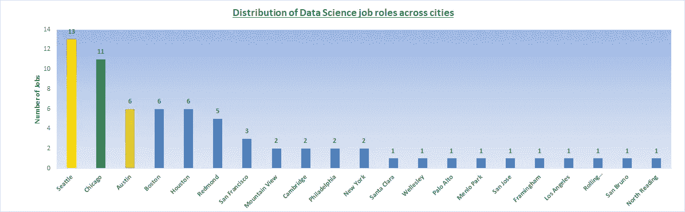

# 了解 G.A.M.F 的数据科学工作要求

> 原文：<https://medium.com/analytics-vidhya/understanding-data-science-job-requirements-at-g-a-m-f-fe31f153967b?source=collection_archive---------8----------------------->

pic Credits—[https://www . adweek . com/digital/breaking-big-tech-is-a-ralling-call-that-have-plan-in-place-to-support-it/](https://www.adweek.com/digital/breaking-up-big-tech-is-a-rallying-call-that-has-no-plan-in-place-to-support-it/)

# 第 2 部分—深入研究特性

即使在最好的情况下，处理没有固定模式的非结构化文本数据也是一项挑战。虽然，我能够使用网络清理的概念从真实的[中提取原始的工作描述，但是从文本中提取特征可不是在公园里散步。这是因为信息在网站上呈现的格式各不相同。](/analytics-vidhya/understanding-data-science-job-requirements-part-1-web-scrapping-9205083eb296)

在应用了文本挖掘和自然语言处理(如 N-grams)的高级概念后，我编写了一个代码，它从文本中提取特征，并以以下格式呈现出来—

原始工作描述

转换后的工作描述

正如你所看到的，我已经把工作描述转换成了公司提到的具体技能和相应的熟练程度。数据科学家的期望(在工作经验和技术专业知识方面)非常不同，因为基于产品的公司更关注统计和机器学习部分，而基于服务的公司更关注数据提取和可视化部分。为了更好地概括它们，我将技术技能和软技能中的专业知识分为以下几个类别-

擅长**数据库管理软件**如— MySQL、SQL、PostgreSQL、MongoDB
擅长**统计软件**如— R、Python、Matlab、SAS、SPSS
擅长**大数据工具**如— Hadoop、Hive、Mapreduce、Spark、Azure、Snowflake、Cassandra
擅长**软技能**如—书面和口头沟通、组织技能和口语技能
擅长 NLP、聚类、回归等
在**仪表板工具**方面的专业知识，如 Tableau、Shiny、PowerBI、Looker、QlikView
在**深度学习概念**方面的专业知识，如神经网络、激活函数、反向传播等

为了简单起见，我将每项技能的熟练程度分为三大类，即“高度熟练”、“中等熟练”和“未提及的技能集”。例如，在上面亚马逊的职位描述中，他们想要一名拥有 ***【优秀】*** 书面和沟通技能的数据科学家，因此软技能专业知识一栏中的熟练程度为“高度熟练”。我使用了“例外”、“优秀”、“精通”等词来标记技能集“高度精通”。缺少这样的词语，但只存在特定的技能组合被标记为“中等熟练”，而在整个工作描述中缺少特定的技能组合导致该技能组合被标记为“未提及的技能组合”。

# *跨公司的工作分配*

我总共有 400 多家公司的 819 份数据科学职位描述。以下是根据数据科学职位数量排名的前 30 家公司的分布情况

# ***洞察***—

亚马逊拥有最多的数据科学职位(33 个)，其次是微软(13 个)和德勤(13 个)

# G.A.M.F .职位的探索性数据分析

**GAMF** 是全球四大科技巨头谷歌、亚马逊、微软和脸书的首字母缩写，在创新和受欢迎程度方面，这些公司首屈一指。我的数据集包含这 4 家公司的 68 个数据科学角色。从现在开始，我将用他们的缩写(G.A.M.F)来称呼他们。让我们看看要成为这些领域的数据科学家需要什么。

西雅图的数据科学职位数量最多(13 个)，其次是芝加哥(11 个)，奥斯汀、波士顿和休斯顿(各 6 个)。

# 基础学位和高级学位分布

偏好度分布

## 洞察力—

虽然拥有本科学位的专业人士可以申请这些职位，但 G.A.M.F 强烈倾向于拥有统计学、应用数学、运筹学、经济学、计算机科学工程等领域硕士或博士学位的专业人士

# 工作经验(年)分布

# 洞察力—

虽然有 3 年工作经验的人最适合这些工作，但那些在分析或相关领域有至少 2 年工作经验的人最适合在谷歌、亚马逊、微软或脸书担任数据科学家。

# 精通数据库管理软件

# 洞察力—

对 MySQL、SQL、PostgreSQL、MongoDB 等*数据库管理软件*具有中等熟练程度的专业人士似乎非常适合 G.A.M.F 的数据科学家角色。有 19 个职位没有特别提到对这些语言的专业知识的要求。

# 熟练使用统计软件

# 洞察力—

令人惊讶的是，G.A.M.F 并不要求对 R、Python、Matlab、SAS、SPSS 等统计软件的熟练程度很高。有 9 个职位没有特别提到对这些语言的专业知识的要求。

# 精通大数据工具

# 洞察力—

G.A.M.F 希望他们的数据科学申请人对大数据工具*有一定程度的精通，如 Hadoop、Hive、Mapreduce、Spark、Azure、Snowflake 和 Cassandra。*

# 精通机器学习

# 洞察力—

G.A.M.F 的数据科学申请人应该在机器学习概念方面有中等至较强的基础，这是正确的，因为这些公司积极地将机器学习嵌入到他们的产品中。

# 深度学习的熟练程度

# 洞察力—

似乎 G.A.M.F 并不期望他们的数据科学申请者精通深度学习，因为超过一半的职位描述没有提到这些技能。

# 熟练使用仪表板工具

# 洞察力—

这再次令人惊讶，因为与许多希望申请人精通 Tableau、Shiny、PowerBI、Looker、QlikView 等仪表板工具的公司不同，G.A.M.F 并不希望他们的数据科学申请人也能如此。

**总结—**

尽管 G.A.M.F 的数据科学家的角色和职责有所不同，但他们都是最难也是最有趣的数据实验的卓越中心。因此，具备以下特质有助于你入围这些公司的面对面面试

至少两年的分析或相关领域的经验，以及定量领域的硕士学位
在统计软件、数据库管理软件、大数据工具和机器学习方面有一定的熟练程度