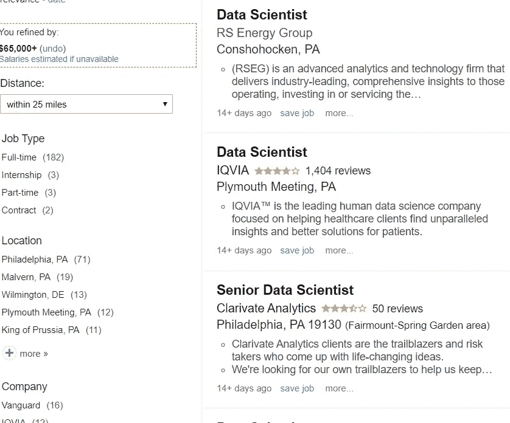
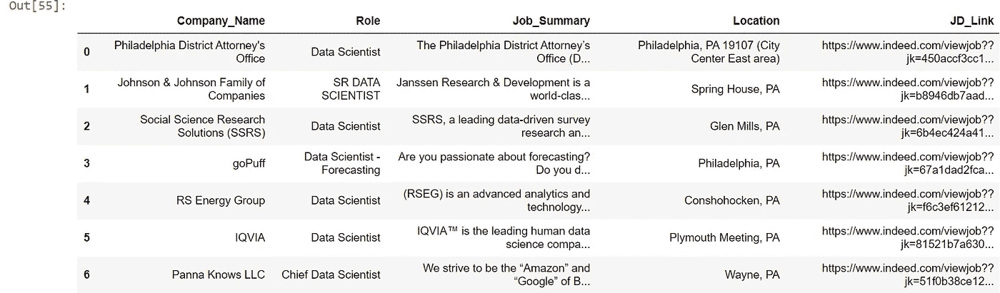
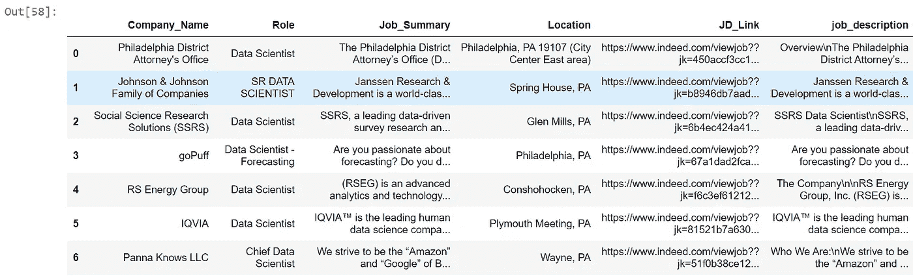
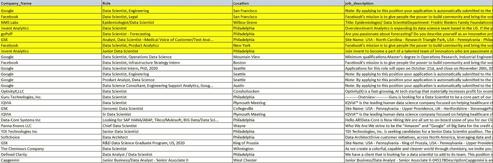

# 了解数据科学工作要求

> 原文：<https://medium.com/analytics-vidhya/understanding-data-science-job-requirements-part-1-web-scrapping-9205083eb296?source=collection_archive---------13----------------------->

## 第 1 部分—网络搜集、探索性数据分析

这是一个成为数据科学家进入就业市场的好时机。这是根据求职网站 Indeed 和 Dice 的最新数据得出的。

“数据科学家的工作变得越来越性感，”位于德克萨斯州奥斯汀的 Indeed 公司的经济学家、Indeed 报告的作者安德鲁·弗劳尔斯说。“越来越多的雇主希望雇佣数据科学家。”


这些话不是我说的；相反，它们是从无数赞美数据科学家未来的文章中抄袭来的。我在这个领域工作了超过 27 个月，我个人认为机器学习将会改变很多行业的游戏规则。

在专业层面上，我应用机器学习的原理来开发跨零售、商业和保险等多个领域的销售预测、客户细分和定价策略。这些项目进一步强化了我的假设，即在不久的将来，数据科学家将会非常吃香。

然而，正如我们在数据科学中经常做的那样，假设公式是一部分，测试假设是另一部分(也许是最重要的！).因此，我决定通过搜集 Indeed.com 的数据科学工作清单来测试我的假设，以便更好地了解美国各大城市数据科学家的最低资格和工作角色。

这是我分析的第一部分，我向你解释我是如何从 Indeed 中提取这些工作列表的。我花了将近 24 个下班后的时间在 Python 上编写完整的报废代码，并多次测试，以确保该过程可以快速自动化，天哪，这真有趣！我写的最终代码 ***提取了全美 800 个薪酬超过 6.5 万美元的数据科学职位*** 而这一切都是在仅仅 ***20 分钟*** 的时间内完成的。这是我用原始数据做的转换的视图。



查看原始职务列表


转换后的职务列表视图—表格形式

在本文中，我将描述我是如何废弃了 100 多个 Indeed 的网页，并清理废弃的数据以获得上面的格式。我还将执行一些基本的探索性数据分析(EDA)来检查废弃数据的有效性。在本系列的第二篇文章(第 2 部分)中，我将解释我们是如何从作业摘要中生成有意义的特征的，因为所有的金子都藏在那里！我们开始吧。

```
#Importing all the necessary libraries
import matplotlib
import numpy as np
import random 
import os
import matplotlib.pyplot as plt
import pandas as pd
from datetime import datetime
import re
import time
import matplotlib.pyplot as plt
import time
from bs4 import BeautifulSoup
import urllib.request
from pandas import ExcelWriter
from itertools import combinations
```

提及将提取数据科学工作的城市名称:-

```
city_list = ['Philadelphia','San+Francisco', 'New+York', 'California', 'Houston', 'Boston', 'Chicago', 'Seattle', 'Austin', 'Maryland']
```

因为涉及到多个城市和多个网页，所以编写了一个 for 循环中的 for 循环来实现自动化。为了更好地解释，我用一个静态的例子来解释整个报废过程。在本文的末尾，您可以找到 GitHub 链接，其中提供了完整的报废代码。

```
#Mentioning the city_name and html link from where the data will be scrappedcity_name = city_list[0]original_html = '[https://www.indeed.com/jobs?q=data+scientist+$65,000&l='+city_name+'&start=10'](https://www.indeed.com/jobs?q=data+scientist+$65,000&l='+city_name+'&start=10')#Parsing the html using beautiful soup and store in variable 'soup'
urlpage =  str(original_html)
page = urllib.request.urlopen(urlpage)
soup = BeautifulSoup(page, 'html.parser')print("Extracting Data Science Job Postings for -", city_name, "from the link - ", urlpage)##OUTPUT - 
***Extracting Data Science Job Postings for - Philadelphia from the link -*** [***https://www.indeed.com/jobs?q=data+scientist+$65,000&l=Philadelphia&start=10***](https://www.indeed.com/jobs?q=data+scientist+$65,000&l=Philadelphia&start=10)
```

浏览了几个网页后，我意识到作业列表存在于类名为“title”的

容器单元中。我进一步清理了字符串“href=”和“id=”之间的文本，它们具有角色的确切名称。在我看来，web 报废就是通过一遍又一遍地查看页面资源来找到正确的容器。这就是为什么我花了这么多时间来写完整的代码:P

编写一个循环来提取网页上的工作角色和工作描述的链接:

```
all_links = []
all_roles = []role_list = soup.findAll('div', attrs={'class':'title'})for i in range(0,len(role_list)):
    #i = 0
    s = str(role_list[i])
    start = 'href='
    end = ' id='
    link = s[s.find(start)+len(start):s.rfind(end)]
    link = link.replace('"', "")
    all_links.append(link)
    title_name = str(role_list[i].text)
    title_name = title_name.strip()
    all_roles.append(title_name)

print("Job Roles present on this page are - ", all_roles)##OUTPUT - 
***Job Roles present on this page are -  ['Data Scientist', 'SR DATA SCIENTIST', 'Data Scientist', 'Data Scientist - Forecasting', 'Data Scientist', 'Data Scientist', 'Chief Data Scientist', 'Genomic Data Scientist', 'Data Scientist', 'Analyst, Data Scientist –Medical Voice of Customer/Text Anal...']***
```

接下来，我分析了我刚刚提取的工作描述的链接，我意识到它们没有统一的模式。

```
##Printing all the links obtainedprint(all_links)##OUTPUT - 
['/rc/clk?jk=450accf3cc188a49&amp;fccid=a054959bd2e612a2&amp;vjs=3',
 '/rc/clk?jk=b8946db7aad572ee&amp;fccid=0bed8e17bc113980&amp;vjs=3',
 '/rc/clk?jk=6b4ec424a41a8ee9&amp;fccid=4c3bc2bd3fda6e72&amp;vjs=3',
 '/rc/clk?jk=67a1dad2fca55e88&amp;fccid=8a2222c2ef6a251d&amp;vjs=3',
 '/rc/clk?jk=f6c3ef61212721db&amp;fccid=b5f5a475a9aae6da&amp;vjs=3',
 '/rc/clk?jk=81521b7a6303cb7b&amp;fccid=6b7a1dfe07e7f037&amp;vjs=3',
 '/rc/clk?jk=51f0b38ce1225e4a&amp;fccid=19313a51d729b8e6&amp;vjs=3',
 '/rc/clk?jk=72bd3bbbec1f33e4&amp;fccid=4e42ec53f4b93e02&amp;vjs=3',
 '/company/Gap-International/jobs/Data-Scientist-45b06c797b37e391?fccid=c9cfc7300b9963c1&amp;vjs=3',
 '/rc/clk?jk=14fbb6832d453b6a&amp;fccid=4e42ec53f4b93e02&amp;vjs=3']
```

正如您在上面看到的，10 个链接中有 9 个以字符串“/rc/clk”开头，但是有一个链接以“/company/”开头。这一点必须注意，否则，这一特定工作说明的内容就不能取消。我是这样做的:

```
all_podcast_links = all_links
all_podcast_links = [i.split('-')[-1] for i in all_podcast_links]modified_links = []
for i in range(0,len(all_podcast_links)):
    main_link_text = all_podcast_links[i]
    string_find = '/rc/clk'
    if(main_link_text.find(string_find) == -1):
        main_link_text = '/rc/clk?jk=' + main_link_text
        text_replace = "?fccid="
        main_link_text = main_link_text.replace(text_replace, '&amp;fccid=')
        print('Caution !! Link modified for link number', i)
    else:
        main_link_text = main_link_text
    modified_links.append(main_link_text)text_delete = '/rc/clk'
all_podcast_links = [w.replace(text_delete,"") for w in modified_links]
text_replace = "/jobs/"
all_podcast_links = [w.replace(text_replace,"&t=") for w in all_podcast_links]
text_to_add = '[https://www.indeed.com/viewjob?'](https://www.indeed.com/viewjob?')
final_links = [text_to_add+s for s in all_podcast_links]
text_replace = "/viewjob?/company/"
final_links = [w.replace(text_replace,"/company/") for w in final_links]
print("/n All links after modification - ", final_links)##OUTPUT - 
***Caution !! Link modified for link number 8******All links after modification -
['https://www.indeed.com/viewjob??jk=450accf3cc188a49&amp;fccid=a054959bd2e612a2&amp;vjs=3', 'https://www.indeed.com/viewjob??jk=b8946db7aad572ee&amp;fccid=0bed8e17bc113980&amp;vjs=3', 'https://www.indeed.com/viewjob??jk=6b4ec424a41a8ee9&amp;fccid=4c3bc2bd3fda6e72&amp;vjs=3', 'https://www.indeed.com/viewjob??jk=67a1dad2fca55e88&amp;fccid=8a2222c2ef6a251d&amp;vjs=3', 'https://www.indeed.com/viewjob??jk=f6c3ef61212721db&amp;fccid=b5f5a475a9aae6da&amp;vjs=3', 'https://www.indeed.com/viewjob??jk=81521b7a6303cb7b&amp;fccid=6b7a1dfe07e7f037&amp;vjs=3', 'https://www.indeed.com/viewjob??jk=51f0b38ce1225e4a&amp;fccid=19313a51d729b8e6&amp;vjs=3', 'https://www.indeed.com/viewjob??jk=72bd3bbbec1f33e4&amp;fccid=4e42ec53f4b93e02&amp;vjs=3', 'https://www.indeed.com/viewjob??jk=45b06c797b37e391&amp;fccid=c9cfc7300b9963c1&amp;vjs=3', 'https://www.indeed.com/viewjob??jk=14fbb6832d453b6a&amp;fccid=4e42ec53f4b93e02&amp;vjs=3']***
```

编写一个循环来提取网页上所有公司的名称:

```
all_companies = []
company_list = soup.findAll('span', attrs={'class':'company'})
for i in range(0,len(company_list)):
    #i = 2
    comp_name = str(company_list[i].text)
    comp_name = comp_name.strip()
    all_companies.append(comp_name)

print("Companies present on the page -", all_companies)##OUTPUT - 
***Companies present on the page - ["Philadelphia District Attorney's Office", 'Johnson & Johnson Family of Companies', 'Social Science Research Solutions (SSRS)', 'goPuff', 'RS Energy Group', 'IQVIA', 'Panna Knows LLC', 'GSK', 'Gap International', 'GSK']***
```

编写一个循环来提取网页上所有公司的位置:

```
all_locations = []
location_list = soup.findAll('span', attrs={'class':'location accessible-contrast-color-location'})
for i in range(0,len(location_list)):
    #i = 2
    loc_name = str(location_list[i].text)
    loc_name = loc_name.strip()
    all_locations.append(loc_name)

print("List of Company Locations -", all_locations)##OUTPUT - 
***List of Company Locations - ['Philadelphia, PA 19107 (City Center East area)', 'Spring House, PA', 'Glen Mills, PA', 'Philadelphia, PA', 'Conshohocken, PA', 'Plymouth Meeting, PA', 'Wayne, PA', 'Collegeville, PA 19426', 'Springfield, PA 19064', 'Philadelphia, PA 19112 (Marconi Plaza-Packer Park area)']***
```

编写一个循环来提取网页上所有公司的工作摘要:

```
all_job_summary = []
job_summary_list = soup.findAll('div', attrs={'class':'summary'})
for i in range(0,len(location_list)):
    #i = 2
    job_summary = str(job_summary_list[i].text)
    job_summary = job_summary.strip()
    all_job_summary.append(job_summary)

print("One of the job summary - ", all_job_summary[0])##OUTPUT - 
***One of the job summary -  The Philadelphia District Attorney’s Office (DAO), led by District Attorney Larry Krasner, is committed to the mission of providing fair and just prosecution to…***
```

将所有结果整理到一个数据框中，以便正确查看:

```
full_company_df = pd.DataFrame(
            {'Company_Name': all_companies,'Role': all_roles,'Job_Summary': all_job_summary,
             'Location' :all_locations, 'JD_Link' :final_links
            })
```

这是整理后的数据框最终的样子:



校对数据帧

接下来，我编写了一个 for 循环，从上面获得的表的列名“JD_Link”中提取整个职务描述:

```
all_company_df = pd.DataFrame()
for i in range(0, len(full_company_df)):
    #i = 0
    new_link = full_company_df['JD_Link'][i]
    urlpage =  str(new_link)
    page = urllib.request.urlopen(urlpage)
    # parse the html using beautiful soup and store in variable 'soup'
    soup = BeautifulSoup(page, 'html.parser')script = soup.find('script')

    #Extracting full JD from the respective div field
    divs = soup.find_all('div',attrs={"id" : "jobDescriptionText"})
    for d in divs:
        job_description = str(d.text)

    #Creating master_Dataframemaster_df = pd.DataFrame({'JD_Link' : urlpage, 'job_description' : job_description}, index = [0])
    all_company_df = all_company_df.append(master_df)
    print('JD extracted for ', (i+1), "companies out of -", len(full_company_df))

all_company_df = all_company_df.reset_index(drop = True)##OUTPUT - 
***JD extracted for  1 companies out of - 10
JD extracted for  2 companies out of - 10
JD extracted for  3 companies out of - 10
JD extracted for  4 companies out of - 10
JD extracted for  5 companies out of - 10
JD extracted for  6 companies out of - 10
JD extracted for  7 companies out of - 10
JD extracted for  8 companies out of - 10
JD extracted for  9 companies out of - 10
JD extracted for  10 companies out of - 10***
```

我现在检查其中一份工作描述，以确保一切就绪。

```
print(all_company_df['job_description'][0])##OUTPUT - 
'Overview\nThe Philadelphia District Attorney’s Office (DAO), led by District Attorney Larry Krasner, is committed to the mission of providing fair and just prosecution to all Philadelphians. DA Krasner believes that justice is best achieved through policies grounded in research, data, and science. Holding true to these commitments, the DAO has improved its capabilities to process data, craft policy, and conduct research. As we continue to modernize a progressive and fast-paced office, we aim to be responsive, forward thinking, and collaborative.\nThe Data Scientist will join an innovative team of researchers, lawyers, analysts, and other software engineers in the development and deployment of applications to support prosecution, analytics, data-driven policy, and public transparency. They will support DA Krasner’s targeted areas for informed reform, including charging, diversion, sentencing, focusing on the most serious crimes, preventing violence, enhancing harm reduction, and ameliorating disparities in the criminal justice process. The Data Scientist will be focused on the development of metrics, visualizations, and unique analyses to support policy makers, evaluate policy, and communicate with the public. The Data Scientist will be expected to:\nbe involved with development, processing, and reporting on a variety of data both internal and external to the District Attorney’s Office;\nbe involved with the development of an internal and external data dashboard that surfaces key reports and information to policymakers, executives, and the public\ndevelop visualizations to show trends and summarize data as well as perform deeper dives to support policy proposals or policy testing;\nhelp develop thoughtful metrics to track the efficacy of policies, to help develop new policies, to support research, and to help communicate to the public the work of the DAO;\nbe responsible for working with both the analytical and development teams to ensure appropriate data capture, storage, and accessibility;\nassist in development, implementation, and maintenance of policies and procedures for ensuring the security and integrity of sensitive data;\nassist in creating, modifying or maintaining ETL processes to support application development, data analysis, and research;\nleverage their significant experience to contribute to data analysis and policy research and implementation;\nperform other duties as required.\n\nQualifications\nA Bachelor’s or Master’s degree in Computer Science, Software Engineering, Mathematics, Statistics, Business Analytics or related technical discipline is preferred, but not required. Additional years of experience exceeding the minimum requirement as well as a proven track record of work may stand in for a degree. The preferred candidate will also have or demonstrate:\n3 years of hands on experience with data I/O, cleaning, coding, manipulation, transformation, modeling, summarizing, and visualizing;\nexperience working with relational databases and non-relational databases and exploring data to analyze business cases to identify areas for improvement;\nexperience with data visualization, especially interactive visualizations\nextensive knowledge of R, experience working with the tidyverse family of packages; experience with statistical analysis; comfort with packages utilized for modeling data;\nexperience with interactive web frameworks such as React, Angular, Dash, or R Shiny a plus\nthe Data Scientist will also have a solid understanding of PostgreSQL, AWS, data analysis and visualization, and statistical principles and methods;\nan enthusiasm to collaborate, innovate, and solve problems;\na proven ability to prioritize work in a team and independently, and handle multiple complex tasks simultaneously;\nhave strong communication skills and be able to interact effectively with team members, executives, funders, City government, academics, and stakeholders inside and outside of the DAO;\nexperience working in the legal field/with attorneys and a knowledge of the criminal justice system are both a plus.'
```

最后，我将工作描述数据帧与最初获得的数据帧进行映射，以获得以下格式的整理数据帧:



这就是我如何提取费城第一页上的数据科学工作清单。以下链接包含前面提到的所有城市的完整自动代码:

[](https://github.com/tapobrata22/Indeed_Data_Science_Scrapping/blob/master/indeed_scrapping_v2.py) [## tapobrata 22/Indeed _ Data _ Science _ screwing

### 此时您不能执行该操作。您已使用另一个标签页或窗口登录。您已在另一个选项卡中注销，或者…

github.com](https://github.com/tapobrata22/Indeed_Data_Science_Scrapping/blob/master/indeed_scrapping_v2.py) 

以下是包含这些城市 800 个职位的最终数据集视图:



希望能在第二部分看到你，在那里我将上面获得的“工作描述”栏的内容分解成如下实体——I)最小 _ 工作 _ 工作 _ 前 _ 年
ii)最小 _ 学位 _ 资格
iii)统计 _ 软件 _ 经验

谢谢你坚持到最后:)