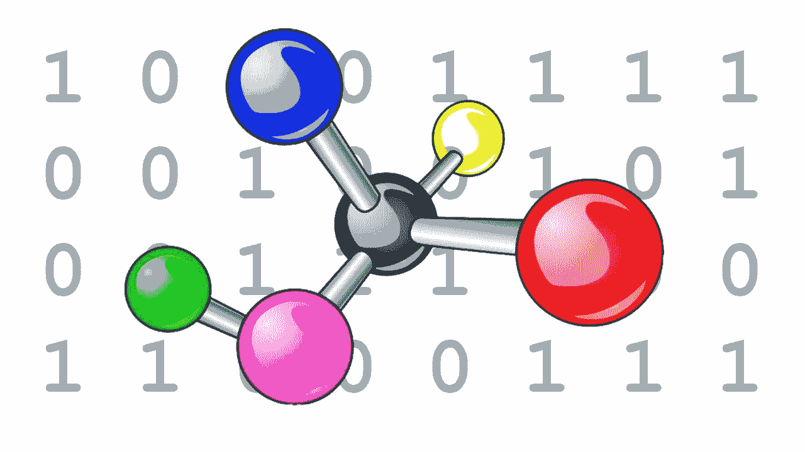
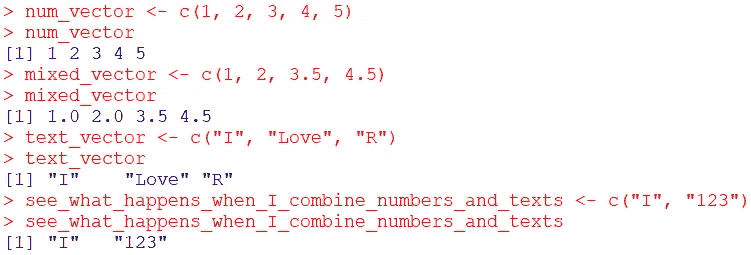
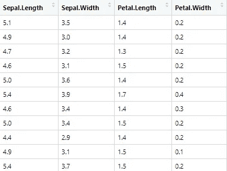
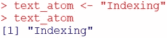
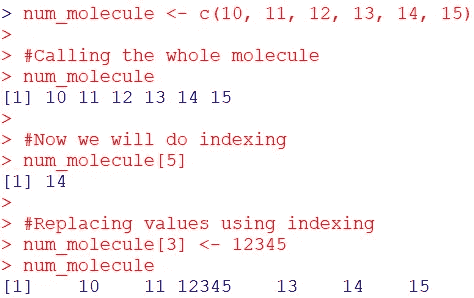
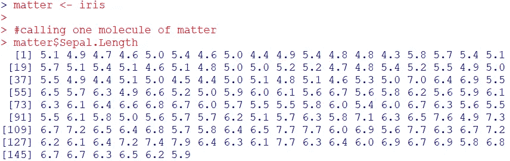
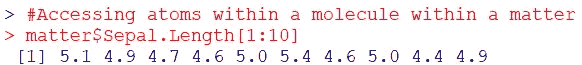
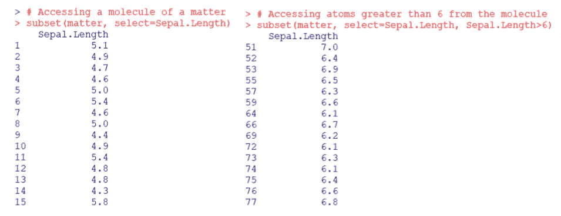
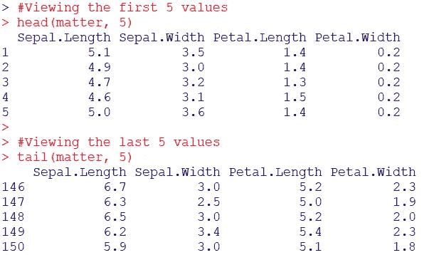

# 理解 R 中的数据类型和结构

> 原文：<https://medium.com/analytics-vidhya/understanding-data-structures-in-r-793d7ce79073?source=collection_archive---------20----------------------->



R 就像任何其他编程语言一样——只是非常注重数据的统计分析。因此，如果你熟悉任何一种编程语言，开始使用 R 会变得非常容易。也许这是真的，但我觉得一旦你和 R 走在一起，你就不会去别的地方了。

如果你对任何编程语言都不熟悉，并且从未尝试过自己学习一门语言，那么问题就来了。对任何编程语言的绝对介绍都应该是通过它的数据结构，然而我已经看到有人直接使用 R 进行统计分析，而没有先学习它们。随着学习曲线变得非常陡峭，这导致了一个巨大的问题，人们要么在任务变得非常艰巨时中途放弃学习，要么继续在非常简单的事情上接受他人的帮助。因此，我再说一遍，我再怎么强调这一点也不为过— **先学习数据结构**！

R 中有许多不同的数据类型和结构，提到所有这些可能会让初学者感到非常困惑。此外，我们中的许多人不需要或使用这么多不同的类型或结构。我在[行为生态学](https://en.wikipedia.org/wiki/Behavioral_ecology)做研究，我只使用了现有选项的一个子集。因此，在这篇文章中，我将解释我发现对我的工作最有用的几个。

# 原子！

好的，让我们从数据类型开始。想想一个原子，物质的积木(物理学家们，请不要杀我，我在尝试用非常简单的类比！).数据类型就像一个原子，它们是更大的数据结构的构建块。数据的原子可以是数字，即数字——无论是整数还是小数。原子也可以是字符(R 中还有其他原子，但我们暂时忽略它们)。比如数字 123 是原子，还有数字 159.64 和文字“我爱 R”。注意到文本周围的引号了吗？这就是在 R 中编写字符原子的方法(可以使用单引号或双引号中的任何一个，但不能同时使用两个)。下面是你如何向 R 描述原子的例子:

```
integer_atom <- 123
decimal_atom <- 159.64
text_atom <- "I love R"
```

假设阅读这篇文章的人是绝对的初学者，在`<-`的左边我们看到原子的名称，在`<-`的右边我们看到我们赋予原子的值。`<-`用于给原子赋值和描述类型(数字或字符)。

# 分子！

现在，我们转向更高阶的结构——数据结构。但是在我将要解释的数据结构中也有两个层次。首先，让我们想想分子——当两个或更多的原子结合时，它们会产生分子。同样，当 R 中的两个或两个以上的原子结合时，就产生了一个分子，叫做“vector”。向量是 r 中最常见和最基本的数据结构。关于向量分子要记住的主要事情是，它只能容纳一种类型的原子——整数、数字或文本(专家——我在这里只谈论原子向量，我将解释列表字母；而初学者——忽略这一点！).创造一个分子非常容易，只要用一个`c()`把原子结合起来就行了！



R 中向量的例子

在上图中，我首先通过将原子放入`c()`来创建分子。当我调用下一行中的分子时，它们显示它们的内容(忽略开头的`[1]`，它只是那一行中第一个原子的序号)。你可以看到 R 只接受分子内的整数，小数或者文本。如果你把两种不同的类型放在一起，它们会转换成一种类型。当我把整数和小数放在一起时，它们被转换成小数。当我把文本和数字放在一起时，它们被转换成文本(注意数字周围的双倒逗号，用于描述文本？这意味着该数字已经被转换成文本)。

# 事！

原子和分子很好，也很有用，但是我们并没有在日常生活中直接使用它们，不是吗？不，我们使用由物质构成的物体，物质是由许多分子聚集在一起形成的。类似地，在 R 中，我们有称为数据帧的物质，它是在两个或多个矢量分子结合时形成的。与向量相比，数据帧(从这里开始称为 matter)是一种高阶数据结构，非常有用。我们在 R 中主要使用 matter，每当我们从电子表格或 CSV 文件中导入数据时，我们通常会使用 matter(点击[这里](/@bishwarup_paul/easy-way-to-import-data-from-spreadsheet-to-r-d20cdf2da79f)，查看我的关于从电子表格中导出数据到 R 的快捷方式的帖子)。



R 中使用“iris”数据集的 dataframe 示例

上面给出了一个例子，使用 r 中的“iris”数据集。习惯使用电子表格的人可以立即识别格式。有四列，每一列保存一个类别的值。在这里，每一列实际上是一个矢量分子，每一个都是由用行表示的数字原子构成的。每列的第一行代表分子的名称，称为“标题”。四个这样的分子结合起来创造了上面的物质。正如我之前所说，这是电子表格中使用的格式，因此你可以直接将数据从电子表格导入到称为数据框的物质中。是不是很整洁？

# 索引

在我们继续学习其他不太有用和更复杂的数据类型和结构之前，我们应该更多地了解如何使用到目前为止我们已经介绍过的数据类型和结构。所以我们学会了如何将数据放入原子、分子和物质中；但是我们如何访问这些数据呢？最常见的访问数据的方法叫做索引，我们现在就要学习它。

索引也被称为“切片”，因为使用它你可以访问部分数据或全部数据。现在，原子只持有一个单一的数据，所以没有什么可以切片。当你调用一个原子时，你得到全部数据。



原子不需要索引！

但是分子和物质拥有不止一个值，因此索引很方便。为了标记分子，我们使用方括号。



使用方括号索引分子

我们在上面的例子中看到，像原子一样，我们可以通过叫它的名字来访问整个分子。但是为了访问它的部分值，我们使用索引。我们也可以使用索引来替换分子的一个或多个值。

方括号也可以用来索引物质，但是由于物质中的每个分子都有自己的名称，我们可以使用`$`通过使用名称来索引物质，这要容易得多。



使用$索引物质

在上面的例子中，我们看到了如何访问物质中的分子。但是如何接近原子呢？为此，我们可以使用`$`和方括号的组合。



索引物质中的原子

物质的索引也可以用一个叫做`subset()`的函数来完成。它可以用来访问物质中的特定分子，或者从分子中访问大于或小于或等于特定值的原子。



使用子集来索引物质

在上面的例子中，我在`subset()`命令中提供了三个参数。第一个参数取物质的名称，第二个参数`select`取你想要访问的分子的名称。提供的第三个参数用于使用特定值访问原子。在这种情况下，我们选择大于 6 的原子。

另一个快速了解事物内容的非常有用的方法是使用名为`head()`和`tail()`的命令。要查看物质内部分子的初始原子，我们用`head()`，用`tail()`查看最后的原子。在这两种情况下，我们都可以提到我们想要看到的原子数量。



用头和尾来观察事物的内容

我想在这里结束这篇文章，现在不想进入其他数据类型和结构，也不想让这个话题过于复杂。如果你认为你已经掌握了我们从这篇文章中学到的三个诀窍，如果你想了解更多，去访问这个[链接](https://swcarpentry.github.io/r-novice-inflammation/13-supp-data-structures/)。

我在这篇文章中使用了很多类比，但我使用它们只是因为我认为这对完全的初学者理解结构和更好地记忆它们是有用的。但是如果它们让你感到困惑，只要记住:原子=数字/文本，分子=矢量，物质=数据框架。