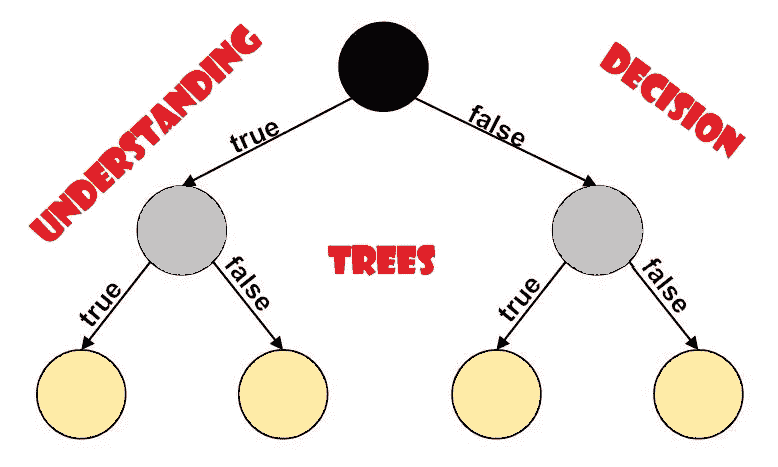
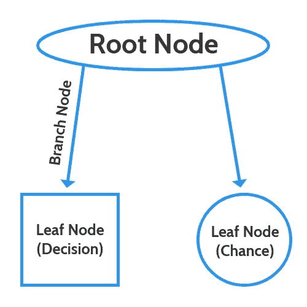
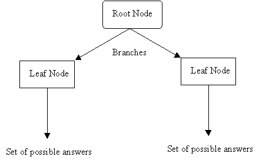
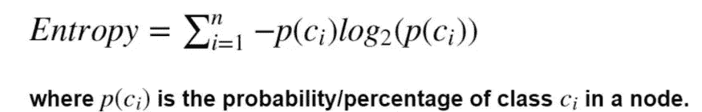
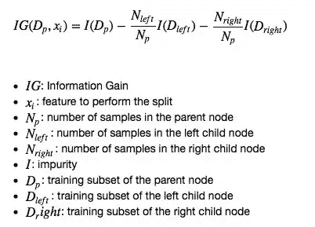
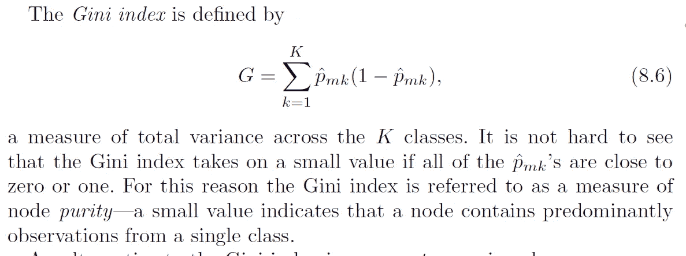
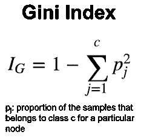
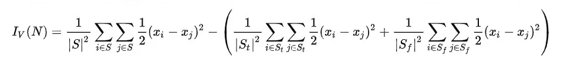
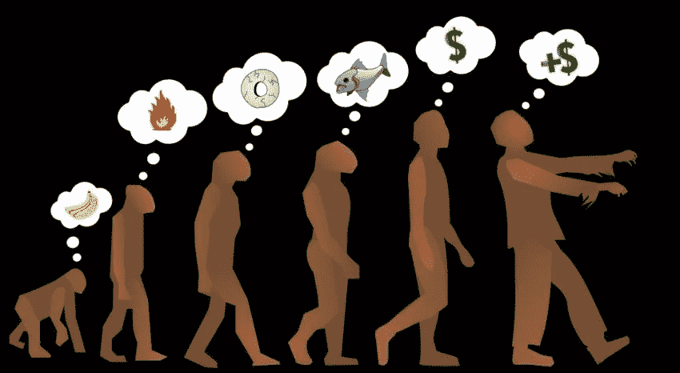

# 理解决策树！！

> 原文：<https://medium.com/analytics-vidhya/understanding-decision-tree-3591922690a6?source=collection_archive---------1----------------------->

# 什么是决策树？

*   **决策树**是一种决策支持工具，它使用决策及其可能结果的树状模型，包括偶然事件结果、资源成本和效用。
*   **决策树学习**是统计学和机器学习中使用的预测建模方法之一。它使用决策树从对某个项目的观察(用树枝表示)到对该项目的目标值的结论(用树叶表示)。
*   决策树是一种用于分类和回归任务的非参数监督学习方法。
*   目标是创建一个模型，通过学习从数据特征推断的简单决策规则来预测目标变量的值。

# 决策树的类型:

## **回归树**

具有连续目标变量的决策树(例如:一套房子的价格)。

*   为了建立回归树，我们首先使用递归二分分裂，即每个数据样本作为一个节点来分裂数据。
*   具有最小残差平方和或均方误差的点被认为是分裂的节点。
*   每个节点在达到限制时停止分裂，这意味着进一步的分裂将具有少于 n 个观察值。
*   为了对分裂背后有个直观的了解，我强烈推荐这个[***stat quest***](https://www.youtube.com/watch?v=g9c66TUylZ4)的视频。

## **分类树**

具有分类目标变量的决策树。(例如。:在泰坦尼克号数据中，无论乘客是否幸存)。

*   它非常类似于回归树，但是残差平方和不用于分割节点。
*   它使用了一些我们将在下面讨论的其他技术。

# 决策树的假设:

照片由[马修·施瓦茨](https://unsplash.com/@cadop?utm_source=medium&utm_medium=referral)在 [Unsplash](https://unsplash.com?utm_source=medium&utm_medium=referral) 上拍摄

***由于决策树是非统计方法，它不对训练数据或预测残差做出任何假设；例如，没有分布、独立性或恒定方差假设。***

但是，决策树有一些非统计假设:

*   开始时，整个训练集被认为是**根。**
*   特征值最好是分类的。如果这些值是连续的，则在构建模型之前会将其离散化。
*   记录是基于属性值递归分布的。
*   通过使用一些统计方法来完成将属性放置为树的根或内部节点的顺序。

# 决策树是如何工作的？

在 [Unsplash](https://unsplash.com?utm_source=medium&utm_medium=referral) 上由 [Adeolu Eletu](https://unsplash.com/@adeolueletu?utm_source=medium&utm_medium=referral) 拍摄的照片

*   它适用于分类和连续的输入和输出变量。
*   我们根据输入变量中最重要的分割器/区分器将总体或样本分成两个或多个同类集合(或子总体)。
*   如何分割的决定严重影响了树的准确性。 ***分类树和回归树的判定标准不同。***
*   决策树使用多种算法来决定将一个节点拆分成两个或多个子节点。子节点的创建增加了结果子节点的同质性。换句话说，我们可以说节点的纯度随着目标变量的增加而增加。
*   然而，问题是算法的贪婪本质。决策树分割所有可用变量上的节点，然后选择产生最相似子节点的分割。

# 决策树的不同类型算法

## → ID3

*   **ID3** ( **迭代二分法 3** )是 Ross Quinlan[1]发明的一种算法，用于从数据集生成决策树。
*   ID3 不保证最优解。
*   它可以收敛于局部最优。
*   它使用贪婪策略，在每次迭代中选择局部最佳属性来分割数据集。
*   算法的最优性可以通过在搜索最优决策树的过程中使用回溯来提高，代价是可能花费更长的时间。
*   ID3 可能会过度拟合训练数据。为了避免过度拟合，较小的决策树应该优先于较大的决策树。这种算法通常生成小树，但并不总是生成尽可能最小的决策树。
*   ID3 在连续数据上比在分解数据上更难使用(分解数据有离散数量的可能值，因此减少了可能的分支点)。如果任何给定属性的值都是连续的，那么就有更多的地方来分割该属性上的数据，并且搜索最佳分割值可能会非常耗时。
*   它主要致力于计算熵和信息增益。

> [https://en.wikipedia.org/wiki/ID3_algorithm](https://en.wikipedia.org/wiki/ID3_algorithm)

## → C4.5 算法

*   C4.5 是昆兰早期 ID3 算法的扩展。C4.5 生成的决策树可以用于分类，为此，C4.5 通常被称为统计分类器。
*   C4.5 使用信息熵的概念，以与 ID3 相同的方式从一组训练数据构建决策树。
*   处理连续和离散属性—为了处理连续属性，C4.5 创建了一个阈值，然后将列表分为属性值高于阈值的列表和属性值小于或等于阈值的列表

> [https://en.wikipedia.org/wiki/C4.5_algorithm](https://en.wikipedia.org/wiki/C4.5_algorithm)

## →分类和回归树(CART)

*   分类和回归树(CART)是一种非参数决策树学习技术，根据因变量是分类变量还是数值变量，生成分类树或回归树
*   决策树由基于建模数据集中变量的规则集合形成:
    1。 ***选择基于变量值的规则，得到最佳分割，以区分基于因变量的观察值。
    2。一旦选择了一个规则并将一个节点一分为二，相同的过程被应用于每个“子”节点(即，它是一个递归过程)。
    3。当购物车检测到无法继续获利，或符合一些预设的停止规则时，分割停止。(或者，尽可能分割数据，然后在稍后修剪树)。***
*   树的每个分支都以一个终端节点结束。每个观察值都属于一个且恰好是一个终端节点，每个终端节点都由一组规则唯一定义。
*   它用于二元分类。
*   在回归树的情况下，它使用最小平方作为度量来选择特征。
*   预测分析的一个非常流行的方法是随机森林。
*   它们甚至可以帮助检测异常/异常值。在 Neptune 博客 的这篇 [**文章中阅读更多关于它们的内容。**](https://bit.ly/3BrZXTt)

## →卡方自动交互检测(CHAID)

*   **卡方自动交互检测** ( **CHAID** )是一种决策树技术，基于调整显著性测试。
*   CHAID 经常在直接营销的背景下用于选择消费者群体，并预测他们对一些变量的反应如何影响其他变量，尽管其他早期应用是在医学和精神病学研究领域
*   像其他决策树一样，CHAID 的优点是其输出高度可视化，易于解释。由于默认情况下使用多路分割，因此需要相当大的样本量才能有效工作，因为样本量小的受访者群体很快就会变得太小，无法进行可靠的分析。
*   与多元回归等替代方法相比，CHAID 的一个重要优势是它是非参数化的。

# 决策树的不同分裂标准

## →熵:

*   决策树是从根节点自上而下构建的，包括将数据划分为包含具有相似值(同质)的实例的子集。
*   **ID3 算法**利用熵来计算样本的同质性。
*   其范围在 0 到 1 之间，其中接近 1 的值表示我们有纯分割，接近 0 的值表示

## →信息增益:

*   信息增益基于数据集在属性上分割后熵的减少。
*   构建决策树就是要找到返回最高信息增益的属性(即最相似的分支)。
*   熵是计算信息增益的标准。
*   信息增益基于在属性上分割数据集后熵的减少。它是用于构建决策树的主要参数。**具有最高信息增益的属性将首先被测试/分割。**
*   **信息增益=基础熵—新熵**

## →基尼指数:

*   基尼指数是一种衡量随机选择的元素被错误识别的频率的指标。这意味着基尼系数越低的属性越好。
*   CART 算法使用的基尼指数

> 要了解基尼指数背后的数学原理，请参考此[链接](https://www.youtube.com/watch?v=7VeUPuFGJHk)。

## →差异:

*   当目标变量是连续的时，这是决策树使用的分裂度量。
*   它检查每个拆分的方差，并采用解释较小方差的拆分。

> s 是预分割样本指数。
> S_t 是分裂检验为真的样本指数集。S_f 是分裂检验为假的样本指数的集合。

> 为了更好地理解连续特征的分割，你可以参考这个来自 StatQuest 的 [youtube 视频。](https://www.youtube.com/watch?v=g9c66TUylZ4&t=4s)

# 决策树的贪婪本性

*   决策树考虑许多特征，并允许基于这些特征的一系列分割。
*   值得注意的是，它们是一类非常通用的模型，可以达到很高的精度，但是找到最佳决策树的任务不容易手动执行，但可以通过计算来完成，因此，我们使用所谓的贪婪方法来选择我们的决策树。
*   这里要记住的重要一点是，使用这个过程我们不会得到最优的决策树，但是，我们会得到一个很好的决策树来预测我们的目标数据。
*   另一件要注意的事情是，我们实际上可以拆分数据，这样任何对象都可以被完全拆分，并且我们可以通过正确的预测获得叶节点中的每个观察值。
*   这将给我们的训练数据集带来 100%的准确性，但这被称为**过拟合，我们总是希望避免这样做。**
*   **这是因为这样的模型不是一个一般化的模型，它不能很好地预测新的和看不见的例子。**

# **优点和缺点:**

## **优势:**

1.  **易于使用和理解。**
2.  **可以处理分类数据和数字数据。**
3.  **抵抗异常值，因此需要很少的数据预处理。**
4.  **可以轻松添加新功能。**
5.  **可用于通过使用集成方法来构建更大的分类器。**

## **缺点:**

1.  **容易过度拟合。**
2.  **需要对他们的表现进行某种衡量。**
3.  **需要小心调整参数。**
4.  **如果某些职业占优势，可能会创建有偏见的学习树。**

# ****快乐学习！！！！！****

**喜欢我的文章？请为我鼓掌并分享它，因为这将增强我的信心。此外，我每周日都会发布新文章，所以请保持联系，以了解数据科学和机器学习基础系列的未来文章。**

**另外，请务必在 LinkedIn 上与我联系。**

****

**马库斯·斯皮斯克在 [Unsplash](https://unsplash.com?utm_source=medium&utm_medium=referral) 上拍摄的照片**