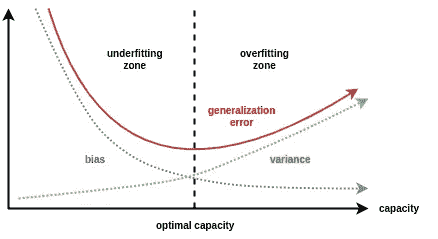

# 理解深度学习需要重新思考概括

> 原文：<https://medium.com/analytics-vidhya/understanding-deep-learning-requires-re-thinking-generalization-fe94889bb14c?source=collection_archive---------16----------------------->

以下分析是我对 ICLR 2017 论文的解读***理解深度学习需要重新思考概括***([arXiv 链接](https://arxiv.org/pdf/1611.03530.pdf))。这篇论文获得了 2017 年 ICLR 三个**最佳论文奖**之一。我喜欢读这篇论文，因为它质疑了学习模型中对泛化的传统理解，以及正则化如何不是泛化的唯一原因。

