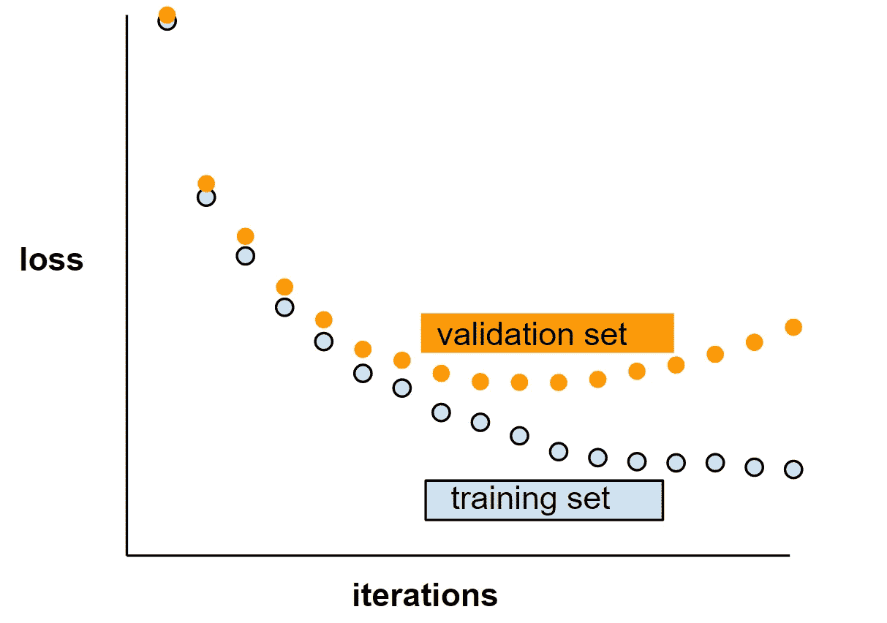
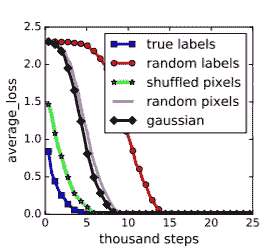
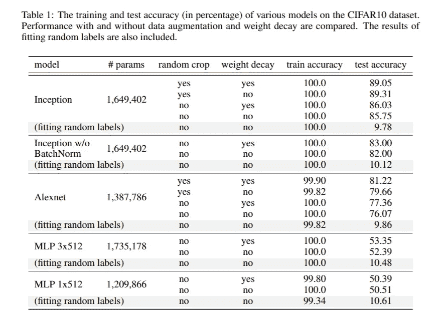

# 理解深度学习需要重新思考泛化

> 原文：<https://medium.com/analytics-vidhya/understanding-deep-learning-requires-rethinking-generalization-7e7759eb6035?source=collection_archive---------6----------------------->

在这篇文章中，我将向您简要介绍由**【张】** ( [链接此处](https://arxiv.org/pdf/1611.03530.pdf))撰写的论文“**理解深度学习需要重新思考泛化**”。

卷积神经网络(CNN)

我认为你对卷积神经网络(CNN)非常熟悉。如果没有，我建议你从维基百科上阅读。

论文“**理解深度学习需要重新思考泛化**”在深度学习和机器学习研究社区引起了不小的轰动。这是一篇罕见的论文，似乎具有很高的研究价值——从在 2017 年[ICLR](http://www.iclr.cc/doku.php?id=ICLR2017:main&redirect=1)获得三个*最佳论文*奖之一来看——但*也*可读。因此，它在 [OpenReview](https://openreview.net/forum?id=Sy8gdB9xx&noteId=Sy8gdB9xx) 上获得了所有 ICLR 2017 年提交作品中最多的评论。

# 关键要点

1.  *深度神经网络很容易拟合随机标签。*
2.  *显式正则化可以提高泛化性能，但是对于控制泛化误差来说，显式正则化既不是必要的，也不是充分的。*

# **但是什么是*概括和概括曲线呢？***

*按照*[*developers.google.com*](https://developers.google.com/machine-learning/crash-course/generalization/video-lecture)*，* ***“泛化是指你的模型对新的、以前未见过的数据进行适当适应的能力，从与用于创建模型的分布相同的分布中提取”*** 。*简单来说就是*【训练误差】*和【测试误差】*的区别。

一条**损失曲线，显示了 [**训练集**](https://developers.google.com/machine-learning/glossary#training_set) 和 [**验证集**](https://developers.google.com/machine-learning/glossary#validation_set) 。一般化曲线可以帮助您检测可能的 [**过度拟合**](https://developers.google.com/machine-learning/glossary#overfitting) 。例如，下面的泛化曲线表明过度拟合，因为验证集的损失最终会明显高于定型集。([参见](https://developers.google.com/machine-learning/glossary#generalization-curve))**

****

# **但是什么是正规化呢？**

**正则化对模型的复杂性施加惩罚，从而防止 [**过度拟合**](https://developers.google.com/machine-learning/glossary#overfitting) 。它确实在深度学习中扮演了一个有趣的角色。它就像一个调整参数，以减少模型的最终测试误差。([参见](https://developers.google.com/machine-learning/glossary#regularization))**

**正则化有两种类型:**

1.  **显式正则化( ***权重衰减*** ， ***丢失*** 和 ***数据增强*** )**
2.  **隐式正规化( ***提前停止，批量正规化*** *和* ***SGD*** )**

> *****【深度神经网络轻松拟合随机标签】*****

**他们进行了随机化测试，其中他们在数据副本上训练了几个预训练的模型，其中真实标签被随机标签取代，令人惊讶的是，神经网络实现了 0 训练误差。**

**他们还为基于 CIFAR10 和 ImageNet 分类基准测试的几种不同的标准架构确定了这一事实，并得出结论:**

1.  ***神经网络的有效容量足以记忆整个数据集*。**
2.  ***训练时间*无明显变化。**
3.  ***随机化标签仅仅是一种数据转换，学习问题的所有其他属性保持不变*。**

**在这些实验的基础上，他们还用*完全随机的像素*(例如高斯噪声)替换了真实图像，并观察到卷积神经网络继续以零训练误差拟合数据。**

**这表明，尽管它们的结构不同，卷积神经网络可以适应 ***随机噪声*** 。随着我们提高噪声水平，神经网络能够捕获数据中的剩余信号，同时使用蛮力拟合噪声部分。**

****

**显示了随着训练步骤衰减的各种实验设置的训练损失。**

## **[**显式正则化**](https://statistics.stanford.edu/events/implicit-and-explicit-regularization-deep-learning)**

> ****“显式正则化可能会提高泛化性能，但对于控制泛化误差来说，它既不是必要的，也不是足够的。”****

**正则化的显式形式，如 ***权值衰减*** 、 ***丢包*** 、 ***数据增强*** 并不能解释神经网络的泛化误差。他们发现，正则化在深度学习中扮演着相当不同的角色。它看起来更像是一个调整参数，通常有助于改善模型的最终测试误差，但没有全部正则化并不一定意味着较差的泛化误差。**

## **[***隐式正规化***](https://statistics.stanford.edu/events/implicit-and-explicit-regularization-deep-learning)**

> **"**对于线性模型，SGD 总是收敛到具有小范数的解。因此，算法本身是隐式正则化解决方案。****

*   ***它只是让我们得出这样的结论:对于 SGD 如何在正则化它的同时影响一个模型，以及它如何影响一个模型的其他属性，还需要更多的理解。***

******

***CIFAR10 数据集上各种模型的训练和测试精度(百分比)。比较了具有和不具有数据增加和重量衰减的性能。还包括拟合随机标签的结果。***

***总之，从我不断增长的深度学习经验来看，我发现他们的实验结果令人惊讶。也许这将是理解深度学习中泛化的一个有用的起点。***

## ***感谢你的阅读，如果你喜欢这个故事，请为它鼓掌。***

***在**linkedIn**:[https://www.linkedin.com/in/kalp-panwala-72284018a](https://www.linkedin.com/in/kalp-panwala-72284018a/)上和我联系***

***在**推特**:【https://twitter.com/PanwalaKalp 上关注我***

***跟着我上**github:**[https://github.com/kpanwala](https://github.com/kpanwala)***

***如果你对这个故事有任何疑问或者任何改进的空间，那么给我发邮件到**kpanwala33@gmail.com**。***