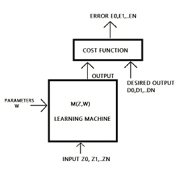
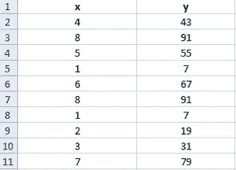
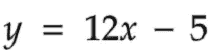
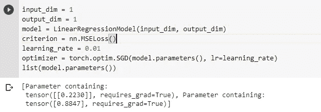
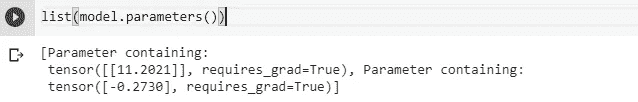
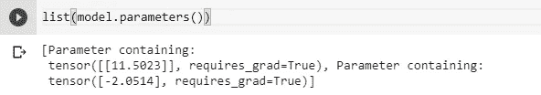
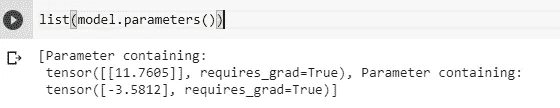
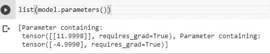
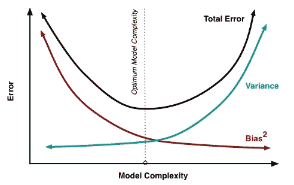

# 学习和推广——理解有效的反向投影第 1 部分

> 原文：<https://medium.com/analytics-vidhya/understanding-efficient-backprop-part-1-learning-and-generalization-1cd76bb4fd69?source=collection_archive---------26----------------------->

# 介绍

自从我开始探索广阔的机器学习领域中的各种基本概念以来，我开始遇到一些令人难以置信的研究论文，这些论文只是让我着迷，让我更深入地研究它们。Yann Lecun、Leon Bottou、Genevieve Orr 和 Klaus-罗伯特·穆勒撰写的《高效反向传播》就是这样一篇论文，它激励我写更多关于它的文章，试图更好地理解它。

考虑到我在这个领域相对来说还是个新手，我在理解这篇论文的过程中写了这篇博客。所以请让我知道是否有我可能忽略的错误。因为这篇研究论文很长，所以这个博客系列将被分成不同的主题，使它更有条理，更容易理解。

**Yann le Cun 的《高效反向传播》中探讨的主题**

1.  学习和概括
2.  标准反向传播
3.  梯度下降的收敛性
4.  经典二阶优化方法
5.  多层网络中的 Hessian 分析
6.  将二阶方法应用于多层网络

# **基于梯度的学习**

*‘采用基于神经网络的预测模型的学习算法基本上是一个优化问题，以获得导致最小误差能量状态的参数。’*

基于梯度的学习是本文介绍的第一个主题。它首先陈述了在处理自动机器学习时大多数成功的方法是如何涉及到基于梯度的学习方法的。但是你这么说是什么意思呢？解释这个概念的一个非常概括的方法是通过下面给出的图表。

基于梯度的学习机

这是一个一阶优化模型。术语“一阶”在这里指的是需要至少一个一阶导数/梯度的算法。从上面给出的图中，输入模式被给定为 Z0、Z1、Z2 等等，其中 W 指的是代表其可调参数的模型的权重。在训练模型时，应用成本函数(通常是均方误差函数)来计算预测输出和期望输出之间的差异。因此，在训练集上计算所有误差的平均值，并调整权重。该过程重复发生以最小化成本函数。

如果这很难理解，让我们用一个小例子来说明这个过程。

所以我做了一个非常小的数据集，有十个值，每个值包含一个输入(x)和一个输出(y)值。现在，我们知道这里使用的公式是:

但是，我们的模型将提供的只是 x 和 y 的值。它不知道这两者之间存在的线性关系。这个系统能够自己学习的唯一方法是不断更新它的参数，直到它精确地满足给定的数据集。

如图所示，x 的值对应于 Zn 的输入值。权重 W 被随机初始化，并被提供给本例中使用的线性回归模型。

训练前初始化权重的输出值

接下来，我们运行这个模型 100 个时期，并列出更新的参数。重新调整后的重量值如下。

如前所述，这种调整是因为成本函数计算了值之间的误差差并更新了权重。现在这个更新的整个过程被称为反向传播，稍后会有更详细的解释。

现在，从输出中很容易看出第一个系数几乎接近实际系数。但是第二个值差得太远了。所以我们再次重复这个过程。

分别在 200、400 和 600 个时期后更新的权重值

虽然这些值并不完全相同，但很明显，该模型现在已经开始了解这两个变量之间的关系，因此可以逐步产生更准确的结果，同时将损失降至最低。

这是一个演示简单线性关系的小例子。当数据集的大小增加并且提供不同的样本集时会发生什么？或者我们如何优化一个需要分类算法而不是回归的模型？在这种情况下，仅仅降低成本函数是不够的。这就是我们引入一个叫做泛化的概念的地方。

# 一般化

泛化是模型为一个全新的数据集预测正确目标值的能力，该数据集未经训练。这种技术很大程度上试图通过最小化或纠正训练集中引入的错误来优化学习。这个过程也被称为经验风险最小化。经验风险最小化背后的基本原理是将训练模型的问题转化为优化问题。它通常集中在两个部分，损失函数和正则化器，正则化器用于惩罚所涉及的参数的某些值。一个超参数也被用来保持两者之间的平衡。这是一个非常简单的解释，但你可以在这里阅读更多相关内容。与 ERM 相关的文章对 ERM 进行了简明的解释，并给出了损失函数、正则项和一些特殊情况的演示。

大多数最小化过程的分析都是通过将泛化误差分解为两项来完成的——偏差和方差。偏差是网络中可以学习的参数，就像权重一样。它给出了跨不同数据集样本的所有网络输出的平均值与所需输出之间差异的总度量。同时，方差是指与预测平均值的偏差。只有当这两个值都达到最小值时，才能实现最小误差。

从上面显示的图表中，我们可以理解，训练的初始阶段出现了较大的偏差和较低的方差。然而，随着训练的进行，这种情况很快就会逆转，因为网络现在开始学习得更好。但这是否意味着一个模型被训练的时间越长，效率就越高？不会。必须指出的重要一点是，如果网络训练时间过长，它也会理解噪声(无意义的信息)并适应训练数据集中的特定特征。这就是所谓的“过拟合”问题。早期停止和正则化是用来防止它的一些技术，稍后将详细介绍。这一点证明，即使实现了优秀的成本最小化策略，对推广产生负面影响的不适当的模型选择也会导致整个网络变得低效。

# 摘要

本文主要基于两个主题——机器学习中的学习和推广。我们能够通过一个小例子来说明基于梯度的学习的一些基本概念。还讨论了概括在准确性和优化方面的重要性。简要说明了经验风险最小化和分析泛化误差的因素。我希望这篇文章能够帮助你理解或者至少给你一个关于我所写的主题的想法。下一篇文章将关注标准的反向传播以及一些实用的技巧，包括初始化权重、改组示例、标准化输入值等等。

*感谢您的阅读！*

# 参考

1.  [**高效反向推进—**](http://yann.lecun.com/exdb/publis/pdf/lecun-98b.pdf) ***扬·勒昆、莱昂·博图、吉纳维芙·奥尔和克劳斯-罗伯特·穆勒***
2.  [比较用于优化预测神经网络的基于梯度的学习方法](http://ieeexplore.ieee.org.egateway.vit.ac.in/document/6799573?arnumber=6799573)
3.  [经验风险最小化](http://www.cs.cornell.edu/courses/cs4780/2015fa/web/lecturenotes/lecturenote10.html)
4.  [成本函数和梯度下降](https://towardsdatascience.com/machine-learning-fundamentals-via-linear-regression-41a5d11f5220)
5.  [机器学习中的泛化](https://developers.google.com/machine-learning/crash-course/generalization/video-lecture)
6.  [机器学习中的泛化、正则化、过拟合、偏差和方差](https://towardsdatascience.com/generalization-regularization-overfitting-bias-and-variance-in-machine-learning-aa942886b870)