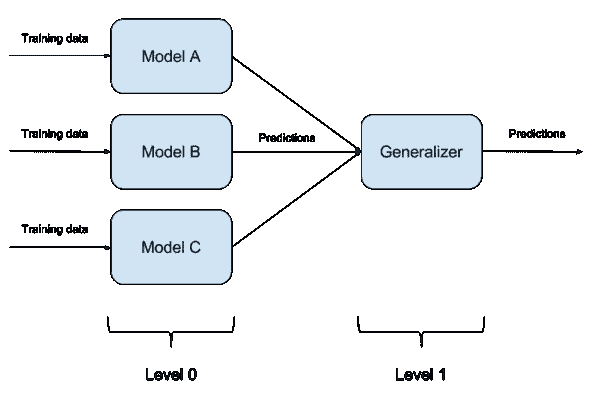

# 理解合奏技巧！！！

> 原文：<https://medium.com/analytics-vidhya/understanding-ensemble-techniques-4a70a4382cfd?source=collection_archive---------15----------------------->


# 内容:

1.  什么是系综方法？
2.  集合方法背后的直觉！
3.  不同的合奏方法
    *装袋
    →装袋背后的直觉
    *助推
    →助推背后的直觉
    *堆叠
    →堆叠背后的直觉
    *桶模型

# 什么是系综方法？

*   集成方法是创建多个模型，然后将它们组合起来以产生改进结果的技术。
*   *与单一模型相比，这种方法可以产生更好的预测性能。*
*   集合方法通常比单一模型产生更精确的解。这是许多机器学习竞赛中的情况，获胜的解决方案使用了集成方法。

# 合奏背后的直觉:


布鲁斯·马尔斯在 [Unsplash](https://unsplash.com?utm_source=medium&utm_medium=referral) 上拍摄的照片

→假设你是一个建筑巨头，被给予一个建造摩天大楼的项目，你请来了一位建筑师为你建造结构蓝图，你喜欢这个设计，但你发现它有很多缺陷。

→所以你请来了一群建筑师，他们互相讨论，创造出最好的建筑，几乎没有缺陷。

集成技术是相似的，建立多个模型以做出最准确的预测。

# 不同类型的集成技术

集成技术有 3 种类型:

## →装袋:

*   **Bootstrap Aggregation(或 Bagging)** 是一种机器学习集成元算法，旨在提高统计分类和回归中使用的机器学习算法的稳定性和准确性。
*   这也减少了*差异，并有助于避免过度拟合*。虽然它通常应用于决策树方法，但它可以用于任何类型的方法。
*   **装袋**是模型平均法的一个特例。
*   ***Bootstrapping***是对单个数据集进行重采样以创建多个模拟样本的统计过程。
    样本是通过一次从数据总体中取出一个观察值，并在选择后将其返回给数据总体而得到的。
    这允许一个给定的观察值被多次包含在一个给定的小样本中。
*   **聚合**就是事物结合的过程。也就是说，把那些东西放在一起，这样我们就可以统称它们。
    换句话说，自举样本被建模，结果被组合和产生。


**装袋背后的直觉:** 让我们继续前面为合奏技法产生的直觉。

→指定的建筑师小组被赋予一项任务，即查看设计，并提出一些东西来消除设计中的缺陷。这些建筑师现在分别针对缺陷提出了一个解决方案，并召开了一次会议，会上他们提出了解决方案，同时使用了每位建筑师提出的最合适的解决方案。

**装袋代码:**

```
from sklearn.tree import DecisionTreeClassifier
from sklearn.ensemble import BaggingClassifierdt = DesicionTreeClassifier()
bagging = BaggingClassifier(base_estimator = dt).fit(x,y)
```

## →升压:

> Boosting 指的是将弱学习者转换为强学习者的一系列算法。

*   **Boosting** 是一种集成方法，用于改进任何给定学习算法的模型预测。
*   **助推**的思路是顺序训练弱学习者，每个人都试图纠正前任。
*   这是通过从训练数据构建模型，然后创建第二个模型来尝试纠正第一个模型的错误来实现的。添加模型，直到训练集被完美预测或者添加了最大数量的模型。
*   它*减少了模型的偏差*。


**助推背后的直觉:** 继续使用早期的直觉方法进行集成

→建筑师可以采用的完成完美设计的另一种方法是。

→许多建筑师中的一个从设计中的修正开始，当他/她完成时，他/她将他的结果传递给另一个。

→另一位建筑师查看修改后的设计，再次进行必要的修改，然后交给另一位建筑师。

→这个过程会一直持续下去，直到设计的文案经过所有建筑师，到达最后一个。

→结果将会有一个新的设计副本，其中包含已纠正的缺陷。

**升压代码:**

```
from sklearn.tree import DecisionTreeClassifier
from sklearn.ensemble import AdaBoostClassifierdt = DecisionTreeClassifier()boosting = AdaBoostClassifier(base_estimator=dt)
```

> 装袋并行处理工作，增压则按顺序进行。


## →堆叠

*   **堆叠(或堆叠泛化)**是一种集成学习技术，将多个分类或回归模型与元分类器或元回归器相结合。
*   基于完整的训练集来训练基础级模型，然后在基础级模型类特征的输出上训练元模型。
*   堆叠的好处在于，它可以利用一系列表现良好的模型在分类或回归任务中的能力，并做出比集合中的任何单个模型都更好的预测。



**堆叠背后的直觉:** 继续举一个例子，一个建筑巨头想要一个完美的设计，于是带来了多个建筑师。

*   现在，每个建筑师都做出了自己最好的设计
*   设计完成后，这些设计被发送给首席架构师。
*   然后，每一个设计都要经过首席建筑师的审核，并组合成一个完美的建筑设计。

**堆垛代码:**

```
from sklearn.linear_model import LogisticRegression
from sklearn.neighbors import KNeighborsClassifier
from sklearn.ensemble import RandomForestClassifierfrom mlxtend.classifier import StackingClassifierLog_model = LogisticRegression()
KNN_model = KNeighborsClassifer()
Rnd_model = RandomForestClassifier()stack = StackingClassifier(classifier = 
                           [KNN_model,Rnd_model],
                           meta_classifier = Log_model)
```

## →一桶模型

*   “模型桶”是一种集成技术，其中模型选择算法用于为每个问题选择最佳模型。
*   当只对一个问题进行测试时，一组模型不会比集合中的最佳模型产生更好的结果，但是当对许多问题进行评估时，它通常会产生比集合中的任何模型平均好得多的结果。
*   输入:
    —您想要使用的型号。
    —一个数据集。
*   学习算法:
    —使用 10-CV 估计所有模型的误差
    —挑选最佳(10-CV 误差最低)模型。
    —在数据集上训练模型并返回结果。

# 快乐学习！！！

喜欢我的文章？请为我鼓掌并分享它，因为这将增强我的信心。此外，我每周日都会发布新文章，所以请保持联系，以了解数据科学和机器学习基础系列的未来文章。

另外，请务必在 LinkedIn 上与我联系。


弗雷德里克·杜比蒙特在 [Unsplash](https://unsplash.com?utm_source=medium&utm_medium=referral) 上拍摄的照片