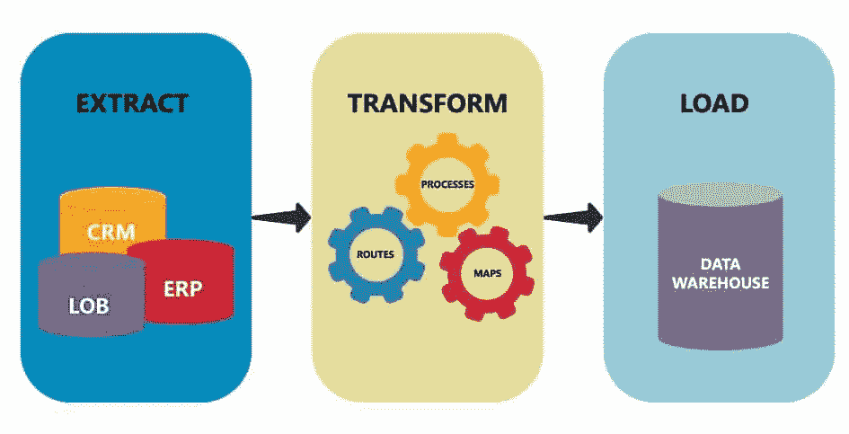

# 了解 ETL 管道

> 原文：<https://medium.com/analytics-vidhya/understanding-etl-pipeline-76718d299a08?source=collection_archive---------4----------------------->

提取-转换-加载(来源: [Astera](https://www.astera.com/wp-content/uploads/2019/07/ETL-e1563879776366.jpg)

# 概观

通常，流水线是用于在连续步骤中设计或执行计算机指令的专用模块的线性序列。类似地，数据管道是将数据从一个地方移动到另一个地方的通用术语。例如，它可以将数据从一台服务器移动到另一台服务器。

在现有的众多数据管道方法中，本文简要讨论了最常用的 ETL 管道。

本文概述:

*   ETL 管道简介
*   例子
*   ETL 管道中的阶段

ETL 管道的一个小示例代码可以在我的 [GitHub](https://github.com/chaitanyakasaraneni/etl_example) 中找到。

# ETL 管道简介

ETL 是一种特殊的数据管道，使用非常普遍。ETL 代表提取、转换、加载。顾名思义，ETL 管道由三个不同但相互关联的步骤组成。它用于编排来自多个数据源的数据，不是一次而是多次，以构建数据存储系统，如数据仓库、数据中心或数据湖，以支持企业分析或数据共享。

# 例子

假设有一个包含 web 日志数据的数据库。数据中的每个条目都包含用户的 IP 地址、时间戳和用户点击的链接。

设想一个场景，您希望按城市和日期运行链接点击分析。您将需要另一个数据集来将 IP 地址映射到城市，并且您还需要从时间戳中提取日期。

使用 ETL 管道，您可以每天运行一次代码，提取前一天的日志数据，将 IP 地址映射到城市，按城市聚集链接点击，然后将这些结果加载到新的数据库中。这样，数据分析师或科学家就可以按城市和日期访问日志数据表。这比总是在原始 web 日志数据上运行相同的复杂数据转换更方便。

使用 ETL 管道是有意义的，因为在使用云计算之前，公司和企业习惯于将他们的数据存储在昂贵的私有服务器上，并且在巨大的数据集上运行查询在时间和经济方面可能非常昂贵。

# ETL 中的阶段

在将数据加载到数据存储系统之前，必须按顺序准备数据。ETL 管道中的步骤组合提供了一些功能来确保实现应用程序的业务需求。

基本 ETL 管道可以分为以下几个阶段:

*   从各种来源提取数据
*   转换数据并为未来运营做好准备
*   将数据加载到所需的存储系统中

现在，让我们简要地看一下每个步骤。

## 数据析取

ETL 中提取过程的目标是轻松地从源中检索所有需要的数据。可以从中提取数据的最常见的数据源有:

1.  数据库
2.  文件
3.  网
4.  其他来源，如用户订阅源(RSS 订阅源)

理解数据是如何从源产生的以及它可以被存储的格式是非常重要的。数据科学中常见的文件格式有:

*   CSV: CSV 代表逗号分隔的值。这些类型的文件用逗号分隔值，每个条目在单独的一行上。通常，第一个条目会包含变量名。
*   JSON: JSON 是一种带有键/值对的文件格式。它看起来像一本 Python 字典。数据中的每一行都在波形括号{}内。变量名是键，变量值是值。
*   XML:就格式而言，XML 与 HTML 非常相似。两者的主要区别在于 HTML 有标准化的预定义标签。在 XML 中，可以根据数据集定制标签。这是同样的数据看起来像 XML 的样子。
*   DB 文件(SQL 数据库):SQL 数据库使用[主键和外键](https://docs.microsoft.com/en-us/sql/relational-databases/tables/primary-and-foreign-key-constraints?view=sql-server-2017)在表中存储数据。
*   文本文件:文本文件(。txt)将只包含文本。

## 数据转换

提取数据后，需要为下一个任务做好准备，该任务可能是数据分析或作为机器学习的输入。

例如，数据工程师和数据科学家经常处理来自多个来源的数据。他们可能需要从 CSV 文件中提取一些数据，从 SQL 数据库中提取其他数据，然后将这两个数据集组合在一起。因此，原始数据集被转换以创建新的数据集。

数据的转换包括:

*   清理和组合来自多个来源的数据
*   使用编码
*   处理数据中的虚拟变量、重复行和异常值
*   根据需要对数据进行规范化
*   工程新功能

## 数据加载

ETL 管道的最后一步是“加载”。既然数据被转换了，它必须被存储在某个地方，否则进度将会丢失。存储转换后的数据有许多选择。选择什么选项取决于业务需求。

举个例子，

*   结构化数据可以存储在 SQL 数据库中
*   如果数据适合 pandas 数据框，则可以将其存储在 CSV 文件中

除了 SQL、CSV 或 JSON 之外，存储转换数据的一些方法可以在链接[中找到。](https://db-engines.com/en/ranking)

# 其他数据管道

自从云计算出现以来，ELT (提取、加载、转换)管道受到了关注。云计算降低了在大型原始数据集上存储数据和运行查询的成本。许多云服务，如[亚马逊红移](https://aws.amazon.com/redshift/)、[谷歌大查询](https://cloud.google.com/bigquery/)或 [IBM Db2](https://www.ibm.com/cloud/db2-warehouse-on-cloud) 可以使用 SQL 或类似 SQL 的语言进行查询。使用这些工具，数据被提取出来，然后直接加载，最后在管道的末端进行转换。

# 摘要

在本文中，我们已经看到了 ETL(提取、转换、加载)管道的简要介绍，以及每个步骤的概述。ETL 管道的一个小例子可以在我的 [GitHub](https://github.com/chaitanyakasaraneni/etl_example) 中找到。看一看它，了解 ETL 管道的工作。

希望你通过阅读这篇文章获得了一些知识。请记住，这篇文章只是一个概述，是我从各种在线资料中读到的对 ETL 管道的理解。