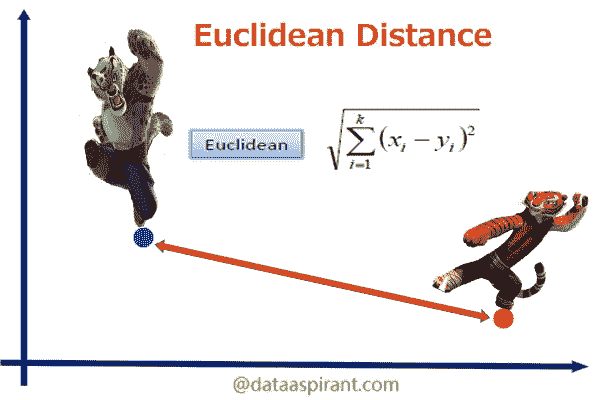
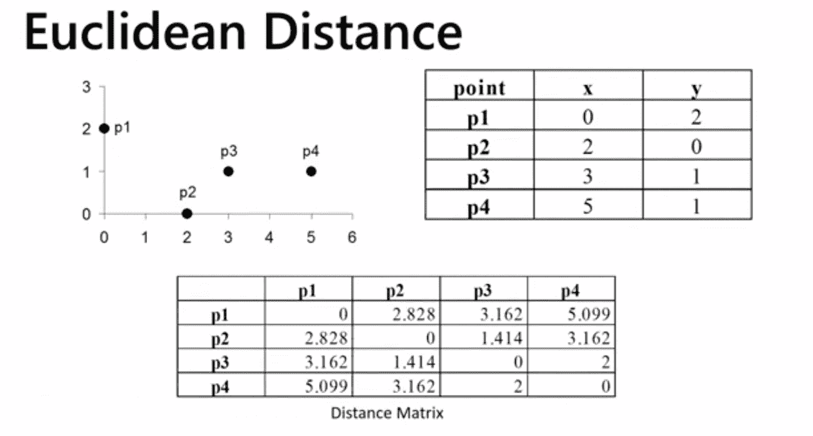
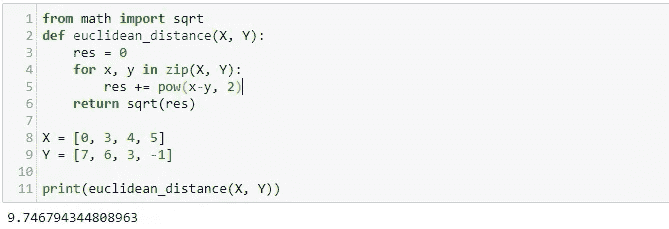
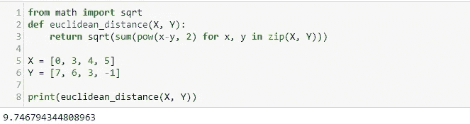
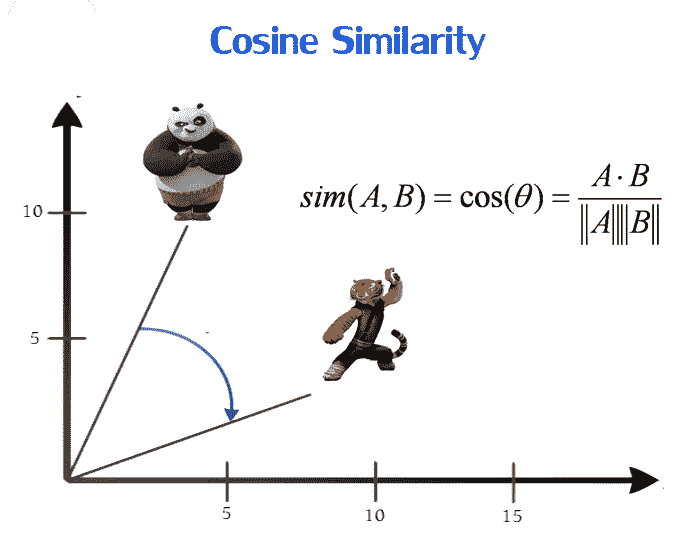
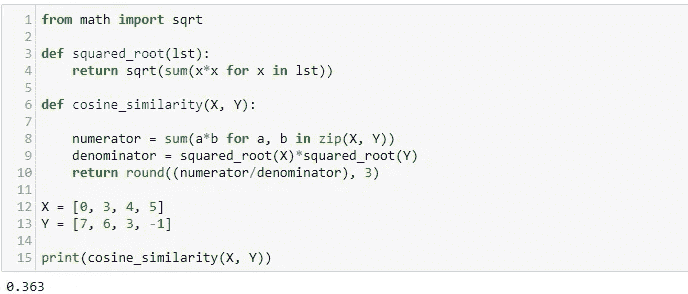
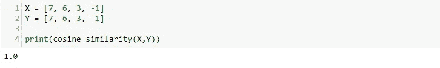

# 相似地理解欧几里德距离和余弦

> 原文：<https://medium.com/analytics-vidhya/understanding-euclidean-distance-and-cosine-similartiy-5d5c7a78a77c?source=collection_archive---------10----------------------->

保罗·尼科勒洛在 [Unsplash](https://unsplash.com?utm_source=medium&utm_medium=referral) 上的照片

寻找相似性是 NLP 最吸引人的想法之一，这里的想法是找到两个句子彼此有多相似，或者给定的两个图像或文档或两个声音彼此有多相似。

这里[提到了 5 种流行的技术](http://dataaspirant.com/2015/04/11/five-most-popular-similarity-measures-implementation-in-python/)

这里，我们将从欧几里德距离开始，然后将主要集中在 coisne_similarity 上。我还将展示这两种方法的 python 代码。

# 欧几里得距离

在欧几里得距离中，我们基本上找到了两点之间的距离，利用勾股定理，两点之间的欧几里得距离越小，这两点之间的相似性就越大

从上表可以看出，两个极值点 p1 和 p4 之间的欧几里德距离是 5.099，而相邻点 p2 和 p3 之间的欧几里德距离是 1.414

> 欧几里德距离的美妙之处在于，它还能帮助我们确定 n 维空间中的距离。

## 密码

或者，我们可以使用列表理解来实现上述相同的欧几里德距离

# **余弦相似度**

因此，正如我们从上面的余弦相似度图中看到的，顾名思义，我们找到了两点之间角度的余弦值

> 余弦相似度的值越高，这两个点在向量空间中就越相似。

余弦相似度基本上是用来寻找两个文档或者两个句子之间的相似度。现在，假设两个文档 a 和 b 文档是其他文档 a 和⊆ B 的片段，那么如果我们选择一个单词，比如在两个文档中都常见的单词 *cricket* ，那么 a 中 cricket 的次数很可能会比文档 b 中的少得多。这里，欧几里德距离的值可能会因为巨大的差异而产生误导，因此在这种情况下，我们会选择余弦相似度，因为它有助于我们解决这个问题。

# 密码

取向量空间中的同一点

*在这篇文章中，我留下了一些开放的观点，为什么余弦相似性起作用，或者当记录 A ⊆ B 时它如何中和，但是字数不同。我将在下一篇文章中解释这一点。*

*谢谢*