# 了解脸书的 GrokNet——一个用于商业应用的图像识别系统

> 原文：<https://medium.com/analytics-vidhya/understanding-facebooks-groknet-an-image-recognition-system-for-commerce-applications-54dde2096f19?source=collection_archive---------8----------------------->

脸书是世界上数据最丰富的公司之一。脸书的 Groknet 是最先进的产品识别系统。该模型在几个商业垂直领域的 7 个数据集上进行训练。

脸书的市场已经成为全球销售和购买产品的巨大平台。当用户上传一个产品，产品的描述包括颜色，价格，地点，品牌，生产年份等。当描述完全或部分缺失时，用户可能会感觉不好。因此，脸书决定使用用户上传的图片来补充缺失的信息。

Groknet 可以分析图像并预测:

1.  对象类别:“酒吧凳子”、“围巾”、“地毯”、“地毯”…
2.  家居属性:物品颜色，材质，装饰风格，
3.  时尚属性:款式，颜色，材质，袖长，…
4.  车辆属性:品牌、型号、外部颜色、年代、
5.  搜索查询:用户可能用来在市场搜索中找到产品的文本短语，
6.  图像嵌入:256 位哈希用于识别确切的产品，查找和排列相似的产品，提高搜索质量。

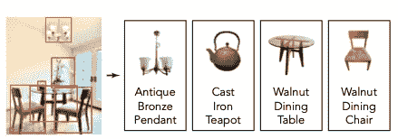

Groknet 识别图像上的所有产品

Groknet 在人类注释、用户生成的标签和嘈杂的搜索引擎交互数据上接受训练。

# 数据准备

GrokNet 旨在解决大量的计算机视觉任务。数据集由来自 7 个不同数据集的 8900 万张 Facebook Marketplace 图片组成。它使用 80 个分类损失函数和 3 个嵌入损失。

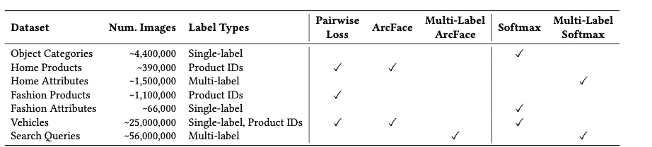

8900 万张图片的训练数据

## 对象类别

对象类别来自内部人工注释的市场图像数据集，有 566 个标签，如“椅子”、“手镯”和“自行车”。

## 属性(时尚、家居和交通工具)

在训练中使用时尚、人和车辆属性的多标签注释。

对于家居产品，颜色和材料是一些属性。

## 产品身份(时尚、家居和汽车)

同一产品的不同图像将在数据集中具有相同的 id。

## 弱监督数据扩充

获取产品 id 是非常困难的任务。他们用下面的方法完成了这个琐碎的任务。

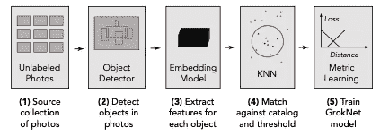

正如我们可以观察到的，从未标记的照片中检测到对象，并为每个对象提取特征。这些嵌入中的每一个都用于从已知产品中寻找最佳匹配。如果嵌入之间的距离小于阈值，则判定匹配。

(脸书团队使用的阈值为 0.2)

## 市场搜索查询

收集来自搜索日志的图像-查询对的数据集。有几个图像可用，用户也搜索了很多产品。使用以下过程中的查询来标记图像。

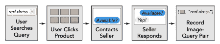

# 体系结构

Groknet 是一个卷积神经网络，构建为 FBLearner 框架中的分布式 pytorch 工作流。它使用 ResNeXt-101 32×4d，有 101 层，32 组，组宽 4 (8B 乘加触发器，43M 参数)。

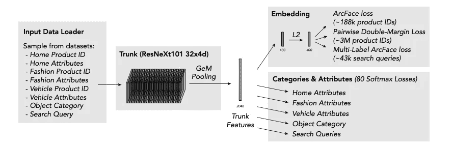

格罗耐特建筑

## 宝石池

广义平均池是一种参数化池操作，它相当于 p = 1 时的平均池和 p = ∞时的最大池。直观上，这允许嵌入将网络的更多注意力集中到每个特征的图像的显著部分。“p”是一个可学习的参数，它收敛到 3。

# 损失函数

由于 Groknet 试图在单个架构中实现不同的任务，因此它使用多个损失函数的加权和。

为了训练 80 个类别和属性标题，使用了 Softmax 和多标签 Softmax。

为了训练统一嵌入头，使用了在相同空间上操作的 3 个度量学习损失——ArcFace、多标签 arc face 和成对嵌入损失。

## 软最大损失

使用具有交叉熵损失的 softmax 向模型添加分类标签。添加的类别相互排斥。有 80 个组，因此有 80 个 softmaxes。

softmax 的公式为

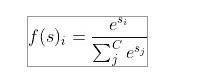

软最大损失

其中 s 是概率分数，C 是类别数

## 多标签弧面损失

弧面是用于深度人脸识别的附加角裕度损失。弗罗穆拉群岛

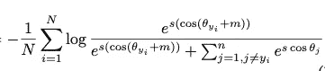

Wj ∈ Rd 表示权重 W ∈ Rd×n 的第 j 列，并且 bj ∈ Rn 是偏置项。WjT xi =∨Wj∨Xi∨cosθj，其中θj 是权重 Wj 和特征 Xi 之间的角度。m 是保证金罚款。

Arc Face loss 期望每个训练示例只有一个标签。然而，我们的市场搜索查询数据集经常将每个产品图片与多个搜索查询相关联。为了解决这个问题，ArcFace loss 被扩展为允许每个影像有多个标注。

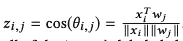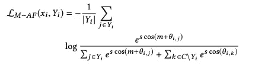

多标签弧面损失

## 成对双倍利润损失

弧面限制了可以包含在训练集中的产品数量，因为每个产品都需要自己的类向量。两个损失用加权和管理相同的嵌入空间。

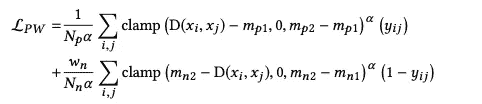

成对双倍利润损失

其中 xi 是嵌入点，yi j ∈ {0，1}。D(xi，XJ)= | | Xi XJ ||^2 是两点之间的距离的平方，Np 是正的数量，Nn 是负的数量，wn 是控制正和负的相对影响的权重，α是增加更难的例子的权重的损失功率，mp1、mp2 是正的双倍边距，mp1、mp2 是负的双倍边距。

通过首先预先计算完整的成对距离矩阵，可以有效地计算损失。

使用以下值:损耗功率α = 1.5，裕度 mp1 = 0.1，mp2 = 0.7，mn1 = 0，mn2 = 0.7，负权重 wn = 10000。

## 分布式成对计算

他们使用 GPU 来计算所有 GPU 和所有主机之间所有可能对的距离。

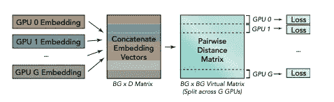

# 部署

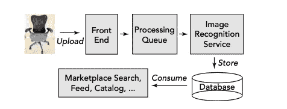

图像被上传并被安排在预测机器上运行，预测机器通过我们的卷积网络输入调整过大小的图像。

我们将输出存储在分布式键值存储中，并将其用于市场搜索、Feed、目录等应用程序，这些应用程序会在新列表创建后的几秒钟内消耗我们的信号。

# 结论

在本文中，我们看到了 GrokNet 使用的数据和架构，它是一个强大的图像识别系统。

## 参考

[https://ai . Facebook . com/research/publications/grok net-unified-computer-vision-model-trunk-and-embedding-for-commerce](https://ai.facebook.com/research/publications/groknet-unified-computer-vision-model-trunk-and-embeddings-for-commerce)