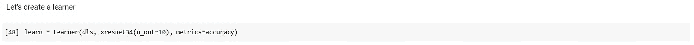
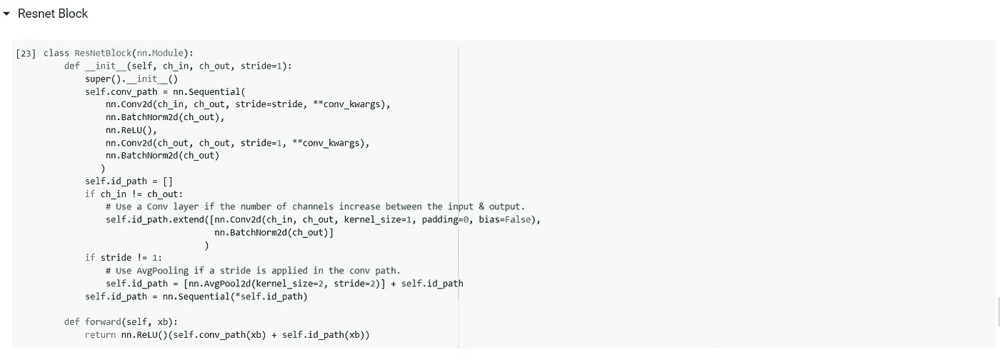
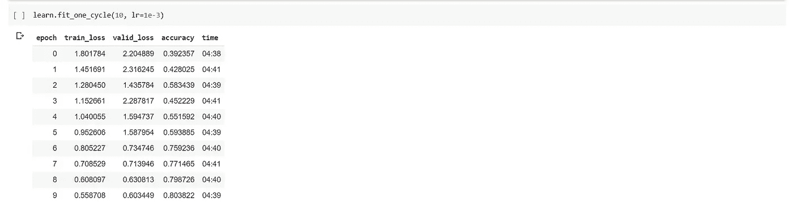

# 用计算机视觉例子理解 FastAI v2 训练-第 1 部分:Resnet 模型

> 原文：<https://medium.com/analytics-vidhya/understanding-fastai-v2-training-with-a-computer-vision-example-part-1-the-resnet-model-dd9270450bb8?source=collection_archive---------7----------------------->

图片来源:[https://wallpapercave.com/matrix-hd-wallpaper](https://wallpapercave.com/matrix-hd-wallpaper)

在这个系列中，我们将使用一个计算机视觉示例来研究 FastAI 训练循环。本系列的目标读者是那些已经熟悉 FastAI，并希望更深入地了解幕后发生的事情的人。我将假设对深度学习和 CNN 有基本的理解，并且不会对所有使用的术语提供解释。如果你需要任何主题的更多解释，我推荐 FastAI [*的免费在线课程《程序员实用深度学习》*](https://course.fast.ai/) *和相关的* [*书*](https://www.amazon.in/Deep-Learning-Coders-fastai-PyTorch-ebook/dp/B08C2KM7NR/ref=tmm_kin_swatch_0?_encoding=UTF8&qid=1602254377&sr=8-1) 。

该系列的总体结构如下:

1.  [研究 resnet34 模型架构，并使用普通 Python & PyTorch 构建它。](/@rakesh.melezhath/understanding-fastai-v2-training-with-a-computer-vision-example-part-1-the-resnet-model-dd9270450bb8)
2.  [深入研究 FastAI 优化器&实现一个 NAdam 优化器。](/@rakesh.melezhath/understanding-fastai-v2-training-with-a-computer-vision-example-part-2-fastai-optimizers-df65cb018604)
3.  [学习 FastAI 学习器和回调&用回调实现一个学习率查找器(lr_find 方法)。](/@rakesh.melezhath/understanding-fastai-v2-training-with-a-computer-vision-example-part-3-fastai-learner-and-a3ea85c6fe78)

这是该系列的第一篇文章，在这篇文章中，我们将研究 fastai 的 resnet34 模型架构，并在 PyTorch 中自行构建它。我们将使用 Imagenette 数据(由 FastAI 提供)，它是著名的 Imagenet 数据集的子集，仅包含 10 个相对容易区分的类。你可以点击阅读更多关于数据集[的信息。](https://github.com/fastai/imagenette)

首先，我们将使用 fastai 便利函数来快速创建和拟合一个优化的 Resnet34 模型，并使用它来研究模型架构。有了这样的理解，我们将使用普通的 Python & Pytorch 从头开始构建模型架构。我们将使用 Google Colab 来运行我们的代码。你可以在这里找到这个系列[的代码文件。](https://github.com/Rakeshsuku/Medium-Blog/tree/master/Understanding%20FastAI%20v2%20Training)

我们开始吧..！

运行以下代码，在 Google Colab 中安装 fastai v2。当您运行下面的第一个单元格时，您需要向您的 Google Drive 帐户提供授权。如果您需要更多信息，请在 Google Colab [这里](https://course.fast.ai/start_colab)查看运行 fastai v2 软件的说明。记住，在运行任何代码之前，为您的 Google Colab 会话启用 GPU。

untar_data()是一个下载数据的快捷函数。在这个系列中我们将会用到很多 fastai 函数，你可以使用 doc()函数来获得这些函数的帮助，如下所示。

## 使用数据块 API 设置数据加载器

我们将使用 fastai 数据块 API 为我们的模型创建数据加载器。我们不会在这里深入研究数据块 API，因为 FastAI 已经有一些关于它们的精彩教程。你可以在这里找到教程。

让我们创建一个标签字典，为我们的数据集提供英文标签，并在我们的数据加载器中使用它。

我们使用 Imagenet stats 来规范化我们的数据集。aug _ tranforms()函数用于在我们的数据加载器中应用数据扩充。让我们快速看一下这些是什么:

您可以使用 summary()方法跟踪创建数据加载器的所有步骤。如果在创建数据加载器时遇到错误，这种方法非常有用。

FastAI 转换管道使我们能够在应用增强转换后轻松地可视化我们的数据集。让我们从数据集中抽取一个样本，并在应用增强后生成它的多个副本。

您还可以使用 show_batch()方法从训练集中获取不同的图像，并在增强后可视化它们。

让我们从训练集中获取一批数据&检查形状。FastAI 使用默认的 batch size 64。数据加载器将输入图像转换为大小为[3，224，224]像素的张量，供我们的神经网络模型使用。

让我们使用 fastai 改进的 resnet34 架构来构建我们的图像分类模型。

现在，创建一个学习者对象来训练我们的模型。Learner 是 FastAI 中处理训练循环的基本类。学习者对象将数据加载器、神经网络模型、优化器和损失函数绑定在一起。FastAI 默认添加了一个 Adam 优化器&可以根据我们的目标变量的类型选择一个合适的损失函数。对于分类问题，它添加 CrossEntropyLoss()作为默认损失函数。

让我们使用 Learner 方法 learn.lr_find()找到一个合适的学习速率，并使用 learn.fit_one_cycle()使用 10 个时期的单周期学习来拟合模型。因为我们没有使用迁移学习，所以我们在这里为相对较多的时期训练模型。

哇！！！我们在 10 个时期内获得了 81.2%的准确率。

我们可以使用学习者对象的 learn.summary()方法来更好地理解我们的模型。summary()方法还显示了模型每一层的激活形状。注意，我们只是显示了下面总结方法输出的顶部和底部。

## xResnet34 模型架构

让我们了解所使用的模型架构。xResnet34 架构由 5 级卷积层组成:一个输入词干+ 4 级 Resnet 块(见下图)。每个 Resnet 块由 2 个 conv 层组成，具有从第一 conv 层的输入到第二 conv 层的输出的短路连接(相同路径)。在论文“ [*用于图像识别的深度残差学习*](https://arxiv.org/abs/1512.03385) 中描述的原始 resnet34 架构在其输入干中具有一个 7×7 卷积层，因此在其主路径中具有 34 个神经网络层(输入干中的 1 个 conv 层+ (2 个 conv 层/resnet 块)*16 个 resnet 块+ 1 个线性层)。FastAI 的 xresnet34 模型在其输入干中有 3 个 conv 层。通过在每个 resnet 块中添加更多的 conv 层来构建更深层次的 resnet 架构。我强烈推荐阅读“ [*深度残差学习用于图像识别*](https://arxiv.org/abs/1512.03385) ”和“ [*用卷积神经网络进行图像分类的锦囊妙计*](https://arxiv.org/abs/1812.01187) ”，以便更好地理解 resnet 架构&及其变体。

Resnet 架构

xresnet34 模型的完整架构如下:

xResnet34 架构。*BN: BatchNorm 层

“nn。上面 id 路径中的“Sequential([])”表示该路径中不存在神经网络层。xresnet34 架构在 **116 个参数张量** (nn)中有**2130 万个**可训练参数。代表权重和偏差的参数张量)如下所示。

xresnet34 架构中参数张量的数量

包含有计算参数个数公式的架构的 excel 文件可以在这里*(文件名:了解 xResNet.xlsx)。*

*现在让我们创建自己的 xresnet34 模型。首先，让我们创建输入词干。*

**

*接下来，我们将创建一个 resnet 块，并使用它来创建 resnet 阶段。resnet 块的结构如下。如果 resnet 块的输入和输出形状不同，则将跨距为 2 的 AveragePooling 层、内核大小为 1x1 的 Conv2d 层和 BatchNorm 层添加到标识路径中。*

**

*xResnet34 中的 resnet 块*

**

*xResnet34 中的 resnet 块*

*接下来让我们构建 resnet 阶段和完整的 xresnet34 模型。*

**

*resnet 阶段*

**

*xresnet34 型号*

*让我们将模型移到 GPU，并使用明凯初始化来初始化权重和偏差。*

**

*我们现在将使用我们自己的神经网络架构创建一个学习器，并像以前一样使用它来拟合分类模型。*

****

*找到了。！！我们在 10 个时期内达到了 80.38%的准确率。在下一篇文章中，我们将研究 FastAI 优化器并构建我们自己的 NAdam 优化器。*

*你可以在这里找到这个系列[的代码文件。](https://github.com/Rakeshsuku/Medium-Blog/tree/master/Understanding%20FastAI%20v2%20Training)*

***本系列其他文章的链接:***

*   *[*深入 FastAI 优化器&实现一个 NAdam 优化器。*](/@rakesh.melezhath/understanding-fastai-v2-training-with-a-computer-vision-example-part-2-fastai-optimizers-df65cb018604)*
*   *[*学习 FastAI 学习器和回调&用回调实现学习率查找器(lr_find 方法)。*](/@rakesh.melezhath/understanding-fastai-v2-training-with-a-computer-vision-example-part-3-fastai-learner-and-a3ea85c6fe78)*

***参考文献:***

1.  *[*程序员实用深度学习*](https://course.fast.ai/)*
2.  *[*FastAI GitHub 回购*](https://github.com/fastai/fastai)*
3.  *[*法泰书*](https://github.com/fastai/fastbook)*
4.  *[*FastAI 文档*](https://docs.fast.ai/index.html)*
5.  *[*用于图像识别的深度残差学习*](https://arxiv.org/abs/1512.03385)*
6.  *[*用卷积神经网络进行图像分类的锦囊妙计*](https://arxiv.org/abs/1812.01187)*
7.  *[*深挖整流器:在 ImageNet 分类上超越人类水平的性能*](https://arxiv.org/abs/1502.01852)*
8.  *[*Pytorch 文档*](https://pytorch.org/docs/stable/index.html)*

* [## 理解和可视化资源

### 这个帖子可以在这里找到 PDF 格式。

towardsdatascience.com](https://towardsdatascience.com/understanding-and-visualizing-resnets-442284831be8)*