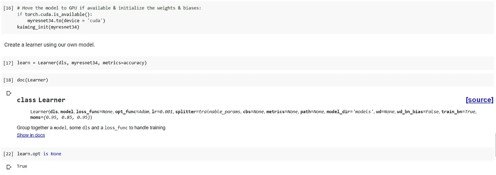
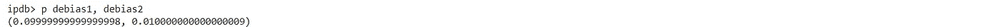

# 用计算机视觉例子理解 FastAI v2 训练-第 2 部分:FastAI 优化器

> 原文：<https://medium.com/analytics-vidhya/understanding-fastai-v2-training-with-a-computer-vision-example-part-2-fastai-optimizers-df65cb018604?source=collection_archive---------11----------------------->

图像来源:[端到端控制的空间不确定性采样](https://arxiv.org/abs/1805.04829)

这是本系列的第二篇文章。本系列的目标读者是那些已经熟悉 FastAI，并希望更深入地了解幕后发生的事情的人。该系列的总体结构如下:

1.  [研究 resnet34 模型架构，并使用普通 Python & PyTorch 构建它。](/@rakesh.melezhath/understanding-fastai-v2-training-with-a-computer-vision-example-part-1-the-resnet-model-dd9270450bb8)
2.  [深入研究 FastAI 优化器&实现一个 NAdam 优化器。](/@rakesh.melezhath/understanding-fastai-v2-training-with-a-computer-vision-example-part-2-fastai-optimizers-df65cb018604)
3.  [学习 FastAI 学习器和回调&用回调实现学习率查找器(lr_find 方法)。](/@rakesh.melezhath/understanding-fastai-v2-training-with-a-computer-vision-example-part-3-fastai-learner-and-a3ea85c6fe78)

在本文中，我们将使用上一篇文章中构建的 resnet 模型来理解 FastAI 优化器。我们将使用 Google Colab 来运行我们的代码。你可以在这里找到这个系列[的代码文件。我们直接开始吧。](https://github.com/Rakeshsuku/Medium-Blog/tree/master/Understanding%20FastAI%20v2%20Training)

首先，我们将从上一篇文章中快速重建我们的模型(参考第一篇文章中的解释)。

用于拟合模型的优化器保存在学习者对象的 learn.opt 属性中。在我们使用 fit()方法或其任何变体(如 fit_one_cycle)拟合模型之前，不会创建优化器对象。学习器构造函数的“opt_func”参数用于创建优化器。默认情况下，FastAI 会添加一个 Adam 优化器。此外，默认情况下，模型的所有可训练参数(即未冻结的所有层的参数)在创建时作为单个列表传递给优化器。

FastAI 优化器创建参数组，使我们能够为网络的不同部分设置不同的超参数值。默认行为是用模型的所有参数创建一个参数组。我们可以通过向优化器传递一个参数集合/生成器列表来创建多个参数组。我们将在第三篇文章中看到一个这样的例子，现在，让我们找到一个好的学习率，并训练一个时期的模型。

FastAI 优化器有 4 个主要属性:

1.  **param_list:** 参数列表的列表。每个内部列表形成一个参数组(稍后解释)。FastAI 使用一个名为“L”的定制列表。
2.  **hypers:** 超参数(学习率、权重衰减、动量等)字典列表。)每个参数组一个字典。
3.  **状态:**包含状态变量的字典，如平均梯度、平均平方梯度等。模型的所有参数。参数 p 的状态可以通过 opt.state[p]来访问。状态变量用于实现 Adam 这样的自适应优化器。
4.  **优化器回调:** FastAI 优化器在 opt.step()操作期间使用回调函数来更新参数&状态变量。我们将通过下面的例子来看看这是如何工作的。让我们检查一下 FastAI 添加到我们模型中的默认优化器。

**param_list:** 让我们先检查一下 param_list。

我们看到 param_list 是一个包含 L 个参数的 L，即 L(L(参数)，L(参数)，…)。每个内层 L 对应一个参数组。在我们的例子中，外部 L 中只有一个 L，因为 FastAI 默认只创建一个参数组。内部 L 包含 116 项是我们 xresnet34 模型中参数张量的个数(checkout [第一篇](/@rakesh.melezhath/understanding-fastai-v2-training-with-a-computer-vision-example-part-1-the-resnet-model-dd9270450bb8)看详情)。

xresnet34 架构中参数张量的数量

先来了解一下第一个参数“0.0.weight”。第一个“0”代表 nn。在输入词干之后，第二个“0”表示输入词干的第一层，它是一个 nn。Conv2d()。我们对这一层没有偏见，因为我们已经将 bias=False 传递给 nn。Conv2d()。“0.0.weight”的形状应为[32，3，3，3]，对应于 32 个输出通道、3 个输入通道和 3×3 内核。让我们检查一下这个。

模型的其他参数可以用类似的方式识别。

xresnet34 模型上 named_children 方法的部分输出

**hypers:** 优化器的“hypers”**属性存储超参数值。它是 L 个超参数字典，每个参数组有一个字典。因此，它允许我们为神经网络模型中的不同层(参数组)设置不同的超参数值(如微分学习率)。注意，我们这里只有一个参数组。让我们在上述 1 个时期的训练后检查超参数值。**

****

**Adam 优化器的超参数**

**上面的“mom”和“sqr_mom”是 Adam 参数更新规则中的 beta1 和 beta2。参考这篇文章 [*梯度下降优化算法的概述*](https://ruder.io/optimizing-gradient-descent/) 如果你想复习不同的优化算法。有多少参数组，我们就有多少超参数字典。使用 optimizer 对象的 set_hypers()方法更新超参数值。set_hypers()方法接受超参数名称&值对作为其参数。超参数值可以用以下格式之一指定:**

*   **单一值:超参数将在所有参数组中设置为相同的值。**
*   **list like object:列表的长度必须等于参数组的数量。每个参数组中的超参数将被设置为列表中相应的值。**
*   **切片对象:如果同时指定了“开始”和“停止”，参数组中的超参数将被设置为开始和停止之间的偶数倍，第一个参数组获得开始值，最后一个参数组获得停止值。如果没有指定“start”值(例如:slice(1e-3))，最后一个参数组中的超参数将获得“stop”值&所有其他参数组将获得值“stop”/10。**

****状态**:优化器的状态属性存储每个参数的状态。状态值用于实现 Adagrad、RMSprop、Adam 等自适应优化器。让我们在 1 个时期的训练之后，探索我们的模型中的几个参数的状态。**

****

**您可以看到 state 是一个长度为 116 的字典，参数作为键&它们的状态作为值。**

**我们模型中的最后一层是一个线性层，有 512 个输入激活和 10 个输出激活。让我们检查这一层的偏差参数，因为它只是一个长度为 10 的一维张量。优化器对象的 ***all_params()*** 方法为模型中的所有参数 p 返回 L((p，pg，state，hyper)，…)，其中 pg 是 p 所属的参数组，state 是 p 的状态，hyper 是参数组 pg 的超参数值(字典)。让我们用这种方法来研究状态。**

****

**上面，我们可以看到状态跟踪 Adam 优化器所需的 grad_avg & sqr_avg。“步骤”存储优化器步骤(即参数更新)的数量，这也是 Adam 更新规则所需要的。由于我们刚刚训练了 1 个时期的模型，并且我们的训练数据集的大小是 147 批，所以步长值是 147。**

**“do_wd”变量决定权重衰减是否应用于该参数。这由传递给学习者构造函数的参数“wd_bn_bias”(默认值:False)控制；默认值指定权重衰减不适用于所有偏移参数和所有 batchnorm 类型的参数(batch norm/实例规范/层规范)。学习者对象的 create_opt()方法将值为 False 的变量“do_wd”插入到这些参数的状态字典中。如果参数在其状态中包含“do_wd”且值为 False，则在 step()操作期间不会应用权重衰减。请注意，create_opt()方法通过调用传递给学习者构造函数的“opt_func”方法来创建优化器对象。**

**如果学习器构造函数的“train_bn”参数设置为 True(默认值)，create_opt()方法还会在批处理规范类型参数的状态字典中存储一个名为“force_train”的变量(值= True)。该变量导致批量定额参数被训练，即使它们属于转移学习设置中的冻结层。我们将在下一篇文章中看到这一点。**

**我们模型中倒数第三个参数是 batchnorm 层的权重张量。让我们检查该参数的状态:**

****

****回调** : FastAI 优化器在 opt.step()操作期间使用回调函数来更新参数&状态变量。step()方法在模型的每个可训练参数上一个接一个地调用所有回调。这些回调可以更新参数值和/或可以返回新的状态值，然后将这些值保存到参数的状态中。让我们实现一个 NAdam 优化器来完成我们对 FastAI 优化器的研究。我无耻地从 FastAI repo 复制了下面的大部分代码。**

**还要注意，优化器回调可以具有在。默认属性。optimizer 对象的 __init__()方法将使用这些默认值来设置超参数值。但是，如果超参数也作为参数传入 __init__()方法，则传入的值优先于回调默认值。**

****那达慕优化器****

**Nadam(内斯特罗夫加速自适应矩估计)是 adam 和 NAG 的组合。那达慕优化器的参数更新规则是:**

****

**那达慕参数更新规则**

**在哪里，**

*   **θt+1 和θt 是时间步长 t+1 和 t 的参数值。**
*   **η是学习率。**
*   **νt 是过去平方梯度的指数衰减平均值，νt 是其偏差校正估计值。**
*   **mt 是过去梯度的指数衰减平均值，mt 是其偏差校正估计值。**
*   **gt 是当前的 graidient**
*   **ϵ是一个平滑术语，以避免被 0 除**
*   **β1 和β2 在 FastAI 的说法中是 mom 和 sqr_mom**

**让我们创建回调来实现 Nadam 参数更新规则:**

************

**注意，当 damp = (1-mom)时，debias()函数只返回(1- mom**step)。所以，debias1 = (1-mom**step)，debias2 = (1-sqr_mom**step)。我们在 nadam_step()中添加了 set_trace()来检查我们的优化器。**

**上面的 *num* 计算*mom * grad _ avg+(1-mom)* p . grad*(即那达慕参数更新规则中的β1*mt + (1-β1)*gt)。请注意，grad_avg (debias1)的偏差校正不适用于此处' *num* 的计算。**

**接下来，让我们创建一个函数，在添加所需的回调后返回一个 Nadam 优化器。**

****

**让我们使用 FastAI 方式的测试参数来验证 Nadam 参数规则(查看 FastAI repo 中的优化器笔记本)。这个测试的 excel 实现可以在这里找到(文件名:Nadam step test example.xlsx)。**

********

**请注意，权重衰减已经应用(p 的值为[0.99，1.98，2.97])。grad_avg 和 sqr_avg 都用 0 初始化，并且在第一个时间步长具有值(1-mom)*p.grad 和(1-sqr_mom)*p.grad。debias1 和 debias2 的值分别为 0.1 ( = 1-mom**1)和 0.01 ( = 1-sqr_mom**1)。**

****

**上面的 *num* 计算*mom * grad _ avg+(1-mom)* p . grad*(即那达慕参数更新规则中的β1*mt + (1-β1)*gt)。让我们在 opt.step()操作之后检查参数值。**

********

**请注意，我们没有在步骤操作后将梯度归零。我们再来一轮吧。**

********

**现在，让我们用自己的 Nadam 优化器实现来拟合我们的模型。**

****

**我们在下面重新定义了 nadam_step()函数来注释掉 set_trace()。**

********

**我们得到了 80.96%的准确性在 10 个时代与我们的那达慕优化。**

**在本文中，我们学习了如何创建一个定制的 FastAI 优化器。但是，如果您想在 FastAI 中使用标准 Pytorch 优化器，您可以使用 **OptimWrapper** 类来包装 Pytorch 优化器&并在您的学习器中使用它。这里 找同样 [*的教程。*](https://docs.fast.ai/tutorial.imagenette#Changing-the-optimizer)**

**在下一篇文章中，我们将研究 FastAI 学习器&回调&构建我们自己的 lr_find()方法的实现。你可以在这里找到这个系列[的代码文件。](https://github.com/Rakeshsuku/Medium-Blog/tree/master/Understanding%20FastAI%20v2%20Training)**

****本系列其他文章的链接:****

*   **[*研究 resnet34 模型架构，使用普通 Python & PyTorch 构建。*](/@rakesh.melezhath/understanding-fastai-v2-training-with-a-computer-vision-example-part-1-the-resnet-model-dd9270450bb8)**
*   **[*学习 FastAI 学习器和回调&用回调实现学习率查找器(lr_find 方法)。*](/@rakesh.melezhath/understanding-fastai-v2-training-with-a-computer-vision-example-part-3-fastai-learner-and-a3ea85c6fe78)**

****参考文献:****

1.  **[*程序员实用深度学习*](https://course.fast.ai/)**
2.  **[*FastAI GitHub 回购*](https://github.com/fastai/fastai)**
3.  **[*法泰书*](https://github.com/fastai/fastbook)**
4.  **[FastAI 文档](https://docs.fast.ai/index.html)**
5.  **[*梯度下降优化算法概述*](https://ruder.io/optimizing-gradient-descent/)**
6.  **[*亚当:一种随机优化的方法*](https://arxiv.org/abs/1412.6980)**
7.  **[*Pytorch 文档*](https://pytorch.org/docs/stable/index.html)**