# 通过计算机视觉示例了解 FastAI v2 培训-第 3 部分:FastAI 学习者和回调

> 原文：<https://medium.com/analytics-vidhya/understanding-fastai-v2-training-with-a-computer-vision-example-part-3-fastai-learner-and-a3ea85c6fe78?source=collection_archive---------6----------------------->

图片来源:[https://images.app.goo.gl/juHhyxgoGhUPRNY38](https://images.app.goo.gl/juHhyxgoGhUPRNY38)

这是我在这个系列的第三篇文章。本系列的目标读者是那些已经熟悉 FastAI，并希望更深入地了解幕后发生的事情的人。在本文中，我们将使用第一篇文章中构建的 resnet 模型来理解 FastAI Learner & Callbacks。该系列的总体结构如下:

1.  [研究 resnet34 模型架构，并使用普通 Python & PyTorch](/@rakesh.melezhath/understanding-fastai-v2-training-with-a-computer-vision-example-part-1-the-resnet-model-dd9270450bb8) 构建它。
2.  [深入研究 FastAI 优化器&实现一个 NAdam 优化器。](/@rakesh.melezhath/understanding-fastai-v2-training-with-a-computer-vision-example-part-2-fastai-optimizers-df65cb018604)
3.  [学习 FastAI 学习器和回调&用回调实现一个学习率查找器(lr_find 方法)。](/@rakesh.melezhath/understanding-fastai-v2-training-with-a-computer-vision-example-part-3-fastai-learner-and-a3ea85c6fe78)

我们将使用 Google Colab 来运行我们的代码。你可以在这里 找到这篇文章 [*的代码文件。我们开始吧..！*](https://github.com/Rakeshsuku/Medium-Blog/tree/master/Understanding%20FastAI%20v2%20Training)

首先，我们将从第一篇文章中快速重建我们的模型。

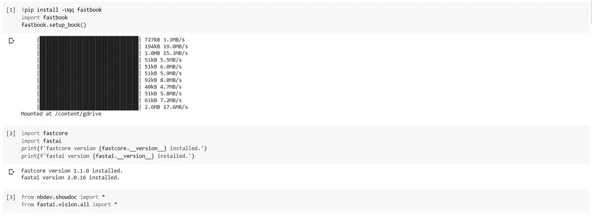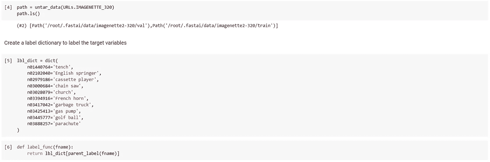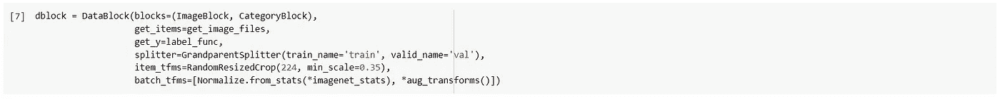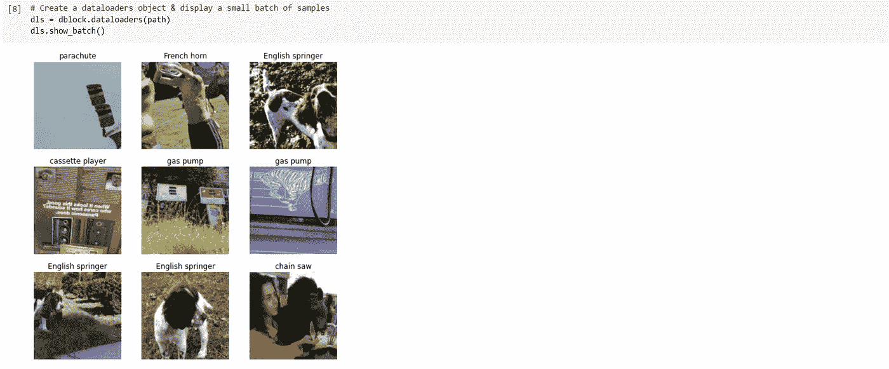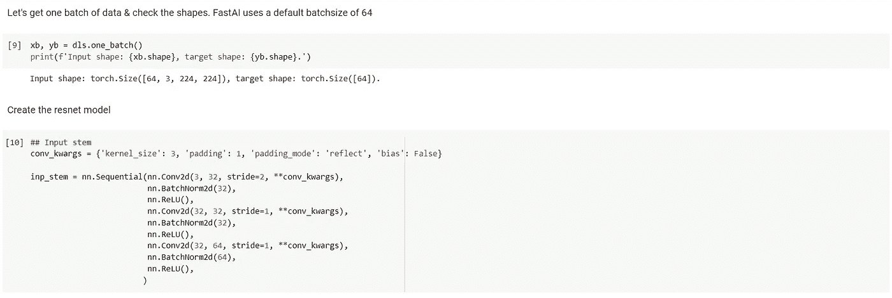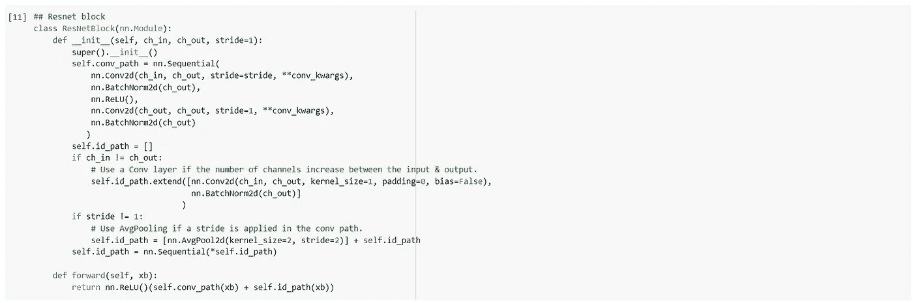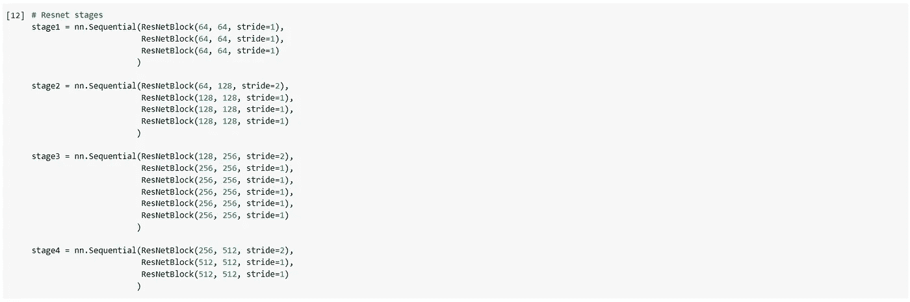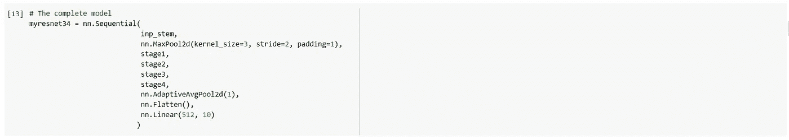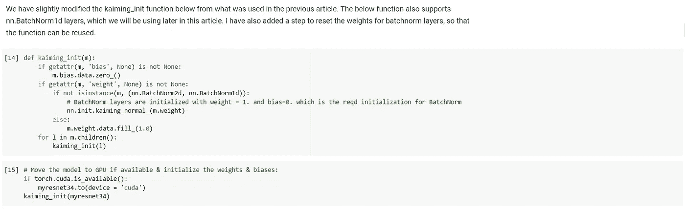

让我们使用我们的模型创建一个学习者。

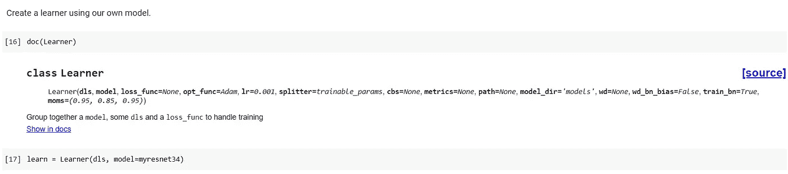

让我们来理解更精简的构造函数的参数:

*   dls:包含训练和验证数据的 dataloaders 对象。
*   模型:神经网络模型。
*   loss_func:要使用的损失函数。如果未指定损失函数，则使用数据加载器对象的默认损失函数。dataloader 对象根据目标的类型选择适当的损失函数。在这里，由于我们已经使用了一个 *CategoryBlock* (见上面的 dblock 创建)*作为我们的目标变量，CrossEntropyLoss 被添加为默认损失函数。FastAI 有一个很好的关于创建自定义损失函数的教程 [*这里*](https://docs.fast.ai/tutorial.imagenette#Changing-the-loss-function) 。*

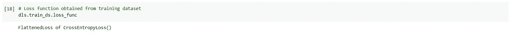

*   opt_func:用于创建优化器对象的函数(可调用)。默认情况下，会添加一个 Adam 优化器。
*   lr:默认学习率。
*   splitter:将模型作为输入并返回参数组列表的函数。默认函数'*trainiable _ param()*'将模型的所有可训练参数(参数要求 _grad = True)作为创建单个参数组的单个列表返回。
*   cbs:定制训练循环的回调列表。默认情况下，FastAI 为学习者添加了以下回调: *TrainEvalCallback* 、*记录器*和 *ProgressCallback* 。在本文中，我们将详细研究学员回访。

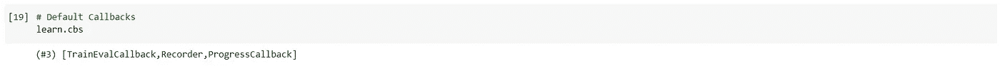

*   metrics:可选的度量列表，可以是函数，也可以是 FastAI 度量类的对象。默认情况下，不选择任何指标。

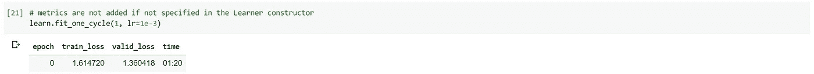

*   路径& model_dir:路径和 model_dir 用于保存和(或)装入模型。
*   wd:使用默认重量衰减。
*   moms:learn . fit _ one _ cycle()方法中使用的默认动量。
*   wd_bn_bias:控制权重衰减是否应用于 batchnorm 类型图层和偏移参数。默认行为是不对这些层应用 wd。
*   train_bn:控制是否要训练 batchnorm 类型层，即使它们属于模型的冻结部分。默认行为是训练 batchnorm 类型图层。

**FastAI 训练循环**

我们将使用 learn.fit()方法来研究 FastAI 训练循环。让我们训练一个时期的模型作为参考。

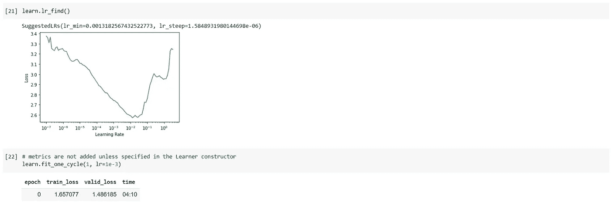

让我们看看 learn.fit()方法的参数。

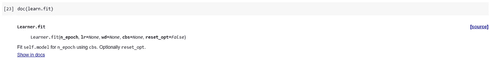

learn.fit()方法接受以下参数:

*   n_epoch:模型必须被训练的时期数
*   lr & wd:优化器使用的学习率和权重衰减
*   cbs:为 fit 操作添加到学习者的任何附加回调。注意，这是除了用学习者构造函数添加的回调之外的。在 fit()操作之后，这些回调将从学习者对象中移除。
*   reset_opt:一个布尔标志，用于指示与学习者对象相关联的优化器是否需要重置。

拟合操作(learn.fit()方法调用)由数据集中的*n _ epoch*epoch 组成。一个历元包括通过训练数据集的一次完整迭代，随后是通过验证数据集的一次完整迭代。FastAI 使用控制流的事件&异常。在 FastAI fit 操作中有五种事件类型&相关异常(括号中提供了异常):

1.  fit(取消异常)
2.  纪元(CancelEpochException)
3.  训练(CancelTrainException)
4.  验证(CancelValidException)
5.  批处理(CancelBatchException)

这些事件类型与以下事件相关联:

*   在 _ {事件类型}之前
*   after _ cancel _ {事件类型}
*   在 _ {事件类型}之后。

这些事件类型的控制流如下(请参见下图以便更好地理解):

1.  *前 _ {事件类型}* 事件。稍后我将解释事件的控制流。
2.  调用与事件类型相关联的函数/方法。
3.  *after _ cancel _ { event _ type }*事件，如果在步骤 1 中引发了相关异常。请注意，如果异常发生在步骤 1 中，则只跳过步骤 2。
4.  *在 _ {事件类型}* 事件之后。步骤 4 & 5 始终运行，即使在步骤 1 中出现异常。
5.  一个可选的“*最终*功能可以在事件类型结束时运行。在 learn.fit()方法调用中，只有' *fit* '事件类型有' *final* '函数( *self。_end_cleanup()* )与之关联(见下图)。

除了上述事件之外，FastAI 还有以下事件，这些事件在训练/验证/推理运行期间每批都会遇到。

*   *after_pred*
*   *after_loss*
*   *前 _ 后*(仅用于训练运行)
*   *after_backwar* d(仅用于训练运行)
*   *after_step* (仅用于训练运行)

事件调用传入事件名称的学习者对象(例如:“after_pred”事件调用 learn(‘after _ pred’))。稍后我将详细解释事件的控制流。首先让我们研究一下 fit 操作。fit()操作过程中的控制流可以通过下图得到最好的解释。注意，如果在 _ {事件类型} 事件之前的*期间没有异常发生，则执行相关的方法，并且控制在 _ {事件类型}* 事件之后传递到*。然而，如果在 _ {事件类型}之前的*期间引发了*取消{事件类型}异常*，则跳过*相关方法&，控制传递到 _ 取消 _ {事件类型}* 事件之后的*。*

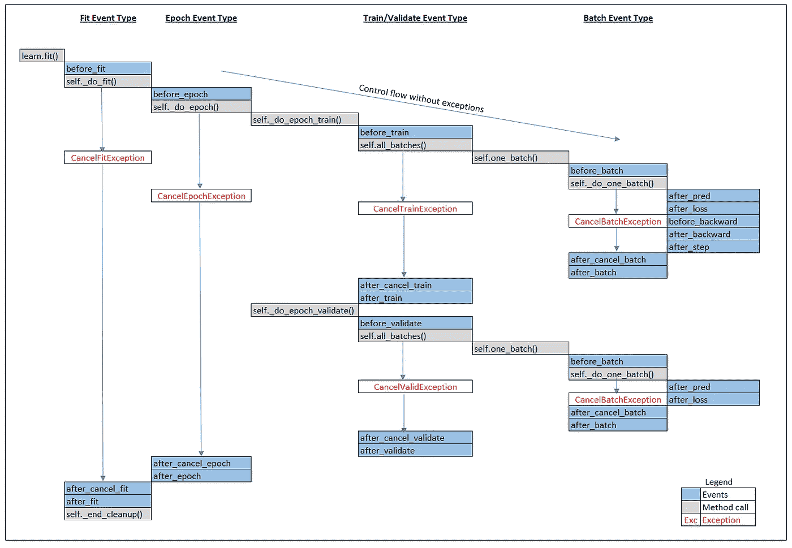

在 FastAI fit 操作期间控制流程。请注意，如果在 before_{event type}事件期间没有发生异常，则执行相关联的方法，并将控制传递给 after_{event type}事件。但是，如果在 before_{event type}事件期间引发了 Cancel { event type }异常，则跳过相关联的方法&控制权将传递给 after_cancel_{event type}事件。

我将简要解释这些方法/事件的作用。注意，下面的“learn”/“self”指的是学习者对象。

1.  learn . fit():learn . fit()方法创建一个上下文，将附加回调(传递给 fit 方法)添加到学习者对象中。这确保了在执行 fit()方法之后，从学习者中移除附加的回调。接下来，如果优化器对象尚未与学习器对象相关联，或者如果 *reset_opt* 参数为真，则创建新的优化器对象。然后，它将 *n_epoch* 存储为学习者对象的属性，并用torch 初始化损失值 *learn.loss* 。张量([0。]).接下来，它启动从' *before_fit'* 事件开始的' *fit'* 事件类型的控制流。
2.  before_fit: before_fit 事件调用 learn('before_fit ')
3.  学习。_do_fit():启动 for 循环，为*learn . n _ epoch*epoch 训练模型。对于每次迭代，将当前纪元编号存储为 *learn.epoch* ，并从“ *epoch* ”事件类型的“ *before_epoch* ”事件开始启动控制流。
4.  before_epoch: before_epoch 事件调用 learn('before_epoch ')
5.  自我。_do_epoch():首先调用 self。_do_epoch_train()在训练数据集上运行 1 个 epoch，然后调用 self。_do_epoch_validate()对验证数据集运行 1 个 epoch(计算损失和指标)。
6.  自我。_do_epoch_train():将训练数据加载器设置为 *self.dl* ，并启动以' *before_train* 事件开始的' *train* 事件类型的控制流程。在执行完'*列车*事件类型后，self。调用 _do_epoch_validate()，将验证数据加载器设置为 *self.dl* ，并使用 torch.no_grad()启动' *validate* '事件类型的控制流，以便禁用验证运行的梯度计算。注意那个自我。_do_epoch_validate()方法也在推断时在 learn.predict()调用中使用，以获得新样本的预测。
7.  before_train: before_train 调用 learn('before_train ')。
8.  self.all_batches():将 *self.n_iter* 设置为 self.dl 的长度(即批次号)。注意，self.dl 在训练运行期间设置为训练数据加载器(事件类型:' *train* ')，在验证运行期间设置为验证数据加载器(事件类型:' *validate* ')。接下来，它在每个 I 上调用 self.one_batch(i，b)，在 enumerate 中调用 batch ' b(*self . dl)*。
9.  self.one_batch(i，b):将“I”设置为 *self.ite* r，并将批处理“b”拆分为 *self.xb -* 输入和 *self.yb* -目标。然后，从' *before_batch* 事件开始，启动' *batch* 事件类型的控制流程。
10.  before_batch: before_batch 调用 learn('before_batch ')
11.  自我。_do_one_batch(): self。_do_one_batch()执行以下操作:

(I)获取该批的预测，并将其存储到 self.pred

㈡after _ pred:调用 learn(‘after _ pred’)

(iii)通过调用 self.loss_func()计算损失，并将其存储到 self.loss 中

(四)亏损后:调用 learn(‘亏损后’)。

(v) before_backward:调用 learn('before_backward ')。(v)至(ix)仅在训练运行时执行。

㈥自我。_backward():通过调用 self.loss.backward()计算渐变

(vii)after_backward:调用 learn('after_backward ')

(七)自我。_step():调用 self.opt.step()来更新参数。

(viii)在 _ 步骤之后:调用 learn(“在 _ 步骤之后”)

(ix) self.opt.zero_grad():将梯度归零。

12.自我。_end_cleanup():在 fit 事件类型结束时调用，以重置 *self.xb、self.yb、self.dl、self.pred* 和 *self.loss* 。

让我们看看当调用 learn(事件名称)时，事件期间的控制流。

**事件期间的流量控制**

当调用 learn(事件名称)时，FastAI 会执行以下操作:

1.  获取与学习者对象相关联的所有回调。
2.  按照正确的顺序对回调进行排序。(我将很快解释排序逻辑)。您可以使用 sort_by_run()函数检查回调的排序顺序。
3.  对于排序列表中的每个回调(假设 cb ),运行与“事件名称”(即 cb)同名的方法。如果回调有这样一个方法，并且它满足以下 3 个条件中的任何一个:

(i) (cb.run = True)和(事件名称是* *内部事件*之一)

(ii) (cb.run = True)和(cb.run_train = True)以及(learn.training = True，如果 learn 具有“training”属性。)

(iii)(CB . run = True)AND(CB . run _ valid = True)AND(learn . training = False，如果 lean 具有“training”属性)

*内部事件:* before_batch、after_pred、after_loss、before_backward、after_backward、after_step、after_cancel_batch、after_batch。

回调属性 cb.run、cb.run_valid 和 cb.run_train 可用于启用/禁用回调，默认情况下它们都被设置为真。顾名思义，属性“run_train”和“run_valid”可分别用于在训练或验证/推理期间有选择地运行回调。此外，请注意，在“after_fit”事件期间的拟合操作结束时，cb.run 属性会重置为 True。

**回调排序逻辑:**

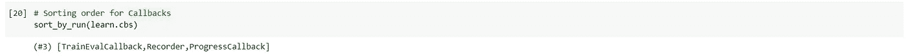

回调的排序顺序

1.  获取回调列表，我们称之为“cbs”。创建一个空列表，比如“res ”,作为存储排序回调的占位符。
2.  将所有“朝向 _ 结束”属性为 True 的回调移到 cbs 的结尾。
3.  对于 cbs 中的每个回调“cb ”,从第一个回调开始，检查 cb 是否有“run_after”属性，如果有，检查 cb.run_after 是否等于 cbs 中的任何其他回调。
4.  对于 cbs 中的所有其他回调“o ”,检查 o 是否有“run_before”属性，如果有，检查 o.run_before 是否等于 cb。
5.  如果 3 和 4 的答案都是假，将 cb 添加到排序列表“res”中。重复 3 到 5 次，直到所有回调都移到 res。

我们可以使用 learn.show_training_loop()方法来查看 fit 操作期间的事件和回调。

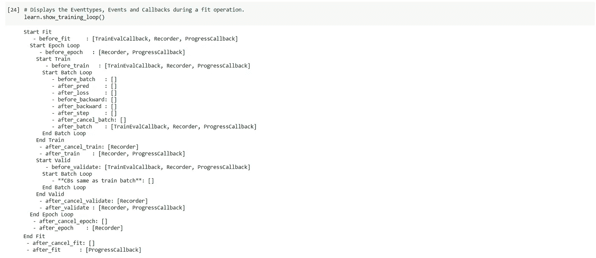

现在，让我们尝试实现我们自己的 LRFinder 回调。像往常一样，我从 FastAI 的 github 回购中复制了下面的大部分代码。

# **LR_Finder 回调**

我们希望 lr finder 回调执行以下操作:

*   lr finder 不应该干扰权重初始化，因此 lr finder 回调应该在开始前首先将模型参数保存到本地文件中，并在结束时重新加载。
*   lr finder 应使用指数增长的学习速率运行 fit，最大迭代次数(批次)为 100 次，因此它应找到运行 fit 所需的适当的纪元数。
*   建立一个指数级增长的学习进度计划。
*   如果迭代次数> 100 或者如果损失增加到所获得的最佳损失的 4 倍以上，则取消训练。
*   在拟合操作结束时将梯度归零。
*   在 fit 操作后，绘制损失与学习率的关系图。

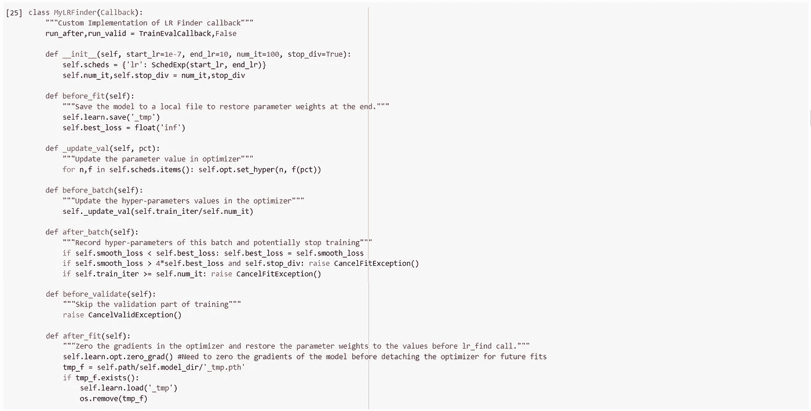

接下来，我们将向学习者添加一个自定义方法来运行我们的回调。@patch 是一个 FastAI decorator，用于向第一个参数的 type-annotation 类添加方法。

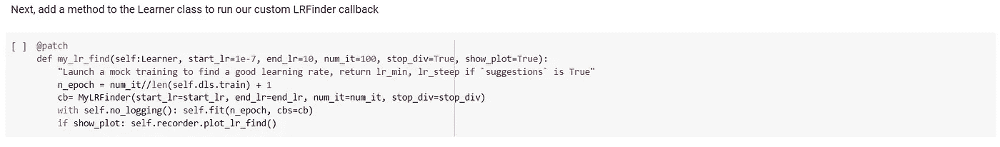

现在让我们使用 lr_find 方法。但是首先我们将重新初始化模型权重。

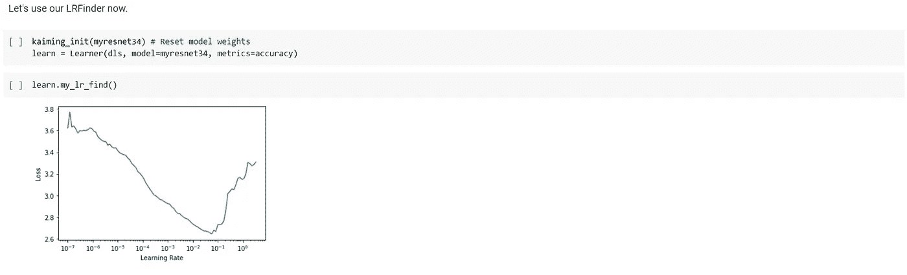

我们现在将尝试在迁移学习环境中使用我们的学习率查找器。我们将使用 Pets 数据集并下载 FastAI 在 Imagenet 数据上预先训练的 xresnet 模型。我决定不使用我们在 Imagenette 数据上训练的模型，因为我们的目标类中只有一个单一的狗品种(对于 Imagenette 数据)。

首先，让我们为 Pets 数据集构建数据加载器。

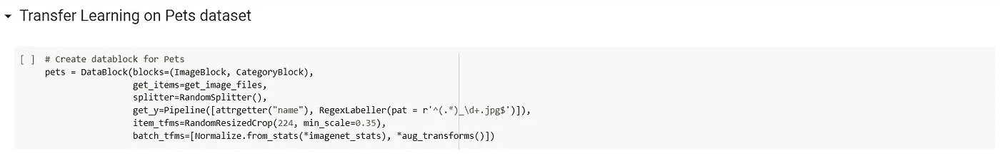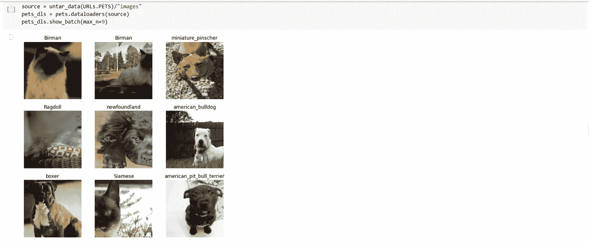

我们在宠物数据集中有 37 种狗和猫。

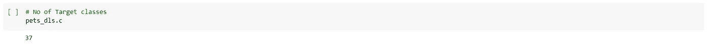

让我们从 FastAI 下载预训练的 xresnet34 模型。

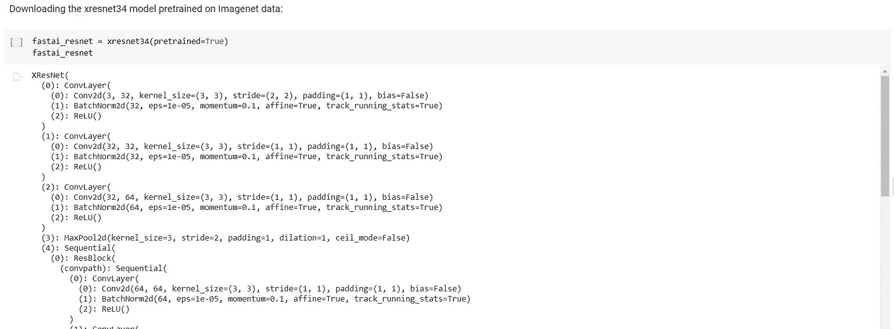

默认情况下，FastAI 在池层切割一个预训练模型，并根据目标类的数量添加一个自定义头。详情请参见[视觉学习者文档，此处为](https://docs.fast.ai/vision.learner)。让我们为我们的研究复制同样的。首先，我们将为我们的模型创建一个“头”。

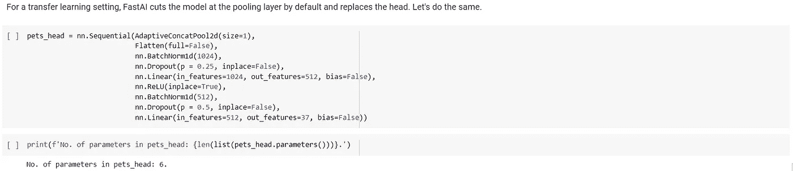

在将头部与模型的预训练部分结合之前，我们将初始化头部的参数，因为我们不想修改预训练参数。

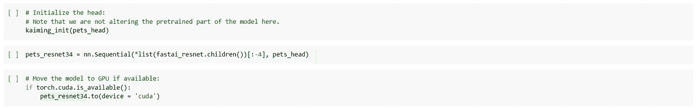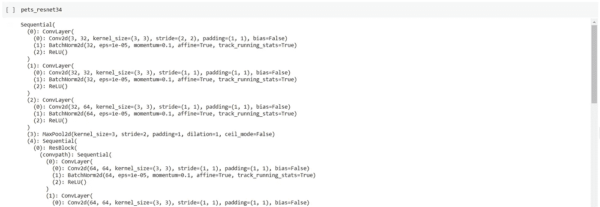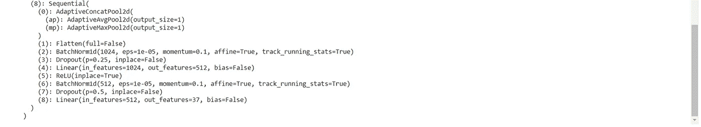

注意:这里我只显示了输出的顶部和底部..

我们将使用不同的学习率&以相对于身体 100 倍的 lr 训练我们模型的头部。因此，我们将使用一个定制的 splitter 函数为优化器创建两个参数组，一个包含头部的参数，另一个包含其余部分的参数。请注意，我们的模型头只有 6 个参数。

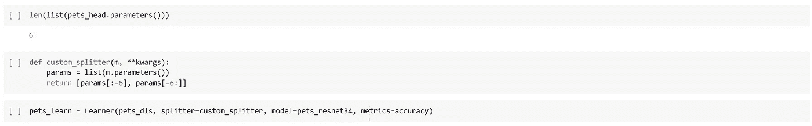

接下来，我们将冻结模型的预训练部分&只训练头部的参数。我们仍将在冻结部分训练 batchnorm 层的参数。研究表明，在迁移学习环境中训练 batchnorm 层通常会产生更好的结果。这种行为由学习器构造函数的“train_bn”(默认值:True)参数控制。

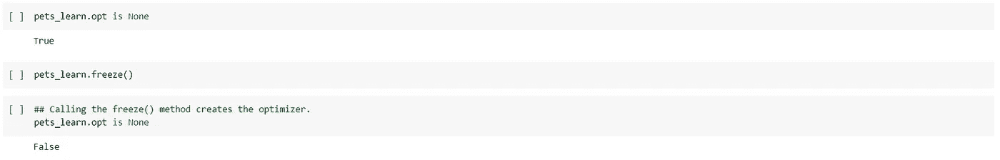

让我们检查参数组中的可训练参数。我们可以看到第一个参数组中的所有参数都属于 batchnorm 层(将参数名与上面 pet3_resnet34 架构的显示进行对比)。

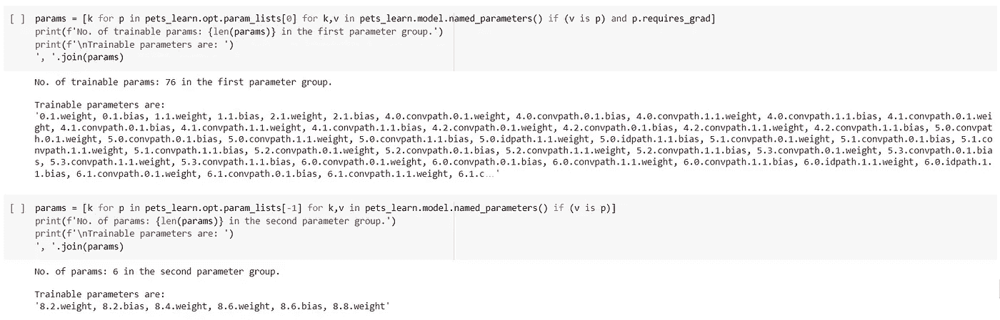

让我们在头部的学习速率应该是模型(身体)其余部分的学习速率的 100 倍的约束下，为我们的模型找到合适的学习。这可以通过向 learn.lr_find()方法的 start_lr & end_lr 参数传递一个 numpy 数组来实现。然而，FastAI 只跟踪记录器回调中最后一个参数组的学习率。我将稍微修改下面记录器回调的几个方法，以便它跟踪两个参数组的学习率，并绘制它们。我将使用@patch decorator 进行适当的修改。

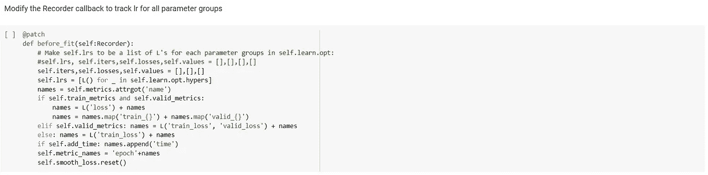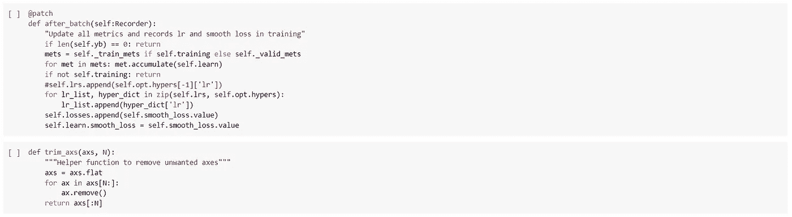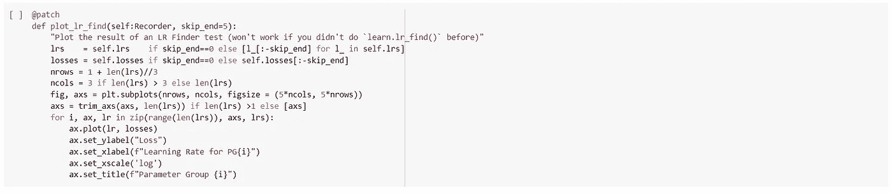

让我们用自己的 lr_find 来找一个合适的学习率:

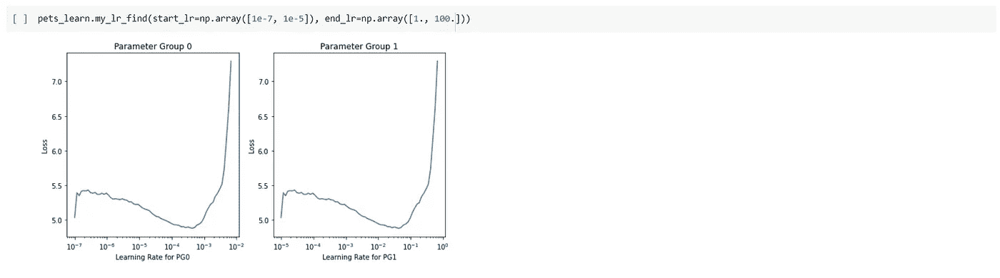

我们将训练 3 个时期的模型。

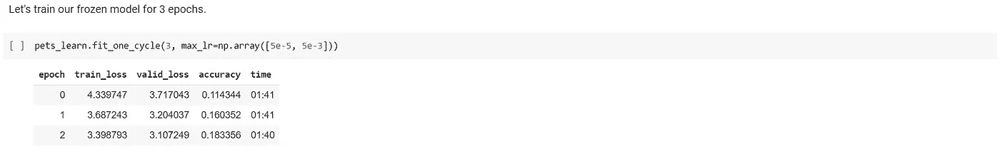

接下来，解冻整个模型并再次训练。我们将再次使用 my_lr_find()找到一个合适的学习率。

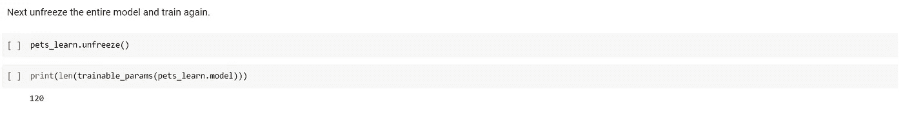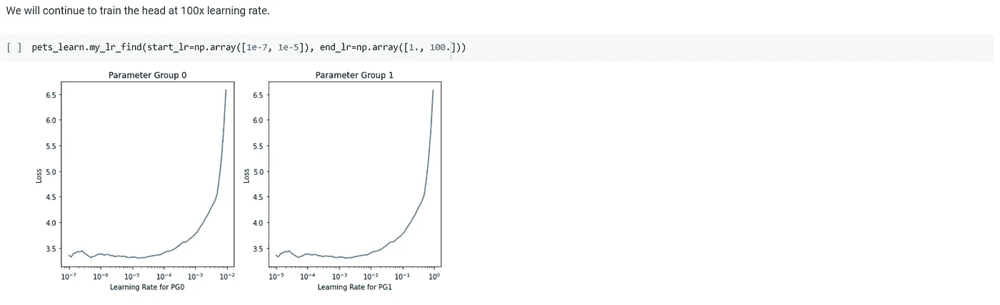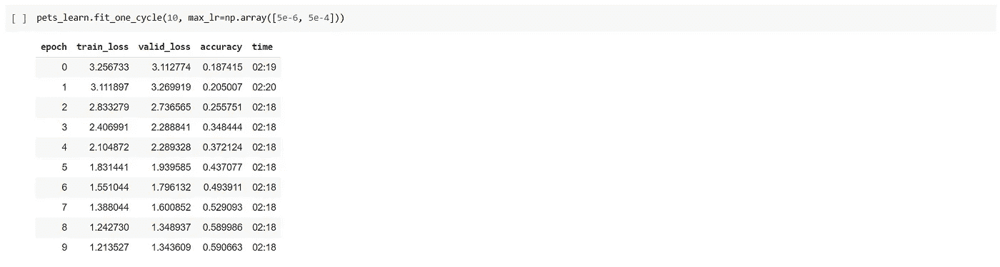

这篇文章的代码文件可以在 这里找到 [*。*](https://github.com/Rakeshsuku/Medium-Blog/tree/master/Understanding%20FastAI%20v2%20Training)

**链接到本系列的其他文章:**

*   [*研究 resnet34 模型架构，使用普通 Python & PyTorch 构建。*](/@rakesh.melezhath/understanding-fastai-v2-training-with-a-computer-vision-example-part-1-the-resnet-model-dd9270450bb8)
*   [深入 FastAI 优化器&实现一个 NAdam 优化器。](/@rakesh.melezhath/understanding-fastai-v2-training-with-a-computer-vision-example-part-2-fastai-optimizers-df65cb018604)

**参考文献:**

1.  [*程序员实用深度学习*](https://course.fast.ai/)
2.  [*FastAI GitHub 回购*](https://github.com/fastai/fastai)
3.  [*法泰书*](https://github.com/fastai/fastbook)
4.  [FastAI 文档](https://docs.fast.ai/index.html)