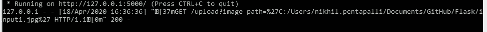

# 理解 Flask 并使用 Python 和 Flask 构建 Web API。

> 原文：<https://medium.com/analytics-vidhya/understanding-flask-and-building-web-api-using-python-and-flask-5611e6f66e03?source=collection_archive---------15----------------------->

# 烧瓶是什么？

Flask 是一个流行的 Python web 框架，这意味着它是一个用于开发 web 应用程序的第三方 Python 库。


照片:【waysquare.com 

有两个著名的 Python web 框架。Flask 被认为比 Django web 框架更具 Pythonic 性，因为在一般情况下，Flask web 应用程序更显而易见。对于初学者来说，Flask 也很容易上手，因为启动和运行一个简单的应用程序几乎没有样板代码。

**安装:**默认情况下，它会安装最新的 python 版本。因此，它可以避免不同版本库之间的兼容性问题。

激活创建的环境，并使用 pip 安装烧瓶。

```
1)conda create --name newenv python=3.62)Activate newenv3)pip install flask
```

现在，让我们创建一个简单的 hello 函数，它使用 flask 返回“Hello World”。

代码:

```
**from** flask **import** Flask

app = Flask(__name__)

@app.route(**"/"**)
**def** hello():
    **return "Hello World!"

if** __name__ == **'__main__'**:
    app.run(debug=True)
```


简单烧瓶 API 的输出

好吧！现在让我们看一下代码。

```
**from** flask **import** Flask
```

这一行要求应用程序从 flask 包中导入 Flask 模块。用于创建 web 应用程序实例的 Flask。

```
app = Flask(__name__)
```

这一行创建了您 web 应用程序的一个实例。__name__ 是 python 中的一个特殊变量，如果模块(python 文件)作为主程序执行，它将等于“__main__”。

```
@app.route(**"/"**)
```

这条线定义了路线。例如，如果我们像上面一样将 route 设置为“/”，那么如果我们访问 localhost:5000/，就会执行代码。您可以将路由设置为“/test ”,如果我们访问 localhost:5000/test，就会显示我们的“hello world”。

```
**def** hello():
    **return "Hello World!"**
```

这一行定义了当我们访问 route 时将执行功能。

```
**if** __name__ == **'__main__'**:
    app.run(debug=True)
```

这一行表示如果我们从 python 代码运行 flask 应用程序，它将开始运行。我们还将`debug` 参数设置为`true`。这将在网页上打印出可能的 Python 错误，帮助我们跟踪错误，并在做出任何新的更改时重新加载 Flask API。您还可以将`host` 参数和`port` 添加到您想要的端口(例如，您可以将其更改为 6000，而不是默认的 5000)。

现在总结一下，让我们举一个上传图片并保存到本地文件系统的真实例子。

```
from flask import Flask, requestimport cv2app = Flask(__name__)@app.route('/upload', methods=['GET', 'POST'])def upload_file():if request.method == 'GET':img_path=request.values.get('image_path')img=cv2.imread(img_path)cv2.imwrite('sample_out.jpg',img)return 'file saved to local directory'if __name__=='__main__':app.run(debug=True)
```


Flask API 已经启动并正在运行。

这个 flask API 的输入是一个图像的路径。因此，让我们检查输出。


使用 URL 和输入图像路径返回字符串，如图所示，输出图像存储在本地文件系统中。



输出响应 200

现在，我们将输出文件保存在本地文件系统中，文件名为‘sample _ out . jpg’。我们可以创建真实世界的 web 应用程序，可以是一些页面、一个博客、一个 wiki，也可以是一个在线日程表应用程序或一个商业网站。

在上面的代码中，引入了 CORS，这是一个用于处理跨源资源共享(CORS)的 Flask 扩展，使得跨源 AJAX 成为可能。

# **结论:**

构建 Flask API 相当容易。现在，您可以创建 Flask API，客户端可以使用描述的 URL 访问您的 API。您还可以使用调度程序，创建 cron 作业或间隔作业，并使用给定的参数执行特定的功能。看看 APscheduler，它不仅触发代码中的功能，还触发你头脑中的一些想法。目前就这些。希望提到的一切都很清楚。感谢阅读这篇文章，如果你喜欢，不要忘记留下一些掌声😉。

LinkedIn:

[](https://www.linkedin.com/in/nikhil-pentapalli-5744bb18b/) [## Nikhil Pentapalli -数据科学家和机器学习工程师| LinkedIn

### 经验丰富的机器学习专家，有在 Reliance Industries Ltd .工作的证明历史，精通…

www.linkedin.com](https://www.linkedin.com/in/nikhil-pentapalli-5744bb18b/)