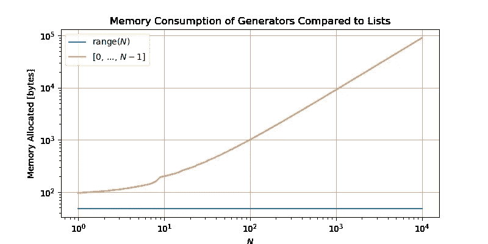

# 用简单的方式理解 Python 中的生成器！

> 原文：<https://medium.com/analytics-vidhya/understanding-generators-in-python-in-simple-way-ae3cbf22309f?source=collection_archive---------31----------------------->

Python 中的生成器函数允许我们编写一个函数，该函数可以发送回一个值，并在稍后恢复到它停止的地方。这些用来创建[迭代器](https://www.geeksforgeeks.org/iterators-in-python/)。

假设，我们想一个接一个地返回从 1 到 10 的数字的平方，然后我们创建一个函数，返回一个数字平方的列表，迭代返回的数字列表，然后一个接一个地打印数字:

```
def num_function():
    num_list = []
    for i in range(1, 11):
        num_list.append(i**2)
    return num_list

for i in num_function():
    print(i)
```

上面的函数将逐行打印从 1 到 10 的数字的平方。这里，我们使用 list 将结果追加到其中。但是，你不认为把元素存储到一个列表中，然后再一次遍历这个列表来一个接一个地打印数字的平方是非常低效的吗？如果你也这样认为，那么 python 有一个解决方案，它提供了生成器函数来帮助你。现在，为了理解如何使用生成器函数，让我们创建上述相同的函数，但采用生成器函数的风格:

```
def num_gen_function():
    for i in range(1, 11):
        yield(i**2)

for i in num_gen_function():
    print(i)
```

在这里，你会得到相同的结果，但与内存效率。还有，这里你看到了`yield keyword`。这个 yield 关键字就像 return 关键字一样，返回值，但它与 return 关键字有很大不同。现在，我们知道 return 关键字在程序执行结束时返回值，但是这里 yield 的行为不同。yield 在执行函数的中途返回一个值，它只是暂停函数，然后返回值。返回一个值后，函数从它停止的地方继续，新值将是先前返回的值的下一个值。这就是收益率和回报的区别。当我们想要返回一些值，并且在返回这些值之后，我们想要执行剩余的函数时，yield 非常方便。

现在，如果你这样想，我们已经限制了 list 的使用，但是我们仍然使用 for 循环来迭代。对于这一点，我们也有一个解决方案，它的下一个()函数。让我们用它来访问从上面的 num_gen_function()生成的元素:

```
g = num_gen_function()
print(next(g))           # will print 1
print(next(g))           # will print 4
print(next(next(g)))     # will print 16  why?
```

这里，我们将一个变量赋给了 function，并使用 next()函数来获取迭代器中的值。next()函数用于从集合中获取下一项。

> 我们不能使用 next()函数访问 range()中的元素，因为它是一类不可变的 iterable 对象。欲了解更多信息，请访问[此处](https://stackoverflow.com/a/13092317/12552274)。现在，如果你想要一个迭代器，那么使用下面的方法将它转换成一个列表，并对它进行迭代:
> `*list(range(start, end)) or iter(range(start, end))*`



高效内存生成器(图片来源:[www.pythonlikeyoumeanit.com](http://www.pythonlikeyoumeanit.com))

我们现在可以在任何需要的地方使用发电机。让我们看看如何使用生成器函数来生成斐波那契数列:

```
def gen_fibonacci(n):
	a = 1
	b = 1
	for i in range(n):
		yield(a)
		a, b = b, a+b

for num in gen_fibonacci(10):
	print(num)
```

这就是我们如何在 python 中使用生成器来实现更高效的内存程序，以及在返回值后执行一些代码。此外，我们可以有类似列表理解的生成器理解。欲了解更多关于发电机理解的信息，请访问[这里](https://www.pythonlikeyoumeanit.com/Module2_EssentialsOfPython/Generators_and_Comprehensions.html#Creating-your-own-generator:-generator-comprehensions)。