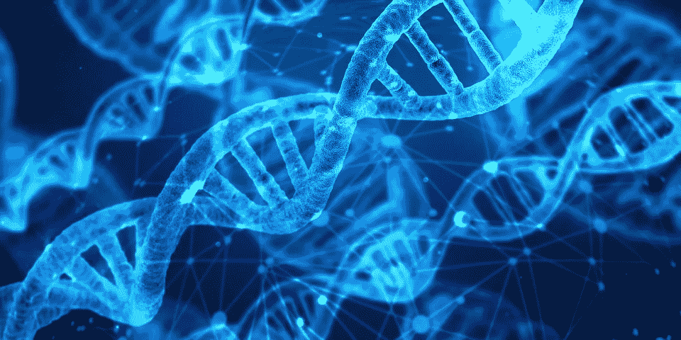

# 理解人工智能领域的遗传算法

> 原文：<https://medium.com/analytics-vidhya/understanding-genetic-algorithms-in-the-artificial-intelligence-spectrum-7021b7cc25e7?source=collection_archive---------0----------------------->

近来，遗传学领域在人工智能领域受到了很多关注。我们已经看到最近科学研究中发生的突破，但是大多数人甚至不知道如何开始理解这个领域。

因此，在这篇文章中，我将向您介绍遗传算法是如何工作的，以及为什么您下次构建神经网络模型时应该考虑它。让我们开始吧！

## 目录

1.  无限猴子定理
2.  理解遗传算法
3.  这些原则是如何在遗传算法中实现的
4.  如何在人工智能项目中使用它

***无限猴子定理***

无限猴子定理指出，如果一只猴子开始在键盘上随机敲击按键无限长的时间，它几乎肯定会键入给定的文本，如威廉·莎士比亚全集。事实上，猴子几乎肯定会将所有可能的有限文本输入无限次。然而，这一事件的概率是如此之小，以至于它将需要比宇宙的估计年龄更长的时间，但这一事件发生的几率不是零。

***证明***

假设打字机有 50 个键，要打的字是“ ***【香蕉】*** 。如果按键被随机且独立地按下，则意味着每个按键被按下的机会相等。那么，打出的第一个字母是‘b’的几率是 1/50，打出的第二个字母是‘a’的几率也是 1/50，以此类推。因此，前六个字母拼成 ***【香蕉】*** 的几率是:

(1/50)×(1/50)×(1/50)×(1/50)×(1/50)×(1/50)=(1/50)6 = 1/15 625 000 000，即不到 150 亿分之一。但是仍然不为零，因此结果仍然是可能的。

所以，猴子会在 15，625，000，000 次中输入 1 次“香蕉”这个词。现在让我们假设猴子每秒敲击一个键，在最坏的情况下，这个事件发生的时间大约是 495 年。

现在，如果我为上述问题模拟一个计算机程序，并对单词 ***【香蕉】*** 进行强力搜索，所涉及的计算量和时间将是巨大的。

但是，如果我想键入相同的内容，我只需不到 6 秒钟就可以完成。为什么？因为我知道字母，我知道香蕉这个词和它的拼写。

那么，我能使用进化论并显著改进我的程序吗？是的，这要归功于遗传算法的概念。

***理解遗传算法***

是一种受 ***达尔文自然选择理论*** 启发，解决 ***优化问题*** 的算法。这是一个很好的解决方案，尤其是在信息不完整或不完善，甚至计算能力有限的情况下。

在达尔文的自然选择理论中，进化发生所必需的三个主要原则是:

1)

**2)**

****3)****

## ******这些原则是如何在遗传算法中实现的******

******遗传算法有五个阶段:******

******1.创建初始群体******

******2.定义适应度函数******

******3.选择父母******

******4.制造交叉******

******5.变化******

*********创建初始种群*********

****在这一步中，我们创建了一组由 n 个元素组成的群体。群体中的每个元素都是您想要解决的问题的解决方案。****

****在我们的例子中，假设这个群体是:****

*   ****巴哈马群岛****
*   ****abcdef****
*   ****jklmn****
*   ****….****
*   ****所有其他 6 个字符的单词****
*   ****mnopqr****
*   ****stuvwx****
*   ****小屋****

*******定义一个适应度函数*******

****适应度函数决定了一个个体有多大可能适合被选择进行繁殖，这是基于它的适应度分数。让我们假设我们的适应度函数将为匹配我们的目标单词 ***banana 的每个字符分配适应度分数或概率百分比给来自群体的每个元素。*******

****在我们的例子中，假设这个群体是:****

*******要素，体能得分*******

*   ****banyan，5 #(这个单词中有来自字母‘b’，‘a’，‘n’，‘a’，‘n’，‘a’的 5 个字符，它们是‘b’，‘a’，‘n’，‘a’，‘n’)****
*   ****abcdef，2#(类似地，字母‘b’，‘a’，‘n’，‘a’，‘n’，‘a’中的两个字符出现在这个单词中，它们是‘a’和‘b’)****
*   ****ijklmn，1 #(按照上面的规则，它只有一个匹配的单词—‘a’)****
*   ****……, ..****
*   ****所有其他 6 个字符的单词，..****
*   ****mnopqr，1****
*   ****stuvwx，0****
*   ****小屋，5****
*   ****等等…****

*******选择双亲*******

****这一步背后的想法是选择最适合的个体，让他们把基因传递给下一代。人口中的两个要素是基于它们的适合度分数来选择的。在我们的案例中，我们选择具有高适应性分数的个体。****

****在我们的例子中，我们选择了这些元素，因为这些词在给定的人群中具有较高的适合度。****

*******元素，体能得分*******

*   ****榕树，5****
*   ****小屋，5****

*******制作交叉*******

****这是遗传算法中最重要的阶段。在这一步中，我们从选择的元素中重新生成一个新的 *n* 元素群体。在这一步中，我们必须从上一步中选择的两个父单词中获得的字符中置换和组合尽可能多的单词。在我们的例子中，父词是' ***榕树*** '和' ***小屋*** '。****

****例如，我们可以从单词' ***榕树*** 中挑选最后 3 个单词，从单词' ***小屋*** '中挑选前 3 个单词，并形成一个新单词作为' ***cabyan*** '，****

****在应用来自单词' ***banyan*** '和' ***cabana*** '的所有可能组合之后，我们得到新的群体集合。****

****在我们的例子中，新的再现元素是:****

*******转载 n 个元素*******

*   ****残烟****
*   ****卡比安****
*   ****卡比纳****
*   ****babyna****
*   ****……****
*   ****从父词' ***榕树*** '和' ***小屋*** '的所有其他可能的组合****
*   ****香蕉****
*   ****扬巴克****
*   ****等等…****

*******制造变异*******

****从交叉阶段开始，我们可能会得到一个对新的多样化群体的进化没有贡献的群体，并且我们的算法会过早地收敛。因此，我们需要从 1%的新创建的人口中改变单词的顺序，以保持这种多样性。我们可以选择任何一种改变。****

****例如，假设从 1%的先前人口中我们得到像' ***banyan*** '和' ***yanbac*** '这样的词。现在，我们选择这些元素来创建新的群体，因为这些单词分别具有 5 和 4 的良好适合度分数，并且因此具有成为双亲的高概率。现在，如果我们从这两个单词中选取最后 3 个和前 3 个字母，并将它们组合起来，我们将得到'*'并且这个单词不再具有足够的生产力来获得任何新的多样化元素。*****

*****但是，如果我们对先前人口的 1%进行变异，并通过简单地翻转两个单词中的第一个和最后一个字母来改变' ***【榕树】*** '和'***【yanbac】***'的字母，我们会得到'***【nanyab】***'和'***【can bay***'。现在，如果我们应用突变元素的最后 3 个和前 3 个字母的相同组合，我们得到'*'这与' ***【燕燕】*** '非常不同。(请注意，在 mutation 中，您可以随心所欲地改变元素。翻转第一个和最后一个元素只是本例中使用的一种随机方式)。******

*********这个过程什么时候停止？*********

******我们的人口数量是固定的。随着新元素的形成，具有低适应度分数的旧元素被移除。当群体已经收敛时，即没有与先前群体显著不同的新元素被再生，那么我们可以说遗传算法已经为我们的问题提供了一组解决方案。******

******在我们的例子中，当我们发现所有的人群都有来自单词 ***banana 的所有字母的组合时，健康值为 6。*********

*********收敛*********

*   *******nnbaaa*******
*   ******aaabnn******
*   ******aabann******
*   ******阿巴安******
*   ******……******
*   *********香蕉*********
*   ******巴安******

******我们有一个集合，也就是说，无论我们重复多少次以上的过程，我们都只能得到这些元素的集合。在我们的最终设置中，必须有单词 banana，因此我们的模拟 ***无限猴子*** 程序键入单词 banana 的时间比使用蛮力要少得多。******

*********伪代码*********

*   ******开始
    —创建初始种群******
*   ******计算适合度******
*   ******重复
    —选择
    —交叉
    —变异
    —计算适应度******
*   ******直到人口聚集******
*   ******停止******

*********伟大的算法但是为什么要用在人工智能上？*********

******我们可以实现遗传算法来学习神经网络的最佳超参数。为了学习超参数，我们应用如下步骤所述的遗传算法:******

******创建多个神经网络的群体******

******将超参数随机分配给所有神经网络******

******重复以下内容******

******1.训练所有的神经网络。******

******2.计算他们的训练成本(训练误差和正则项除外)******

******3.根据以前的神经网络的成本，从该组超参数中计算适应度分数。最好的神经网络成本最低。因此，它的逆将给出高的适应值******

******4.根据适合度选择两个最佳神经网络******

******5.从中复制出新的神经网络******

******6.改变孩子的基因******

******7.对群体中的所有神经网络执行步骤 5–7。在最新一代的末期，我们有了最佳的超参数******

*********结论*********

******遗传算法可以用来解决各种类型的优化问题。我们看到了如何用遗传算法处理人工智能中的超参数。这是一个很好的选择，值得你的下一个项目去看看！******