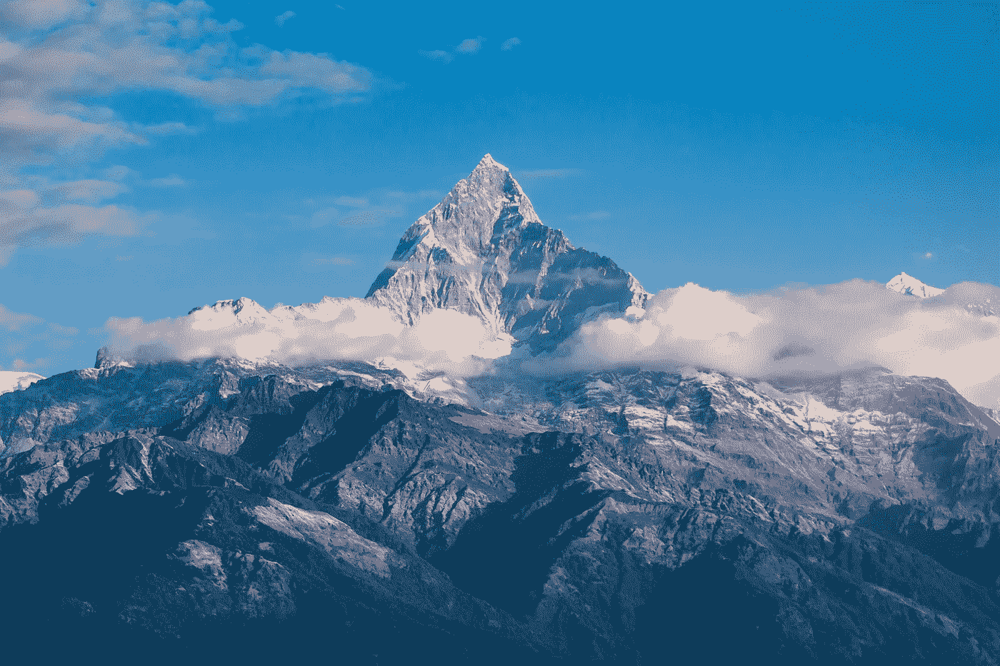

# 了解梯度下降

> 原文：<https://medium.com/analytics-vidhya/understanding-gradient-descent-8dd88a4c60e6?source=collection_archive---------2----------------------->

## 使用 Numpy 实现

图片来源:[https://www.pexels.com](https://www.pexels.com/search/mountain/)

# 介绍

梯度下降是许多机器学习算法中使用的最重要的优化技术之一。大多数深度学习算法都有梯度下降。

从上一段中可以看到两个关键词:

*   梯度下降