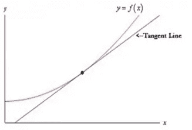

# 理解梯度下降并分解背后的数学原理:

> 原文：<https://medium.com/analytics-vidhya/understanding-gradient-descent-and-breaking-down-the-math-behind-7b26c8e50534?source=collection_archive---------12----------------------->

梯度下降是一种广泛使用的**优化算法**，被一系列机器学习算法使用。机器学习算法具有计算模型误差(预测值-实际值)的成本函数。所以，最好的模型必须是拥有最低成本的 T2 模型。梯度下降的目标是找到具有最小成本的模型参数。当我们将我们想要使用的模型传递到梯度下降时，它将使用模型的不同参数计算成本，并返回成本最低的参数。这是它的工作原理:

想象一下我们画出成本和函数的参数。为了实现梯度下降，函数必须是一个**凸函数**(“U”形)。现在看着球，这就是梯度下降的过程。注意球到达最低点后是如何停止滚动的？这是我们最低成本的要点。然后，该算法返回该成本的参数值。

梯度下降是一个美丽的解决方案，非常直观的理解。我们要一步一步来，理解算法是如何知道往哪个方向走才能到达最小点，知道什么时候到达了最小点。

要理解梯度下降，我们首先需要更深入地理解**变化率和斜率**的概念。我们需要它，这样我们就可以计算出函数中某一点的变化率。

假设我们有一个函数 f(x) = x + 2，我们已经知道该函数的斜率由 y 的变化**和 x 的变化**给出

那是非常直接的。像这样的函数有一个恒定的变化率。当我们处理一个没有恒定变化率的函数时会发生什么？就像这个:

想象一条割线穿过两点。我们可以求出函数中两点之间的差值，并计算出函数中该部分的变化率。如果 y 的值由 f(x)给出，则斜率为:

现在，我们如何找到函数在特定点的变化率？当斜率公式要求我们找出两点之间的差异时，这怎么可能呢？我们可以用微积分中的两个概念来做，极限和微分。如果你对微积分没有很深的理解，不要担心，我们会复习微积分中需要用到这个算法的部分。

**限值:**

想象一下，在两边非常接近特定 x 值的两点之间构建一条分割线。例如，如果特定的 x 值为 4，我们构建一条连接点 3.99 和 4.01 的线，并计算这条细线的斜率。为了帮助我们构建这条线，我们首先需要理解极限的概念。

那么，什么是极限，我们为什么要关心它呢？

**极限是当输入接近某个** [**值**](https://en.wikipedia.org/wiki/Value_(mathematics)) 时， [**函数**](https://en.wikipedia.org/wiki/Function_(mathematics)) **接近的值。让我们来看看这个图表**

在 x = 2 时，f(x) = 4。从表面上看，当 x = 1.99 时，f(x)的值将略低于 4，当 x = 2.11 时，f(x)的值将略高于 4。所以这个函数从这个点的左边和右边接近这个相同的值 4。这给了我们一条有价值的信息，即函数是连续的，并且有可能在 x = 1.99 和 x = 2.11 之间构造一条细线。

当你延伸这条线，你得到一条**切线**，我们需要计算它的斜率。

现在来看这个**不连续函数:**

在这个函数中，当 x = 1.99 时，f(x)接近 1，当 x = 2.11 时，f(x)接近 2。它们不是从两边接近相同的值，并且函数是不连续的。

**分化:**我们现在知道极限了。我们将使用一个极限和一个叫做微分的微积分技巧。在微分中，我们结合函数的极限和导数的概念来寻找某一点的变化率。这正是我们想要的！让我们来看看如何实现我们的斜率函数:

**第一步:**假设我们知道 x2 — x1 = h，如果我们现在将它代入斜率方程，我们得到:

**第二步:**因为我们要找两个非常接近的点，我们希望 h 的值尽可能接近 0。所以，我们在 h → 0 处取一个极限。这是函数的导数。变量 x 的函数 y = f(x)的**导数**是函数值 y 相对于变量 x 的变化而变化的速率的度量 ***微分*** 是计算导数的动作。它也更常用 dy/dx 来表示。

代入函数，h = 0，就得到函数在 x 点的斜率。

幸运的是，我们有一个更直接的方法来找到一个函数的导数，而不需要这么麻烦。求函数导数的一个更简单的方法是遵循导数规则。有很多，但这里我们只使用两个规则:

1.  **幂法则:**幂法则的导数由下式给出:

2) **1)** **链式法则:**说我们有一个变量 z，它依赖于 y，y 依赖于 x，在这种情况下，我们用一系列函数来求 z，也叫**复合函数**。在这种情况下求导，我们使用链式法则。这里我们先对 dz/dy 求导，然后对 dy/dx 求导，再将它们相乘。

**偏导数:**在我们的例子中，我们处理了只有一个变量的情况。在多变量的情况下，我们取偏导数。我们通过保持其余变量不变来获得每个变量的导数。

恭喜你！你现在知道如何找到函数中某一点的斜率。

如果函数只将单个变量作为输入，则使用微分。

如果函数是多元的，请使用偏导数。

现在我们有了这些知识，让我们看看如何在梯度下降中应用它们。

**梯度下降:**

我们要使用梯度下降进行优化的模型的成本函数(计算模型误差并为其分配误差成本的函数)必须是凸函数。这意味着当我们绘制它的时候，它应该看起来像一个“U”。

注意最小值吗？也叫全局最小值，函数的最低点。这就是具有完美的偏差-方差权衡的参数模型。梯度下降算法的目标是找到全局最小值并返回其参数。

考虑您的模型函数，参数为 0 和 1。y 轴表示成本值，x 轴表示参数值。该算法运行迭代并执行以下操作:

其中 J(θ)是成本函数，j = 1，2……n，对于每个参数 **α** 是学习率，它决定了我们在一个方向上所采取的步长。这是开发商指定的。让我们来分解一下:

**1。** **我们先用随机的初始参数初始化模型。**

**2。使用微分，该算法计算该点的变化率(想象切线的斜率)**

**3。** **我们更新参数的值:**

如果**斜率为正**，-α**∂/∂θj j(θ)部分公式将为负数。这意味着它会降低θ的值。从视觉上看，这意味着我们已经超过了最小成本，功能将后退一步。**

****

**如果**斜率为负**，公式中的-α∂/∂θj j(θ)部分将为正数。这意味着它会增加θ的值。视觉上这意味着最小成本在前面，功能将向前迈进一步。**

****

**如果**斜率为零**，—α**∂/∂θj j(θ)将为零。这意味着它不会更新θ的值。这意味着我们已经达到了最低成本。****

******4。** **该函数返回达到全局最小成本时的参数值。******

********

> ******即使是最小的行动也是朝着正确方向迈出的步伐******

******确保你的算法工作正常:******

****有几件事可以帮助您的算法更快地找到最小值:****

******迭代次数:**收敛之前的迭代次数取决于你的数据大小。为了找到最佳的迭代次数，用图表表示最小迭代次数。你可以看到在 300 之后，这条线变平了。所以这是一个很好的迭代次数，超过这个次数就没有意义了。****

********

******学习率α:** 虽然你的学习率会随着进度而降低或升高，但分配一个合理的值仍然很重要。如果你的学习率太小，算法会慢慢达到全局最小值。如果它太大，它可能永远找不到全局最小值，因此永远不会收敛。****

********

******梯度下降的类型:******

******批量梯度下降:**在每次迭代的批量梯度下降中，该函数使用所有的训练点来计算成本。****

******随机梯度下降:该函数将在每次迭代中计算一个示例的误差。在 SGD 之前随机洗牌是有好处的。如果您的训练集非常大，这是一个很好的技术。******

******小批量梯度下降:**小批量为每次迭代计算训练集大小的样本误差。如果我们使用矢量化实现，它可以击败 SGD 低效。****

****注意:如果你的成本函数有一个以上的最小值(局部最小值),不能保证梯度下降会达到全局最小值。****

****************

****我们完事了。现在你知道梯度下降是如何工作的了。我希望这是有用的！****

******来源:******

****1)[https://towards data science . com/understanding-the-mathematics-behind-gradient-descent-DDE 5d C9 be 06 e](https://towardsdatascience.com/understanding-the-mathematics-behind-gradient-descent-dde5dc9be06e)****

****2)吴恩达的机器学习课程****

****3)机器学习的基本数学:Python 版课程 Edx****