# 理解机器学习中的梯度

> 原文：<https://medium.com/analytics-vidhya/understanding-gradients-in-machine-learning-60fff04c6400?source=collection_archive---------8----------------------->

当我第一次开始研究神经网络时，我立即遇到了反向传播梯度的公式，从网络末端计算的损失函数开始，一层一层地返回。这些公式看起来已经很复杂了，尽管做了几个基本假设——比如一个完全连接的网络和每个神经元后的 sigmoid 激活函数。我想知道像 TensorFlow 和 Pytorch 这样流行的软件包如何执行相同的操作，但对于任意的数学函数。

现代机器学习包使用“自动微分”(或“亲笔签名”)来处理这一点，有了这个名字，听起来好像一切都只是发生；就好像你写了运算，计算机就能算出所有的导数。但不可能这么简单。在诸如卷积之类的运算中，使用位于输入图像上不同位置的某一选定大小的权重滤波器来计算乘法和，并且结果是新图像，其中每个值对应于一个这样的和。“亲笔签名”是怎么处理这个的？

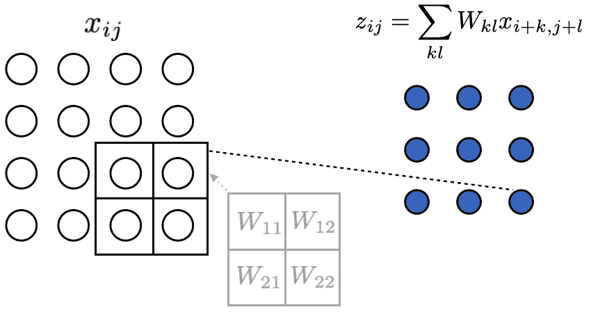

一个 2x2 卷积:如何对 ***的那个*** 求导？(图由作者提供)

**在这里我们将:**

1.  *展示反向传播是如何从分化的“链式法则”中出现的。*
2.  [*通过一些具体的例子来计算导数。*](https://colab.research.google.com/github/joshue031/gradients/blob/main/nn_gradients.ipynb) *我们将使用 TensorFlow，旨在准确理解在张量上调用* `*gradient*` *函数时计算的内容。*

# 链式法则

在训练神经网络时，我们的目标是通过调整网络的可训练参数来最小化一些损失函数。这意味着，在每个训练步骤，计算损失函数相对于每个参数 *W* 的导数，并以减少损失 *L* 的方式调整这些参数——通过在导数的相反(-)方向推动它们一小步，

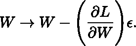

接下来的任务是为每个参数找到∂·l·/∂w。现代机器学习软件包使用计算图来解决这个问题，我们将看到这如何允许我们将问题分解成可管理的部分。损失函数是图的参数的多元函数，因此为了找到所有的导数，我们可以应用链式法则。

链式法则例如规定，对于两个变量 *x1* 和 *x2* 的函数 *f* ，它们都是第三个变量 *t* 的函数，

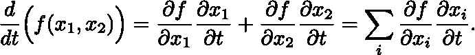

让我们考虑下图:

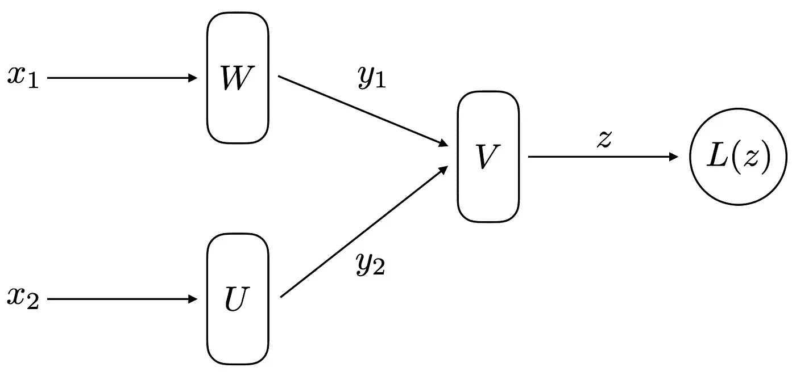

(图由作者提供)

这里我们假设 *W* 、 *V* 和 *U* 每个都代表几个参数——它们可以是向量、矩阵或一些高阶张量——但是现在我们只使用单个下标来表示它们。我们还将假设所有输入和输出( *x1* 、 *x2* 、 *y1* 、 *y2* 和 *z* )都是向量，并且为了简单起见，将使用单个下标 *x* 来遍历 *x1* 和 *x2* 的所有元素，对于 *y* 也是如此。现在使用链式法则来寻找损耗 *L* 相对于 W 参数之一的导数，

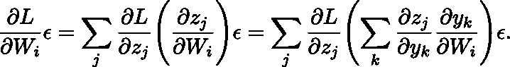

开始看起来，对于每个参数，我们需要解一个像这样的长方程，但是现在让我们再多做一点。

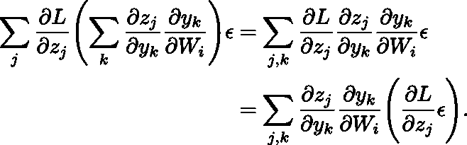

我们可以定义数量

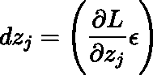

z 方向上的小位移，然后沿着图表“向后发送”。

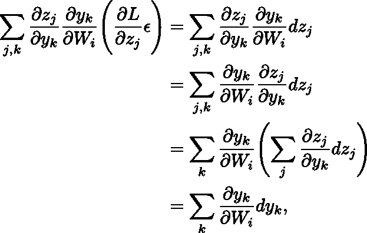

在哪里

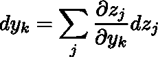

因此*和*的小位移遵循相同的模式，

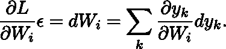

需要注意两件重要的事情:

*   值只能沿着有一些相关性的路径反向传播。例如，图中的值 *dy2* 都不会影响任何 *dWi* ，因为 *y2* 的分量相对于 Wi 的所有偏导数都为零。

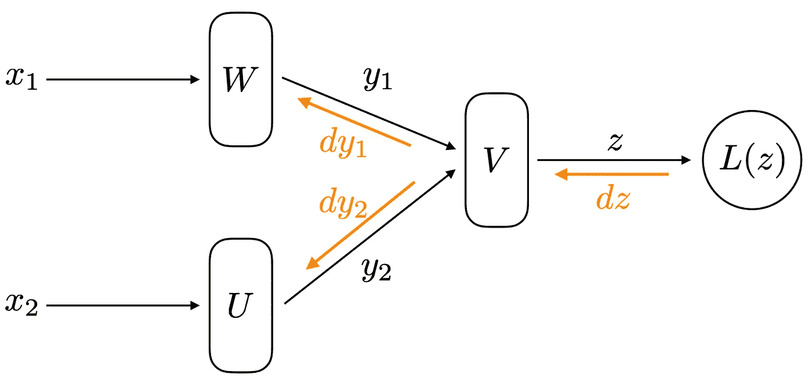

为了满足链式法则，梯度沿着与信息最初向前发送的路径相同的路径向后发送。(图由作者提供)

*   当执行反向传播时，不需要立刻担心整个网络。对于每个节点，我们只需要考虑通过输出通道发送的梯度，使用它们来计算该节点处参数的导数，然后通过输入通道发送回要在先前节点中使用的正确梯度。如果我们对每个节点都这样做，整个网络的梯度就可以解决。

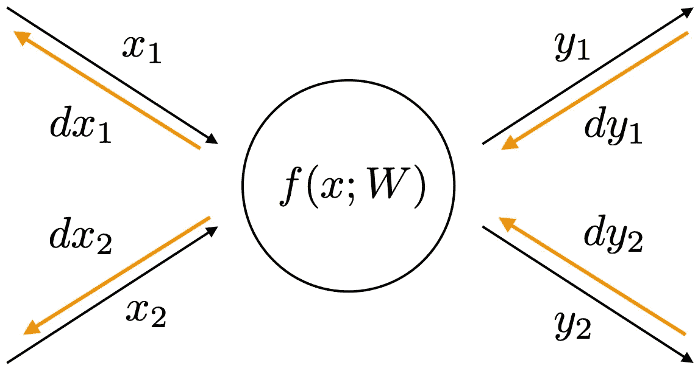

对于网络的每个节点，我们的任务是:使用输入梯度 dy1 和 dy2 来计算参数 dW 中的位移，并计算输出梯度 dx1 和 dx2。(图由作者提供)

Autograd 处理这方面的系统性，但它并不神奇——鉴于每个节点上应用的函数的导数(必须明确定义),它可以使用这一程序在整个网络中反向传播梯度。

让我们通过 TensorFlow 中的一些具体例子来了解如何利用张量输入和输出进行求导的细节。

*[***你可以使用这个 Jupyter 笔记本***](https://colab.research.google.com/github/joshue031/gradients/blob/main/nn_gradients.ipynb) ***在 Colab 中交互地完成这些例子。****

# *示例 sigmoid 函数*

*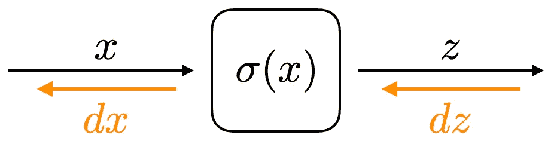*

*(图由作者提供)*

*sigmoid 函数为每个元素 *xi* 产生一个输出*子*，由下式给出:*

*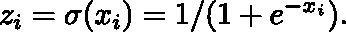*

*鉴于:*

*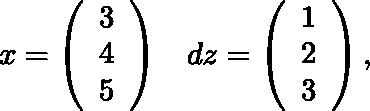*

*计算梯度 *dx* 。记住，如上所述，这意味着用分量计算矢量*

*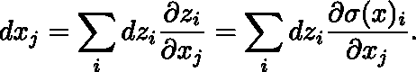*

## *张量流代码*

*下面是问题设置:*

```
*import tensorflow as tf# Define inputs and output gradients.
x = tf.constant([3.0, 4.0, 5.0])
dz = tf.constant([1.0, 2.0, 3.0])# Define the gradient.
def grad_sigmoid(x, dz):
    # (Add implementation here)
dx = grad_sigmoid(x,dz)# Compute the gradient with Tensorflow.
with tf.GradientTape() as g:
    g.watch(x)
    z = tf.sigmoid(x)
dx_tf = g.gradient(z, x, output_gradients=dz)# Check the answer.
print(dx == dx_tf)*
```

## *解决办法*

*注意，我们将利用 Kronecker delta，如果它的两个索引相同，则等于 1，否则等于 0，*

*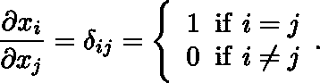*

*求导，*

*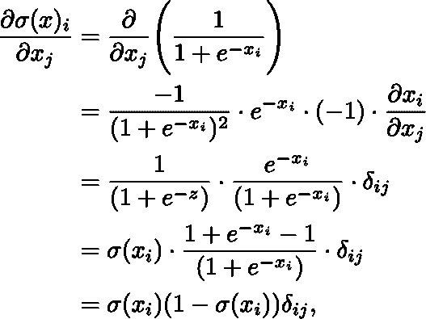*

*并计算梯度，*

*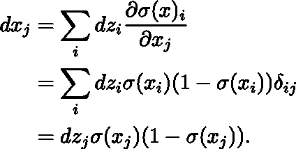*

*我们可以用矢量点积符号来表示(将数字结果四舍五入到 3 位有效数字)*

*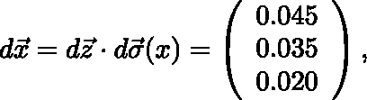*

*在哪里*

*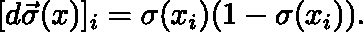*

*上面在 Tensorflow 中实现的内容如下:*

```
*def grad_sigmoid(x, dz):
    return dz*tf.sigmoid(x)*(1-tf.sigmoid(x))*
```

# *示例 softmax 函数*

*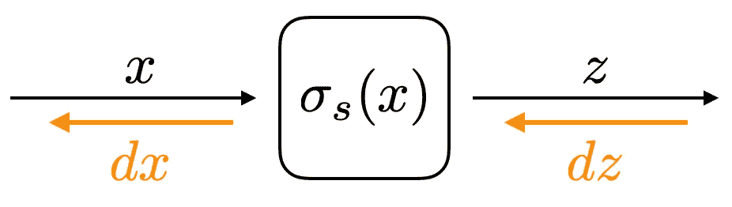*

*(图由作者提供)*

*sigmoid 函数为输入向量 *x* 生成一个包含元素的向量 *z**

*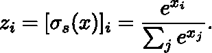*

*鉴于:*

**

*计算梯度 *dx* 。*

## *张量流代码*

*下面是问题设置:*

```
*import tensorflow as tf# Define inputs
x = tf.constant([3.0, 4.0, 5.0])
dz = tf.constant([1.0, 2.0, 3.0])# Define the gradient.
def grad_softmax(x, dz):
    # (Add implementation here)
dx = grad_softmax(x, dz)# Compute the gradient with Tensorflow.
with tf.GradientTape() as g:
    g.watch(x)
    z = tf.nn.softmax(x)
dx_tf = g.gradient(z, x, output_gradients=dz)# Check the answer.
print(dx == dx_tf)*
```

## *解决办法*

*求导，*

*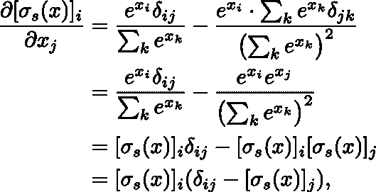*

*并计算梯度，*

*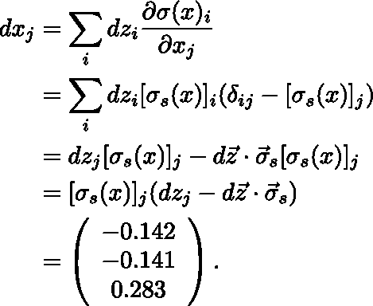*

*这里我们再次四舍五入到 3 位有效数字，并使用点积符号，*

*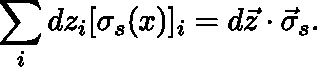*

*上面在 TensorFlow 中实现的内容如下:*

```
*def grad_softmax(x,dz):
    return tf.nn.softmax(x) * (dz - tf.tensordot(tf.nn.softmax(x), dz, 1))*
```

# *示例 3:矩阵乘法*

*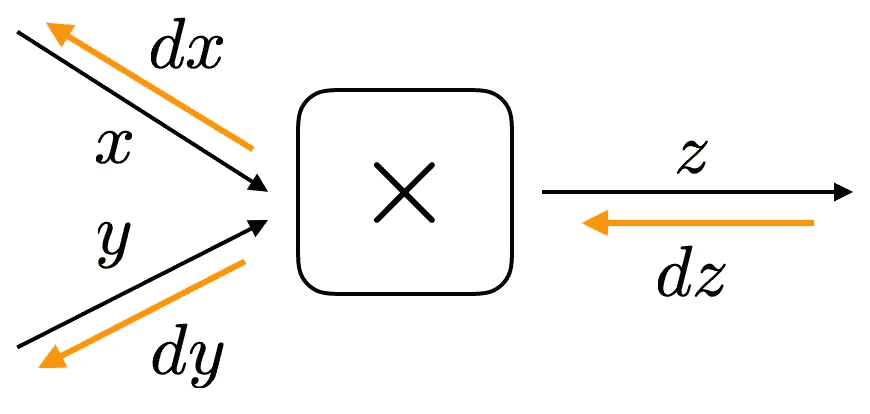*

*(图由作者提供)*

*现在让我们考虑一种情况，其中输入不是向量(秩 1 张量)，而是矩阵(秩 2 张量)。计算将是相似的，但是元素将由两个索引而不是一个来标识。*

*我们将两个矩阵 *x* 和 *y* 相乘以产生一个包含元素的矩阵 *z**

*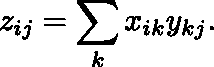*

*考虑到*

*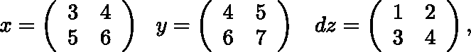*

*计算梯度 *dx* 。注意，在计算梯度 dx 的元素时，总和中必须包括 *dz* 的所有元素。因此，我们现在必须将两个指数相加为*

*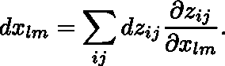*

## *张量流代码*

*下面是问题设置:*

```
*import tensorflow as tf# Define inputs
x = tf.constant([[3.0, 4.0], [5.0, 6.0]])
y = tf.constant([[4.0, 5.0], [6.0, 7.0]])
dz = tf.constant([[1.0, 2.0], [3.0, 4.0]])# Define the gradient.
def grad_matmul(x, y, dz):
    # (Add implementation here)
dx = grad_matmul(x, y, dz)# Compute the gradient with Tensorflow.
with tf.GradientTape() as g:
    g.watch(x)
    z = tf.matmul(x, y)
dx_tf = g.gradient(z, x, output_gradients=dz)# Check the answer.
print(dx == dx_tf)*
```

## *解决办法*

*因为我们现在正在处理矩阵，对某个矩阵元素的偏导数会产生两个克罗内克增量，如下所示*

*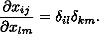*

*用这个来求导，*

*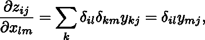*

*然后计算梯度，*

*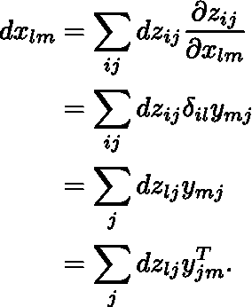*

*这实际上只是 *dz* 与转置的 *y* 矩阵的另一个矩阵乘法，*

*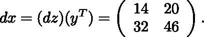*

*这可以在 TensorFlow 中实现，如下所示:*

```
*def grad_matmul(x, y, dz):
    return tf.matmul(dz,tf.transpose(y))*
```

# *示例 4:卷积*

*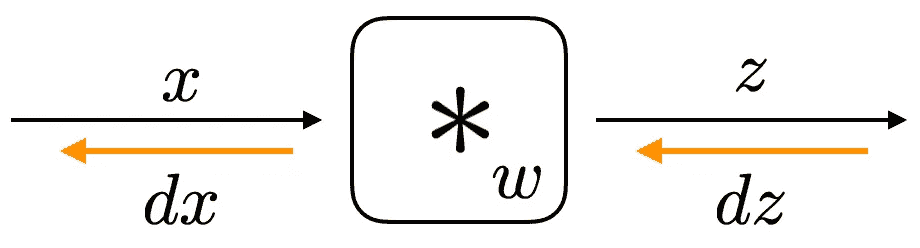*

*(图由作者提供)*

*现在让我们用矩阵输入和输出来尝试一个更复杂的例子。我们将矩阵 *x* 与滤波器 *w* 的卷积 *z* 写成*

*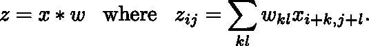*

*给定 4x4 输入 *x* ，2x2 滤波器 *w* ，因此 3x3 输出 *z* ，*

*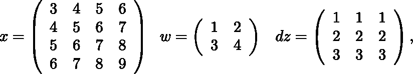*

*找到坡度 *dw* 。(注:我们这次找的是 *dw* ，不是 *dx* ！)*

## *张量流代码*

*下面是问题设置:*

```
*import tensorflow as tf# Use this method to perform the convolution.
def conv2d(x, w):
    return tf.nn.conv2d(tf.reshape(x,[1,x.shape[0],x.shape[1],1]),
                        tf.reshape(w,[w.shape[0],w.shape[1],1,1]), 
                        strides=[1,1],
                        padding="VALID")# Define inputs
x = tf.constant([[3.0, 4.0, 5.0, 6.0], 
                 [4.0, 5.0, 6.0, 7.0],
                 [5.0, 6.0, 7.0, 8.0],
                 [6.0, 7.0, 8.0, 9.0]])
w = tf.constant([[1.0, 2.0], 
                 [3.0, 4.0]])
dz = tf.constant([[1.0, 1.0, 1.0], 
                  [2.0, 2.0, 2.0],
                  [3.0, 3.0, 3.0]])# Define the gradient.
def grad_conv2d(x, w, dz):
    # (Add implementation here)
dx = grad_conv2d(x, w, dz)
# Reshape to remove channel and batch number dimensions.
dx = tf.reshape(dx, [w.shape[0],w.shape[1]])# Compute the gradient with Tensorflow.
with tf.GradientTape() as g:
    g.watch(w)
    z = conv2d(x,w)
dx_tf = g.gradient(z, w, 
                   output_gradients = tf.reshape(dz,
                                     [1,dz.shape[0],dz.shape[1],1]))# Check the answer.
print(dx == dx_tf)*
```

## *解决办法*

*计算导数，*

*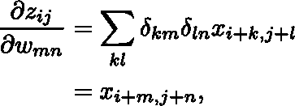*

*然后我们有了梯度*

*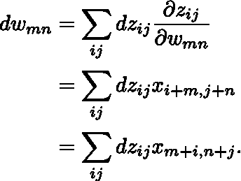*

*我们注意到这只是卷积*

*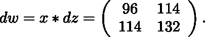*

*这可以使用上面的函数`conv2d`在 TensorFlow 中实现，如下所示:*

```
*def grad_conv2d(x, w, dz):
    return conv2d(x, dz)*
```

# *结论*

*并不是所有的梯度都像上面的例子一样是一个简洁的单行表达式，但是希望这有助于在计算图形中执行“向后传递”时澄清一些核心概念。*